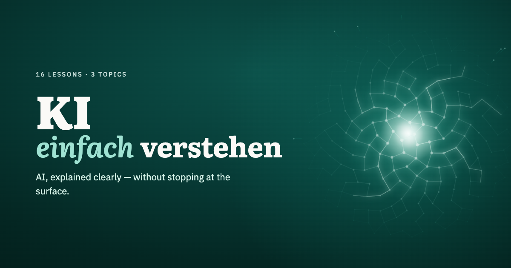

**English** · [Deutsch](README.de.md)

<!-- TODO(demo-gif): swap this banner for a short GIF of a live demo (e.g. the tokenizer) once one is recorded. -->
<p align="center">
  <a href="https://ki-einfach-verstehen.de/en/">
    
  </a>
</p>

# KI einfach verstehen: learn how AI really works

A free course that explains what happens inside modern AI models, from the
first spam filter to the language model behind a chatbot. Short lessons
build on each other, with diagrams, animations and interactive demos you can
play with. No technical background needed, but nothing is glossed over either.

- **Step by step:** lessons in a fixed order, each one using only what came before.
- **Bilingual:** every lesson in German and English.
- **Check yourself:** a few recall questions at the end of each lesson, no
  sign-up, progress stays in your browser.
- **Open:** content under CC BY 4.0, code under MIT. Use the graphics in your
  slides, lessons and articles.

**Start reading:** [ki-einfach-verstehen.de/en](https://ki-einfach-verstehen.de/en/)
or browse the Markdown lessons right here in the repo.

> ⭐ **Star this repo as a bookmark.** New lessons land here, so you'll find
> your way back when the next one is out.

## Contents

<!-- The list below is generated by `pnpm gen:lessons` (scripts/export-lessons.mjs). Edit the content collections, not this list. -->
<!-- lessons-toc:start -->
### 1. [Foundations](https://ki-einfach-verstehen.de/en/topic/foundations/)

The concepts everything else builds on: what separates a program from a model, and what's behind probabilities, vectors, hardware and neural networks.

1. **Program, Algorithm, Model Compared**  
   What is the difference between AI and an algorithm? Classic software follows rules a person writes down. An AI model is made of numbers set by training.  
   [Website](https://ki-einfach-verstehen.de/en/lessons/program-algorithm-model/) · [Markdown](lessons/en/program-algorithm-model.md)
2. **Input and Output: What a Function Does**  
   What does an AI model receive, and what does it give back? From spam filter to chatbot: why the output is usually a list of ratings.  
   [Website](https://ki-einfach-verstehen.de/en/lessons/input-and-output/) · [Markdown](lessons/en/input-and-output.md)
3. **Tokenizers: How Text Breaks into Tokens**  
   Shows why a language model splits text into pieces from a fixed list, how a tokenizer learns these pieces by counting, and why the number of tokens is not the number of words.  
   [Website](https://ki-einfach-verstehen.de/en/lessons/tokenizer-ids-vocabulary/) · [Markdown](lessons/en/tokenizer-ids-vocabulary.md)
4. **Token IDs: How Tokens Become Numbers**  
   Shows how a tokenizer uses its vocabulary to turn every text piece into a number and back, why that number means nothing, why tokenizer and model belong together, and how many tokens a model processes at once.  
   [Website](https://ki-einfach-verstehen.de/en/lessons/token-ids-and-vocabulary/) · [Markdown](lessons/en/token-ids-and-vocabulary.md)
5. **Scalar, Vector, Matrix, Tensor: the Building Blocks of Numbers**  
   From the weather app to the chatbot: how number, list, table and stack of tables relate, and why your chat is exactly such a block of numbers for a model.  
   [Website](https://ki-einfach-verstehen.de/en/lessons/scalar-vector-matrix-tensor/) · [Markdown](lessons/en/scalar-vector-matrix-tensor.md)
6. **Probability and Softmax: How a Model Decides**  
   How a language model turns its scores into shares, why it sometimes picks the obvious choice and sometimes something else, and what temperature changes about that.  
   [Website](https://ki-einfach-verstehen.de/en/lessons/probability-and-softmax/) · [Markdown](lessons/en/probability-and-softmax.md)
7. **Parameters, Training and Inference: How a Model Learns**  
   What is inside a model file, what people decide before training, how training uses the error to find each fader’s direction and why learning costs more than using.  
   [Website](https://ki-einfach-verstehen.de/en/lessons/parameters-training-inference-hardware/) · [Markdown](lessons/en/parameters-training-inference-hardware.md)
8. **Model Size and Hardware: Where a Model Fits**  
   How much memory an AI model needs, why space, not speed, is the first limit, how quantization shrinks models and why training needs far more memory still.  
   [Website](https://ki-einfach-verstehen.de/en/lessons/model-size-and-hardware/) · [Markdown](lessons/en/model-size-and-hardware.md)
9. **Neural Networks: How Many Small Calculations Become a Model**  
   What a single artificial neuron calculates, why only the kink and stacking let it do more than one sum, and what a figure like “96 layers” means.  
   [Website](https://ki-einfach-verstehen.de/en/lessons/neural-networks/) · [Markdown](lessons/en/neural-networks.md)

### 2. [Inside the Model](https://ki-einfach-verstehen.de/en/topic/inside-the-model/)

A prompt goes in, a token comes out — you follow everything that happens in between, step by step.

1. **What an AI Model Actually Is**  
   What is an AI model? Not a database of facts, but billions of numbers in which knowledge is spread out. That is where answers and made-up facts come from.  
   [Website](https://ki-einfach-verstehen.de/en/lessons/what-an-ai-model-actually-is/) · [Markdown](lessons/en/what-an-ai-model-actually-is.md)
2. **Tokenization Inside the Model: How Your Chat Becomes a Token Sequence**  
   How a chat with roles becomes a single token sequence, what special tokens are for, and everything that has to fit into the context window.  
   [Website](https://ki-einfach-verstehen.de/en/lessons/tokenization-inside-the-model/) · [Markdown](lessons/en/tokenization-inside-the-model.md)
3. **Embeddings: How a Number Becomes a Learned Vector**  
   Why a token ID tells the model nothing about similarity, how training turns random numbers into similar profiles for tokens used in similar ways, and what a large vocabulary costs.  
   [Website](https://ki-einfach-verstehen.de/en/lessons/embeddings/) · [Markdown](lessons/en/embeddings.md)
4. **Transformer Blocks and Attention: How Context Gets Mixed In**  
   How a language model mixes earlier words into every token, why it may not look ahead while doing so, and how many such blocks work in a row.  
   [Website](https://ki-einfach-verstehen.de/en/lessons/transformer-blocks-and-attention/) · [Markdown](lessons/en/transformer-blocks-and-attention.md)
5. **Output Head: From the Last State to a Prediction**  
   How a language model computes a score for every token from its last state, why only the last position counts, and how this builds an answer piece by piece.  
   [Website](https://ki-einfach-verstehen.de/en/lessons/output-head/) · [Markdown](lessons/en/output-head.md)

### 3. [How Learning Works](https://ki-einfach-verstehen.de/en/topic/how-learning-works/)

How does an AI learn? It measures its error, traces improvements backwards through its computation and changes its weights step by step.

1. Text Becomes Many Practice Problems *(in preparation)*
2. Forward Pass and Loss: How the Model Measures Its Own Error *(in preparation)*
3. Backpropagation and Gradients: How the Model Knows What to Change *(in preparation)*
4. Optimization: What Actually Changes the Weights *(in preparation)*
5. Batch, Epoch, Step, Token Budget: How to Measure Training Progress *(in preparation)*

### 4. [From Model to Assistant](https://ki-einfach-verstehen.de/en/topic/from-model-to-assistant/)

What turns a language model into a chat assistant — why it can be convincingly wrong, what it really knows in a conversation, and how you check its answers.

1. From Text Predictor to Assistant *(in preparation)*
2. How a Model "Thinks" *(in preparation)*
3. Why AI Is Convincingly Wrong *(in preparation)*
4. What a Chatbot Knows in a Conversation *(in preparation)*
5. Does AI Understand What It Says? *(in preparation)*
6. Checking Answers: Using AI Safely in Everyday Life *(in preparation)*

Every technical term in a sentence or two: **[Glossary](https://ki-einfach-verstehen.de/en/glossary/)**
<!-- lessons-toc:end -->

Each lesson exists twice: the **website** version with the interactive demos,
animations and recall questions, and a **Markdown** version in
[`lessons/`](lessons/) that reads well on GitHub, offline or in your own notes.

## Contributing

Found a mistake, an unclear passage or a missing source? That's the most
valuable help there is. Please read [CONTRIBUTING.md](CONTRIBUTING.md):
it starts with an issue, not a pull request, because this repository is a
generated mirror. Questions about the content are best asked in the
[community forum](https://community.ki-einfach-verstehen.de).

## License

- **Content** (lesson texts, glossary, graphics, illustrations, animations,
  `lessons/`): [CC BY 4.0](LICENSE-CONTENT.md). Credit it as
  `KI einfach verstehen, <title>, CC BY 4.0, <URL>`.
- **Code** (components, scripts, styles): [MIT](LICENSE).

Fonts, the logo and the merch designs are excluded, see
[LICENSE-CONTENT.md](LICENSE-CONTENT.md). Vendored third-party code keeps
its own licence: `src/vendor/qrcodegen.js` is the
[QR Code generator](https://www.nayuki.io/page/qr-code-generator-library)
by Project Nayuki (MIT, notice in the file).

## About this repository

This is the source of the website, built with [Astro](https://astro.build).
It is mirrored from a private project repository that also holds the
e-book and video scripts; only the website is open source.

```sh
pnpm install
pnpm dev          # http://localhost:4321
pnpm build        # static site in dist/
pnpm lint         # content checks and tests
pnpm gen:lessons  # regenerate lessons/ and the contents above
```

Requires Node.js 22.12 or newer and pnpm.
