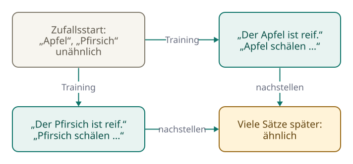
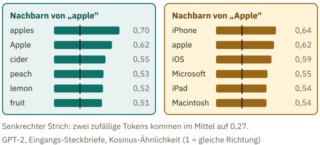
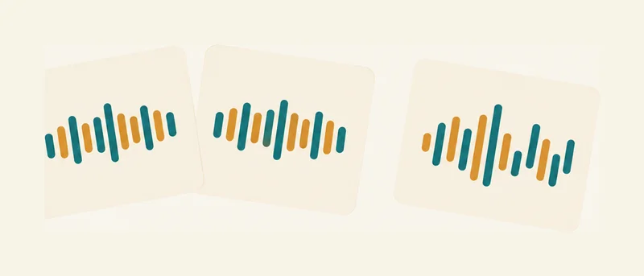
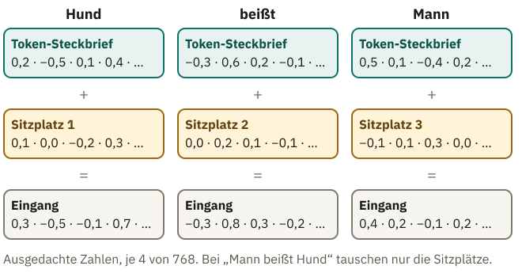

<!-- Generated from src/content/bausteine/de/embeddings.mdx by scripts/export-lessons.mjs -- do not edit by hand. -->

# Embeddings: wie aus einer Nummer ein bedeutungsvoller Vektor wird

> Lesefassung für GitHub. Die vollständige Fassung mit interaktiven Demos, Animationen und Abrufmoment findest du auf der Website: **[Embeddings: wie aus einer Nummer ein bedeutungsvoller Vektor wird](https://ki-einfach-verstehen.de/de/bausteine/embeddings/)**
>
> Lizenz: [CC BY 4.0](https://creativecommons.org/licenses/by/4.0/deed.de) · Nenne die Quelle so: KI einfach verstehen, „Embeddings: wie aus einer Nummer ein bedeutungsvoller Vektor wird“, CC BY 4.0, https://ki-einfach-verstehen.de/de/bausteine/embeddings/

Warum eine Token-ID dem Modell nichts über Bedeutung verrät, wie im Training aus Zufallszahlen ähnliche Steckbriefe für ähnlich verwendete Tokens werden und wozu das Modell zusätzlich den Platz im Satz braucht.

*Ein Barcode sagt der Kasse, welcher Artikel es ist, aber nichts darüber, was der Artikel mit anderen gemeinsam hat.*

An der Supermarktkasse piept der Scanner, und auf dem Display steht „Äpfel, lose“. Der Barcode hat der Kasse genau eine Sache verraten: welcher Artikel es ist. Dass Äpfel und Birnen beide Obst sind, steht in keinem Strichcode. So ähnlich geht es einem Sprachmodell mit deiner Chatnachricht, nachdem der [Tokenizer](https://ki-einfach-verstehen.de/de/glossar/tokenizer/) sie zerlegt hat. Übrig ist eine Folge von [Token-IDs](https://ki-einfach-verstehen.de/de/glossar/token-id/), und jede ID sagt nur, welches Textstück gemeint ist.

Die kleinste Fassung des frei verfügbaren Modells GPT-2, rund 124 Millionen Parameter groß, hat ein englisches Vokabular; um diese Fassung geht es hier durchgehend. Darin trägt das Token „␣apple“ die Nummer 17180. Das Zeichen ␣ steht für das Leerzeichen, das zum Token gehört, wie mitten im Satz. Gemeint ist im Folgenden immer diese Form mit Leerzeichen, auch wenn das ␣ wegfällt. „␣laptop“ hat die 13224 und „␣pear“, die Birne, die 25286. Der Nummer nach liegt der Laptop also näher am Apfel als die Birne. Trotzdem behandelt das Modell Apfel und Birne als verwandt. Woher weiß es das, wenn ihm niemand erklärt hat, was Obst ist?

## Was einer Nummer fehlt

Eine Token-ID funktioniert wie die Artikelnummer aus dem Baustein über [Tokenizer](./tokenizer-ids-vokabular.md): Sie identifiziert ein Textstück und bedeutet selbst nichts. Benachbarte Nummern stehen nicht für ähnliche Stücke.

Das Modell braucht also etwas, das es vergleichen und verrechnen kann. Den ersten Schritt dazu kennst du aus dem Baustein über [Skalar, Vektor, Matrix und Tensor](./skalar-vektor-matrix-tensor.md). Das Modell benutzt die ID als Zeilennummer und schlägt in einer großen Tabelle eine Zeile nach. Bei GPT-2 besteht jede Zeile aus 768 Zahlen. Diese Zeile ist so etwas wie der **Steckbrief** des Tokens: eine lange, feste Folge von Zahlen, die zu genau diesem Token gehört.

Anders als Nummern lassen sich Steckbriefe vergleichen. Ähnlich heißt dabei grob: Wo der eine Steckbrief große Zahlen hat, hat der andere auch große, und wo der eine kleine oder negative hat, auch der andere. Fachleute stellen sich jeden Steckbrief als Punkt in einem riesigen Raum vor. Deshalb sagen sie: Ähnliche Steckbriefe liegen nah beieinander, sie sind Nachbarn.

Warum vergibt man nicht einfach die Nummern geschickter, Obst neben Obst? Auf einer einzigen Zahlenreihe hat jede Nummer nur zwei direkte Nachbarn, links und rechts. „apple“ soll aber zugleich nah an „pear“, „peach“, „lemon“, „cider“ und „Apple“ liegen, und „Apple“ nah an „iPhone“, ohne dass das iPhone dadurch neben die Birne rückt. Eine Liste aus vielen Zahlen kann einem Token in vielen Hinsichten zugleich ähneln, eine einzelne Nummer nicht.

Hier liegt die erste Hälfte der Antwort auf das Rätsel vom Anfang: Die Steckbriefe von „apple“ und „pear“ ähneln sich spürbar mehr als die von „apple“ und „laptop“.

Die zweite Hälfte fehlt noch: Wer hat die Zahlen so eingetragen?

## Wie aus Zufallszahlen Steckbriefe werden

Niemand hat das getan. Vor dem Training stehen in der Tabelle Zufallszahlen. Beim ersten GPT-Modell von OpenAI waren es kleine Werte, zufällig um null gestreut. In diesem Zustand hat „apple“ mit „pear“ nicht mehr gemeinsam als mit „laptop“.

Dann beginnt das Training, wie du es aus dem Baustein über [Parameter, Training und Inferenz](./parameter-training-inferenz-hardware.md) kennst. Das Modell sagt das nächste Token vorher und stellt seine [Parameter](https://ki-einfach-verstehen.de/de/glossar/parameter/) ein kleines Stück nach, damit die Vorhersage besser passt. Die Zahlen in der Tabelle gehören zu diesen Parametern. Kommt ein Token in einem Trainingstext vor, wird deshalb auch seine Zeile nachgestellt.

Angenommen, ein kleines Modell hat für „Apfel“ und „Birne“ je eine eigene Zeile. In seinen Trainingstexten stehen Sätze wie „Der Apfel ist reif.“ und „Die Birne ist reif.“ Nach „Apfel“ soll das Modell „ist reif“ vorhersagen, also werden die Zahlen der Zeile „Apfel“ so verstellt, dass diese Fortsetzung besser passt. Nach „Birne“ folgt dasselbe, also verändern sich auch die Zahlen der Zeile „Birne“ auf ähnliche Weise. „Laptop“ steht in Sätzen über Akkus und Bildschirme, und seine Zeile verändert sich ganz anders.

Warum werden die beiden Zeilen dabei einander ähnlich und nicht nur jede für sich irgendwie passend? Alles, was nach der Tabelle kommt, ist für jedes Token dieselbe Rechnung mit denselben Parametern. Soll diese eine Rechnung aus der Zeile „Apfel“ und aus der Zeile „Birne“ dieselbe Fortsetzung machen, kommen ihr die beiden Zeilen am leichtesten entgegen, indem sie einander ähnlich werden.

[▶ Animation auf der Website ansehen](https://ki-einfach-verstehen.de/de/bausteine/embeddings/)

*Ein ausgedachtes Beispiel: Weil nach „Apfel“ und nach „Birne“ dasselbe folgt, werden beide Zeilen im Training in ähnliche Richtungen nachgestellt.*

Über Millionen Sätze summieren sich diese kleinen Schritte. Sprachwissenschaftler hatten die Idee dahinter schon in den 1950er-Jahren: Wörter, die in ähnlichen Umgebungen vorkommen, haben meist ähnliche Bedeutungen. Sie heißt **Verteilungshypothese**. Der Linguist J. R. Firth fasste sie 1957 so zusammen: „You shall know a word by the company it keeps“, sinngemäß: Ein Wort erkennt man an seiner Gesellschaft.

So lernen auch die Modelle hinter heutigen Chatbots ihre Tabelle. Was aber wird aus einem Wort, das in zwei ganz verschiedenen Umgebungen vorkommt? Überleg kurz, bevor du weiterliest.

## Ähnliche Verwendung, ähnlicher Steckbrief

Ob das Prinzip trägt, zeigt GPT-2. Für diesen Baustein wurde seine Tabelle durchsucht: Welche Steckbriefe liegen am nächsten an dem von „apple“? Ganz oben stehen Schreibvarianten wie „apples“ und „Apple“. Gleich danach folgen „cider“ (Apfelwein), „peach“ (Pfirsich), „lemon“ (Zitrone) und „fruit“ (Obst). Niemand hat dem Modell gesagt, dass das zusammengehört. Diese Wörter standen nur in ähnlichen Sätzen.

Die Frage vom Ende des letzten Abschnitts hat zwei Antworten. Ist das Wort ein einziges Token, bekommt es auch nur einen Steckbrief, und der muss beide Verwendungen zugleich bedienen; darauf kommt der letzte Abschnitt zurück. Bei „apple“ hilft die Schreibweise. Die Firma schreibt sich meist groß, und das großgeschriebene „Apple“ ist für das Modell ein anderes Token mit eigenem Steckbrief. Seine nächsten Nachbarn sind „iPhone“, „apple“, „iOS“, „Microsoft“, „iPad“ und „Macintosh“. Bis auf das gleich geschriebene Obstwort stehen dort Handys und Konkurrenten, keine Obstkörbe.

*Die nächsten Nachbarn von „apple“ und „Apple“ in der Eingangstabelle von GPT-2 (Auswahl, für diesen Baustein nachgerechnet). Der senkrechte Strich zeigt, was zwei zufällige Tokens im Mittel erreichen.*

Die Liste von „Apple“ zeigt auch, was ein Steckbrief nicht ist: eine Definition. Microsoft ist weder ein Apfel noch ein Handy, es kommt nur in ähnlichen Texten vor. Ähnlichkeit am Eingang heißt deshalb: ähnliche Verwendung, nicht gleiche Bedeutung.

Eine Ebene tiefer: Wie misst man, ob zwei Steckbriefe ähnlich sind?

Meist mit der **Kosinus-Ähnlichkeit**. Man fasst jeden Steckbrief als Pfeil auf und fragt, wie sehr zwei Pfeile in dieselbe Richtung zeigen: 1 heißt gleiche Richtung, 0 rechtwinklig, −1 entgegengesetzt. Man multipliziert die Zahlen an gleicher Stelle und addiert alle Produkte. Das Ergebnis teilt man durch die Längen der beiden Pfeile.

cos(v, w) = (v · w) / (|v| · |w|)

Ein Spielzeugbeispiel mit drei statt 768 Zahlen: v = (1, 2, 0) und w = (2, 3, 1). Die Produkte ergeben 2 + 6 + 0 = 8. Die Länge eines Pfeils bekommt man, indem man jede Zahl mit sich selbst malnimmt, alles addiert und die Wurzel zieht: √(1 + 4 + 0) = √5 ≈ 2,24 und √(4 + 9 + 1) = √14 ≈ 3,74. Ihr Produkt ist etwa 8,37. Also ist cos ≈ 8 / 8,37 ≈ 0,96, fast dieselbe Richtung.

Bei GPT-2 kommen „apple“ und „pear“ auf 0,456, „apple“ und „laptop“ auf 0,357. Zum Vergleich wurden 20.000 zufällige Token-Paare gemessen: Im Mittel erreichten sie 0,27, und 95 von 100 lagen unter 0,35. „apple“ und „laptop“ liegen also nur knapp über dem Zufall, „apple“ und „pear“ deutlich.

## Embedding und Embedding-Matrix

In der Fachsprache heißt der Steckbrief eines Tokens **[Embedding](https://ki-einfach-verstehen.de/de/glossar/embedding/)**, auf Deutsch manchmal Einbettung. Weil er eine geordnete Liste von Zahlen ist, ist er ein [Vektor](https://ki-einfach-verstehen.de/de/glossar/vektor/). Die ganze Tabelle mit einer Zeile pro Token des [Vokabulars](https://ki-einfach-verstehen.de/de/glossar/vokabular/) heißt **[Embedding-Matrix](https://ki-einfach-verstehen.de/de/glossar/embedding-matrix/)**.

*Steckbriefe ohne Beschriftung: Ähnlich verwendete Tokens tragen ähnliche Zahlenmuster, ein anders verwendetes Token ein anderes.*

Ein echter Steckbrief sieht dagegen so aus, hier die ersten 8 von 768 Zahlen für „apple“ bei GPT-2: 0,119 · −0,175 · 0,129 · 0,063 · 0,045 · 0,046 · −0,323 · 0,079. Was bedeutet die siebte Zahl? Das kann niemand sagen. Hier hinkt das Bild: Ein Steckbrief auf Papier hat Felder wie Größe oder Augenfarbe, die jemand ausgefüllt hat. Hier hat kein Feld einen Namen, und auch Fachbücher halten fest, dass die einzelnen Zahlen keine klare Bedeutung haben. Was ein Embedding ausdrückt, steckt in allen Zahlen zusammen.

Die Tabelle ist groß. Bei der kleinsten GPT-2-Fassung hat sie 50.257 Zeilen zu je 768 Zahlen, zusammen gut 38 Millionen. Das sind rund 31 Prozent ihrer etwa 124 Millionen Parameter.

Bei heutigen, viel größeren Modellen ist die Tabelle noch größer, macht aber nur einen kleinen Teil aus, bei Llama 3.1 8B von 2024 etwa 6,5 Prozent. Der weitaus größte Teil steckt dort in den Blöcken danach, um die es im nächsten Baustein geht.

Die Tabelle hat allerdings eine Zeile für jedes Token, nicht für jedes Wort. Der Tokenizer von Qwen3 zerlegt „Apfel“ in „Ap“ und „fel“, „Birne“ in „Bir“ und „ne“. „Laptop“ und „Bank“ sind dort dagegen je ein Token. Für „Apfel“ hat diese Tabelle also gar keine eigene Zeile, nur Zeilen für die beiden Stücke. Was „Apfel“ bedeutet, setzt das Modell erst in späteren Rechenschritten zusammen. Andere Tokenizer zerlegen anders, aber auf Deutsch kommt so etwas ständig vor.

Vielleicht hast du gelesen, mit Embeddings könne man rechnen: König − Mann + Frau ergebe Königin. So sauber klappt das nur mit einem Kniff, denn bei der Suche nach dem Ergebnis werden die eingegebenen Wörter ausgeschlossen. Ohne diesen Ausschluss landet die Rechnung an der Tabelle von GPT-2 wieder bei „king“. Ein Embedding hält fest, wie ein Token verwendet wird. Ein Rechenwerk für Bedeutungen ist es nicht.

Eine Ebene tiefer: Stimmt „König − Mann + Frau = Königin“?

Das Beispiel stammt von Tomas Mikolov und Kollegen (2013), die bei der Suche nach „Queen“ die eingegebenen Wörter ausschlossen. Eine Untersuchung von 2020 rechnete ohne diesen Ausschluss nach: Die Trefferquote bei solchen Analogieaufgaben fiel von 0,71 auf 0,21, meist kam das Ausgangswort zurück.

An der Tabelle von GPT-2 liegt ohne Ausschluss „king“ mit einem Kosinus von 0,776 vorn, „queen“ folgt mit 0,709. Das Lehrbuch von Jurafsky und Martin hält zudem fest, dass das Verfahren nur für bestimmte Beziehungen gut klappt, etwa Land und Hauptstadt, und auch dort nur mit dem Ausschluss. Mikolovs Vektoren stammen zudem aus viel einfacheren Modellen als heutige Chatbots.

## Der Sitzplatz im Satz

Eine Sache fehlt noch. „Hund beißt Mann“ und „Mann beißt Hund“ bestehen aus denselben drei Wörtern. Angenommen, jedes davon ist ein Token: Dann holt das Modell in beiden Sätzen dieselben drei Steckbriefe. Nur die Reihenfolge ist anders, und genau die entscheidet, wer hier gebissen wird.

Naheliegend wäre, dass das Modell die Reihenfolge ohnehin kennt, denn die Steckbriefe stehen der Reihe nach untereinander. Die Rechenschritte danach stammen aber aus der Transformer-Architektur von 2017, und die behandelt jede Zeile gleich, egal wo sie steht, wie Karten, die alle offen auf dem Tisch liegen. Vertauscht man zwei Zeilen, vertauschen sich nur die Ergebnisse. Die Erfinder schrieben deshalb, man müsse ihrem Modell die Position der Tokens eigens mitgeben.

Eine Einschränkung gibt es. In Sprachmodellen wie GPT-2 darf jedes Token in den späteren Rechenschritten nur auf die Tokens davor schauen, nicht auf die danach; wie dieses Schauen funktioniert, zeigt der nächste Baustein. Diese Regel hängt selbst von der Reihenfolge ab, und daran könnte ein Token ungefähr ablesen, wie viele Vorgänger es hat. Eine Studie von 2022 fand, dass solche Modelle, ganz ohne Positionssignal trainiert, trotzdem mithalten; die Forscher vermuten genau diesen Grund. Ein eigenes Signal macht die Reihenfolge aber direkt sichtbar und ist bis heute üblich.

GPT-2 löst das mit einer zweiten Tabelle. Sie hat eine Zeile für jeden möglichen Platz im Text, bei GPT-2 sind das 1.024. Jede Zeile ist ein Steckbrief für einen **Sitzplatz**: einer für Platz 1, einer für Platz 2 und so weiter. Auch diese Zahlen starten zufällig und werden im Training gelernt. Weil beide Steckbriefe gleich lang sind, werden sie Zahl für Zahl addiert. Angenommen, im Steckbrief von „Hund“ steht an erster Stelle 0,2 und im Steckbrief von Platz 1 eine 0,1: Weiter geht 0,3. Steht der Hund wie in „Mann beißt Hund“ auf Platz 3 und hat dieser Platz dort −0,1, geht 0,1 weiter. Gleiches Token, anderer Platz, andere Summe: In die weiteren Rechenschritte geht also „Hund auf Platz 1“ oder „Hund auf Platz 3“, nicht nur „Hund“. Die Fachsprache nennt den Sitzplatz-Steckbrief **[Positions-Embedding](https://ki-einfach-verstehen.de/de/glossar/positions-embedding/)**.

*Token-Steckbrief plus Sitzplatz-Steckbrief ergibt, was ins Modell weitergeht. Bei „Mann beißt Hund“ sitzt der Hund auf Platz 3, und seine Summe fällt anders aus.*

Fragst du einen Chatbot, ob Anna Ben eingeladen hat oder Ben Anna, bekäme sein Modell ohne Positionssignal dieselben Steckbriefe, nur umsortiert. Mit dem Signal unterscheiden sich die Summen, und die späteren Rechenschritte können erkennen, wer wen eingeladen hat.

Wörtlich passt das Bild vom Sitzplatz nur zu Modellen wie GPT-2. Der Original-Transformer nahm statt einer gelernten Tabelle feste Wellenmuster aus Sinus und Kosinus. Viele heutige Modelle wie Llama addieren am Eingang gar nichts, sondern drehen die Zahlen in jedem Block ein Stück, je nach Platz (Fachwort RoPE), genau dort, wo Tokens einander betrachten. Wie das geht, zeigt der nächste Baustein. Gemeinsam ist allen Varianten: In den Steckbriefen selbst steckt keine Reihenfolge, deshalb bekommt das Modell sie eigens mitgeliefert.

## Bank bleibt Bank, vorerst

*Eine Bank im Park oder eine Bank fürs Geld: Am Eingang des Modells ist das derselbe Steckbrief.*

„Ich setze mich im Park auf die Bank.“ „Ich bringe das Geld zur Bank.“ Am Eingang des Modells ist es dasselbe Token, also dieselbe Nummer und dieselbe Zeile in der Embedding-Matrix. Nur der Sitzplatz-Anteil unterscheidet sich, und der verrät nichts über Parks oder Geld.

Das ist die angekündigte Grenze: Ein Token mit mehreren Bedeutungen muss mit einem einzigen Steckbrief für alle auskommen. Bei „apple“ half die Großschreibung, ganz sauber trennt aber auch sie nicht; unter den Nachbarn des kleinen „apple“ taucht nach vielen Obstwörtern „iPhone“ auf. Bei „Bank“ hilft keine Schreibweise. Park und Geld stecken in derselben Zeile.

Trotzdem versteht ein Chatbot „Bank“ meist richtig. In den folgenden Rechenschritten, den Blöcken oder Schichten des Modells, werden die Steckbriefe Stück für Stück verändert und nehmen Informationen aus dem Satz auf. Eine Untersuchung an GPT-2 und verwandten Modellen zeigte 2019: In den oberen Schichten hängt die Darstellung desselben Wortes deutlich stärker vom Satz ab als am Eingang. Der Steckbrief aus der Tabelle ist also nur der Ausgangspunkt.

Damit ist der Eingang des Modells vollständig. Was noch fehlt, ist der Zusammenhang: Wie bekommt jedes Token Informationen von den anderen Tokens im Satz, sodass aus „Bank“ einmal das Geldinstitut und einmal die Sitzbank wird? Darum geht es im nächsten Baustein.

---

Quelle: https://ki-einfach-verstehen.de/de/bausteine/embeddings/

← Zurück: [Tokenisierung im Modell: Wie dein Chat zu einer Tokenfolge wird](./tokenisierung-im-modell.md) · [Alle Bausteine](../../README.de.md#inhalt) · Weiter: [Transformerblöcke und Attention: Wie Kontext eingemischt wird](./transformerbloecke-und-attention.md) →
