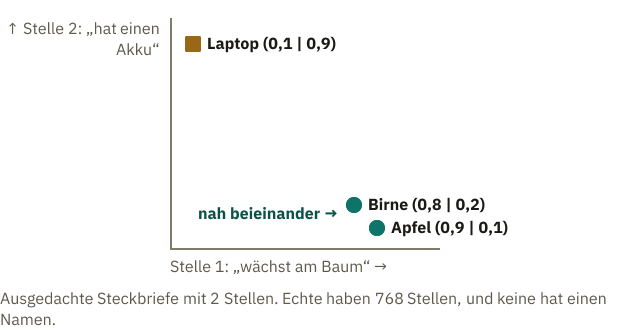

<!-- Generated from src/content/bausteine/de/embeddings.mdx by scripts/export-lessons.mjs -- do not edit by hand. -->

# Embeddings: wie aus einer Nummer ein bedeutungsvoller Vektor wird

> Lesefassung für GitHub. Die vollständige Fassung mit interaktiven Demos, Animationen und Abrufmoment findest du auf der Website: **[Embeddings: wie aus einer Nummer ein bedeutungsvoller Vektor wird](https://ki-einfach-verstehen.de/de/bausteine/embeddings/)**
>
> Lizenz: [CC BY 4.0](https://creativecommons.org/licenses/by/4.0/deed.de) · Nenne die Quelle so: KI einfach verstehen, „Embeddings: wie aus einer Nummer ein bedeutungsvoller Vektor wird“, CC BY 4.0, https://ki-einfach-verstehen.de/de/bausteine/embeddings/

Warum eine Token-ID nichts über Bedeutung verrät und wie im Training aus Zufallszahlen ähnliche Steckbriefe für ähnlich verwendete Tokens werden.

*Ein Barcode sagt der Kasse, welcher Artikel es ist, aber nichts darüber, was der Artikel mit anderen gemeinsam hat.*

An der Supermarktkasse piept der Scanner, und auf dem Display steht „Äpfel, lose“. Der Barcode hat der Kasse genau eine Sache verraten: welcher Artikel es ist. Dass Äpfel und Birnen beide Obst sind, steht in keinem Strichcode. So ähnlich geht es einem Sprachmodell mit deiner Chatnachricht, nachdem der [Tokenizer](https://ki-einfach-verstehen.de/de/glossar/tokenizer/) sie zerlegt hat. Übrig ist eine Folge von [Token-IDs](https://ki-einfach-verstehen.de/de/glossar/token-id/), und jede ID sagt nur, welches Textstück gemeint ist.

Ein Beispiel liefert die kleinste Version des frei verfügbaren Modells GPT-2, gemeint ist hier immer diese. Ihr Vokabular ist englisch. Mitten im Satz, mit Leerzeichen davor, trägt „apple“ die Nummer 17180, „laptop“ die 13224 und „pear“, die Birne, die 25286. Der Nummer nach liegt der Laptop also näher am Apfel als die Birne. Trotzdem behandelt das Modell Apfel und Birne als verwandt. Woher weiß es das, wenn ihm niemand erklärt hat, was Obst ist?

## Was einer Nummer fehlt

Eine Token-ID ist, wie am Ende des [vorigen Bausteins](./tokenisierung-im-modell.md), ein Barcode, oder wie im Baustein über [Token-IDs](./token-ids-und-vokabular.md) die Nummer auf einer Karteikarte. Sie sagt, welches Textstück gemeint ist, und bedeutet selbst nichts. Benachbarte Nummern stehen nicht für ähnliche Stücke.

Was das Modell mit der Nummer anfängt, kennst du aus dem Baustein über [Skalar, Vektor, Matrix und Tensor](./skalar-vektor-matrix-tensor.md). Erinnerst du dich an das dicke Nachschlagebuch? Die Token-ID war die Seitenzahl, und auf jeder Seite standen bei GPT-2 768 Zahlen. Im Rechner ist jede Seite eine Zeile einer großen Tabelle. Im ersten Baustein dieses Themenbereichs hieß es: Das Modell schlägt keine Zeile wie „Frankreich | Paris“ nach. Das gilt weiter. Diese Zeile enthält keinen Fakt, nur die Zahlen des Tokens; gerechnet wird erst danach.

Diese Zeile heißt hier der **Steckbrief** des Tokens: eine lange, feste Folge von Zahlen, die zu genau diesem Token gehört. Im Baustein über Skalar und Vektor war mit Steckbrief noch die Form eines Zahlenblocks gemeint. Ab hier ist es immer die Zahlenzeile eines Tokens.

**Anders als Nummern lassen sich Steckbriefe vergleichen.** Ein ausgedachtes Beispiel mit nur zwei Stellen, die zum Mitdenken Namen bekommen: „wächst am Baum“ und „hat einen Akku“. Der Apfel hat (0,9 | 0,1), die Birne (0,8 | 0,2), der Laptop (0,1 | 0,9). Apfel und Birne haben vorn eine große, hinten eine kleine Zahl, der Laptop umgekehrt. Echte Steckbriefe haben 768 Stellen, und keine davon trägt einen Namen.

*Ein ausgedachtes Beispiel: Jeder Steckbrief aus zwei Zahlen wird ein Punkt, die erste Zahl gibt an, wie weit rechts, die zweite, wie weit oben. Apfel und Birne liegen nah beieinander, der Laptop weit weg.*

Zeichnet man jede Stelle als eine Richtung, wird jeder Steckbrief zu einem Punkt: die erste Zahl nach rechts, die zweite nach oben. Ähnliche Steckbriefe landen nah beieinander. Für 768 Stellen bräuchte man 768 Richtungen, das kann niemand zeichnen, aber das Prinzip bleibt. Deshalb sagen Fachleute: Ähnliche Steckbriefe sind **Nachbarn**.

Bei GPT-2 ist es tatsächlich so gekommen: Der Steckbrief von „apple“ liegt näher an dem von „pear“ als an dem von „laptop“. Wie deutlich, zeigt eine Messung zwei Abschnitte weiter. Vorher die größere Frage: Wer hat die Zahlen so eingetragen?

## Wie aus Zufallszahlen Steckbriefe werden

Niemand. Vor dem Training stehen in der Tabelle Zufallszahlen, jedes Token startet also mit einem anderen Steckbrief. Beim ersten GPT-Modell von OpenAI waren es kleine Werte, zufällig um null gestreut. In diesem Zustand hat „apple“ mit „pear“ nicht mehr gemeinsam als mit „laptop“.

Dann beginnt das Training. Erinnerst du dich an den Spamfilter aus dem ersten Baustein der Grundlagen? Seine Gewichte starteten zwar bei null statt bei Zufallszahlen, nachgestellt wurde aber genauso: Lag er bei einer Mail daneben, rückten die beteiligten Gewichte ein kleines Stück in die Richtung, die den Fehler verkleinert. Ein Sprachmodell lernt genauso, wie im letzten Baustein der Grundlagen: Es sagt das nächste Token vorher, und seine [Parameter](https://ki-einfach-verstehen.de/de/glossar/parameter/), die Regler am Mischpult, werden ein Stück nachgestellt, damit die Vorhersage besser passt. Auch die Zahlen in der Tabelle sind solche Regler. Kommt ein Token in einem Trainingssatz vor, wird deshalb auch seine Zeile nachgestellt.

Angenommen, ein kleines Modell hat für „Apfel“ und „Birne“ je eine eigene Zeile. In seinen Trainingstexten stehen Sätze wie „Der Apfel ist reif.“ und „Die Birne ist reif.“ Nach „Apfel“ soll das Modell als nächstes Token „ist“ vorhersagen, also werden die Zahlen der Zeile „Apfel“ so verstellt, dass „ist“ besser passt. Nach „Birne“ folgt dasselbe. „Laptop“ steht dagegen in Sätzen wie „Der Laptop hat einen Akku.“

Warum werden die beiden Zeilen dabei einander ähnlich und nicht nur jede für sich irgendwie passend? Alles, was nach der Tabelle kommt, ist für jedes Token dieselbe Rechnung mit denselben Reglern. Eine Spielzeugrechnung zeigt, was daraus folgt. Angenommen, jeder Steckbrief hätte nur eine Zahl, und die Rechnung danach wäre einfach „mal 2“. Heraus kommt der Score für „ist“ als nächstes Token, und damit „ist“ vorn liegt, soll er 10 betragen. In der Zeile „Apfel“ steht anfangs zufällig eine 3, das ergibt 6, zu wenig. Also wird die 3 Schritt für Schritt Richtung 5 nachgestellt. In der Zeile „Birne“ steht eine 8, das ergibt 16, zu viel. Sie wandert ebenfalls Richtung 5.

Beide landen bei 5, weil dieselbe Rechnung dasselbe Ergebnis liefern soll. Nach „Laptop“ folgt „hat“, der Score für „ist“ soll dort niedrig sein, sagen wir 2. Seine Zahl wandert Richtung 1. Woher weiß das Training, ob eine Zahl nach oben oder unten muss? Wie, steht im Baustein über [Parameter, Training und Inferenz](./parameter-training-inferenz-hardware.md): Das Training berechnet für jeden Regler, in welche Richtung er den Fehler verkleinert, und dreht ihn ein Stück dorthin. Echte Steckbriefe haben 768 Zahlen, und die Rechnung danach ist viel länger und lernt selbst mit. Das Prinzip bleibt: **Tokens, nach denen Ähnliches folgt, werden ähnlich nachgestellt**, und ihre Steckbriefe rücken zusammen.

[▶ Animation auf der Website ansehen](https://ki-einfach-verstehen.de/de/bausteine/embeddings/)

*Ein ausgedachtes Beispiel: Weil nach „Apfel“ und nach „Birne“ dasselbe folgt, werden beide Zeilen im Training ähnlich nachgestellt.*

Über Millionen Sätze summieren sich diese kleinen Schritte. Sprachwissenschaftler hatten die Idee dahinter schon in den 1950er-Jahren: Wörter, die in ähnlichen Umgebungen vorkommen, haben meist ähnliche Bedeutungen. Sie heißt **Verteilungshypothese**. Der Linguist J. R. Firth fasste sie 1957 so zusammen: „You shall know a word by the company it keeps“, sinngemäß: Ein Wort erkennt man an seiner Gesellschaft.

> **Interaktive Demo:** [auf der Website ausprobieren](https://ki-einfach-verstehen.de/de/bausteine/embeddings/)

So lernen auch die Modelle hinter heutigen Chatbots ihre Tabelle. Aber stimmt das in einem echten Modell?

## Ähnliche Verwendung, ähnlicher Steckbrief

Nachprüfen lässt sich das an GPT-2. Für diesen Baustein wurde seine Tabelle durchsucht: Welche Steckbriefe liegen am nächsten an dem von „apple“? Ganz oben stehen Schreibvarianten wie „apples“ und „Apple“. Gleich danach folgen „cider“ (Apfelwein), „peach“ (Pfirsich), „lemon“ (Zitrone) und „fruit“ (Obst). Niemand hat dem Modell gesagt, dass das zusammengehört. Diese Wörter standen nur in ähnlichen Sätzen.

Zieht man vom Nullpunkt einen Pfeil zu jedem Punkt der Skizze, kann man fragen, wie sehr zwei Pfeile in dieselbe Richtung zeigen. Gezählt wird nur die Richtung, nicht die Länge: Gleiche Richtung ergibt 1, rechtwinklig 0. In der Skizze kommen Apfel und Birne so auf fast 1, Apfel und Laptop auf rund 0,2. Schon zwei zufällig gezogene Tokens kommen bei GPT-2 im Mittel auf etwa 0,27. Als Nachbar zählt erst, was deutlich darüber liegt, und die Nachbarn von „apple“ erreichen 0,5 bis 0,7. Und das Rätsel vom Anfang? „pear“ gehört nicht zu den allernächsten Nachbarn, liegt aber klar über dem Zufall, „laptop“ nur knapp.

Was aber wird aus einem Wort, das in zwei ganz verschiedenen Umgebungen vorkommt, wie „apple“ als Obst und als Firma? Überleg kurz, bevor du weiterliest.

Bei „apple“ hilft die Schreibweise. Die Firma schreibt sich meist groß, und das großgeschriebene „Apple“ ist für das Modell ein anderes Token mit eigenem Steckbrief. Seine nächsten Nachbarn sind „iPhone“, „apple“, „iOS“, „Microsoft“, „iPad“ und „Macintosh“. Bis auf das Obstwort stehen dort Handys und Konkurrenten. Für Wörter wie „Bank“ gibt es diesen Ausweg nicht; darauf kommt der letzte Abschnitt zurück.

*Die nächsten Nachbarn von „apple“ und „Apple“ in der Eingangstabelle von GPT-2 (Auswahl, für diesen Baustein nachgerechnet). Die Balken zeigen die Ähnlichkeit der Steckbriefe, 1 hieße gleich ausgerichtet. Der senkrechte Strich markiert 0,27, so viel erreichen zwei zufällige Tokens im Mittel.*

Die Liste von „Apple“ zeigt auch, was ein Steckbrief nicht ist: eine Definition. Microsoft ist weder ein Apfel noch ein Handy, es kommt nur in ähnlichen Texten vor. Ähnlichkeit am Eingang heißt deshalb: **ähnliche Verwendung, nicht gleiche Bedeutung**.

> **Interaktive Demo:** [auf der Website ausprobieren](https://ki-einfach-verstehen.de/de/bausteine/embeddings/)

Eine Ebene tiefer: Wie misst man, ob zwei Steckbriefe ähnlich sind?

Meist mit der **Kosinus-Ähnlichkeit**: 1 heißt gleiche Richtung, 0 rechtwinklig, −1 entgegengesetzt. Man nimmt die Zahlen an gleicher Stelle mal, addiert alle Produkte und teilt durch die Längen der beiden Pfeile (Wurzel aus der Summe der Quadrate). Als Formel: cos(v, w) = (v · w) / (|v| · |w|).

Mit der Skizze von oben: Apfel und Birne ergeben 0,9 · 0,8 + 0,1 · 0,2 = 0,74, geteilt durch √0,82 · √0,68 ≈ 0,75, also cos ≈ 0,99. Apfel und Laptop kommen auf 0,18 / 0,82 ≈ 0,22.

Bei GPT-2 erreichen „apple“ und „pear“ 0,456, „apple“ und „laptop“ 0,357; 20.000 zufällige Paare im Mittel 0,27, und 95 von 100 lagen unter 0,35. Warum nicht 0? Alle Steckbriefe zeigen ein Stück in eine gemeinsame Grundrichtung: Nachgerechnet hat jede Zeile einen positiven Kosinus zum Durchschnitt aller Zeilen. Zieht man diesen Durchschnitt ab, liegen Zufallspaare im Mittel bei 0. Entscheidend ist deshalb der Abstand zum Zufallswert.

## Embedding und Embedding-Matrix

In der Fachsprache heißt der Steckbrief eines Tokens **[Embedding](https://ki-einfach-verstehen.de/de/glossar/embedding/)**, auf Deutsch manchmal Einbettung. Weil er eine geordnete Liste von Zahlen ist, ist er ein [Vektor](https://ki-einfach-verstehen.de/de/glossar/vektor/). Die ganze Tabelle mit einer Zeile pro Token des [Vokabulars](https://ki-einfach-verstehen.de/de/glossar/vokabular/) heißt **[Embedding-Matrix](https://ki-einfach-verstehen.de/de/glossar/embedding-matrix/)**.

*Steckbriefe ohne Beschriftung: Ähnlich verwendete Tokens tragen ähnliche Zahlenmuster, ein anders verwendetes Token ein anderes.*

Ein echter Steckbrief sieht anders aus als das Beispiel mit „wächst am Baum“. Hier die ersten 8 von 768 Zahlen für „apple“ bei GPT-2: 0,119 · −0,175 · 0,129 · 0,063 · 0,045 · 0,046 · −0,323 · 0,079. Was bedeutet die siebte Zahl? Das kann niemand sagen. Hier hinkt das Bild: Ein Steckbrief auf Papier hat Felder wie Größe oder Augenfarbe, die jemand ausgefüllt hat. Hier hat kein Feld einen Namen, und auch Fachbücher halten fest, dass die einzelnen Zahlen keine klare Bedeutung haben. **Was ein Embedding ausdrückt, steckt in allen Zahlen zusammen.**

Eine Ebene tiefer: Stimmt „König − Mann + Frau = Königin“?

Mit Embeddings lässt sich rechnen, Zahl für Zahl: Von den 768 Zahlen von „king“ zieht man die von „man“ ab und addiert die von „woman“. Dann sucht man den Steckbrief, der am nächsten am Ergebnis liegt. Das berühmte Beispiel stammt von Tomas Mikolov und Kollegen (2013), und es klappte mit einem Kniff: Die eingegebenen Wörter wurden von der Suche ausgeschlossen.

Ohne diesen Ausschluss fiel die Trefferquote laut einer Untersuchung von 2020 von 0,71 auf 0,21; meist kam das Ausgangswort zurück, denn Abziehen und Addieren verschieben den Vektor nur ein Stück. An GPT-2 liegt ohne Ausschluss „king“ mit 0,776 vorn, „queen“ folgt mit 0,709. Laut dem Lehrbuch von Jurafsky und Martin klappt das Verfahren nur für bestimmte Beziehungen, etwa Land und Hauptstadt. Ein Rechenwerk für Bedeutungen ist ein Embedding nicht.

Bei der kleinsten Version von GPT-2 mit rund 124 Millionen Parametern hat sie eine Zeile für jeden der gut 50.000 Einträge im Vokabular und macht knapp ein Drittel aller Parameter aus. Bei großen heutigen Modellen ist sie noch länger, aber nur ein kleiner Teil des Ganzen; der Großteil steckt in den Rechenstufen danach. Und „eine Zeile pro Token“ heißt nicht „eine Zeile pro Wort“.

## Eine Zeile pro Token, nicht pro Wort

Bei GPT-2 ist „apple“ ein ganzes Token, weil sein Vokabular an englischen Texten gelernt wurde. Deutsche Wörter zerfallen oft in Stücke, wie „Katze“ im ausgedachten Beispiel des Tokenizer-Bausteins in „␣Kat“ und „ze“. Qwen3, das frei verfügbare Modell von Alibaba aus dem vorigen Baustein, zerlegt „Apfel“ in „␣Ap“ und „fel“ und „Birne“ in „␣Bir“ und „ne“. „Laptop“ und „Bank“ sind dort je ein Token.

Für „Apfel“ hat diese Tabelle also keine eigene Zeile, nur Zeilen für die beiden Stücke. Der Steckbrief von „␣Ap“ muss dabei zu allen Wörtern passen, die mit diesem Stück beginnen, auch zu „Apotheke“ und „Aprikose“. Dass „Ap“ und „fel“ zusammen das Obst meinen, ergibt sich erst in den Rechenstufen danach. Wenn du auf Deutsch chattest, besteht deine Nachricht oft aus solchen Stücken.

Jetzt hat jedes Token seinen Steckbrief. Aber woher weiß das Modell, in welcher Reihenfolge sie stehen?

## Der Sitzplatz im Satz

„Hund beißt Mann“ und „Mann beißt Hund“ bestehen aus denselben drei Wörtern. Angenommen, jedes davon ist ein Token: Dann holt das Modell in beiden Sätzen dieselben drei Steckbriefe. Nur die Reihenfolge ist anders, und genau die entscheidet, wer hier gebissen wird.

Naheliegend wäre, dass das Modell die Reihenfolge ohnehin kennt, denn die Steckbriefe stehen der Reihe nach untereinander. Doch die Rechenstufen danach, die Blöcke aus dem ersten Baustein dieses Themenbereichs, behandeln jede Zeile gleich, egal wo sie steht, wie Karten offen auf dem Tisch. Ein ausgedachter Spielzeugfall: Angenommen, das Modell zählt für seine Vorhersage einfach alle Steckbriefe zusammen. „Hund beißt Mann“ ergibt Hund + beißt + Mann, „Mann beißt Hund“ ergibt Mann + beißt + Hund, also dieselbe Summe. Wer wen beißt, ginge verloren. Deshalb schrieben die Forschenden, die 2017 diesen Bauplan für Sprachmodelle vorstellten, man müsse die Position der Tokens eigens mitgeben.

GPT-2 löst das mit einer zweiten Tabelle. Sie hat eine Zeile für jede Position, die ins [Kontextfenster](https://ki-einfach-verstehen.de/de/glossar/kontextfenster/) passt, bei GPT-2 also 1.024, die Höchstzahl aus dem vorigen Baustein. Jede Zeile ist ein Steckbrief für einen **Sitzplatz**: einer für Platz 1, einer für Platz 2 und so weiter. Auch diese Zahlen starten zufällig und werden im Training gelernt.

Weil beide Steckbriefe gleich lang sind, werden sie Zahl für Zahl addiert. Angenommen, im Steckbrief von „Hund“ steht an erster Stelle 0,2 und im Steckbrief von Platz 1 eine 0,1: Weiter geht 0,3. Steht der Hund wie in „Mann beißt Hund“ auf Platz 3 und hat dieser Platz dort −0,1, geht 0,1 weiter. **Gleiches Token, anderer Platz, andere Summe.** In die Blöcke geht also „Hund auf Platz 1“ oder „Hund auf Platz 3“, nicht nur „Hund“. Die Fachsprache nennt den Sitzplatz-Steckbrief **[Positions-Embedding](https://ki-einfach-verstehen.de/de/glossar/positions-embedding/)**.

*Token-Steckbrief plus Sitzplatz-Steckbrief ergibt, was ins Modell weitergeht. Bei „Mann beißt Hund“ sitzt der Hund auf Platz 3, und seine Summe fällt anders aus.*

Geht beim Addieren nicht verloren, was Hund und was Platz war? Bei einer einzigen Zahl schon: 0,3 kann 0,2 plus 0,1 sein oder 0,3 plus 0. Bei 768 Zahlen bleibt das Muster des Tokens erkennbar, ähnlich wie man in einem Akkord die einzelnen Töne noch heraushört. Nachgerechnet an GPT-2: Sucht man zu einer solchen Summe den ähnlichsten Token-Steckbrief, findet man in über 99 von 100 Fällen das richtige Token. Anders als im Akkord gibt es dabei aber keine sauber getrennten Töne, nur Zahlenmuster, die sich überlagern.

Die Summe ist kein gespeicherter Wert mehr, sondern ein Zwischenwert, wie die Anzeigen am Mischpult aus dem ersten Baustein dieses Themenbereichs: Sie entsteht für jeden Satz neu. Mit ihr rechnen die Blöcke weiter und können so unterscheiden, ob der Hund den Mann beißt oder der Mann den Hund.

Wörtlich passt das Bild vom Sitzplatz nur zu Modellen wie GPT-2. Andere Modelle, etwa Llama, bringen den Platz auf anderem Weg ins Spiel; einen davon zeigt der nächste Baustein. Gemeinsam ist allen: Die Reihenfolge wird eigens mitgeliefert.

## Bank bleibt Bank, vorerst

*Eine Bank im Park oder eine Bank fürs Geld: Am Eingang des Modells ist das derselbe Steckbrief.*

„Ich setze mich im Park auf die Bank.“ „Ich bringe das Geld zur Bank.“ Am Eingang des Modells ist es dasselbe Token, also dieselbe Nummer und dieselbe Zeile in der Embedding-Matrix. Nur der Sitzplatz-Anteil unterscheidet sich, und der verrät nichts über Parks oder Geld.

Das ist die angekündigte Grenze: Ein Token mit mehreren Bedeutungen muss mit einem einzigen Steckbrief für alle auskommen. Bei „apple“ half die Großschreibung, ganz sauber trennt aber auch sie nicht; unter den Nachbarn des kleinen „apple“ taucht nach vielen Obstwörtern „iPhone“ auf. Bei „Bank“ hilft keine Schreibweise. Park und Geld stecken in *derselben* Zeile.

Trotzdem versteht ein Chatbot „Bank“ meist richtig. In den Blöcken des Modells, oft Schichten genannt, entstehen aus diesen Summen Stufe für Stufe neue Zwischenwerte, die Informationen aus dem Satz aufnehmen. Die Zeile in der Tabelle bleibt dabei unverändert. Eine Untersuchung von 2019 zeigte an GPT-2: In den späteren Blöcken, näher am Ausgang, hängen die Zwischenwerte desselben Wortes deutlich stärker vom Satz ab als am Eingang. **Der Steckbrief aus der Tabelle ist also nur der Ausgangspunkt.**

Damit ist der Eingang des Modells vollständig. Was noch fehlt, ist der Zusammenhang: Wie bekommt jedes Token Informationen von den anderen Tokens im Satz, sodass aus „Bank“ einmal das Geldinstitut und einmal die Sitzbank wird? Darum geht es im nächsten Baustein.

---

Quelle: https://ki-einfach-verstehen.de/de/bausteine/embeddings/

← Zurück: [Tokenisierung im Modell: Wie dein Chat zu einer Tokenfolge wird](./tokenisierung-im-modell.md) · [Alle Bausteine](../../README.de.md#inhalt) · Weiter: [Transformerblöcke und Attention: Wie Kontext eingemischt wird](./transformerbloecke-und-attention.md) →
