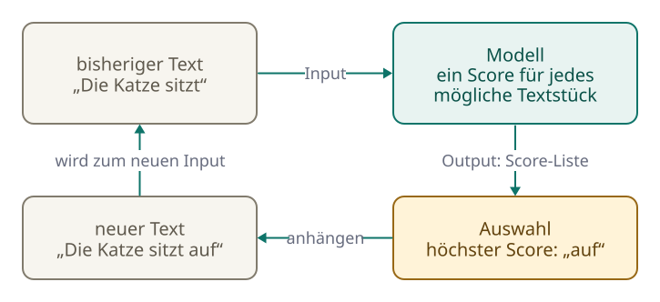
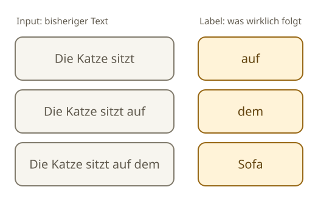

<!-- Generated from src/content/bausteine/de/input-und-output.mdx by scripts/export-lessons.mjs -- do not edit by hand. -->

# Input und Output: Was eine Funktion tut

> Lesefassung für GitHub. Die vollständige Fassung mit interaktiven Demos, Animationen und Abrufmoment findest du auf der Website: **[Input und Output: Was eine Funktion tut](https://ki-einfach-verstehen.de/de/bausteine/input-und-output/)**
>
> Lizenz: [CC BY 4.0](https://creativecommons.org/licenses/by/4.0/deed.de) · Nenne die Quelle so: KI einfach verstehen, „Input und Output: Was eine Funktion tut“, CC BY 4.0, https://ki-einfach-verstehen.de/de/bausteine/input-und-output/

Was bekommt ein KI-Modell, und was gibt es zurück? Vom Spamfilter bis zum Chatbot: warum der Output meist eine Liste von Bewertungen ist.

Der Spamfilter aus dem [vorigen Baustein](./programm-algorithmus-modell.md) hat eine überschaubare Aufgabe: Eine Mail geht hinein, ein Urteil kommt heraus. Bei einem Chatbot wirkt das anders. Du tippst eine Frage, und nach kurzer Zeit steht eine ganze, passende Antwort da. Wie kommt das zustande, wenn das Modell dahinter nur mit festen Zahlen rechnet? Dieser Baustein beginnt beim Spamfilter und zeigt Schritt für Schritt, was ein Modell wirklich bekommt und was es zurückgibt.

## Was hineingeht, was herauskommt

Schau dir den Spamfilter noch einmal genau an. Was hineingeht, heißt **[Input](https://ki-einfach-verstehen.de/de/glossar/input/)**: hier eine Mail, genauer die Wörter darin. Was herauskommt, heißt **[Output](https://ki-einfach-verstehen.de/de/glossar/output/)**. Auf den ersten Blick ist das ein Urteil, Spam oder kein Spam. Dazwischen steckt aber eine Zahl. Der Filter zählt die Gewichte der Wörter zusammen, bei „Gratis: Dein Gewinn wartet" kommt 5 heraus. Erst der Vergleich mit der Schwelle 2 macht daraus das Urteil Spam.

*Beim Spamfilter ist der Input eine Mail. Heraus kommt zuerst eine Zahl, erst danach das Urteil.*

Halte diese zwei Schritte auseinander. Das Zusammenzählen der trainierten Gewichte bewertet die Mail. Der feste Vergleich mit der Schwelle entscheidet danach. Im vorigen Baustein gehörte dieser Vergleich noch zur Rechenvorschrift des Filters. Ab hier ist mit „dem Modell" nur der bewertende Teil gemeint. Wozu das gut ist, zeigt sich beim Chatbot: Im zweiten Schritt steckt dort der Grund, warum dieselbe Frage zwei verschiedene Antworten bekommen kann.

Noch etwas gilt für jede Mail: **Gleicher Input ergibt gleichen Output.** Kommt dieselbe Mail zweimal, zählt der Filter zweimal dieselben Gewichte zusammen. Er erinnert sich nicht an die erste Mail und wird beim zweiten Mal nicht strenger. Die Gewichte ändern sich nur im Training, nicht beim Bewerten.

*Ein Taschenrechner liefert zu denselben Tasten immer dasselbe Ergebnis. In diesem Sinn ist auch ein trainiertes Modell eine Funktion.*

Ein vertrautes Gerät funktioniert genauso: der Taschenrechner. Du tippst „2 + 3", er zeigt 5, heute, morgen und bei jedem anderen Menschen. Mathematiker nennen so etwas eine **[Funktion](https://ki-einfach-verstehen.de/de/glossar/funktion/)**: eine feste Zuordnung, die zu jedem Input genau einen Output berechnet. Ein trainiertes Modell ist in diesem Sinn auch eine Funktion. Seine Rechenvorschrift steht fest, und seine Parameter stehen nach dem Training ebenfalls fest. Auch die Art von Input und Output steht fest. Der Spamfilter bekommt immer Text, ganz gleich wie lang, und gibt immer genau eine Zahl aus. Ein Foto könnte er gar nicht bewerten. Er kann nur Wörter nachschlagen und ihre Gewichte zusammenzählen. Jedes Modell rechnet nur mit der Art von Input, für die es gebaut ist.

Der Vergleich hat Grenzen. Den Rechenweg eines Taschenrechners haben Menschen Schritt für Schritt gebaut. Beim Modell steckt das, was die Rechnung ausmacht, in Zahlen, die der Trainingsalgorithmus eingestellt hat. Und ein Taschenrechner gibt eine einzige Zahl aus. Viele Modelle geben dagegen eine ganze Reihe von Zahlen aus, wie der nächste Abschnitt zeigt. Funktionen bleiben sie trotzdem: Die ganze Reihe zusammen ist der eine Output, und bei gleichem Input ist es jedes Mal dieselbe Reihe.

## Eine Bewertung für jede Möglichkeit

Ein Spamfilter hat nur zwei mögliche Ergebnisse. Eine Bilderkennung soll ein Foto dagegen einer von vielen Klassen zuordnen, etwa Katze, Hund, Fuchs oder Auto. Ihr Input ist das Foto, für das Modell die Helligkeits- und Farbwerte seiner Bildpunkte. Ihr Output ist keine einzelne Zahl, sondern eine Zahl für jede Klasse.

So könnte das für das Foto einer Katze aussehen, mit ausgedachten Zahlen: Katze 6,2, Hund 2,9, Fuchs 1,4, Auto −3,0. Jede dieser Zahlen ist ein **[Score](https://ki-einfach-verstehen.de/de/glossar/score/)**, eine Bewertung, wie gut die Klasse zum Bild passt. Es zählt, wie die Scores zueinander stehen: Je höher ein Score im Vergleich zu den anderen, desto besser passt die Klasse. Welche Klasse am Ende auf dem Bildschirm steht, entscheidet wieder ein eigener Schritt: Er nimmt die Klasse mit dem höchsten Score. Das ist dieselbe Zweiteilung wie beim Spamfilter. **Das Modell bewertet, ein einfacher Schritt danach entscheidet.**

Jetzt zu einem **[Sprachmodell](https://ki-einfach-verstehen.de/de/glossar/sprachmodell/)**, dem Modell hinter einem Chatbot. Überleg kurz, bevor du weiterliest: Das Modell bekommt den Text „Die Katze sitzt". Was gibt es aus? Die fertige Antwort? Ein einzelnes Wort?

Weder noch. Der Output eines Sprachmodells hat dieselbe Form wie bei der Bilderkennung, nur sind seine Klassen **Textstücke**. Ein Textstück ist ein ganzes Wort, ein Wortteil oder ein Satzzeichen. Für jedes Textstück, das es kennt, gibt es einen Score aus, wie gut dieses Stück als Nächstes passt. Mit ausgedachten Werten sieht ein Ausschnitt so aus:

*Ausschnitt aus einer Score-Liste nach „Die Katze sitzt“ (ausgedachte Werte). Das Modell gibt solche Scores für jedes Textstück aus, das es kennt.*

„auf" und „still" passen gut, „Regen" passt kaum. Die Liste ist in Wirklichkeit sehr lang. Das ältere Sprachmodell GPT-2 kennt zum Beispiel 50.257 Textstücke, und seine Score-Liste für das nächste Stück hat deshalb immer genau 50.257 Einträge, egal wie kurz oder lang der Input ist. Was ein Textstück genau ist und woher die Liste aller Textstücke kommt, klärt der nächste Baustein.

## Wie aus einzelnen Stücken eine Antwort wird

**Ein Durchgang bewertet also nur das nächste Textstück.** Eine ganze Antwort entsteht, indem sich derselbe kleine Ablauf immer wiederholt:

1. Der bisherige Text geht als Input ins Modell.
2. Das Modell gibt die Score-Liste aus.
3. Ein Auswahlschritt macht daraus ein einziges Textstück.
4. Dieses Stück wird an den Text angehängt, und der längere Text ist der Input der nächsten Runde.

[▶ Animation auf der Website ansehen](https://ki-einfach-verstehen.de/de/bausteine/input-und-output/)

*Die Textschleife: Input ins Modell, Score-Liste heraus, ein Textstück auswählen, anhängen, und der längere Text geht wieder hinein.*

Spiel drei Runden durch. Runde eins: Input „Die Katze sitzt". Der Auswahlschritt nimmt hier einfach das Stück mit dem höchsten Score, also „auf" mit 8,1. Runde zwei: Input ist jetzt „Die Katze sitzt auf". Das Modell rechnet die ganze Liste neu, und diesmal liegen andere Stücke vorn:

*Score-Liste nach „Die Katze sitzt auf“ (ausgedachte Werte): Mit dem längeren Input liegen andere Textstücke vorn.*

Vorn liegt jetzt „dem" mit 7,6, knapp vor „einem" mit 6,8. Gewählt wird also „dem". Runde drei bekommt „Die Katze sitzt auf dem". Diesmal liegt „Sofa" vorn, und „Sofa" wird angehängt. Die Schleife endet, wenn der Auswahlschritt ein besonderes **Stopp-Zeichen** wählt oder eine eingestellte Längengrenze erreicht ist. Dieses Stopp-Zeichen ist selbst ein Eintrag der Score-Liste, aber kein sichtbares Zeichen. Beim Vorbereiten der Trainingstexte wird es meist ans Ende jedes Textes gesetzt. Deshalb hat das Modell gelernt, es hoch zu bewerten, wenn ein Text fertig ist.

## Was die Schleife im Chatfenster erklärt

*Drei Runden, drei angehängte Stücke: Aus „Die Katze sitzt“ ist „Die Katze sitzt auf dem Sofa“ geworden.*

Aus dieser Schleife folgen drei Dinge, die du bei jedem Chatbot beobachten kannst. Erstens erscheint die Antwort oft in kleinen Stücken, fast Wort für Wort, weil sie tatsächlich Stück für Stück entsteht. Zweitens wird nichts zurückgenommen. Jedes gewählte Stück bleibt stehen, und alle folgenden Runden rechnen mit ihm weiter. Ein früh gewähltes, unpassendes Stück prägt deshalb den Rest der Antwort. Hätte Runde zwei „einem" statt „dem" gewählt, hätte jede weitere Runde mit „Die Katze sitzt auf einem" weitermachen müssen, und der Satz hätte anders geendet, ohne Weg zurück zu „dem".

Drittens kann dieselbe Frage zweimal verschieden beantwortet werden. Das Modell ist *trotzdem* eine Funktion. Hier hilft die Zweiteilung vom Spamfilter: Das Modell bewertet, ein eigener Schritt danach entscheidet. Die Bewertung ergibt bei gleichem Input im Prinzip jedes Mal dieselbe Score-Liste. **Der Unterschied entsteht fast immer erst im zweiten Schritt, beim Auswählen.** Beim Spamfilter ist dieser Schritt ein fester Vergleich mit der Schwelle. Viele Chatbots nehmen dagegen nicht immer das Stück mit dem höchsten Score, sondern wählen mit etwas Zufall aus. Dann bekommen auch Stücke mit etwas niedrigerem Score eine Chance. Wie das genau geht, zeigt ein späterer Baustein.

Eine Ebene tiefer: Wie im Rechenzentrum winzige Rechenunterschiede entstehen

Ein Computer speichert Kommazahlen als sogenannte **Gleitkommazahlen**, mit einer festen Zahl von Stellen. Was nicht hineinpasst, wird gerundet. Gespeichert wird im Zweiersystem, also nur mit Nullen und Einsen. Schon 0,1 lässt sich so nicht exakt speichern, ähnlich wie 1/3 im Zehnersystem als 0,333… nie endet. Diese Rundung hat eine überraschende Folge: Beim Addieren kommt es darauf an, welche Zahlen zuerst zusammengezählt werden. Rechne mit a = 0,1, b = 0,2 und c = 0,3 einmal (a + b) + c, also erst a und b, und einmal a + (b + c), also erst b und c. Die Programmiersprache Python zeigt links 0,6000000000000001 und rechts 0,6 an. Die beiden Ergebnisse unterscheiden sich an der letzten gespeicherten Stelle. Auf dem Papier ist beides dasselbe, im Computer nicht.

Für jede Score-Liste addiert ein Sprachmodell riesige Mengen solcher Zahlen. Im Rechenzentrum teilen Grafikchips große Summen auf viele Rechenkerne auf und fügen die Teilergebnisse danach zusammen. Dabei werden die Anfragen vieler Menschen gemeinsam berechnet, als ein sogenannter **Batch**. Wie die Arbeit aufgeteilt wird, kann von der Größe dieses Batches abhängen. Die Größe hängt von der Auslastung ab, also davon, wie viele gerade gleichzeitig fragen. Ändert sie sich, kann sich auch die Reihenfolge der Additionen ändern, und die Scores weichen dann an den letzten Stellen ab.

Meist bleibt das folgenlos. Liegen zwei Stücke aber fast gleichauf, kann so ein Unterschied kippen, welches vorn liegt. Ab da läuft die Antwort anders weiter, ohne Weg zurück. Das Forschungsunternehmen Thinking Machines Lab hat es ausprobiert: Ein Modell beantwortete dieselbe Anfrage 1000-mal, immer mit dem Stück mit dem höchsten Score, und lieferte 80 verschiedene Antworten. Jede war 1000 Textstücke lang. Alle stimmten in den ersten 102 Stücken überein, erst dann trennten sich die Wege.

Das Modell bleibt dabei dieselbe Funktion: Rechenvorschrift und Parameter sind unverändert, und auf dem Papier käme jedes Mal dieselbe Score-Liste heraus. Abweichen kann nur die Ausführung: Der Computer rechnet dieselben Schritte in anderer Reihenfolge und rundet dabei an der letzten Stelle minimal anders.

Damit hast du die ganze Schleife beisammen: Text rein, Score-Liste raus, ein Stück auswählen, anhängen, und alles geht wieder hinein, bis ein Stopp-Zeichen kommt. Bei einem Chatbot geht dein Text, der **[Prompt](https://ki-einfach-verstehen.de/de/glossar/prompt/)**, als Input in die erste Runde. Die Antwort wird Stück für Stück hinten angehängt.

> **Interaktive Demo:** [auf der Website ausprobieren](https://ki-einfach-verstehen.de/de/bausteine/input-und-output/)

## Beispiele beim Training, nur Input im Einsatz

Bleibt die Frage, woher das Modell weiß, dass nach „Die Katze sitzt" eher „auf" passt als „Regen". Die Antwort kennst du aus dem vorigen Baustein: aus Trainingsbeispielen mit **Label**. Ein Trainingsbeispiel besteht aus einem Input und dem Output, der richtig gewesen wäre. Der Trainingsalgorithmus vergleicht, was das Modell ausgibt, mit dem Label und stellt die Parameter ein kleines Stück nach.

Beim Spamfilter mussten Menschen jede Mail als Spam oder normale Post markieren. **Beim Sprachmodell steckt das Label schon im Text selbst.** Nimm einen ganz gewöhnlichen Satz: „Die Katze sitzt auf dem Sofa." Aus ihm lassen sich gleich mehrere Trainingsbeispiele bilden.

*Ein gewöhnlicher Satz ergibt mehrere Trainingsbeispiele: Jeder Anfang ist ein Input, das Textstück, das wirklich folgt, ist sein Label.*

Der Input ist jeweils der Anfang, das Label das Stück, das tatsächlich folgt: Zu „Die Katze sitzt" gehört das Label „auf", zu „Die Katze sitzt auf" das Label „dem". Der Trainingsalgorithmus schaut, welchen Score das Modell dem richtigen Stück gegeben hat. Lag das richtige Stück nicht weit genug vor den anderen, stellt er die Parameter so nach, dass es im Vergleich zu ihnen beim nächsten Mal etwas besser abschneidet. Weil jeder Text auf diese Weise viele Beispiele liefert, kann ein Sprachmodell mit riesigen Textmengen trainiert werden. Für dieses **Grundtraining**, das Vorhersagen des nächsten Stücks, vergibt also niemand Labels von Hand. Erst danach wird das Modell noch mit Beispielen nachtrainiert, die Menschen geschrieben oder bewertet haben. So lernt es, auf Fragen wie ein hilfreicher Chatbot zu antworten.

Im Einsatz fehlt das Label. Wenn du einem Chatbot eine Frage stellst, kennt niemand das „richtige" nächste Stück, es gibt nichts zu vergleichen. Das Modell rechnet nur mit den Parametern, die das Training hinterlassen hat. Dein Gespräch verändert das Modell nicht, während du chattest. Dass ein Chatbot im selben Gespräch auf deine früheren Nachrichten eingeht, widerspricht dem nicht. Der bisherige Verlauf wird einfach jedes Mal wieder als Input mitgeschickt. Ein neues Gespräch beginnt ohne diesen Verlauf, außer die Anwendung schickt selbst etwas daraus mit.

Wie beim Spamfilter entstehen neue Fassungen eines Modells erst in eigenen, späteren Trainingsläufen. Manche Anbieter verwenden dafür auch gespeicherte Gespräche, wenn die passende Einstellung eingeschaltet ist. Nachsehen und ändern kannst du das meist in den Datenschutzeinstellungen.

Damit ist geklärt, was ein Sprachmodell bekommt und was es zurückgibt: Text rein, eine Score-Liste über alle Textstücke raus, und eine Schleife macht daraus eine Antwort. Eine Lücke bleibt. Ein Modell rechnet ausschließlich mit Zahlen, mit Buchstaben kann es nichts anfangen. Wie aus „Die Katze sitzt" etwas wird, womit es rechnen kann, zeigen die nächsten beiden Bausteine. Den ersten Schritt dahin zeigt [Tokenizer: Wie Text in Tokens zerfällt](./tokenizer-ids-vokabular.md).

---

Quelle: https://ki-einfach-verstehen.de/de/bausteine/input-und-output/

← Zurück: [Programm, Algorithmus, Modell im Vergleich](./programm-algorithmus-modell.md) · [Alle Bausteine](../../README.de.md#inhalt) · Weiter: [Tokenizer: Wie Text in Tokens zerfällt](./tokenizer-ids-vokabular.md) →
