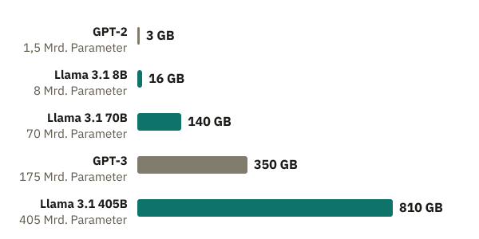
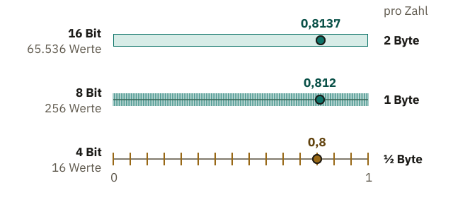

<!-- Generated from src/content/bausteine/de/modellgroesse-und-hardware.mdx by scripts/export-lessons.mjs -- do not edit by hand. -->

# Modellgröße und Hardware: Wo ein Modell Platz findet

> Lesefassung für GitHub. Die vollständige Fassung mit interaktiven Demos, Animationen und Abrufmoment findest du auf der Website: **[Modellgröße und Hardware: Wo ein Modell Platz findet](https://ki-einfach-verstehen.de/de/bausteine/modellgroesse-und-hardware/)**
>
> Lizenz: [CC BY 4.0](https://creativecommons.org/licenses/by/4.0/deed.de) · Nenne die Quelle so: KI einfach verstehen, „Modellgröße und Hardware: Wo ein Modell Platz findet“, CC BY 4.0, https://ki-einfach-verstehen.de/de/bausteine/modellgroesse-und-hardware/

Wie viel Speicher ein KI-Modell braucht, warum zuerst der Platz und nicht das Tempo entscheidet, wie Quantisierung Modelle verkleinert und warum Training noch viel mehr Speicher braucht.

Im vorigen Baustein hast du die Modelldatei von Llama 3.1 8B kennengelernt: ein kleiner Bauplan und rund acht Milliarden Zahlen, zusammen 16 Gigabyte. Auf manchen Handys läuft ein Sprachmodell direkt auf dem Gerät, bei Apple etwa eines mit rund 3 Milliarden Parametern. Große Chatbots laufen dagegen in Rechenzentren.

Was glaubst du: Liegt das vor allem daran, dass der Chip im Handy zu langsam rechnet, oder an etwas anderem?

## Wie viel Platz acht Milliarden Zahlen brauchen

Jede der acht Milliarden Zahlen ist in der Datei mit 2 Byte gespeichert, und ein Gigabyte ist eine Milliarde Byte. Woher kommen die 2 Byte? Ein Speicher besteht aus winzigen Stellen, die jeweils nur Ja oder Nein festhalten. Eine solche Stelle heißt Bit, und acht Bit ergeben ein Byte. Llama 3.1 hält jede Zahl mit 16 Bit fest, also mit 2 Byte.

Jede Kombination aus Ja und Nein steht für einen bestimmten Wert. Zwei Bit ergeben schon vier Kombinationen: Ja-Ja, Ja-Nein, Nein-Ja und Nein-Nein. Jedes weitere Bit verdoppelt die Zahl der Kombinationen: 4 Bit ergeben 16 Werte, 8 Bit 256, 16 Bit schon 65.536. So viele verschiedene Werte kann jede Zahl von Llama 3.1 annehmen. Llama 3.1 liest seine 16 Bit allerdings so, dass diese Werte nicht gleichmäßig verteilt sind: dicht um null, weiter auseinander bei größeren Zahlen.

Daraus folgt eine Faustregel: Milliarden Parameter mal Byte pro Zahl ergibt Gigabyte. Für Llama 3.1 8B heißt das 8 mal 2, also 16 Gigabyte. Meta bietet Llama 3.1 auch in einer mittleren Fassung mit 70 Milliarden Parametern an. Wie viel Platz braucht die?

Nach der Faustregel 70 mal 2, also 140 Gigabyte. Die größte Fassung, Llama 3.1 405B, kommt so auf rund 810 Gigabyte.

*Nach der Faustregel mit 2 Byte pro Zahl: Der Speicher für die Parameter wächst im selben Verhältnis wie ihre Zahl.*

Die Faustregel zählt nur die Parameter. Beim Rechnen kommen die Zahlen deines Textes hinzu und alles, was das Modell daraus Schritt für Schritt berechnet. Diese Zwischenergebnisse brauchen zusätzlich Platz, und weil das bisherige Gespräch bei jeder Nachricht mitgeht, wächst ihr Anteil mit der Länge des Gesprächs. Die Faustregel liefert deshalb eine Untergrenze: Weniger als 16 Gigabyte braucht Llama 3.1 8B mit 16 Bit nie. Auf Download-Seiten kannst du so aus der Zahl im Modellnamen abschätzen, wie groß die Dateien ungefähr sind.

Wo müssen diese Gigabyte liegen, damit das Modell mit den Zahlen rechnen kann?

## Platz vor Tempo

Im Mischpult-Bild aus den vorigen Bausteinen ist jeder Parameter ein Regler und der Bauplan das Pult. Hier endet das Bild aber: Ein echtes Pult verarbeitet den Ton selbst. Ein Modell ist nur eine Datei mit Bauplan und Reglerstellungen. „Laufen“ heißt, ein Chip rechnet für jedes Textstück nach dem Bauplan mit allen diesen Zahlen. Den Grafikprozessor kennst du aus dem Baustein über Vektoren und Matrizen. Dieser Chip führt Tausende gleichartiger Rechnungen zugleich aus. Am schnellsten rechnet er mit Zahlen aus seinem eigenen Speicher direkt neben dem Chip. Dieser Speicher heißt **[Grafikspeicher](https://ki-einfach-verstehen.de/de/glossar/grafikspeicher/)**, oft auch VRAM genannt.

*Ein Grafikchip rechnet mit den Zahlen in seinem eigenen, schnellen Speicher.*

Die Datei selbst liegt im Dauerspeicher. Beim Handy sind das etwa die 128 oder 256 Gigabyte, mit denen geworben wird. Von dort zu lesen ist viel zu langsam, wenn für jedes Textstück alle Zahlen gebraucht werden. Zum Rechnen werden sie deshalb in den schnellen Speicher kopiert. Damit das Modell zügig antwortet, müssen dort alle Parameter zugleich Platz finden.

Eine Grafikkarte für Spiele, also ein Grafikprozessor samt Grafikspeicher, ist etwa die GeForce RTX 4090 des Chipherstellers Nvidia. Sie hat laut Hersteller 24 Gigabyte Grafikspeicher. Llama 3.1 8B passt mit seinen 16 Gigabyte darauf, mit etwas Platz für Zwischenergebnisse. Ein Grafikprozessor für Rechenzentren, etwa die H100 von Nvidia, hat in der verbreiteten Fassung 80 Gigabyte.

Die größte Fassung, Llama 3.1 405B, braucht nach der Faustregel rund 810 Gigabyte. Das ist mehr, als zehn H100-Chips zusammen fassen. Sie läuft deshalb nur auf vielen Chips zugleich, die sich die Zahlen aufteilen. **Die erste Grenze ist der Platz, nicht das Rechentempo des Chips.** Ein schnellerer Chip hilft nicht, solange die Zahlen nicht alle in den schnellen Speicher neben ihm passen. Den Rest müsste er bei jedem Textstück aus dem langsamen Dauerspeicher holen. Dann wartet auch der schnellste Chip.

*Ein kleines Modell passt aufs Handy. Die größten brauchen Reihen von Chips im Rechenzentrum, weil ihre Zahlen sonst keinen Platz finden.*

Ein Handy hat keinen eigenen Grafikspeicher. Der schnelle Speicher neben seinem Chip ist der Arbeitsspeicher, den sich Modell, Betriebssystem und alle Apps teilen. Aktuelle Pixel-Handys von Google haben je nach Modell 8 bis 16 Gigabyte davon, viel weniger als die 128 oder 256 Gigabyte Dauerspeicher. Llama 3.1 8B mit seinen 16 Gigabyte passt deshalb selbst auf das größte dieser Handys nicht, denn auch System und Apps brauchen ihren Teil. Größere Modelle passen erst recht nicht. Deshalb berechnen Chips im Rechenzentrum die Antworten großer Chatbots, und deine Frage reist dorthin.

Eine Ebene tiefer: Warum die Antwort Stück für Stück erscheint

Für jedes neue Textstück wird das ganze Sprachmodell einmal durchgerechnet. Dafür müssen alle Parameter aus dem Grafikspeicher zu den Rechenwerken des Chips wandern. Bei einzelnen Anfragen dauert dieses Laden länger als das Rechnen selbst.

Wie viele Gigabyte der Speicher pro Sekunde liefern kann, gibt die **Speicherbandbreite** an. Bei der H100 in ihrer verbreiteten SXM-Fassung sind es laut Hersteller 3,35 Terabyte pro Sekunde, also 3350 Gigabyte. Ein Überschlag mit Llama 3.1 8B: 3350 geteilt durch 16 ergibt rund 209. Bei einer einzelnen Anfrage schafft dieser Chip mit 16-Bit-Zahlen also höchstens rund 200 Textstücke pro Sekunde, egal wie schnell er rechnet. In der Praxis sind es weniger. Deshalb rechnen Rechenzentren die Anfragen vieler Menschen gemeinsam, in einem Batch: Der Chip lädt die Parameter einmal und verwendet sie für alle Anfragen dieses Schritts. Das Tempo spielt also eine Rolle, aber erst, wenn das Modell Platz gefunden hat.

Wie läuft dann Apples Modell mit 3 Milliarden Parametern auf dem Handy?

## Gröber gerundet: Quantisierung

Nach der Faustregel bräuchte Apples Handy-Modell mit 2 Byte pro Zahl 6 Gigabyte. Auf einem Handy mit 8 Gigabyte bliebe für System und Apps kaum etwas übrig. Trotzdem läuft es auf dem Gerät. Dafür wird jede Zahl mit weniger Bit gespeichert, also gröber gerundet.

Nimm die ausgedachte Zahl 0,8137. Vereinfacht angenommen, die erlaubten Werte liegen gleichmäßig zwischen 0 und 1. Wären die 65.536 Werte von 16 Bit so verteilt, bliebe die Zahl fast genau erhalten. Mit 8 Bit stehen nur noch 256 Werte zur Wahl, und die Zahl rückt auf den nächstgelegenen, 0,812.

Mit 4 Bit bleiben nur 16 Werte. Zwischen 16 Strichen von 0 bis 1 liegen 15 Lücken, der Abstand ist also ein Fünfzehntel, rund 0,067. Der nächstgelegene Wert zu 0,8137 ist 0,8. Dieses gröbere Speichern heißt **[Quantisierung](https://ki-einfach-verstehen.de/de/glossar/quantisierung/)**. Alle Regler bleiben dabei erhalten, nur steht jeder etwas ungenauer.

*Vereinfacht, mit gleichmäßig verteilten erlaubten Werten zwischen 0 und 1: Je weniger Bit, desto weniger Werte, desto gröber wird die ausgedachte Zahl 0,8137 gerundet.*

Weniger Bit heißt weniger Platz. Mit 8 Bit braucht jede Zahl nur noch 1 Byte, mit 4 Bit ein halbes. Llama 3.1 8B schrumpft mit 4 Bit von 16 auf mindestens rund 4 Gigabyte; echte 4-Bit-Dateien sind meist etwas größer. Apple speichert den größten Teil seines Handy-Modells sogar mit 2 Bit pro Zahl, ein Achtel des Platzes. Damit das gut geht, hat Apple das Modell schon beim Training an die groben Werte gewöhnt.

Gröber gerundete Regler verschieben die Scores, die das Modell für jedes nächste Textstück berechnet, ein wenig. Meist liegt trotzdem dasselbe Textstück vorn. Je weniger Bit, desto öfter kippt die Wahl, und das Modell macht mehr Fehler. Wie stark das ausfällt, hängt vom Verfahren und von der Zahl der Bit ab. Bei 8 Bit ist die Einbuße oft kaum messbar: Ein Verfahren aus dem Jahr 2022 lässt ein Modell so groß wie GPT-3 mit 8 Bit ohne Leistungsverlust laufen. Mit weniger Bit wird es heikler. Viele Modelle zum Herunterladen gibt es deshalb in mehreren Fassungen mit unterschiedlich vielen Bit.

Was glaubst du: Mit wie vielen Bit passt Llama 3.1 8B auf ein Handy mit 8 Gigabyte? Überleg kurz, bevor du weiterliest.

> **Interaktive Demo:** [auf der Website ausprobieren](https://ki-einfach-verstehen.de/de/bausteine/modellgroesse-und-hardware/)

Mit 8 Bit wären es 8 Gigabyte, der ganze Speicher. Das geht nicht. Mit 4 Bit sind es rund 4 Gigabyte, die Hälfte. Ob das reicht, hängt davon ab, wie viel System und Apps gerade belegen; es wird knapp. Mit 2 Bit wären es rund 2 Gigabyte. Das passt, aber ein fertiges Modell, das man nachträglich so grob rundet, wird spürbar schlechter.

## Der Speicher im Training

Was glaubst du: Braucht das Training von Llama 3.1 8B so viel Speicher wie das Benutzen? Es sind ja dieselben acht Milliarden Parameter. Denk kurz darüber nach, bevor du weiterliest.

Es braucht deutlich mehr. Im Training liefert die Backpropagation für jeden Regler seine Steigung. Daraus ergibt sich sein Schritt, wie beim Apfel-Modell mit seinem einen Regler: Schritt gleich Steigung mal Lernrate. Die Steigung jedes Reglers muss gespeichert bleiben, bis sein Schritt ausgeführt ist.

Außerdem sind die Schritte oft kleiner als der Abstand zwischen zwei erlaubten 16-Bit-Werten. Der Regler würde nach dem Schritt wieder auf seinen alten Wert gerundet, so wie bei 4 Bit jede Zahl zwischen rund 0,77 und 0,83 auf 0,8 rückt. Der Schritt ginge verloren. Deshalb speichert das Training für jede Zahl eine genauere Kopie mit 32 Bit, in der sich die winzigen Schritte sammeln. Das Training rechnet weiter mit der 16-Bit-Zahl, weil das schneller geht. Diese Zahl wird aus der Kopie immer wieder neu gerundet.

Und das meistgenutzte Trainingsverfahren rechnet etwas feiner als die Regel „Steigung mal Lernrate“. Es merkt sich je Regler zwei Hilfswerte: in welche Richtung seine Steigungen zuletzt zeigten und wie groß sie typischerweise waren, damit ein einzelner Ausreißer den Regler nicht weit verreißt.

Ein Forschungspapier zum Training großer Modelle rechnet pro Parameter mit 2 Byte für die Zahl und 2 Byte für ihre Steigung. Dazu kommen 4 Byte für die Kopie mit 32 Bit und je 4 Byte für die beiden Hilfswerte. Das sind 16 Byte statt 2, also achtmal so viel. Für Llama 3.1 8B sind das rund 128 Gigabyte: 8 Milliarden mal 16 Byte. Mehr, als eine H100 fasst. Die Zwischenergebnisse kommen noch hinzu. Schon das Training eines Modells dieser Größe verteilt sich deshalb auf mehrere Chips.

*Pro Parameter: Zum Benutzen genügen 2 Byte, im Training kommen Steigung, genauere Kopie und zwei Hilfswerte hinzu.*

Eine Ebene tiefer: Was Training zusätzlich im Speicher hält

Die 16 Byte stammen aus dem Forschungspapier zu ZeRO, einem Verfahren zum Training sehr großer Modelle. Die Rechnung gilt für Training mit gemischter Genauigkeit, also mit 16-Bit-Zahlen und der genaueren 32-Bit-Kopie daneben.

Fachleute nennen die Steigungen aller Regler zusammen **Gradient**. Das Trainingsverfahren mit den zwei Hilfswerten heißt **Adam**. Einer seiner Hilfswerte hält fest, in welche Richtung die letzten Steigungen eines Reglers zeigten, der andere, wie groß sie typischerweise waren. Daraus berechnet Adam für jeden Regler einen eigenen, ausgeglicheneren Schritt.

Andere Rechnungen kommen auf etwas mehr. Eine Anleitung von Hugging Face nennt zum Beispiel 18 Byte pro Parameter. ZeRO verteilt diese Einträge auf alle beteiligten Chips, statt sie auf jedem Chip vollständig zu speichern. Beim Benutzen fallen Steigungen, Kopie und Hilfswerte ganz weg.

Dass große Chatbots in Rechenzentren laufen, liegt also zuerst am Platz. Auch Llama 3.1 8B bekommst du nicht mit einem schnelleren Chip aufs Handy, sondern nur mit gröber gerundeten Zahlen. Mit 4 Bit wird es knapp, mit 2 Bit passt es, aber das Modell wird spürbar schlechter.

In den Milliarden Zahlen eines Modells steht kein ausgeschriebener Satz. Wie kann ein Chatbot dann wissen, dass Paris die Hauptstadt von Frankreich ist? Darum geht es im nächsten Themenbereich. Er beginnt mit dem Baustein [Was ein KI-Modell eigentlich ist](./was-ein-ki-modell-eigentlich-ist.md).

---

Quelle: https://ki-einfach-verstehen.de/de/bausteine/modellgroesse-und-hardware/

← Zurück: [Parameter, Training und Inferenz: Wie ein Modell lernt](./parameter-training-inferenz-hardware.md) · [Alle Bausteine](../../README.de.md#inhalt) · Weiter: [Was ein KI-Modell eigentlich ist](./was-ein-ki-modell-eigentlich-ist.md) →
