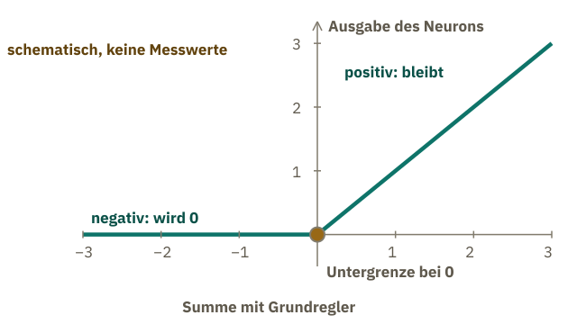
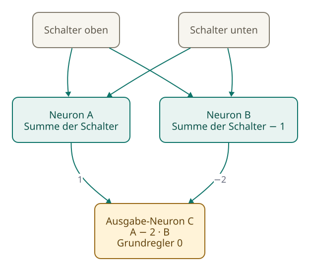
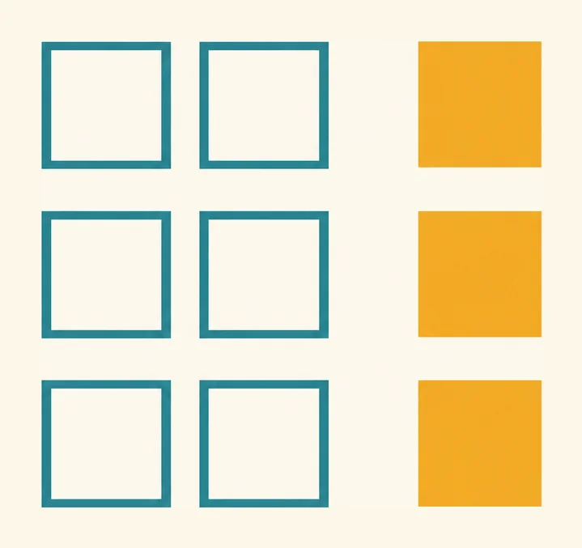
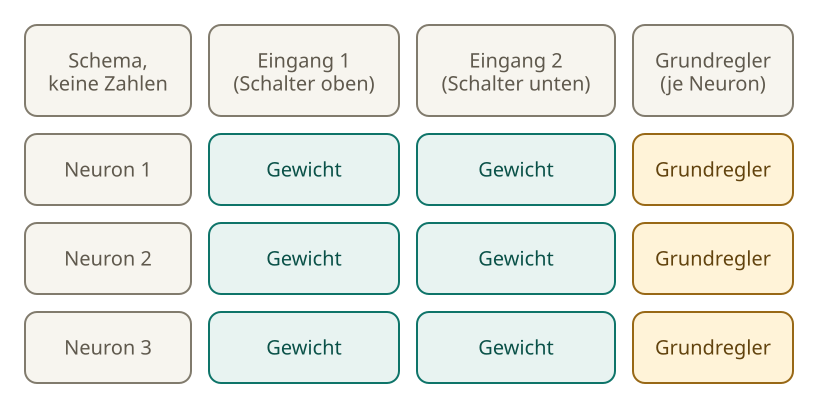
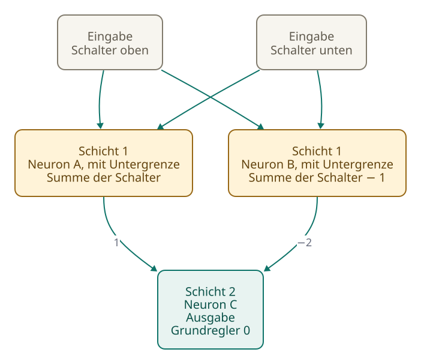
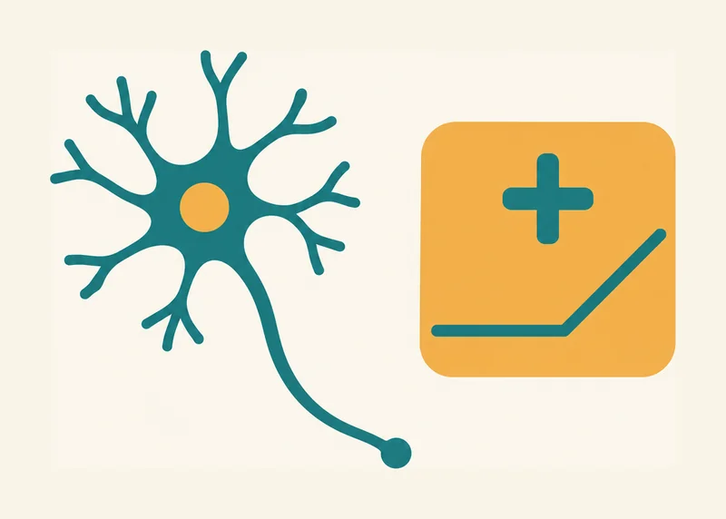

<!-- Generated from src/content/bausteine/de/neuronale-netze.mdx by scripts/export-lessons.mjs -- do not edit by hand. -->

# Neuronale Netze: Wie aus vielen kleinen Rechnungen ein Modell wird

> Lesefassung für GitHub. Die vollständige Fassung mit interaktiven Demos, Animationen und Abrufmoment findest du auf der Website: **[Neuronale Netze: Wie aus vielen kleinen Rechnungen ein Modell wird](https://ki-einfach-verstehen.de/de/bausteine/neuronale-netze/)**
>
> Lizenz: [CC BY 4.0](https://creativecommons.org/licenses/by/4.0/deed.de) · Nenne die Quelle so: KI einfach verstehen, „Neuronale Netze: Wie aus vielen kleinen Rechnungen ein Modell wird“, CC BY 4.0, https://ki-einfach-verstehen.de/de/bausteine/neuronale-netze/

Was ein künstliches Neuron ausrechnet, warum erst die Untergrenze und das Stapeln etwas bauen, das mehr kann als eine Summe, und was eine Angabe wie „96 Schichten“ meint.

In den Milliarden Zahlen eines Modells steht kein einziger Satz. Wie daraus trotzdem eine Antwort wird, fängt mit einer erstaunlich kleinen Rechnung an, und die kennst du schon.

## Der Spamfilter rechnet schon wie ein Neuron

Erinnerst du dich an den Spamfilter aus dem ersten Baustein? Er hatte für jedes Wort ein Gewicht gespeichert: „Gewinn“ +3, „gratis“ +2, „Rechnung“ −2. Für jede Mail zählte er die Gewichte der Wörter zusammen, die darin vorkommen. Lag die Summe über 2, galt die Mail als Spam.

Vier Mails zeigen, wie das ausgeht. „Gratis: Dein Gewinn wartet“ kommt auf 2 plus 3, also 5: Spam. „Pokal-Gewinn: Rechnung für die Feier“ auf 3 minus 2, also 1: Posteingang. „Deine Rechnung, gratis zum Download“ auf 2 minus 2, also 0: Posteingang. „Hallo, wie geht’s?“ enthält kein Wort aus der Liste, die Summe ist 0, also ebenfalls Posteingang. Jedes Wort zählt einmal, auch wenn es mehrfach vorkommt. Eine Eingabe ist deshalb 1, wenn das Wort vorkommt, und 0, wenn nicht.

Der Filter ist damit schon fast ein [Neuron](https://ki-einfach-verstehen.de/de/glossar/neuron/). Ein Neuron nimmt Eingaben, multipliziert jede mit ihrem Gewicht, zählt alles zusammen und gibt eine Zahl aus. Diese Summe heißt gewichtete Summe. Der Spamfilter rechnet genau das, nur gibt er am Ende ein Urteil aus statt einer Zahl. Den Namen hat das Neuron von den Nervenzellen geliehen.

Das passende Bild kennst du aus dem ersten Baustein: das Mischpult. Ein Kanal hat Regler, und die Regler sind die Gewichte. Die Summe läuft durch den Kanal. Neu ist die Anzeige am Ende des Kanals: Sie zeigt, welche Zahl das Neuron gerade ausgibt, die Ausgabe des Neurons. Die Regler sind gespeichert und bleiben, wie sie sind. Die Eingaben entstehen dagegen für jede Mail neu.

*Ein Kanal als Neuron: Die drei senkrechten Regler halten die Gewichte der drei Eingaben, der waagerechte Regler darüber ist der Grundregler. Dahinter sitzt eine feste Stufe, die negative Werte auf null setzt (die Untergrenze, weiter unten erklärt). Die Anzeige zeigt die Ausgabe des Neurons.*

Im Spamfilter gehört jeder Regler zu einem Wort: Das Wort ist die Eingabe, der Regler hält ihr Gewicht. In einem großen Netz gehört ein Regler dagegen zur Verbindung zwischen zwei Rechenschritten. Dort trägt er keine Beschriftung, wie schon die 175 Milliarden Regler von GPT-3 im ersten Baustein. Dem Filter fehlen noch zwei Dinge. Er entscheidet nur mit einer festen Schwelle, und er gibt keine Zahl weiter, mit der eine nächste Rechnung arbeiten könnte. Das Neuron behebt beides: Es verschiebt die Summe um eine eigene Zahl, sodass die Prüfung immer bei null stattfindet, und es reicht statt eines Urteils eine Zahl weiter.

## Der Grundregler ersetzt die Schwelle, die Untergrenze schneidet ab

Die Schwelle 2 bekommt im Neuron ein Gegenstück: den [Grundregler](https://ki-einfach-verstehen.de/de/glossar/grundregler/), in Fachtexten Bias genannt. Er ist eine feste Zahl, die zur Summe dazugezählt wird. Beim Spamfilter wäre er −2. Statt zu fragen, ob die Summe über 2 liegt, zählt das Neuron −2 dazu und schaut, ob über null etwas übrig bleibt. „Gratis: Dein Gewinn wartet“ kommt so auf 5 minus 2, also 3, die Pokal-Mail auf 1 minus 2, also −1. Der Grundregler gehört zum Neuron und gilt für jede Mail.

Danach kommt die [Untergrenze](https://ki-einfach-verstehen.de/de/glossar/aktivierungsfunktion/), eine feste Schaltung hinter der Summe. Eine positive Zahl bleibt, wie sie ist. Eine negative wird auf null gesetzt, denn unter null lässt die Untergrenze nichts durch. Nach oben begrenzt sie nichts, sie schneidet nur unten ab. Fachleute nennen so eine Schaltung Aktivierungsfunktion. Ihre einfachste Form heißt ReLU, kurz für das englische „rectified linear unit“, etwa „gleichgerichtete lineare Einheit“.

*Schematisch, keine Messwerte: Unter null bleibt die Ausgabe auf null, darüber steigt sie gerade an.*

Ein Treppenlicht hat zwei Schalter, einen oben und einen unten. Das Licht brennt, wenn genau einer davon gedrückt ist. Sind beide gedrückt oder keiner, bleibt es dunkel. Die Zahlen im folgenden Netz setzt ein Mensch von Hand, trainiert wurde nichts. Es zeigt nur, wie Summe, Grundregler und Untergrenze zusammenwirken; was ein echtes Modell mit Milliarden Zahlen antwortet, lässt sich daraus nicht ablesen.

Das Netz hat drei Neuronen. A und B sitzen vorn, sehen beide Schalter und haben an jedem das Gewicht 1. Der Grundregler von A steht auf 0, der von B auf −1. Hinter beiden sitzt die Untergrenze.

Was zeigt B, wenn keiner der Schalter gedrückt ist? Rechne kurz selbst.

Ist keiner der Schalter gedrückt, rechnet A 0. B rechnet 0 mit Grundregler −1, also −1, und die Untergrenze macht daraus 0. Ist ein Schalter gedrückt, rechnet A 1, und B rechnet 1 mit Grundregler −1, also 0. Sind beide gedrückt, rechnet A 2, und B rechnet 2 mit Grundregler −1, also 1.

Die Zahlen von A und B gehen in ein Ausgabe-Neuron C. Es gewichtet die Ausgabe von A mit 1 und die von B mit −2, sein Grundregler steht auf 0. Ohne gedrückten Schalter ergibt das 0, bei einem gedrückten 1, bei beiden 2 minus 2, also 0. Für keinen, nur oben, nur unten und beide Schalter kommt also 0, 1, 1, 0 heraus. Das Licht brennt genau dann, wenn einer der beiden gedrückt ist.

In Qwen3-8B, einem frei veröffentlichten Sprachmodell, steckt an dieser Stelle eine glattere Kurve statt der scharfen Ecke bei null.

Eine Ebene tiefer: Welche Stufe nutzt ein aktuelles Sprachmodell?

Qwen3-8B ist ein offenes Sprachmodell, dessen Konfigurationsdatei öffentlich einsehbar ist. Dort steht unter `hidden_act` der Wert `silu`. Gemeint ist eine abgerundete Stufe, keine strenge Untergrenze: Für große negative Eingaben geht sie gegen null, für positive bleibt sie fast gleich der Eingabe, und dazwischen gibt es keine scharfe Ecke.

Dieselbe Datei nennt unter `num_hidden_layers` die Zahl 36. Das ist die Zahl der Schichten im Sinn einer Modellangabe, also der großen Blöcke, die weiter unten im Text vorkommen, nicht die Zahl einzelner Neuronenreihen.

Wie die Neuronen um diese Kurve herum verschaltet sind, steht in der Datei nicht. Die Grundidee bleibt dieselbe: Hinter der Summe sitzt eine Schaltung, die nicht einfach weiterzählt.

## Ohne Untergrenze bleibt alles Addition

Überleg kurz, bevor du weiterliest. Was zeigt das Treppenlicht ohne Untergrenze, wenn keiner der Schalter gedrückt ist?

> **Interaktive Demo:** [auf der Website ausprobieren](https://ki-einfach-verstehen.de/de/bausteine/neuronale-netze/)

Die Antwort ist nicht 0. Neuron A rechnet wie vorher: 0, 1 und 2. Seine Summe ist nie negativ, deshalb hatte die Untergrenze bei ihm nichts abzuschneiden. Neuron B steht ohne Untergrenze bei −1, und das Ausgabe-Neuron C rechnet dann 0 plus (−2 mal −1), also 2.

Bei einem gedrückten Schalter rechnet A 1, B 1 minus 1, also 0, und C 1. Bei beiden rechnet A 2, B 1, und C 2 minus 2, also 0. Die Reihe der vier Fälle ist damit 2, 1, 1, 0. Ohne Untergrenze sinkt der Wert mit jedem gedrückten Schalter gleichmäßig: 2, 1, 0. Das Muster „genau einer“ verlangt dagegen 0 bei keinem und bei beiden Schaltern und einen Gipfel dazwischen. Eine gleichmäßig fallende Reihe kann keinen Gipfel bilden.

[▶ Animation auf der Website ansehen](https://ki-einfach-verstehen.de/de/bausteine/neuronale-netze/)

*Ohne Untergrenze: Die Schalter nacheinander, Werte an jedem Neuron. Die Reihe ist 2, 1, 1, 0. Nach Anzahl gedrückter Schalter sinkt der Wert gleichmäßig, 2, 1, 0. Einen Gipfel kann eine gerade Abnahme nicht bilden.*

Woran liegt das? Ohne Untergrenze ist jede Rechnung eine gewichtete Summe mit einer festen Zahl dazu. Die Ausgabe von A ist die Summe der Schalter, die Ausgabe von B dieselbe Summe minus 1. Das Ausgabe-Neuron rechnet die Ausgabe von A minus 2 mal die von B. Sind zum Beispiel beide Schalter gedrückt, ist das 2 minus 2 mal 1. Allgemein ergibt sich die Zahl der gedrückten Schalter minus 2 mal (dieselbe Zahl minus 1), und das ist 2 minus die Zahl der gedrückten Schalter. Es bleibt eine gewichtete Summe mit einer festen Zahl dazu. Ein einziges Neuron, das an jedem Schalter das Gewicht −1 hat und den Grundregler 2, liefert dieselben vier Werte.

Zwei hintereinandergeschaltete Reihen von Neuronen ohne Untergrenze können also nicht mehr als eine. Zehn wären es auch nicht, sie ließen sich alle zu einer einzigen zusammenfassen. Die Lehrbuchfassung sagt es ebenso: Ist auch die Schaltung dazwischen linear, also bloß Malnehmen und Addieren, bleibt das ganze Netz eine lineare Funktion seiner Eingabe.

Ohne Untergrenze oder eine ähnliche Schaltung kann ein Netz kein Muster darstellen, bei dem zwei Angaben zusammen etwas anderes bedeuten als jede für sich, wie „genau einer von beiden“. Auch in Sprachmodellen sind solche Schaltungen ein wichtiger Grund, warum sie Zusammenhänge dieser Art darstellen können.

## Wie viele Zahlen stecken in einer Schicht?

Die Neuronen A und B im Treppenlicht bekamen dieselben Schalter als Eingabe. Eine Gruppe von Neuronen mit derselben Eingabe heißt [Schicht](https://ki-einfach-verstehen.de/de/glossar/schicht/). A und B bilden also eine Schicht. Das Ausgabe-Neuron C ist eine Schicht mit nur einem Neuron.

Eine Matrix aus dem fünften Baustein ist eine Tabelle mit Zeilen. Eine Schicht lässt sich genauso aufschreiben: Jede Zeile ist ein Neuron, jede Spalte ein Eingang. Wo sich Zeile und Spalte kreuzen, steht das Gewicht dieses Neurons für diesen Eingang. Dazu kommt pro Neuron ein Grundregler. Wie viele Zahlen hat eine Schicht mit zwei Eingaben und drei Neuronen? Zähl, bevor du weiterliest.

*Zählkasten für zwei Eingänge und drei Neuronen: Jedes Neuron hat zwei Gewichtskästchen und einen Grundregler.*

Zählen geht so: Jedes der drei Neuronen hat zwei Gewichte, eines pro Eingabe. Drei Neuronen mal zwei Gewichte ergibt sechs. Dazu kommt je ein Grundregler pro Neuron, also drei. Zusammen sind es neun Zahlen. Der Grundregler zählt einmal pro Neuron. Die Regel lautet: Eingaben mal Neuronen, plus ein Grundregler für jedes Neuron. Sie gilt für jede Schicht, die einen Grundregler hat. Eine Schicht mit fünf Eingaben und vier Neuronen hat 5 mal 4, also 20 Gewichte, und vier Grundregler. Zusammen sind es 24 Zahlen.

Programme, mit denen Netze gebaut werden, legen Schichten genauso an. PyTorch, ein verbreitetes solches Programm, speichert die Gewichte einer Schicht als Tabelle, mit Zeilen für die Neuronen, dort Ausgänge genannt, und Spalten für die Eingänge, und hat standardmäßig pro Neuron einen Bias, den Grundregler. Die Gewichte im Modell hinter deinem Chatbot stehen in Tabellen dieser Art, nur viel größer.

*Dieselbe Schicht als Tabelle: Zeilen sind Neuronen, Spalten Eingänge, die Kreuzungen Gewichte. Die Randspalte enthält die Grundregler.*

Eine Ebene tiefer: Wie viele Zahlen hat ein Netz für Ziffern?

Ein Lehrbeispiel aus einer Videoreihe zeigt die Regel an einem größeren Netz. Es erkennt handgeschriebene Ziffern: 784 Eingaben für 28 mal 28 Bildpunkte, dann zwei Schichten mit je 16 Neuronen und am Ende 10 Ausgaben für die Ziffern.

Zwischen Eingaben und erster Schicht stehen 784 mal 16, also 12.544 Gewichte. Zwischen den beiden Schichten 16 mal 16, also 256. Zur letzten Schicht 16 mal 10, also 160. Das sind zusammen 12.960 Gewichte. Dazu kommen 16 plus 16 plus 10 Grundregler, also 42. Insgesamt sind es 13.002 Zahlen. Die Regel aus dem Text stimmt also auch hier. Die Zahl sagt allerdings nichts darüber, was ein einzelnes Gewicht bedeutet. Sie zeigt nur, wie viele Stellen beim Training verändert werden.

## Schichten stapeln: Der Zwischenwert läuft weiter

Die Ausgabe einer Schicht wird zur Eingabe der nächsten. Die Zahl, die ein Neuron an die nächste Schicht weiterreicht, heißt [Zwischenwert](https://ki-einfach-verstehen.de/de/glossar/zwischenwert/). Im Mischpult sind das die Anzeigen, die sich mit jedem Durchlauf ändern. Zwischenwerte entstehen für jeden Text neu. Die Gewichte dagegen bleiben fest, während das Modell antwortet.

Im Treppenlicht sind A und B die Zwischenwerte. Ist kein Schalter gedrückt, sind beide 0, denn die Untergrenze setzt B von −1 auf 0. Sind beide Schalter gedrückt, sind sie 2 und 1. Das Ausgabe-Neuron C rechnet daraus 0. Mit dem Zwischenwert rechnet die nächste Schicht weiter; die Antwort entsteht erst am Ende.

[▶ Animation auf der Website ansehen](https://ki-einfach-verstehen.de/de/bausteine/neuronale-netze/)

*Zwei Schichten: Die Zwischenwerte A und B laufen in das Ausgabe-Neuron C weiter. Die Untergrenze sitzt in Schicht 1 hinter der Summe von A und B.*

Die Untergrenze macht das Stapeln erst lohnend. Ohne sie wäre die zweite Schicht nur eine Umrechnung der ersten, wie im Abschnitt davor. Mit ihr kann eine Schicht etwas darstellen, was die vorige allein nicht erreicht: im Treppenlicht „genau einer von beiden“, das ohne Untergrenze nicht entsteht.

Modellangaben benutzen dasselbe Wort, meinen aber oft mehr. GPT-3, das Modell mit den rund 175 Milliarden [Parametern](https://ki-einfach-verstehen.de/de/glossar/parameter/), also den Reglern aus dem ersten Baustein, hat laut seinem Forschungspapier 96 Schichten. Mit Schicht ist in dieser Angabe ein größerer Baustein gemeint, der [Transformerblock](https://ki-einfach-verstehen.de/de/glossar/transformerblock/): eine Gruppe aus mehreren Teilen, darunter solche Neuronenschichten, die das Modell hintereinander durchläuft. [Transformer](https://ki-einfach-verstehen.de/de/glossar/transformer/) heißt die Bauart, auf der die großen Sprachmodelle heute beruhen. Was in einem Block steckt, zeigt der letzte Abschnitt. Die 96 Blöcke laufen nacheinander, jeder mit vielen Neuronen.

## Was das Gehirn-Bild nicht sagt

Das Wort Neuron stammt aus der Biologie. Schon 1943 beschrieben Warren McCulloch und Walter Pitts Nervenzellen als Schaltelemente mit einer Schwelle, die entweder feuern oder nicht. Ihr Modell hatte feste Werte und lernte nicht.

Der Name verführt zu einer Vorstellung: Ein Neuron sei ein kleines Bauteil im Gehirn, das dazulernt. Das liegt nahe, stimmt aber nicht. Ein künstliches Neuron ist eine Rechenvorschrift aus Summe, Grundregler und Untergrenze. Gelernt werden die Gewichte und die Grundregler, die Rechenvorschrift bleibt gleich.

Das Lehrbuch sagt es vorsichtig: Neuronale Netze sind lose von der Neurowissenschaft inspiriert, doch ihr Ziel ist nicht, das Gehirn genau nachzubilden. Wie weit der Abstand reicht, zeigt eine Studie aus dem Jahr 2021. Um das Ein- und Ausgabeverhalten eines einzelnen simulierten Nervenzellen-Modells nachzubilden, brauchte es ein Netz mit fünf bis acht Schichten. Ein einzelnes künstliches Neuron ist deshalb kein Ersatz für eine echte Nervenzelle.

*Die Nervenzelle hat dem Neuron den Namen gegeben. Die Rechenvorschrift dahinter ist eine Summe mit Grundregler und Untergrenze.*

Auch die zweite Vorstellung ist verlockend: Ein Neuron stehe für ein Wort. Im Spamfilter war das so, dort hatte jedes Wort einen Regler. In großen Netzen mischen sich dagegen viele Eingaben. In einem kleinen Sprachmodell reagierte ein einzelnes Neuron auf wissenschaftliche Zitate, englische Dialoge, Anfragen, mit denen ein Browser Webseiten abruft, und koreanischen Text. Ein Neuron steht deshalb nicht unbedingt für einen einzelnen Begriff.

Dass das Training die Gewichte einstellt, weißt du aus dem ersten Baustein: Beim Spamfilter rückten die Gewichte nach jeder falsch eingeordneten Mail ein Stück nach. Wie es bei Milliarden Reglern gleichzeitig herausfindet, welcher in welche Richtung muss, klärt der dritte Themenbereich.

## Womit ein Sprachmodell seine Schichten baut

Ein Transformerblock hat in einem Sprachmodell zwei Teile. Im ersten steckt ein Rechenschritt, der anders arbeitet als ein Neuron mit Untergrenze. Erinnerst du dich an die [Tokens](https://ki-einfach-verstehen.de/de/glossar/token/), die Textstücke, in die der Tokenizer einen Text zerlegt? Jedes Token wird in diesem Schritt mit den anderen Tokens des Textes verrechnet, so wandern Informationen zwischen ihnen. Fachleute nennen ihn [Attention](https://ki-einfach-verstehen.de/de/glossar/attention/), englisch für Aufmerksamkeit. Wie er arbeitet, erklärt der nächste Themenbereich. Der zweite Teil ist ein [Feed-Forward-Netz](https://ki-einfach-verstehen.de/de/glossar/feed-forward-netz/), englisch für vorwärts gerichtetes Netz. Es rechnet für jedes Token einzeln, und die Zahlen fließen darin nur nach vorn. Es besteht aus Schichten mit einer Stufe, die der Untergrenze ähnelt. Wie diese Schichten genau verschaltet sind, unterscheidet sich von Modell zu Modell. Manche Sprachmodelle wie Qwen3 lassen in ihrem Feed-Forward-Netz den Grundregler allerdings weg.

Auch die Forschungsarbeit von 2017, die den Transformer vorgestellt hat, setzt auf diesen Aufbau. Im Teil, der die Eingabe liest, besteht jede Schicht dort aus zwei Teilschichten, und die zweite ist ein Feed-Forward-Netz mit einer ReLU-Stufe dazwischen. Was sich zwischen einem kleinen Netz, das handgeschriebene Ziffern auf Bildern erkennt, und einem Sprachmodell unterscheidet, sind vor allem Größe und Anordnung. Neu kommt im Sprachmodell der Rechenschritt zwischen den Tokens dazu.

Welche Zahlen in all diesen Schichten stehen, legt das Training fest. Der nächste Themenbereich zeigt zuerst, wie ein Sprachmodell als Ganzes durch diese Schichten läuft. Er beginnt mit dem Baustein [Was ein KI-Modell eigentlich ist](./was-ein-ki-modell-eigentlich-ist.md).

---

Quelle: https://ki-einfach-verstehen.de/de/bausteine/neuronale-netze/

← Zurück: [Modellgröße und Hardware: Wo ein Modell Platz findet](./modellgroesse-und-hardware.md) · [Alle Bausteine](../../README.de.md#inhalt) · Weiter: [Was ein KI-Modell eigentlich ist](./was-ein-ki-modell-eigentlich-ist.md) →
