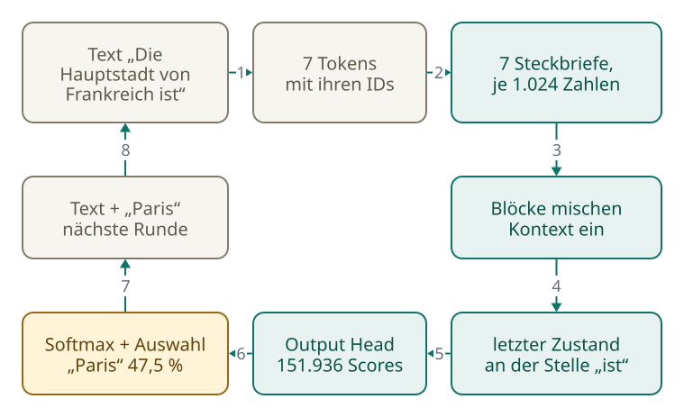

<!-- Generated from src/content/bausteine/de/output-head.mdx by scripts/export-lessons.mjs -- do not edit by hand. -->

# Output Head: Vom letzten Zustand zur Vorhersage

> Lesefassung für GitHub. Die vollständige Fassung mit interaktiven Demos, Animationen und Abrufmoment findest du auf der Website: **[Output Head: Vom letzten Zustand zur Vorhersage](https://ki-einfach-verstehen.de/de/bausteine/output-head/)**
>
> Lizenz: [CC BY 4.0](https://creativecommons.org/licenses/by/4.0/deed.de) · Nenne die Quelle so: KI einfach verstehen, „Output Head: Vom letzten Zustand zur Vorhersage“, CC BY 4.0, https://ki-einfach-verstehen.de/de/bausteine/output-head/

Wie ein Sprachmodell aus seinem letzten Zustand einen Score für jedes Token berechnet, warum dabei nur die letzte Position zählt und wie so eine Antwort entsteht.

Am Ende des vorigen Bausteins hatte jede Position im Text einen Zustand: eine Liste von Zahlen, in die die Blöcke Schicht für Schicht den Kontext eingemischt haben. Bei dem kleinen Sprachmodell Qwen3-0.6B sind es 1.024 Zahlen pro Position. Im Chatfenster erscheinen aber keine Zahlenlisten, sondern Wörter.

Im ersten Baustein dieses Themenbereichs sagte genau dieses Modell nach „Die Hauptstadt von Frankreich ist“ mit 48,8 Prozent „Paris“ voraus, ohne irgendwo einen Eintrag nachzuschlagen. Du weißt schon, dass dabei kein Wort direkt herauskommt. Offen blieb, welche Rechnung zu der Zahl 48,8 führt, und warum dasselbe Modell nach genau diesem Satzanfang bei einem anderen Versuch „Zürich“ schrieb.

## Heraus kommt eine Tafel, kein Wort

Was das Modell am Ende liefert, ist die Score-Liste, die der vorige Baustein angekündigt hat. Sie ähnelt der Punktetafel aus dem Baustein über [Wahrscheinlichkeit und Softmax](./wahrscheinlichkeit-und-softmax.md): eine Zeile pro Kandidat, in jeder Zeile ein Punktestand. Nur hat sie nicht drei Zeilen, sondern eine für jeden Eintrag im [Vokabular](https://ki-einfach-verstehen.de/de/glossar/vokabular/), dazu ein paar Reservezeilen. Bei Qwen3-0.6B sind es zusammen 151.936. Jede bekommt einen [Score](https://ki-einfach-verstehen.de/de/glossar/score/), auch die Zeile für ein Komma, für „Fahrrad“ oder für ein chinesisches Schriftzeichen.

*Die Tafel am Ende des Modells: eine Zeile für jeden Eintrag im Vokabular, jede mit eigenem Punktestand. Eine Zeile liegt vorn.*

Für diesen Themenbereich wurde Qwen3-0.6B auf einem gewöhnlichen Rechner ausprobiert, in der frei verfügbaren Grundfassung ohne Chat-Training. Die Zahlen stammen aus einem einzigen Lauf. Nach „Die Hauptstadt von Frankreich ist“ hat „Paris“ den höchsten Score, 20,6. Auf Platz zwei steht mit 19,2 ein Lückenstrich „____“, wie er in Arbeitsblättern und Quizfragen vorkommt. Solche Texte hat das Modell im Training offenbar oft gesehen. „Bern“ folgt erst auf Platz fünf mit 17,2. Softmax macht aus diesen Scores Prozente. „Paris“ bekommt 48,8, der Lückenstrich 11,3 und „Bern“ 1,5. Daher kommt die Zahl aus dem ersten Baustein.

*Die Spitze der echten Tafel: Kleine Abstände zwischen den Scores werden durch Softmax zu großen Unterschieden in den Prozenten.*

Dass das Modell in jeder Runde jeden Eintrag seines Vokabulars bewertet und erst ein eigener Schritt genau einen auswählt, kennst du aus dem Baustein über [Input und Output](./input-und-output.md). Neu ist, wie die echte Liste aussieht. Das Gewählte ist oft nicht einmal ein ganzes Wort. Nach „Der Hund jagt die“ lagen bei demselben Modell Wortanfänge vorn, etwa „T“, „F“ und „Kat“, jeder mit nur wenigen Prozent. Gewählt wird ein [Token](https://ki-einfach-verstehen.de/de/glossar/token/).

Scores können auch negativ sein. Im selben Versuch lief GPT-2 mit, ein älteres Modell, das fast nur Englisch kann, in seiner kleinsten Fassung mit rund 124 Millionen Parametern. Nach „The dog chased the“ (der Hund jagte den) waren dort sogar alle 50.257 Scores negativ. Der höchste gehörte „dog“ mit −86,4. Trotzdem macht Softmax daraus eine gültige Verteilung, in der „dog“ knapp 20 Prozent bekommt. Wie im Baustein über Softmax gilt: Es zählen nur die Abstände zwischen den Scores, nicht ihre Höhe, so wie beim Skat auch vorn liegt, wer am wenigsten im Minus steht.

Doch woher kommen die 20,6 Punkte für „Paris“?

## Woher die Punkte kommen: eine Zeile pro Token

Den Teil des Modells, der die Tafel füllt, nennen Fachleute **[Output Head](https://ki-einfach-verstehen.de/de/glossar/output-head/)**, auf Deutsch etwa Ausgabekopf. Er ist kein eigenes großes Netz, sondern eine einzige Rechenschicht. Für jeden Eintrag im Vokabular hat er eine Zeile mit genauso vielen Zahlen wie der Zustand. Der Score eines Tokens misst, wie gut der Zustand zu seiner Zeile passt.

Angenommen, ein Modell hätte Zustände mit nur drei Zahlen und ein Vokabular aus vier Tokens: „Katze“, „Taube“, „Ente“ und „Wolke“. Nach „Der Hund jagt die“ steht an der letzten Position der Zustand (1,0 | 0,5 | −1,0). Die Zeile von „Katze“ lautet (2,0 | 1,0 | −1,5).

Der Output Head rechnet Stelle für Stelle: erste Zahl mal erste Zahl und so weiter. Dann zählt er alles zusammen. 1,0 mal 2,0 ergibt 2,0. 0,5 mal 1,0 ergibt 0,5. −1,0 mal −1,5 ergibt plus 1,5, denn minus mal minus ist plus. Zusammen sind das 4,0, der Score von „Katze“. Diese Rechnung kennst du aus dem vorigen Baustein: Genau so wurde dort die Query eines Tokens mit jedem Key verglichen.

„Taube“ hat die Zeile (1,0 | 1,0 | −1,0), das ergibt 1,0 + 0,5 + 1,0 = 2,5. „Ente“ hat (0,5 | 0 | −1,0) und kommt auf 1,5. „Wolke“ hat die Zeile (−1,0 | 0 | 0). Welchen Score bekommt sie? Rechne kurz selbst, bevor du weiterliest.

Es sind −1,0: An der ersten Stelle ist der Zustand positiv und die Zeile negativ, das gibt Abzug. Daraus folgt die Regel hinter jedem Score: Haben Zustand und Zeile an einer Stelle dasselbe Vorzeichen, gibt es Punkte, bei entgegengesetztem Vorzeichen Abzug. Je weiter eine Zahl von null entfernt ist, egal ob mit Plus oder Minus, desto stärker zählt sie. Ein hoher Score heißt also, dass Zustand und Zeile übereinstimmen.

*Der Output Head im Kleinen: Der Zustand wird mit jeder Zeile Stelle für Stelle malgenommen, die Ergebnisse werden zusammengezählt (ausgedachte Zahlen).*

Bei echten Modellen ist es dieselbe Rechnung, nur größer. Bei Qwen3-0.6B hat jede Zeile 1.024 Zahlen, und es gibt 151.936 Zeilen. Der Output Head besteht damit aus rund 156 Millionen Zahlen, alles im Training eingestellte [Parameter](https://ki-einfach-verstehen.de/de/glossar/parameter/). In jeder Runde rechnet der Output Head 151.936 solche Vergleiche.

An einer Stelle passt das Bild der Punktetafel nicht. Auf einer Punktetafel vergibt ein Schiedsrichter Punkte nach Regeln, die sich nachlesen lassen. Die Zeilen des Output Heads haben dagegen keine beschrifteten Stellen. Niemand hat festgelegt, dass die erste Zahl „Tier“ bedeutet; die Zahlen sind so, wie das Training sie eingestellt hat.

Eine Ebene tiefer: Der Output Head als eine einzige Matrix-Rechnung

Alle Zeilen untereinander bilden eine [Matrix](https://ki-einfach-verstehen.de/de/glossar/matrix/). Bei GPT-2 hat sie die Form 50.257 × 768: eine Zeile pro Token, 768 Zahlen pro Zeile. Der Zustand ist ein Vektor mit 768 Zahlen. Die 50.257 Vergleiche lassen sich als eine einzige Multiplikation des Zustands mit der Matrix schreiben:

`Scores = h · Wᵀ`

Dabei ist h der Zustand und W die Matrix. Das hochgestellte T heißt, dass die Matrix gekippt wird, damit ihre Zeilen auf die Stellen des Zustands treffen. Heraus kommt ein Vektor mit 50.257 Scores. Bei GPT-2 nachgerechnet, stimmt das bis auf Rundungsabweichungen unter 0,0002 mit den Scores des Modells überein.

Zwei Feinheiten. Direkt vor dem Output Head steht bei GPT-2 noch ein letzter Ausgleichsschritt, eine sogenannte Normalisierung, die viele Modelle so oder ähnlich haben. Mit „letzter Zustand“ ist der Zustand nach diesem Schritt gemeint. Und die Scores heißen in der Fachsprache Logits. Manche Quellen zählen Softmax noch zum Output Head; dieser Baustein meint damit nur die Rechenschicht, die die Scores liefert.

Die Zeilen des Output Heads erinnern an etwas, das ganz am Anfang des Weges stand.

## Dieselbe Tabelle am Eingang und am Ausgang

Am Eingang des Modells holt jede Token-ID ihren Steckbrief aus einer großen Tabelle. Diese Tabelle hat eine Zeile pro Vokabulareintrag, und jede Zeile ist so lang wie ein Zustand. Genau so sieht auch die Tabelle des Output Heads aus. Könnte es dieselbe sein?

Im Baustein über Tokenisierung im Modell hieß es, am Ausgang stehe meist eine zweite Tabelle. Bei großen Modellen ist das oft so, bei kleinen ist das Teilen dagegen häufig. Fachleute nennen das Weight Tying, auf Deutsch etwa „gekoppelte Gewichte“. Die Tabelle wird dann zweimal benutzt: vorne, um zu einer ID die Zahlen zu holen, hinten, um den letzten Zustand mit jeder Zeile zu vergleichen. Ein hoher Score für „Paris“ heißt dann: Der Zustand an der letzten Position ähnelt dem Steckbrief von „Paris“.

*Weight Tying: Dieselbe Tabelle übersetzt am Eingang Tokens in Zahlen und vergleicht am Ausgang Zahlen mit Tokens.*

Ob ein Modell die Tabelle teilt, steht in seiner Konfigurationsdatei. Bei Qwen3-0.6B heißt der Eintrag „tie_word_embeddings: true“, beim größeren Qwen3-8B „false“: Es hat am Ausgang eine eigene, zweite Tabelle. GPT-2 teilt die Tabelle, ebenso Llama 3.2 1B von Meta. Forschende zeigten schon 2016, dass das Teilen Sprachmodelle sogar etwas besser machen kann. Vor allem spart es Platz.

Wie viel, zeigt eine kleine Rechnung. Die Tabelle von Qwen3-0.6B hat 151.936 Zeilen mit je 1.024 Zahlen, das sind die rund 156 Millionen von eben. Ohne Teilen kämen sie am Ausgang ein zweites Mal dazu. Geteilt macht die eine Tabelle 26 Prozent aller Parameter aus, bei GPT-2 31 und bei Llama 3.2 1B 21 Prozent. Unter den vier hier verglichenen Modellen teilen die drei kleinen die Tabelle, das große nicht. Eine feste Regel ist das nicht, passt aber zur Rechnung: Wo die Tabelle ein großer Teil des Modells ist, spart das Teilen am meisten. Und gerade kleine Modelle sollen oft auf Laptop oder Handy laufen, wo jedes Gigabyte zählt.

Bisher ging es um einen einzigen Zustand. Das Modell hat aber an jeder Position einen.

## Welche Position zählt

„Die Hauptstadt von Frankreich ist“ besteht für Qwen3-0.6B aus sieben Tokens: „Die“, „Haupt“, „stadt“, „von“, „Frank“, „reich“ und „ist“. Nach dem letzten Block hat jedes davon seinen Zustand. Welcher der sieben geht in den Output Head?

Beim Erzeugen nur einer: der Zustand der letzten Position, hier der von „ist“. Die anderen sechs würden Tokens vorhersagen, die längst im Text stehen. Programmbibliotheken wie Hugging Face Transformers berechnen beim Erzeugen deshalb auf Wunsch nur die Scores der letzten Position, was viel Speicher spart.

Heißt das, das Modell achtet nur auf das letzte Wort? Das liegt nahe, wenn nur ein Zustand in den Output Head geht. Aber in diesen Zustand haben die Blöcke Information aus allen vorigen Positionen eingemischt, wie im vorigen Baustein beschrieben. Das Wort „ist“ allein deutet auf keine Hauptstadt hin. Erst durch den eingemischten Kontext passt sein Zustand gut zur Zeile von „Paris“.

Im Training ist das anders. Dort läuft ein Stück Trainingstext durch das Modell, und jede Position liefert ihre eigene Tafel. Wie viele Vorhersagen stecken in einem einzigen Durchlauf mit „Der Hund jagt die Katze“, wenn jedes Wort ein Token ist? Überleg kurz.

Fünf Positionen liefern je eine Tafel, vier davon lassen sich direkt prüfen: Die Position „Der“ soll „Hund“ vorhersagen, „Hund“ das Wort „jagt“, „jagt“ das Wort „die“ und „die“ das Wort „Katze“. Für „Katze“ steht das nächste Token nicht mehr im Text. Jede Position bekommt dabei den echten Text davor, nicht das, was das Modell selbst geraten hätte. Dieses Verfahren heißt Teacher Forcing. Weil keine Vorhersage auf eine andere warten muss, laufen alle gleichzeitig.

*Beim Erzeugen liefert nur die letzte Position eine Tafel. Im Training sagt jede Position ihr nächstes Token voraus, alle gleichzeitig.*

Das erklärt einen Unterschied, den du von Chatbots kennst. Im Training liefert jeder Satz viele Übungsaufgaben auf einmal. Antworten entstehen dagegen Stück für Stück, denn beim Erzeugen gibt es den echten nächsten Text noch nicht: Jedes Token muss erst gewählt sein, bevor das nächste berechnet werden kann.

## Eine ganze Runde, vom Text bis zum nächsten Token

Jetzt lässt sich der ganze Weg am Stück gehen. Der Text wird in Tokens zerlegt, jedes mit seiner ID. Jede ID holt ihren Steckbrief aus der Tabelle. Die Blöcke mischen Schicht für Schicht Kontext in die Zustände ein. Der Zustand der letzten Position geht in den Output Head, und heraus kommt die Tafel mit 151.936 Scores. Softmax macht daraus Prozente. Ein Auswahlschritt wählt ein Token, und das wird angehängt. Dann beginnt die nächste Runde mit einem Token mehr.

[▶ Animation auf der Website ansehen](https://ki-einfach-verstehen.de/de/bausteine/output-head/)

*Eine vollständige Runde durchs Modell: vom Text über Tokens, Steckbriefe, Blöcke und den letzten Zustand bis zur Tafel, zur Auswahl und zum angehängten Token.*

Beim Auswahlschritt entscheidet sich, was aus der Tafel wird. Nimmt das Modell immer das Wahrscheinlichste (Greedy-Auswahl), kommt nach „Die Hauptstadt von Frankreich ist“ jedes Mal „Paris“. Wird dagegen am Glücksrad aus dem Baustein über Softmax gedreht ([Sampling](https://ki-einfach-verstehen.de/de/glossar/sampling/)), ist das Ergebnis offen. Im Versuch kam beim ersten Mal „Zürich“ heraus. Die Stadt hatte ein schmales, aber nicht leeres Feld auf dem Rad. Beim zweiten Mal schrieb das Modell einen Doppelpunkt und dann den Satz noch einmal: „Die Hauptstadt von Frankreich ist Paris.“ Beim dritten Mal kam gleich „Paris“. Dasselbe passiert, wenn du im Chatbot auf „Neu generieren“ tippst: Die erste Tafel bleibt gleich, nur wird neu gelost. Ab dem ersten anderen Token ändern sich auch die weiteren.

Was einmal angehängt ist, bleibt stehen, und jede weitere Runde baut darauf auf. Der Output Head hat dabei nichts falsch gerechnet.

Immer das Wahrscheinlichste zu nehmen, hat eine eigene Schwäche. Im Versuch setzte GPT-2 so „Der Hund jagt die“ mit „Welt des Welt des Welt des Welt des“ fort. Das ist die Wiederholungsschleife aus dem Baustein über Softmax, hier an einem echten Modell. GPT-2 kann kaum Deutsch, was das Beispiel besonders drastisch macht.

Eine Ebene tiefer: Muss jede Runde alles neu gerechnet werden?

So beschrieben, läuft in jeder Runde der ganze Text noch einmal durchs Modell, obwohl nur ein Token dazukam. Den Ausweg nennt der vorige Baustein in seiner Vertiefung, den KV-Cache: Die Keys und Values früherer Tokens werden aufgehoben, weil spätere Tokens an ihnen nichts ändern. Pro Runde geht dann nur das neue Token durch die Blöcke.

Wie viel das ausmacht, wurde für diesen Baustein mit GPT-2 auf einem gewöhnlichen Rechner gemessen. Die Zahlen geben nur eine Größenordnung an: 200 Tokens zu erzeugen, dauerte mit Cache rund 3,6 Sekunden, ohne Cache rund 14 Sekunden, also etwa viermal so lange. Umsonst ist der Cache nicht: Er wächst mit jedem Token und kann bei sehr langen Texten einen großen Teil des Speichers belegen.

## Wann die Schleife endet und was sich einstellen lässt

Bleibt die Frage, wann die Schleife aufhört. Das Ende-Token aus dem Baustein über Tokenisierung im Modell, in den Grundlagen noch Stopp-Zeichen genannt, hat eine eigene Zeile im Output Head und bekommt in jeder Runde einen Score wie alle anderen. Bei GPT-2 ist es der letzte Eintrag. Das Modell beendet seine Antwort also, indem genau dieses Token gewählt wird. Die Längengrenze dagegen ist eine Einstellung außerhalb des Modells. Vielleicht kennst du das: Eine lange Antwort hört mitten im Satz auf, und die App bietet an, weiterzuschreiben. Dann wurde nicht das Ende-Token gewählt, sondern die Grenze war erreicht.

In den Programmierschnittstellen der Anbieter steht, welcher Fall eingetreten ist. Bei Anthropic heißt es „end_turn“, wenn das Modell seine Antwort selbst abgeschlossen hat, sonst endete sie zum Beispiel an einer selbst festgelegten Zeichenfolge, bei der abgebrochen werden soll, oder an der Höchstzahl an Tokens. Bei OpenAI gilt eine an der Grenze abgeschnittene Antwort als unvollständig.

*Was sich von außen einstellen lässt, betrifft vor allem den Auswahlschritt, nicht den Output Head.*

Von außen lässt sich fast nur der Auswahlschritt einstellen, nicht die Rechnung davor. Die Temperatur kennst du aus dem Baustein über Softmax; Top-k und Top-p (dort in der Vertiefung) behalten vor dem Drehen nur die wahrscheinlichsten Tokens. Manche Anbieter nehmen diese Regler bei einzelnen Modellen aber aus der Hand (Stand Oktober 2026). Bei den GPT-6-Modellen von OpenAI müssen Temperatur und Top-p aus der Anfrage verschwinden, sobald das Modell vor dem Antworten nachdenken soll. Anthropic akzeptiert bei Modellen nach Claude Opus 4.6 als Temperatur nur noch 1,0, lehnt Top-k ab und nimmt Top-p nur ab 0,99 an, also praktisch ohne Wirkung. Gelost wird trotzdem, nur legt der Anbieter fest, wie.

Damit ist die Anfangsfrage beantwortet: Das Modell schreibt kein Wort, es füllt eine Tafel. Der Output Head vergleicht den letzten Zustand mit einer Zeile für jedes Token, oft mit denselben Steckbriefen wie am Eingang, und aus der Übereinstimmung wird der Score. Softmax macht daraus Prozente wie die 48,8 für „Paris“. Ein Auswahlschritt nimmt das Wahrscheinlichste oder lost; beim Losen wird es manchmal „Zürich“.

Mit dieser Runde ist auch der Weg durchs Modell komplett, vom Text über Tokens, Steckbriefe und Blöcke bis zur Tafel. Jede Zahl auf diesem Weg war aber einfach da: die Steckbriefe, die Gewichte in den Blöcken, die Zeilen des Output Heads. Eingestellt hat sie das Training, und zwar mit genau der Vorhersage aus diesem Baustein: Das Modell sagt an jeder Position das nächste Token voraus. Diese Vorhersage wird mit dem echten Token verglichen. Wie aus diesem Vergleich ein besseres Modell wird, zeigt der nächste Themenbereich, „Wie Lernen funktioniert“.

---

Quelle: https://ki-einfach-verstehen.de/de/bausteine/output-head/

← Zurück: [Transformerblöcke und Attention: Wie Kontext eingemischt wird](./transformerbloecke-und-attention.md) · [Alle Bausteine](../../README.de.md#inhalt)
