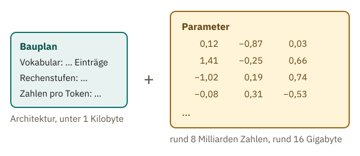
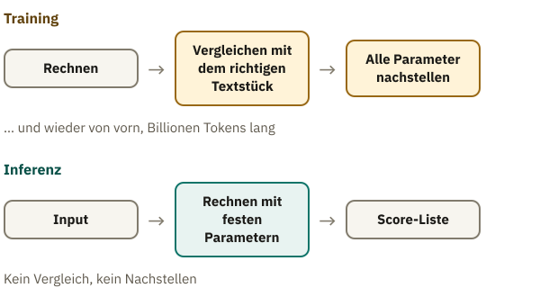

<!-- Generated from src/content/bausteine/de/parameter-training-inferenz-hardware.mdx by scripts/export-lessons.mjs -- do not edit by hand. -->

# Parameter, Training und Inferenz, Hardware: Wie ein Modell läuft

> Lesefassung für GitHub. Die vollständige Fassung mit interaktiven Demos, Animationen und Abrufmoment findest du auf der Website: **[Parameter, Training und Inferenz, Hardware: Wie ein Modell läuft](https://ki-einfach-verstehen.de/de/bausteine/parameter-training-inferenz-hardware/)**
>
> Lizenz: [CC BY 4.0](https://creativecommons.org/licenses/by/4.0/deed.de) · Nenne die Quelle so: KI einfach verstehen, „Parameter, Training und Inferenz, Hardware: Wie ein Modell läuft“, CC BY 4.0, https://ki-einfach-verstehen.de/de/bausteine/parameter-training-inferenz-hardware/

Was in einem fertigen KI-Modell steckt, was Menschen vor dem Training festlegen, warum Lernen so viel teurer ist als Benutzen und welche Hardware ein Modell braucht.

Im vorigen Baustein kam die Temperatur ins Spiel, eine Einstellung, die nicht trainiert wird. Die Scores selbst berechnet das Modell aus seinen Parametern, und die stellt das Training ein. Wie sähe so ein Modell eigentlich aus, wenn du es in die Hand nehmen könntest?

Fast geht das. Manche Firmen veröffentlichen ihre Modelle zum Herunterladen. Meta zum Beispiel hat 2024 das Sprachmodell Llama 3.1 herausgebracht. Die kleinste Fassung, Llama 3.1 8B, umfasst im üblichen Format der Plattform Hugging Face rund 16 Gigabyte Gewichtsdateien. Was steckt in diesen 16 Gigabyte? Warum hat es über eine Million Stunden Rechenzeit gekostet, sie herzustellen? Und warum läuft ein kleines Modell auf einem Handy, während ein großer Chatbot ein Rechenzentrum braucht?

## Was in einer Modelldatei steckt

Wer Llama 3.1 8B herunterlädt, bekommt vor allem zwei Arten von Dateien. Eine ist winzig, kleiner als ein Kilobyte. Sie ist eine Art Bauplan des Modells und nennt zum Beispiel, wie viele Einträge sein Vokabular hat. Die andere Art sind die Gewichtsdateien, hier vier Stück mit zusammen 16 Gigabyte. Sie enthalten Zahlen, rund acht Milliarden davon. Das sind die Parameter, die das Training eingestellt hat. Ein Satz oder ein Fakt steht darin nirgends im Klartext.

*Ein heruntergeladenes Modell besteht aus zwei Teilen: einem kleinen Bauplan und sehr vielen Zahlen.*

Aus dem ersten Baustein kennst du für diese zwei Teile ein Bild: das Mischpult. Die kleine Datei nennt Bautyp und Maße des Geräts, etwa wie viele Rechenstufen es hat. Diesen Bauplan nennt man die **[Architektur](https://ki-einfach-verstehen.de/de/glossar/architektur/)** des Modells. Die Rechenschritte selbst kennt die Software, die das Modell lädt. Die großen Dateien halten fest, wie jeder einzelne Regler steht: die Parameter. Anders als am echten Pult trägt keiner dieser Regler eine Beschriftung.

Was glaubst du: Wenn zwei Modelle genau dieselbe Architektur haben, verhalten sie sich dann auch gleich?

Nicht unbedingt. Neben Llama 3.1 8B bietet Meta eine zweite Fassung an, Llama 3.1 8B Instruct. Beide haben dieselbe Architektur und genau gleich viele Parameter. Die Grundfassung hat nur das Grundtraining hinter sich, das Vorhersagen des nächsten Textstücks. Die Instruct-Fassung wurde danach weitertrainiert, damit sie wie ein Chatbot auf Fragen und Anweisungen eingeht. Dazu kommen kleine Unterschiede in den Begleitdateien, etwa wie ein Gespräch für das Modell in Text umgewandelt wird. Den eigentlichen Unterschied machen aber die Zahlen: dasselbe Pult, andere Reglerstellungen, anderes Verhalten. Auch der Chatbot, mit dem du schreibst, ist so entstanden, aus einem Grundmodell, dessen Regler ein weiteres Training neu gestellt hat.

Acht Milliarden Regler klingen nach viel. Wie viele haben die großen Modelle, und wie viel Platz braucht das?

## Milliarden Regler: Wie groß ein Modell ist

Die Zahl im Namen verrät die Größe. Das „8B“ in Llama 3.1 8B steht für 8 Milliarden Parameter, das B für das englische Wort billion. Vorsicht: Das englische billion ist eine deutsche Milliarde, nicht eine Billion. Solche Kürzel im Namen sagen dir, wie viele Regler auf dem Pult sind.

Jede dieser Zahlen braucht Platz. Llama 3.1 speichert jeden Parameter in 2 Byte. Ein Byte kennst du aus dem Baustein über Tokenizer: Es ist die übliche Einheit, in der Speicher gezählt wird. Ein Gigabyte sind eine Milliarde Byte. Acht Milliarden Zahlen zu je 2 Byte sind also 16 Milliarden Byte, rund 16 Gigabyte, genau die Größe der Gewichtsdateien. Daraus folgt eine einfache Faustregel: Milliarden Parameter mal 2 ergibt den Speicherbedarf in Gigabyte.

Probier die Regel selbst aus: Meta bietet dasselbe Modell auch mit 70 Milliarden Parametern an. Wie viel Speicher braucht diese Fassung?

Rund 140 Gigabyte. Die größte Fassung hat 405 Milliarden Parameter und kommt so auf rund 810 Gigabyte.

*Speicherbedarf mit 2 Byte pro Parameter: Von GPT-2 bis zum größten Llama 3.1 wächst er von 3 auf rund 810 Gigabyte.*

Das größte GPT-2 von 2019 hatte 1,5 Milliarden Parameter und bräuchte nach der Regel 3 Gigabyte. GPT-3, ein Vorläufer der Modelle hinter ChatGPT, hat 175 Milliarden. Mit 2 Byte pro Zahl sind das 350 Gigabyte, mehr als hundertmal so viel wie bei GPT-2. Die Regel zählt dabei nur die Parameter selbst. Beim Benutzen kommt noch Speicher für Zwischenergebnisse hinzu, bei langen Gesprächen eine ganze Menge. Deshalb ist die Regel eine Untergrenze.

Mit der Faustregel kannst du die Kürzel im Namen eines Modells lesen: Die Zahl vor dem B mal zwei sagt dir, wie viele Gigabyte es mindestens braucht, solange jede Zahl wie bei Llama 3.1 in 2 Byte gespeichert ist. Vorsicht bei Namen wie Llama-4-Scout-17B-16E: „16E“ steht für 16 sogenannte Experten, Gruppen von Reglern, von denen für jedes Textstück nur ein Teil mitrechnet. Die 17B zählen nur die Regler, die für ein Textstück tatsächlich mitrechnen. Platz brauchen trotzdem alle, laut Modellbeschreibung 109 Milliarden, also rund 218 Gigabyte.

Wer hat aber entschieden, dass Llama 3.1 8B acht und nicht neun Milliarden Regler hat? Das Training jedenfalls nicht.

## Was vor dem Training feststeht

Bevor sich der erste Regler bewegt, haben Menschen schon eine ganze Reihe von Entscheidungen getroffen. Das Training stellt die Regler, aber es baut kein neues Pult. Wie viele Regler es gibt, wie viele Einträge das Vokabular hat, wie viele Tokens ins Kontextfenster passen: Das alles steht fest, bevor das Training beginnt. Bei GPT-2 etwa verdoppelten die Entwickler das Kontextfenster gegenüber dem Vorgänger von 512 auf 1024 Tokens.

Solche Einstellungen heißen **[Hyperparameter](https://ki-einfach-verstehen.de/de/glossar/hyperparameter/)**. Der Unterschied: Hyperparameter legen Menschen fest, Parameter stellt das Training ein. Die Architektur aus dem ersten Abschnitt besteht aus solchen Entscheidungen. Dazu kommen Einstellungen, die nur das Training betreffen. Am Mischpult wären Hyperparameter die Entscheidungen, bevor beim Soundcheck zum ersten Mal ein Regler geschoben wird, etwa wie viele Kanäle das Pult haben soll. Den Soundcheck, also das Einstellen der Regler, übernimmt beim Modell das Training.

Ein Hyperparameter wirkt direkt auf das Training: die **[Lernrate](https://ki-einfach-verstehen.de/de/glossar/lernrate/)**. Im ersten Baustein hat der Trainingsalgorithmus die Gewichte des Spamfilters bei jedem Fehler „ein kleines Stück“ nachgestellt. Wie groß dieses Stück ist, legt die Lernrate fest. Was, glaubst du, passiert, wenn das Stück sehr groß ist?

Dann schießt jede Korrektur übers Ziel hinaus. Das Gewicht von „Gewinn“ würde nach einer Werbemail weit nach oben springen und nach der nächsten Bankmail weit nach unten. Es fände nie die Stelle, an der sich beide Seiten die Waage halten. Ist das Stück dagegen zu klein, kommt das Training kaum voran. Die passende Lernrate finden Fachleute oft nur, indem sie mehrere Werte in Trainingsläufen ausprobieren.

Und die Temperatur aus dem vorigen Baustein? Manche zählen auch sie zu den Hyperparametern. Wichtiger ist ein Unterschied: Die Lernrate wirkt nur während des Trainings und hinterlässt ihre Spuren in den Parametern. Die Temperatur wird erst beim Benutzen gesetzt, bei jeder Anfrage neu, und lässt das Modell unverändert.

Ein Schluss liegt nahe: mehr Parameter, besseres Modell. Auch die Größe ist aber eine Entscheidung vor dem Training, und sie hat einen Preis: Je mehr Regler, desto mehr Rechenarbeit kostet jedes Stück Trainingstext. Beim KI-Labor DeepMind bekam das Modell Chinchilla mit 70 Milliarden Parametern so viel Rechenzeit wie das viermal größere Gopher derselben Forscher. Weil jedes Textstück bei einem Viertel der Regler weniger Rechnung kostet, reichte die Zeit für viermal so viel Text. Chinchilla schnitt besser ab und war im Betrieb obendrein billiger. Wie gut ein Modell wird, hängt also nicht an der Zahl der Regler allein, sondern auch daran, mit wie viel Text sie eingestellt werden.

Eine Ebene tiefer: Wie GPT-3 eingestellt wurde

Das Forschungspapier zu GPT-3 von 2020 nennt für das größte Modell unter anderem diese Hyperparameter:

- **96 Schichten.** Eine Schicht ist eine Rechenstufe, die das Ergebnis der vorigen weiterverarbeitet. Jedes Token läuft durch alle 96 nacheinander.
- **12.288 Zahlen pro Token.** So lang ist der Vektor, mit dem das Modell jedes Token auf diesem Weg darstellt.
- **Ein Kontextfenster von 2048 Tokens.**
- **Eine Lernrate von höchstens 0,00006.** Sie wurde zu Beginn langsam hochgefahren und später schrittweise verkleinert, auch dieser Plan stand vorher fest. Die Lernrate ist ein Faktor: Der Trainingsalgorithmus berechnet, in welche Richtung und wie stark jeder Parameter sich ändern sollte, und verkleinert diese Korrektur mit dem Faktor, bevor er nachstellt.
- **Ein Batch von 3,2 Millionen Tokens.** Das Modell wird nicht nach jedem einzelnen Textstück nachgestellt. Der Trainingsalgorithmus sammelt die Korrekturen aus 3,2 Millionen Tokens Text und stellt dann einmal nach.

Insgesamt sah GPT-3 im Training rund 300 Milliarden Tokens. Keiner dieser Werte wurde gelernt. Zahl der Schichten und Länge der Vektoren legen fest, wie groß das Pult ist: Aus ihnen ergeben sich die 175 Milliarden Parameter. Die Lernrate und der Batch bestimmen, wie der Soundcheck abläuft.

Sind alle Entscheidungen gefallen, beginnt das Training. Warum dauert es so lange, wenn eine Antwort im Chatfenster nach Sekunden dasteht?

## Lernen kostet mehr als Benutzen

Bei einem Konzert gibt es zwei Phasen am Mischpult. Vorher, beim Soundcheck, spielt die Band ein paar Takte. Die Tontechnikerin hört hin, merkt, was nicht stimmt, schiebt Regler, und die Band spielt wieder. Während des Konzerts verarbeitet das Pult dann einfach, was hereinkommt. Der Soundcheck steht für das Training. Das Benutzen des fertigen Modells heißt **[Inferenz](https://ki-einfach-verstehen.de/de/glossar/inferenz/)**, das ist das Konzert. Jede Frage, die du einem Chatbot stellst, löst Inferenz aus.

*Der Soundcheck vor dem Konzert: Erst werden die Regler eingestellt, dann bleiben sie stehen.*

Hier hinkt das Bild ein wenig. Beim Soundcheck schiebt ein Mensch nach Gehör ein paar Regler. Beim Training stellt kein Mensch etwas, sondern ein Algorithmus rechnet für alle Milliarden Regler zugleich aus, wohin sie sollen. Und am echten Pult greift die Technikerin auch während des Konzerts noch ein. Beim Modell nicht: Bei der Inferenz bewegt sich kein Regler, ganz gleich, was du eingibst. Lernt ein Chatbot dann gar nicht dazu, während du mit ihm schreibst? Nein, dein Gespräch verändert das Modell nicht. Was er sich darin „merkt“, wird bei jeder Nachricht als Input mitgeschickt, wie im Baustein über Input und Output. Neue Fassungen entstehen erst in eigenen, späteren Trainingsläufen. Manche Anbieter verwenden dafür auch gespeicherte Gespräche, wenn die passende Einstellung eingeschaltet ist.

Warum ist das eine so viel teurer als das andere? Bei der Inferenz rechnet das Modell für jedes Textstück einmal mit seinen Zahlen: Input rein, Score-Liste raus. Beim Training kommen für jedes Beispiel zwei Schritte dazu. Der Trainingsalgorithmus vergleicht die Score-Liste mit dem Textstück, das tatsächlich folgt. Dann berechnet er für jeden einzelnen Parameter, in welche Richtung er nachgestellt werden soll. Bei Llama 3.1 8B sind das acht Milliarden Korrekturen, jedes Mal, wenn eine Portion Trainingstext durchgerechnet ist.

*Training ist eine Schleife aus Rechnen, Vergleichen und Nachstellen. Inferenz ist nur der erste Schritt, mit festen Zahlen.*

Und das Training braucht sehr viele Beispiele. Llama 3.1 wurde mit rund 15 Billionen Tokens trainiert, also 15.000 Milliarden. Für die kleinste Fassung gibt Meta 1,46 Millionen Stunden Rechenzeit auf Grafikchips an. Ein einzelner Chip wäre damit über 160 Jahre beschäftigt. Deshalb läuft Training auf Tausenden Chips gleichzeitig, für das größte Llama 3.1 waren es über 16.000. Dieser Aufwand fällt für jede Fassung einmal an. Danach wird sie immer wieder benutzt, ohne dass sich ein Parameter ändert. Eine einzelne Anfrage ist dagegen billig. Weil aber Millionen Menschen Fragen stellen, braucht auch das Benutzen zusammengenommen große Rechenzentren.

Auch beim Speicher bleibt es im Training nicht bei den Parametern. Zu jedem Regler muss sich der Trainingsalgorithmus seine berechnete Korrektur merken und noch ein paar Hilfswerte. Schon ohne Zwischenergebnisse braucht das Training rund achtmal so viel Platz wie das bloße Benutzen, bei Llama 3.1 8B weit über 100 Gigabyte statt 16.

Eine Ebene tiefer: Was Training zusätzlich im Speicher hält

Erstens die Korrektur für jeden Parameter aus dem letzten Rechenschritt, den Gradienten: in welche Richtung und wie stark er sich ändern soll. Zweitens arbeitet das verbreitete Trainingsverfahren Adam mit einem Gedächtnis. Für jeden Parameter führt es zwei laufende Durchschnitte mit: einen über die Richtung der letzten Korrekturen und einen über ihre Größe. Drittens wird zwar mit 2-Byte-Zahlen gerechnet, aber eine genauere Kopie aller Parameter mit 4 Byte pro Zahl aufbewahrt. Sonst könnten winzige Korrekturen beim Runden ganz verschwinden, ein Effekt wie die Rundung aus dem Baustein über Input und Output.

Das Forschungspapier zum Speicherverfahren ZeRO rechnet so: 2 Byte für den Parameter, 2 für seinen Gradienten, 12 für die genaue Kopie und die beiden Adam-Werte. Zusammen sind das 16 Byte pro Parameter, achtmal so viel wie für die Inferenz. Andere Rechnungen kommen auf 18 Byte. Für Llama 3.1 8B ergeben 16 Byte rund 130 Gigabyte, mehr als ein einzelner Rechenzentrumschip mit 80 Gigabyte fasst. Dazu kommen die Zwischenergebnisse jeder Rechenstufe, die das Training aufheben muss, um die Gradienten zu berechnen. Verfahren wie ZeRO verteilen all diese Daten deshalb auf viele Chips.

Training ist also Sache großer Rechenzentren. Aber worauf läuft ein fertiges Modell, wenn du es benutzt?

## Platz und Tempo: Welche Hardware ein Modell braucht

Auf manchen Handys läuft ein Sprachmodell auf dem Gerät selbst, bei Apple etwa eines mit rund 3 Milliarden Parametern. Große Chatbots dagegen laufen in Rechenzentren. Liegt das vor allem daran, dass Handys zu langsam rechnen?

Hier endet das Mischpult-Bild: Ein Pult ist ein Gerät, ein Modell nur eine Datei mit Bauplan und Zahlen. „Laufen“ heißt: Ein Chip lädt alle Reglerstellungen und rechnet damit. Am schnellsten rechnet ein Grafikchip mit Zahlen, die in seinem eigenen Speicher daneben liegen, dem **[Grafikspeicher](https://ki-einfach-verstehen.de/de/glossar/grafikspeicher/)**, oft VRAM genannt. Weil ein Modell wie Llama 3.1 für jedes neue Textstück mit allen Parametern rechnet, müssen sie dort Platz finden, damit es zügig läuft.

*Ein Grafikchip rechnet mit den Zahlen in seinem eigenen, schnellen Speicher.*

Eine Spiele-Grafikkarte wie die GeForce RTX 4090 hat 24 Gigabyte Grafikspeicher. Llama 3.1 8B passt mit seinen 16 Gigabyte darauf. Ein Chip für Rechenzentren wie die H100 von Nvidia hat in der verbreiteten Fassung 80 Gigabyte. Das größte Llama 3.1 mit rund 810 Gigabyte braucht mehrere Chips. Die erste Grenze ist also der Platz, nicht das Tempo.

Ein Handy hat keinen eigenen Grafikspeicher. Modell, System und alle Apps teilen sich den Arbeitsspeicher, bei aktuellen Pixel-Handys 8 bis 16 Gigabyte. Ein Modell mit 3 Milliarden Parametern bräuchte nach der Faustregel 6 Gigabyte und nähme einem 8-Gigabyte-Handy fast den ganzen Platz. Wie passt es trotzdem aufs Handy? Die Lösung heißt **[Quantisierung](https://ki-einfach-verstehen.de/de/glossar/quantisierung/)**: Jede Zahl wird mit weniger Stellen gespeichert, also gröber gerundet. Gezählt wird in Bit, den kleinsten Ja-Nein-Stellen eines Speichers. Ein Byte hat 8 davon, 2 Byte also 16.

Speichert man jede Zahl mit 8 statt 16 Bit, halbiert sich der Platz, mit 4 Bit bleibt ein Viertel. Apple verkleinert den größten Teil seines Handy-Modells sogar auf 2 Bit pro Zahl, also auf ein Achtel. Statt 6 Gigabyte braucht es damit nicht viel mehr als drei Viertel eines Gigabytes. Gröber gerundete Zahlen können etwas Genauigkeit kosten. Wie viel, hängt vom Verfahren ab. Bei 8 Bit ist der Verlust oft kaum messbar, selbst bei Modellen von der Größe von GPT-3.

Damit ist die Kette komplett: Parameter mal Bytes pro Zahl ergibt den Platz. Und der entscheidet, ob ein Modell aufs Handy, auf eine Grafikkarte oder nur ins Rechenzentrum passt.

> **Interaktive Demo:** [auf der Website ausprobieren](https://ki-einfach-verstehen.de/de/bausteine/parameter-training-inferenz-hardware/)

Eine Ebene tiefer: Warum die Antwort Stück für Stück erscheint

Ein Sprachmodell erzeugt seine Antwort Textstück für Textstück. Für jedes neue Stück rechnet es einmal durch das ganze Modell. Dafür müssen alle Parameter von Llama aus dem Grafikspeicher zu den Rechenwerken des Chips wandern. Bei einzelnen Anfragen dauert dieses Laden länger als das Rechnen selbst.

Wie viele Gigabyte der Speicher pro Sekunde liefern kann, heißt Speicherbandbreite. Bei der H100 in ihrer verbreiteten SXM-Fassung sind es laut Hersteller 3,35 Terabyte pro Sekunde, also 3350 Gigabyte. Ein Überschlag mit Llama 3.1 8B: 3350 geteilt durch 16 ergibt rund 209. Mehr als etwa 200 Textstücke pro Sekunde kann eine einzelne Anfrage auf diesem Chip mit 16-Bit-Zahlen also kaum bekommen, egal wie schnell er rechnet. Mit quantisierten Zahlen muss weniger geladen werden, die Grenze liegt höher. In der Praxis schafft eine Anfrage weniger Textstücke, weil zusätzlich Zwischenergebnisse zum bisherigen Text geladen werden.

Deshalb rechnen Rechenzentren die Anfragen vieler Menschen gemeinsam, im Batch aus dem Baustein über Input und Output. Der Chip lädt die Parameter dann einmal und verwendet sie für alle Anfragen dieses Schritts.

Damit ist die Frage vom Anfang beantwortet. In den 16 Gigabyte von Llama 3.1 8B stecken ein kleiner Bauplan und rund acht Milliarden Zahlen. Menschen haben vorher festgelegt, wie das Pult gebaut ist und wie der Soundcheck abläuft. Das Training brauchte dann über eine Million Chip-Stunden, um die Regler zu stellen. Benutzen heißt nur noch Rechnen mit festen Zahlen, und ob das auf einem Handy oder im Rechenzentrum geschieht, entscheidet zuerst der Platz.

Eine Frage bleibt. In diesen Milliarden Zahlen steht kein Satz. Wie kann ein Modell dann wissen, dass Paris die Hauptstadt von Frankreich ist? Darum geht es im nächsten Teil: was ein KI-Modell eigentlich ist und warum es keine Datenbank voller Fakten ist.

---

Quelle: https://ki-einfach-verstehen.de/de/bausteine/parameter-training-inferenz-hardware/

← Zurück: [Wahrscheinlichkeit und Softmax: Wie ein Modell sich entscheidet](./wahrscheinlichkeit-und-softmax.md) · [Alle Bausteine](../../README.de.md#inhalt)
