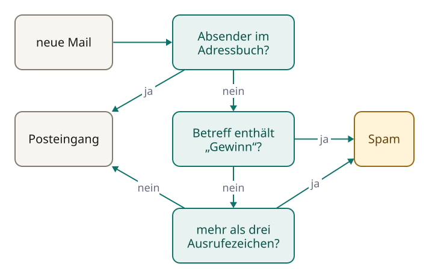
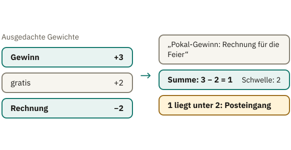
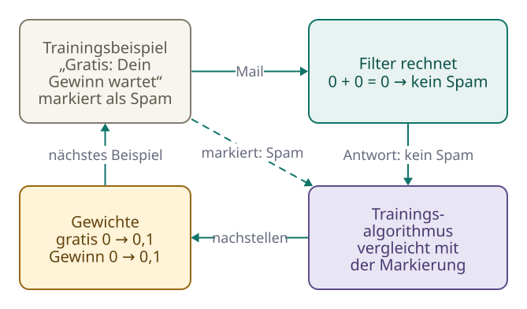
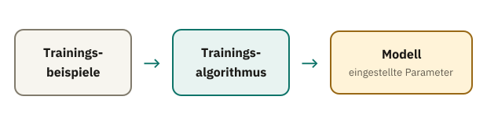

<!-- Generated from src/content/bausteine/de/programm-algorithmus-modell.mdx by scripts/export-lessons.mjs -- do not edit by hand. -->

# Programm, Algorithmus, Modell im Vergleich

> Lesefassung für GitHub. Die vollständige Fassung mit interaktiven Demos, Animationen und Abrufmoment findest du auf der Website: **[Programm, Algorithmus, Modell im Vergleich](https://ki-einfach-verstehen.de/de/bausteine/programm-algorithmus-modell/)**
>
> Lizenz: [CC BY 4.0](https://creativecommons.org/licenses/by/4.0/deed.de) · Nenne die Quelle so: KI einfach verstehen, „Programm, Algorithmus, Modell im Vergleich“, CC BY 4.0, https://ki-einfach-verstehen.de/de/bausteine/programm-algorithmus-modell/

Programm, Algorithmus und KI-Modell auseinanderhalten: warum ein Modell nicht aus aufgeschriebenen Regeln besteht, sondern aus Zahlen, die beim Training eingestellt werden.

Irgendwo in deinem Postfach gibt es einen Ordner, den du selten öffnest: Spam. Dort landen Mails, die dir einen Lottogewinn versprechen oder ein Paket ankündigen, das du nie bestellt hast. Meistens sortiert der Filter richtig, obwohl du ihm nie erklärt hast, was Werbung ist. Woher weiß er das?

Die naheliegende Antwort lautet: Jemand hat ihm Regeln aufgeschrieben. Viele stellen sich [KI](https://ki-einfach-verstehen.de/de/glossar/ki/) als riesiges Regelbuch vor, das Fachleute Zeile für Zeile gefüllt haben. Für manche Software stimmt das. Für das, was heute meist mit KI gemeint ist, stimmt es nicht. Wo der Unterschied liegt, klären drei Begriffe, die im Alltag oft durcheinandergehen: Programm, Algorithmus und Modell.

## Wer schreibt eigentlich die Regeln?

Angenommen, du sollst selbst einen Spamfilter bauen. Der naheliegende Weg: Du schreibst Regeln auf. Ein ausgedachter, aber typischer Filter könnte drei haben: Steht der Absender in deinem Adressbuch, kommt die Mail direkt in den Posteingang. Sonst gilt: Enthält der Betreff das Wort „Gewinn", kommt sie in den Spam. Hat sie mehr als drei Ausrufezeichen, ebenfalls. Alles Übrige landet im Posteingang. Genau so arbeitet ein klassisches [Programm](https://ki-einfach-verstehen.de/de/glossar/programm/): eine Folge von Anweisungen, die ein Computer Schritt für Schritt ausführt und die ein Mensch festgelegt hat.

Der Computer versteht keine dieser Regeln. Er prüft, ob eine Bedingung zutrifft, und führt aus, was dahinter steht. Alles, was der Filter kann, steht in diesen Zeilen. Willst du wissen, warum eine Mail im Spam gelandet ist, liest du nach und findest die Regel, die gegriffen hat.

*Ein Regelfilter: Jede Mail läuft an festen, von Menschen geschriebenen Bedingungen vorbei.*

Das Vorgehen hinter diesen Zeilen lässt sich auch ohne Computer beschreiben: Absender mit dem Adressbuch vergleichen, Betreff lesen, Ausrufezeichen zählen, entscheiden. Eine solche genau festgelegte Vorgehensweise heißt [Algorithmus](https://ki-einfach-verstehen.de/de/glossar/algorithmus/). Er ähnelt einem Rezept, einer Folge von Schritten, die zum Ergebnis führt, egal wer sie ausführt. Das Programm ist die Fassung dieses Rezepts, die ein Computer ausführen kann. Der Vergleich hat eine Grenze: Ein Rezept darf „eine Prise Salz" sagen und dir den Rest überlassen. Ein Algorithmus lässt keinen solchen Spielraum, jeder Schritt muss eindeutig sein.

*Ein Algorithmus gleicht einem Rezept: festgelegte Schritte, unabhängig davon, wer sie ausführt.*

Regelfilter haben eine Schwäche, die Spam-Versender schnell finden. Steht im Betreff „G3WINN" statt „Gewinn", greift die Gewinn-Regel nicht mehr. Also kommt eine Regel für die Schreibweise mit der Drei dazu, dann eine für „G-e-w-i-n-n", dann eine für das nächste Schlupfloch. Werden die Regeln strenger, erwischen sie auch echte Mails, etwa die Nachricht vom Sportverein über den Gewinn des Pokals.

Genau diese Erfahrung beschrieb der Programmierer Paul Graham im Jahr 2002. Er hatte nach eigenen Angaben rund ein halbes Jahr an Software gearbeitet, die nach einzelnen Spam-Merkmalen suchte. Je strenger er die Filter einstellte, desto mehr echte Mails sortierten sie aus. Dann versuchte er einen anderen Weg: einen Filter, dem niemand die Regeln aufschreibt.

## Ein Mischpult statt einer Regelliste

Wie kann ein Filter entscheiden, ohne dass ihm jemand sagt, welche Wörter verdächtig sind? Mit Zahlen. Angenommen, der Filter hat für jedes Wort eine Zahl gespeichert, ein Gewicht. Die folgenden Werte sind ausgedacht und sollen nur das Prinzip zeigen: „Gewinn" hat das Gewicht +3, „gratis" +2 und „Rechnung" −2. Alle anderen Wörter zählen 0. Für jede Mail zählt der Filter die Gewichte der Wörter zusammen, die darin vorkommen. Liegt die Summe über 2, gilt die Mail als Spam.

Zwei Mails zeigen, wie das ausgeht. „Gratis: Dein Gewinn wartet" ergibt 2 + 3 = 5, also Spam. Und die Mail vom Sportverein, „Pokal-Gewinn: Rechnung für die Feier"? Sie kommt auf 3 − 2 = 1, bleibt unter der Schwelle und landet im Posteingang. Keine Wenn-dann-Zeile entscheidet über diese Mail. Das Ergebnis ergibt sich daraus, wie die Gewichte gegeneinander stehen. Noch hat sich allerdings jemand diese Gewichte ausgedacht.

*Ausgedachte Gewichte, eine Mail durchgerechnet: Die Summe entscheidet, nicht eine einzelne Regel.*

Ein solcher Filter ist ein kleines [Modell](https://ki-einfach-verstehen.de/de/glossar/modell/): eine Rechenvorschrift, deren Verhalten von gespeicherten Zahlen abhängt. Diese Zahlen heißen [Parameter](https://ki-einfach-verstehen.de/de/glossar/parameter/), oft auch Gewichte. Die Rechenvorschrift selbst ist denkbar schlicht, sie zählt zusammen und vergleicht mit der Schwelle. Auch diese Vorschrift hat ein Mensch geschrieben, aber sie sagt nichts über Spam. Welche Wörter verdächtig sind, steht allein in den Zahlen. Was der Filter tatsächlich tut, bestimmen die Parameter. Ändert sich eine einzige Zahl, entscheidet er anders, ohne dass sich eine Zeile Programmcode ändert.

Ein Mischpult macht das greifbar. Jeder Regler ist ein Parameter, seine Stellung ist eine Zahl. Wie die Regler verschaltet sind, entspricht der Rechenvorschrift, beim Spamfilter also: zusammenzählen und mit der Schwelle vergleichen. Dasselbe Pult kann einen Song dumpf oder klar klingen lassen, je nachdem, wie die Regler stehen. Ebenso kann dieselbe Rechenvorschrift Spam erkennen oder gar nichts Brauchbares tun, je nachdem, welche Zahlen in ihr stehen.

*Ein Modell gleicht einem Mischpult: Was herauskommt, hängt davon ab, wie die Regler stehen.*

Damit sind die drei Begriffe sortiert. Der Algorithmus ist das Verfahren, das Programm seine ausführbare Fassung, das Modell eine Rechenvorschrift, deren Verhalten in Parametern steckt, die beim Training aus Beispielen eingestellt werden. Was Training genau heißt, ist noch offen, und damit die Frage, wer die Regler so eingestellt hat.

> **Interaktive Demo:** [auf der Website ausprobieren](https://ki-einfach-verstehen.de/de/bausteine/programm-algorithmus-modell/)

## Wie die Regler ihre Stellung finden

Von Hand jedenfalls nicht. Im Spamfilter arbeiten zwei Verfahren. Das eine kennst du schon: Es bewertet eine Mail, indem es zusammenzählt und mit der Schwelle vergleicht. Auch das ist ein Algorithmus, nur einer, der ohne die eingestellten Zahlen keinen Spam erkennt. Das andere stellt die Zahlen ein, mit denen das erste rechnet. Es heißt [Trainingsalgorithmus](https://ki-einfach-verstehen.de/de/glossar/trainingsalgorithmus/). Er braucht dafür Beispiele, bei denen die richtige Antwort schon feststeht: Tausende Mails, die Menschen vorher als Spam oder als normale Post markiert haben.

Zu Beginn stehen alle Gewichte auf null. Der Filter kennt also kein verdächtiges Wort und lässt jede Mail durch. Dann läuft immer dieselbe Schleife. Der Filter bekommt ein Beispiel und rechnet seine Antwort aus. Der Trainingsalgorithmus vergleicht diese Antwort mit der Markierung. Lag der Filter daneben, verschiebt der Trainingsalgorithmus die beteiligten Gewichte ein kleines Stück in die Richtung, die den Fehler verkleinert: so, dass die Summe dieser Mail ein Stück näher an die richtige Seite der Schwelle rückt. Danach kommt das nächste Beispiel. Dieses wiederholte Nachstellen anhand von Beispielen heißt Training.

[▶ Animation auf der Website ansehen](https://ki-einfach-verstehen.de/de/bausteine/programm-algorithmus-modell/)

*Die Trainingsschleife: Antwort ausrechnen, mit der Markierung vergleichen, Gewichte ein Stück nachstellen, nächstes Beispiel.*

Die erste Trainingsmail lautet „Gratis: Dein Gewinn wartet", markiert als Spam. Der Filter rechnet 0 + 0 = 0 und lässt sie durch. Falsch. Also rücken die Gewichte von „gratis" und „Gewinn" ein Stück nach oben. Nach Tausenden solcher Durchgänge stehen bei typischen Werbewörtern hohe Zahlen und bei Wörtern aus normaler Post niedrige oder negative.

Überleg kurz selbst, bevor du weiterliest: Im Training taucht eine echte Mail deiner Bank auf, „Dein Gewinn aus Zinsen", markiert als normale Post. Der Filter hält sie für Spam, weil „Gewinn" inzwischen ein hohes Gewicht hat. Was passiert jetzt mit diesem Gewicht?

Es sinkt ein wenig, und mit ihm die Gewichte der anderen Wörter dieser Mail, etwa „Zinsen". So rutschen Wörter, die oft in harmloser Post stehen, mit der Zeit unter null. Werbemails mit „Gewinn" schieben das Gewicht also immer wieder ein Stück nach oben, harmlose Mails mit „Gewinn" ein Stück nach unten. Es bleibt dort stehen, wo sich beide Seiten die Waage halten: hoch genug für die meisten Werbemails, aber nicht so hoch, dass jede Bankmail im Spam landet.

So weit das ausgedachte Beispiel. Funktioniert das auch mit echter Post?

## Was der Filter dabei lernt

Dass Gewichte aus Beispielen auch bei echter Post funktionieren, zeigte Graham 2002, allerdings auf einem einfacheren Weg als mit der Schleife oben: durch Auszählen. Wie verdächtig jedes einzelne Wort ist, musste er nicht mehr selbst festlegen. Sein Filter ermittelte aus Sammlungen von Spam und normaler Post für jedes Wort selbst eine Zahl, die angibt, wie typisch das Wort für Spam ist, ähnlich den Gewichten oben, nur anders berechnet. In Grahams eigenem Test verpasste dieser Filter weniger als 5 von 1000 Spam-Mails und sortierte keine einzige echte Mail aus. Das war eine Messung an seiner eigenen Post, keine allgemeine Studie.

Eine Ebene tiefer: Was Graham noch von Hand einstellte

Grahams Filter stellte keine Gewichte Schritt für Schritt nach wie die Schleife oben. Er zählte. Für jedes Wort hielt er fest, wie oft es in der Spam-Sammlung und wie oft in der normalen Post vorkam, und teilte jeweils durch die Zahl der Mails in der Sammlung. Daraus ergab sich eine Wahrscheinlichkeit: Wie wahrscheinlich ist eine Mail mit diesem Wort Spam? Ein Beispiel: Ein Wort steht in 100 von 1000 Spam-Mails und in 5 von 1000 normalen Mails. Die 5 verdoppelte Graham zu 10 (warum, steht gleich unten). Das ergibt 0,1 gegen 0,01. Von zusammen 0,11 entfallen 0,1 auf Spam, das Wort bekommt also rund 0,9. Ein Wort, das fast nur in Spam steht, landet nahe 1, ein Wort aus normaler Post nahe 0.

Diese Wortwerte stammten aus den Daten. Wie damit gerechnet wird, legte Graham selbst fest, vieles davon nach eigenen Angaben durch Ausprobieren:

- Jede Zählung aus der normalen Post verdoppelte er. Das drückt die Werte von Wörtern, die gelegentlich auch in echter Post stehen, etwas nach unten und schützt vor Fehlalarmen, also echten Mails im Spam.
- Er berücksichtigte nur Wörter, die insgesamt mehr als fünfmal vorkamen.
- Kein Wert lag unter 0,01 oder über 0,99. Ein einzelnes Wort war also nie ganz sicher.
- Ein Wort, das der Filter noch nie gesehen hatte, bekam 0,4: eher harmlos, denn Spam-Wörter sind meist altbekannt.

Kam eine neue Mail, nahm der Filter nur ihre 15 auffälligsten Wörter, also die, deren Wert am weitesten von 0,5 entfernt lag. Diese 15 Werte verrechnete er mit der Bayes-Regel, einer Formel aus der Wahrscheinlichkeitsrechnung, zu einem Gesamtwert. Die Formel verstärkt Einigkeit: Stehen die meisten der 15 Wörter nahe 1, landet auch der Gesamtwert sehr nahe an 1, stehen sie nahe 0, sehr nahe an 0. Lag er über 0,9, galt die Mail als Spam. Wo genau diese Schwelle liegt, war laut Graham fast egal, weil kaum eine Mail in der Mitte landete.

Übertragen auf den Beispielfilter: Grahams Wortwerte entsprechen den Gewichten, die 0,9 entspricht der Schwelle 2. Die Wortwerte kamen aus den Beispielen. Wie sie berechnet und verrechnet wurden, wählte ein Mensch: die Verdopplung, die Mindesthäufigkeit, die Grenzen 0,01 und 0,99, den Wert 0,4, die 15 Wörter und die Schwelle.

Oft heißt es, ein solcher Filter habe gelernt, was Spam ist, und das ganze Vorgehen heißt [maschinelles Lernen](https://ki-einfach-verstehen.de/de/glossar/maschinelles-lernen/). Das Wort passt nur mit Einschränkung. Der Filter hat nicht verstanden, was Werbung ist. Verändert haben sich nur Zahlen: beim Beispielfilter durch Nachstellen, bis die Fehler bei den Beispielen klein waren, bei Graham durch Auszählen. Die meisten heutigen Trainingsalgorithmen arbeiten wie die Schleife oben, nur genauer: Fehler messen, ein Stück nachstellen, wiederholen.

## Wo das Mischpult an seine Grenze kommt

Auch das Mischpult hat eine Grenze. Die Regler eines echten Pults sind beschriftet, mit Bass, Höhen oder Lautstärke. Die Parameter eines großen Modells tragen keine Beschriftung, und es sind unvorstellbar viele. Das Modell GPT-3 aus dem Jahr 2020, ein Vorläufer der Modelle hinter ChatGPT, hat rund 175 Milliarden davon. Was ein einzelner bewirkt, lässt sich nicht in Worte fassen, erst alle zusammen ergeben das Verhalten. Der Beispielfilter mit seinen drei Wörtern ist so klein, dass man jedes Gewicht noch lesen kann. Deshalb eignet er sich zum Erklären, und genau darin ähnelt er echten Modellen am wenigsten.

Wenn aber niemand Regeln aufschreibt, warum hält sich dann die Vorstellung vom riesigen Regelbuch so hartnäckig?

## Warum die Regelbuch-Vorstellung so hartnäckig ist

*So stellen sich viele KI vor: ein Regelbuch, so dick, dass es für jeden Fall eine Zeile hat.*

Die Vorstellung kommt nicht von ungefähr. Fast alles, was du sonst am Computer benutzt, arbeitet tatsächlich mit festgelegten Anweisungen, von der Tabellenkalkulation bis zur Ampelsteuerung. Auch die KI selbst sah lange so aus. In den 1970er-Jahren entstanden [Expertensysteme](https://ki-einfach-verstehen.de/de/glossar/expertensysteme/), in den 1980ern waren sie weit verbreitet und gehörten zu den ersten wirklich erfolgreichen Formen von KI-Software. Sie sollten die Entscheidungen von Fachleuten nachbilden und bestanden im Kern aus großen Sammlungen von Wenn-dann-Regeln. Wer sich KI als Regelbuch vorstellt, hat also ein Bild im Kopf, das es wirklich gegeben hat. Es beschreibt nur nicht die trainierten Modelle, um die es heute meist geht. Gemischte Systeme gibt es trotzdem: Gmail etwa kombiniert nach Angaben von Google gelernte Modelle mit weiteren, auch regelbasierten Schutzfiltern.

Warum der Unterschied zählt, zeigt sich, wenn etwas schiefgeht. Beim Regelfilter findest du die Zeile, die gegriffen hat, und änderst sie. In einem trainierten Modell gibt es diese Zeile nicht, nur Zahlen. Beim kleinen Beispielfilter verrät das Gewicht von „Gewinn" noch, dass das Wort verdächtig ist. Bei Milliarden unbeschrifteter Parameter sagt keine einzelne Zahl „Gewinn ist verdächtig". Die Fehler eines trainierten Modells stammen außerdem aus den Beispielen. Hätten die Menschen beim Markieren jede Mail mit dem Wort „Rechnung" als Spam eingeordnet, hätte der Filter genau das übernommen. Eine falsche Regel, die man korrigieren könnte, stünde nirgends.

Zurück zur Frage vom Anfang: Woher weiß der Spamfilter, was Werbung ist? Aus Zahlen, die ein Trainingsalgorithmus an vielen markierten Beispielen eingestellt hat, nicht aus Regeln, die jemand aufgeschrieben hat. Ist das Training vorbei, bleiben die Regler stehen. Von da an arbeitet das Modell wie ein gewöhnliches Programm: Es bekommt etwas, rechnet mit seinen festen Parametern und gibt etwas aus. Solange niemand neu trainiert, verstellt eine neue Mail keinen Regler mehr.

*Erst stellt der Trainingsalgorithmus die Parameter ein, danach arbeitet das Modell mit diesen festen Werten.*

Beim Spamfilter ist überschaubar, was hineingeht und was herauskommt: eine Mail rein, ein Urteil raus. Bei einem Modell, das Texte schreibt oder Bilder erkennt, ist das weniger offensichtlich. Was genau dort hineingeht und was herauskommt, klärt der nächste Baustein, [Input und Output](./input-und-output.md).

---

Quelle: https://ki-einfach-verstehen.de/de/bausteine/programm-algorithmus-modell/

[Alle Bausteine](../../README.de.md#inhalt) · Weiter: [Input und Output: Was eine Funktion tut](./input-und-output.md) →
