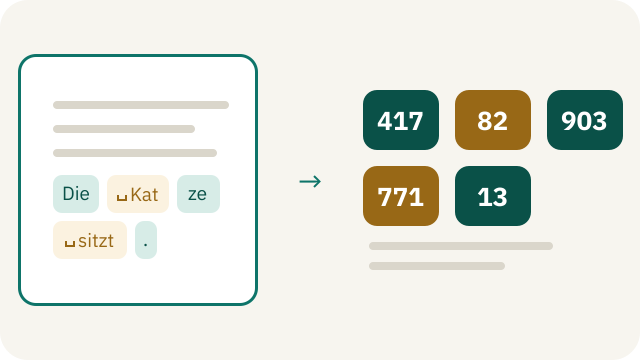
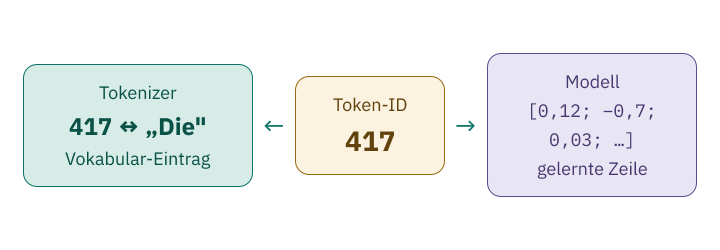

<!-- Generated from src/content/bausteine/de/token-ids-und-vokabular.mdx by scripts/export-lessons.mjs -- do not edit by hand. -->

# Token-IDs: Wie aus Tokens Zahlen werden

> Lesefassung für GitHub. Die vollständige Fassung mit interaktiven Demos, Animationen und Abrufmoment findest du auf der Website: **[Token-IDs: Wie aus Tokens Zahlen werden](https://ki-einfach-verstehen.de/de/bausteine/token-ids-und-vokabular/)**
>
> Lizenz: [CC BY 4.0](https://creativecommons.org/licenses/by/4.0/deed.de) · Nenne die Quelle so: KI einfach verstehen, „Token-IDs: Wie aus Tokens Zahlen werden“, CC BY 4.0, https://ki-einfach-verstehen.de/de/bausteine/token-ids-und-vokabular/

Zeigt, wie ein Tokenizer jedes Textstück über sein Vokabular in eine Nummer übersetzt und zurück, warum diese Nummer nichts bedeutet, warum Tokenizer und Modell zusammengehören und wie viele Tokens ein Modell auf einmal verarbeitet.

Im vorigen Baustein hat ein [Tokenizer](https://ki-einfach-verstehen.de/de/glossar/tokenizer/) Text in [Tokens](https://ki-einfach-verstehen.de/de/glossar/token/) zerlegt, also in Stücke aus seiner festen Liste, dem [Vokabular](https://ki-einfach-verstehen.de/de/glossar/vokabular/): „Frankreich“ etwa wurde bei GPT-2 (einem älteren, frei verfügbaren Modell) zu „Frank“, „re“ und „ich“. Welche Stücke es gibt, hatte er vorher durch Zählen gelernt. Mit „Frank“ kann ein [Modell](https://ki-einfach-verstehen.de/de/glossar/modell/) aber nicht rechnen, es braucht Zahlen. Welche Zahl bekommt ein Stück wie „Frank“, und verrät sie dem Modell etwas darüber, was es bedeutet?

## Jedes Stück bekommt eine Nummer

Jedes Stück im Vokabular hat eine feste Nummer, seine **[Token-ID](https://ki-einfach-verstehen.de/de/glossar/token-id/)**. Welche Nummer ein Stück bekommt, legt der Tokenizer einmal fest, wenn er sein Vokabular lernt; danach ändert sie sich nie. Die Nummer sagt also nur, an welcher Stelle der Liste ein Stück steht.

*Das Vokabular als Kartei: Für jedes Stück deines Satzes wird die passende Karte herausgesucht.*

Das Vokabular funktioniert dabei wie eine Kartei. Auf jeder Karte stehen ein Textstück und eine Nummer. Der Tokenizer zerlegt deinen Satz nach seinen Regeln, sucht zu jedem Stück die Karte und schreibt deren Nummer auf. Heraus kommt eine Folge von Nummern, in der Reihenfolge der Stücke. Der Kasten bleibt immer derselbe, die herausgesuchte Reihe entsteht für jeden Text neu. Auf einer Karte steht nur eine Zeichenfolge, keine Erklärung, was sie bedeutet. Und der Tokenizer sucht keine Karten aus, die inhaltlich passen; er nimmt genau die, die seine Regeln ergeben.

Das ausgedachte Mini-Vokabular hat fünf Karten. Das Zeichen ␣ steht für ein Leerzeichen, das zum Stück gehört.

| Token-ID | Textstück |
| ---: | :--- |
| 417 | „Die“ |
| 82 | „␣Kat“ |
| 903 | „ze“ |
| 771 | „␣sitzt“ |
| 13 | „.“ |

Stücke und Nummern sind für das Beispiel ausgedacht, trainiert wurde hier nichts. Im Bild der Kartei sind die fünf Karten ein Ausschnitt aus einem viel größeren Kasten. Deshalb tragen sie keine Nummern von 1 bis 5. Echte Vokabulare haben Zehntausende bis Hunderttausende Einträge, und unter 417 steht dort meist etwas ganz anderes.

Der Tokenizer bekommt „Die Katze sitzt.“ und zerlegt den Satz in „Die“, „␣Kat“, „ze“, „␣sitzt“ und „.“; ein Stück „␣Katze“ gibt es in dieser Liste nicht. Dann schlägt er jedes Stück nach und gibt die Folge 417, 82, 903, 771, 13 aus. Diesen Hinweg vom Text zu den Nummern nennt man **[Kodieren](https://ki-einfach-verstehen.de/de/glossar/tokenizer/)**. Genau diese fünf Zahlen bekommt das Modell als Input. Jede Nachricht, die du einem Chatbot schickst, wird so kodiert, bevor das Modell sie sieht.

*Ein Satz wird zuerst in Textstücke zerlegt, dann über das ausgedachte Mini-Vokabular in Nummern übersetzt. Das Zeichen ␣ markiert ein Leerzeichen, das zum Stück gehört.*

## Der Rückweg: aus Nummern wird Text

Auch die Antwort eines Chatbots entsteht in Nummern. Erinnere dich an die Schleife: Das Modell gibt für jedes Stück im Vokabular einen [Score](https://ki-einfach-verstehen.de/de/glossar/score/) aus, und der Auswahlschritt wählt eines davon. Diese Score-Liste ist nach den Nummern des Vokabulars geordnet: Eintrag 417 bewertet das Stück mit der Nummer 417. Wählt der Auswahlschritt einen Eintrag, steht damit dessen Nummer fest, etwa 82. Damit du die Antwort lesen kannst, geht der Tokenizer den umgekehrten Weg: Er schlägt jede Nummer nach und hängt die gespeicherten Stücke in derselben Reihenfolge aneinander. Diesen Rückweg nennt man **[Dekodieren](https://ki-einfach-verstehen.de/de/glossar/tokenizer/)**.

Aus 417, 82, 903, 771, 13 wird so wieder „Die Katze sitzt.“. Die Leerzeichen gehen dabei nicht verloren, weil sie schon in „␣Kat“ und „␣sitzt“ gespeichert sind. Auch die Reihenfolge zählt: 82, 903, 417 ergibt „KatzeDie“, mit einem Leerzeichen am Anfang.

Im Bild der Kartei: Ein Token ist das Stück auf einer Karte, etwa „␣Kat“, die Token-ID die Nummer darauf, etwa 82, und das Vokabular der ganze Kasten. Der Tokenizer ist das Programm, das nach seinen Regeln die Karten heraussucht und beim Rückweg die Nummern wieder in Stücke übersetzt.

Rate, bevor du weiterliest, was herauskommt, wenn man 417 und 82 vertauscht.

> **Interaktive Demo:** [auf der Website ausprobieren](https://ki-einfach-verstehen.de/de/bausteine/token-ids-und-vokabular/)

Tauschst du 417 und 82, kommt „KatDieze sitzt.“ heraus, mit einem Leerzeichen am Anfang. Jede Nummer holt nur ihr eigenes Stück zurück, samt Leerzeichen.

## Eine ID ist ein Etikett

Verrät die 417 dem Modell, dass „Die“ ein Artikel ist? Nein. Im ausgedachten Mini-Vokabular steht unter 417 „Die“, im echten Vokabular von GPT-2 dagegen „el“, ein Wortteil. **Eine Nummer gilt nur in ihrem Vokabular**, und für das Modell misst sie nichts: Es rechnet nie mit der Größe der Nummer, es benutzt sie nur zum Nachschlagen.

*Eine ID ist nur ein Etikett: eine Nummer, die nichts über den Inhalt verrät.*

Wo steckt dann das, was das Modell über „Die“ gelernt hat? Der Spamfilter aus dem ersten Baustein hatte für jedes Wort eine Zahl gespeichert, ein Gewicht; im ausgedachten Beispiel hatte „Gewinn“ das Gewicht +3. Ein Sprachmodell speichert zu jeder Token-ID statt einer einzigen Zahl eine ganze Liste gelernter Zahlen. In einem ausgedachten Beispiel stehen darin etwa 0,3, −1,2, 0,8 und so weiter. Auch das sind [Parameter](https://ki-einfach-verstehen.de/de/glossar/parameter/), im Training nachgestellt wie die Gewichte des Spamfilters. Die ID sagt nur, welche Liste gemeint ist. Mit dieser Liste beginnt die Rechnung für das Stück.

Dieselben Nummern ordnen auch die Ausgabe, die Score-Liste. Anders als die Liste gelernter Zahlen ist sie nicht gespeichert. Das Modell berechnet sie für jeden Input neu. Weil sie für jedes Stück im Vokabular genau einen Eintrag hat, hat die Score-Liste von GPT-2 so viele Einträge wie sein Vokabular, nämlich 50.257.

*Dieselbe ID 417 ist im Tokenizer die Nummer des Textstücks „Die“ aus dem Mini-Vokabular und im Modell die Adresse einer Liste gelernter Zahlen. Das Modell selbst sieht nur die Zahl.*

## Warum Tokenizer und Modell ein festes Paar sind

Kann man einem fertigen Modell einen anderen Tokenizer geben? Angenommen, zwei Tokenizer haben gleich viele Karten, verteilen die Nummern aber anders: Beim einen steht unter 417 „Die“, beim anderen „el“, wie bei GPT-2. Ein Modell wurde mit dem ersten trainiert, bekommt aber Nummern vom zweiten. In deinem Text steht „el“, und der fremde Tokenizer liefert dafür 417. Was macht das Modell daraus? Überlege kurz, bevor du weiterliest.

Es holt die Liste, die es für 417 gelernt hat, also für „Die“. Eine Fehlermeldung gibt es nicht, denn 417 ist eine gültige Nummer. Das Modell holt zu den Nummern also Listen, die es für andere Stücke gelernt hat, und rechnet ohne Warnung damit weiter.

*Ein fremder Tokenizer hat eine eigene Kartei: Unter derselben Nummer steht dort ein anderes Stück.*

**Deshalb gehört zu jedem Modell genau sein Tokenizer** mit seinen Regeln und seinem Vokabular. Das Modell hat seine Parameter mit genau einer Zuordnung von Nummern zu Stücken gelernt. Mit einer anderen passen Nummer und gelernte Liste nicht mehr zusammen. Wechselst du in einer Chat-App zu einem Modell mit anderem Tokenizer, wird deine Nachricht dort anders zerlegt und nummeriert. Oft besteht sie dann auch aus einer anderen Zahl von Tokens. Jedes Modell bekommt sie von seinem eigenen Tokenizer.

> **Interaktive Demo:** [auf der Website ausprobieren](https://ki-einfach-verstehen.de/de/bausteine/token-ids-und-vokabular/)

## Wie viele Tokens auf einmal passen

In einem langen Chat mit einem KI-Assistenten scheint eine frühe Anweisung irgendwann nicht mehr zu wirken. Das kann an einer Grenze für die Zahl der Tokens liegen.

Jedes Token belegt einen eigenen Platz in der Folge, die ins Modell geht, eine **Position**. „Die Katze sitzt.“ belegt mit dem Mini-Vokabular fünf Positionen. Ein Modell verarbeitet aber nur eine begrenzte Zahl von Positionen auf einmal.

Diese Höchstzahl heißt **[Kontextfenster](https://ki-einfach-verstehen.de/de/glossar/kontextfenster/)**. Bei GPT-2 waren es 1.024 Tokens; manche heutigen Modelle fassen rund eine Million. Auch die Antwort, die das Modell gerade erzeugt, belegt Plätze: Jedes gewählte Stück wird ja an den Input angehängt.

Wie im Baustein über Input und Output geht bei jeder neuen Nachricht von dir der ganze bisherige Verlauf erneut als Input ins Modell. Mit jeder Antwort wird er länger. Irgendwann passt er nicht mehr ins Fenster. Was dann geschieht, entscheidet nicht das Modell, sondern die Chat-Anwendung drumherum: das Programm, das deinen Verlauf zusammenstellt und ans Modell schickt. Manche Chat-Anwendungen lassen die ältesten Teile weg, andere fassen sie zusammen. Programme, die ein Modell direkt ansprechen statt über ein Chatfenster, bekommen bei einer zu langen Anfrage dagegen oft nur eine Fehlermeldung. Fällt der Anfang weg, wirkt eine frühe Anweisung nicht mehr. Das Modell hat sie nicht wie ein Mensch vergessen; sie stand nur nicht mehr in seinem Input.

*Ein ausgedachter Chat als Folge von Tokens. Ins Kontextfenster passt nur eine feste Zahl von Plätzen; was davor liegt, ist bei dieser Nachricht nicht mehr Teil des Inputs.*

Gezählt werden dabei Tokens, nicht Wörter. Im vorigen Baustein brauchte „Die Hauptstadt von Frankreich ist“ beim Tokenizer von GPT-2 doppelt so viele Tokens wie „The capital of France is“. Ein deutscher Text füllt dort das Fenster also schneller als ein gleich langer englischer. Wie viele Tokens ein Text genau belegt, weiß nur der Tokenizer des jeweiligen Modells.

## Die Nummern sind erst der Anfang

„Frank“ bekommt also bei GPT-2 eine feste Nummer aus dessen Vokabular, so wie „␣Kat“ im Mini-Vokabular die 82. Keine dieser Nummern verrät dem Modell, was das Stück bedeutet. Jede sagt ihm nur, welche Liste gelernter Zahlen es holen soll. Das stimmt nur mit genau seinem Tokenizer.

Wie die Liste gelernter Zahlen zu einer Token-ID aussieht und wie man viele davon zu einer Tabelle ordnet, zeigt der nächste Baustein: [Skalar, Vektor, Matrix, Tensor](./skalar-vektor-matrix-tensor.md).

---

Quelle: https://ki-einfach-verstehen.de/de/bausteine/token-ids-und-vokabular/

← Zurück: [Tokenizer: Wie Text in Tokens zerfällt](./tokenizer-ids-vokabular.md) · [Alle Bausteine](../../README.de.md#inhalt) · Weiter: [Skalar, Vektor, Matrix, Tensor: die Bausteine der Zahlen](./skalar-vektor-matrix-tensor.md) →
