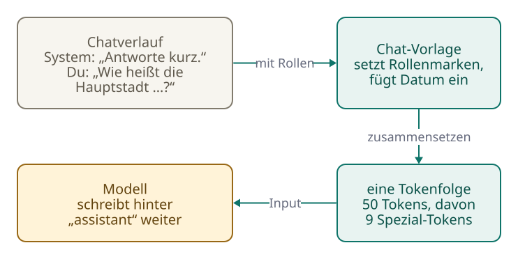
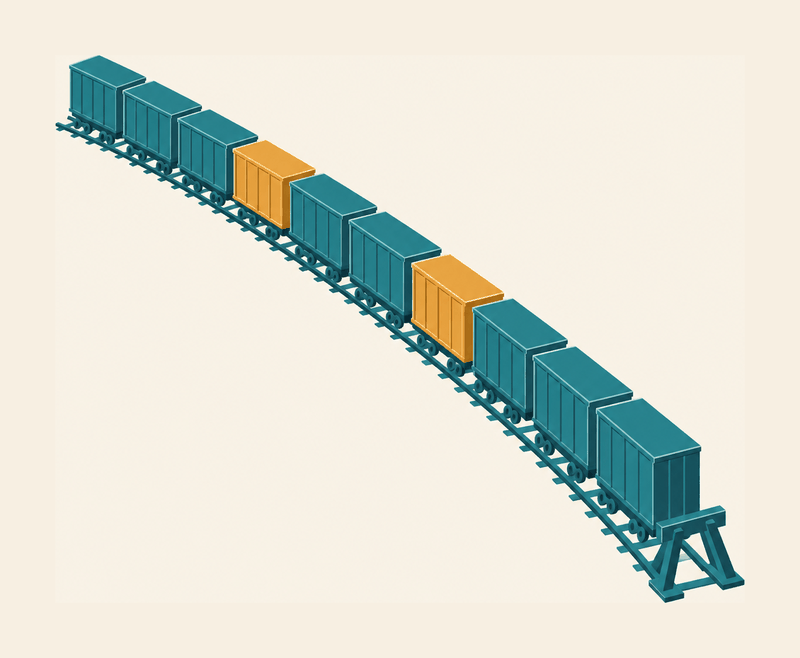
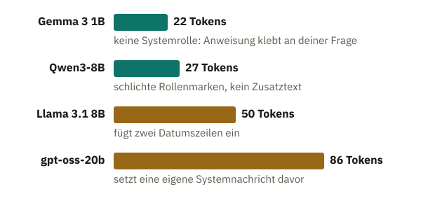
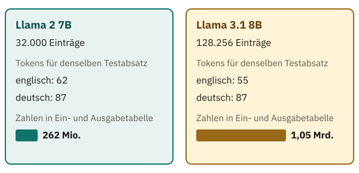
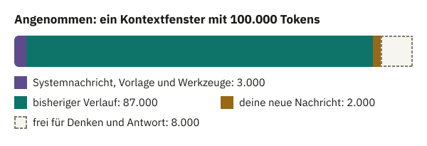

<!-- Generated from src/content/bausteine/de/tokenisierung-im-modell.mdx by scripts/export-lessons.mjs -- do not edit by hand. -->

# Tokenisierung im Modell: Wie dein Chat zu einer Tokenfolge wird

> Lesefassung für GitHub. Die vollständige Fassung mit interaktiven Demos, Animationen und Abrufmoment findest du auf der Website: **[Tokenisierung im Modell: Wie dein Chat zu einer Tokenfolge wird](https://ki-einfach-verstehen.de/de/bausteine/tokenisierung-im-modell/)**
>
> Lizenz: [CC BY 4.0](https://creativecommons.org/licenses/by/4.0/deed.de) · Nenne die Quelle so: KI einfach verstehen, „Tokenisierung im Modell: Wie dein Chat zu einer Tokenfolge wird“, CC BY 4.0, https://ki-einfach-verstehen.de/de/bausteine/tokenisierung-im-modell/

Wie aus einem Chat mit Rollen eine einzige Tokenfolge wird, wozu Spezial-Tokens dabei dienen, warum die Vokabulargröße ein Kompromiss ist und was alles ins Kontextfenster passen muss.

„Wie heißt die Hauptstadt von Frankreich?“ Sechs Wörter und ein Fragezeichen. Ein Chatbot hat vorher noch die Anweisung „Antworte kurz.“ bekommen. Schätz, bevor du weiterliest: Wie viele **[Tokens](https://ki-einfach-verstehen.de/de/glossar/token/)** kommen beim **[Modell](https://ki-einfach-verstehen.de/de/glossar/modell/)** an, wenn du diese Frage abschickst? Zehn? Zwanzig?

Das Wissen eines Modells steckt in Milliarden Zahlen, das hat der vorige Baustein gezeigt. Bevor das Modell damit rechnet, muss aus deinem Chat aber eine einzige lange Folge von Tokens werden, in der auch steht, wer was gesagt hat. Wie ein **[Tokenizer](https://ki-einfach-verstehen.de/de/glossar/tokenizer/)** einen Satz zerlegt, weißt du schon. Hier geht es um das Drumherum: wie aus mehreren Nachrichten eine Folge wird, wie groß das **[Vokabular](https://ki-einfach-verstehen.de/de/glossar/vokabular/)** sein sollte und wie lang die Folge werden darf.

## Dein Chat ist ein einziger langer Text

Im Chatfenster sieht ein Gespräch aus wie ein Stapel getrennter Sprechblasen: oben vielleicht eine Anweisung, darunter deine Frage, später die Antwort. Deshalb liegt die Vermutung nahe, das Modell bekomme nur die jüngste Blase und die Rollen „du“ und „Assistent“ liefen über getrennte Leitungen. Beides stimmt nicht. Ein **[Sprachmodell](https://ki-einfach-verstehen.de/de/glossar/sprachmodell/)** kann nur eines: eine Folge von Tokens fortsetzen. Also muss das Programm um das Modell herum das ganze Gespräch in eine einzige Folge verwandeln.

Das erledigt die **[Chat-Vorlage](https://ki-einfach-verstehen.de/de/glossar/chat-vorlage/)**, ein festes Muster, das jedes Chatmodell mitbringt. Sie nimmt die Liste der Nachrichten, jede mit ihrer Rolle, und setzt sie nach diesem Muster hintereinander. Übliche Rollen heißen „system“ für Anweisungen, „user“ für dich und „assistant“ für das Modell. Den Systemtext schreibt meist nicht du, sondern der Anbieter der Chat-App, und du siehst ihn in der Regel nicht. Für den Chat vom Anfang macht die Vorlage des frei verfügbaren Modells Llama 3.1 8B von Meta daraus diesen Text:

```text
<|begin_of_text|><|start_header_id|>system<|end_header_id|>

Cutting Knowledge Date: December 2023
Today Date: 26 Jul 2024

Antworte kurz.<|eot_id|><|start_header_id|>user<|end_header_id|>

Wie heißt die Hauptstadt von Frankreich?<|eot_id|><|start_header_id|>assistant<|end_header_id|>

```

Für diesen Baustein wurde mit dem echten Tokenizer ausgezählt, wie viele Tokens das sind: 50. Deine Frage selbst macht davon nur zehn aus. Neun Tokens sind **[Spezial-Tokens](https://ki-einfach-verstehen.de/de/glossar/spezial-token/)**, die Einträge in spitzen Klammern. Dass ein Vokabular solche Einträge für Struktur enthält, kennst du aus dem Baustein über den [Tokenizer](./tokenizer-ids-vokabular.md).



[▶ Animation auf der Website ansehen](https://ki-einfach-verstehen.de/de/bausteine/tokenisierung-im-modell/)

*Aus zwei Nachrichten mit Rollen wird bei Llama 3.1 eine einzige Folge aus 50 Tokens, die mit einer offenen Antwortrolle endet.*



*Die Tokenfolge als Güterzug: gewöhnliche Waggons für Textstücke, andersfarbige Markierungswaggons für die Spezial-Tokens, ein Prellbock als Grenze.*

Du kannst dir die fertige Folge wie einen langen Güterzug vorstellen. Jeder Waggon ist ein Token. Zwischen den gewöhnlichen Waggons hängen andersfarbige Markierungswaggons. Sie zeigen an, wo ein Rollenname steht, wo eine Nachricht endet und wo die nächste beginnt. Das Bild hat zwei Grenzen. Ein Waggon hat keine Ladung, die etwas bedeutet, nur eine Nummer an der Seite: seine ID im Vokabular. Und die Markierungen wirken nur, weil das Modell im Training sehr viele Züge mit genau diesen Markierungen gesehen hat.

Schreibst du nach der Antwort „Paris.“ noch „Und von Italien?“, baut die Vorlage den ganzen Zug neu: Systemtext, erste Frage, alte Antwort, neue Frage, jeweils mit Markierungen dazwischen. Aus 50 werden 67 Tokens. Dass der Verlauf jede Runde erneut mitgeschickt wird, weißt du aus dem Baustein über [Input und Output](./input-und-output.md).

## Text, den du nie geschrieben hast

Schau noch einmal auf die Llama-Folge. Zwei Zeilen darin stammen weder von dir noch vom Modell: „Cutting Knowledge Date: December 2023“ und „Today Date: 26 Jul 2024“. Die Vorlage fügt sie von sich aus ein. Die erste nennt den Wissensstand: Texte nach Dezember 2023 hat das Modell im Training nicht gesehen. Das zweite Datum ist voreingestellt und gilt, wenn das Programm kein aktuelles Datum mitgibt. Du siehst diese Zeilen nie, das Modell liest sie bei jeder Anfrage mit.

Wie viel Zusatztext dazukommt, hängt vom Modell ab. Derselbe Chat, durch die offiziellen Vorlagen von vier frei verfügbaren Modellen geschickt, ergibt sehr verschiedene Längen:



*Derselbe Chat, vier Chat-Vorlagen: zwischen 22 und 86 Tokens, je nachdem, was die Vorlage hinzufügt (ausgezählt am 6. Oktober 2026).*

Gemma 3 von Google kommt auf 22 Tokens. Es kennt gar keine eigene Systemrolle: Seine Vorlage klebt die Anweisung „Antworte kurz.“ einfach vor deine Frage, und die Rolle des Assistenten heißt dort „model“. Qwen3 von Alibaba braucht 27 Tokens. Es setzt jede Nachricht zwischen die schlichten Marken `<|im_start|>` mit dem Rollennamen und `<|im_end|>` und fügt nichts hinzu. Llama liegt mit seinen Datumszeilen bei 50. Die Vorlage von OpenAIs gpt-oss dagegen kommt auf 86 Tokens, weil sie einen eigenen Systemtext voranstellt, mit Datum, Wissensstand und Hinweisen zum Antwortformat. Die Anweisung „Antworte kurz.“ wird dort zu einer Nachricht mit der Rolle „developer“.

Daraus folgen zwei Dinge. Erstens zählt nicht nur, was du tippst. Die Vorlage bestimmt mit, wie lang der Zug wird und was eine Anfrage kostet, wenn pro Token abgerechnet wird. Zweitens ist die Vorlage keine Formsache. Warum, zeigt der nächste Abschnitt.

Bis hierher also: Deine Nachrichten, frühere Antworten, Zusatztext und Markierungen werden zu einer Folge. Was leisten die Markierungen genau?

## Markierungs-Waggons: woran das Modell Rollen und Enden erkennt


*Ein Ende-Token wirkt wie eine Zielflagge: Es zeigt an, dass ein Redebeitrag vorbei ist.*

Die Spezial-Tokens in der Llama-Folge haben feste Aufgaben. `<|begin_of_text|>` markiert ganz vorn den Anfang. `<|start_header_id|>` und `<|end_header_id|>` schließen einen Rollennamen ein, also „system“, „user“ oder „assistant“. `<|eot_id|>` beendet einen Redebeitrag; der Name steht für „end of turn“. Auch die Rollennamen selbst sind für das Modell nur Tokens in derselben Folge. Dass es den Systemtext anders behandelt als deine Frage, hat es im Training an sehr vielen Gesprächen in genau diesem Format gelernt.

Bemerkenswert ist das Ende der Folge. Sie endet nicht direkt nach deiner Frage, sondern mit einem offenen Kopf für die Rolle „assistant“, hinter dem noch nichts steht. Was würde wohl passieren, wenn dieser Kopf fehlte? Dann fehlt das Signal, wer als Nächstes spricht, und das Modell muss raten, wie die Folge weitergeht. Es kann den Kopf selbst schreiben, aber auch etwas Seltsames tun, etwa deine Nachricht fortsetzen oder eine neue Nutzerfrage erfinden. Genau davor warnt die Dokumentation der verbreiteten Programmbibliothek Transformers. Der offene Kopf ist eine Art Regieanweisung: Ab hier spricht der Assistent.

Und woher weiß das Modell, wann seine Antwort fertig ist? Im menschlichen Sinn weiß es das nicht. In seinen Trainingsgesprächen stand am Ende jeder Antwort ein `<|eot_id|>`, also erzeugt es diese Marke an ähnlicher Stelle selbst. Das Programm drumherum achtet auf genau diese ID und hört auf, sobald sie gewählt wird, spätestens aber bei einer eingestellten Längengrenze. Bei Llama 3.1 beenden die vortrainierten Grundmodelle, noch ohne Nachtraining für Gespräche, Text mit `<|end_of_text|>`, die Chatmodelle mit `<|eot_id|>`. Beide Marken stehen im selben Vokabular. Welche das Modell am Ende wählt, hat ihm allein das Training beigebracht. Wartet ein Programm auf die falsche Marke, hört es nicht auf, und das Modell schreibt weiter.

Darum schadet eine falsche Vorlage so sehr. Schickt ein Programm einem Llama-Modell die Marken von Gemma, findet der Tokenizer dafür keine Spezial-Tokens. Er zerlegt `<start_of_turn>` in gewöhnliche Textstücke, also in normale Waggons. Die Folge sieht dann nicht mehr aus wie die Gespräche, an denen das Modell gelernt hat. Dieselbe Transformers-Dokumentation warnt, mit den falschen Steuer-Tokens arbeiteten Chatmodelle drastisch schlechter. OpenAI schreibt zu gpt-oss, die Modelle funktionierten nur mit ihrem eigenen Format korrekt.

<details>
<summary>Eine Ebene tiefer: Warum gpt-oss zwei verschiedene Enden kennt</summary>

Im Baustein über den Tokenizer hast du das Gesprächsformat „Harmony“ der gpt-oss-Modelle kennengelernt: `<|start|>`, dann die Rolle, `<|message|>`, der Inhalt und `<|end|>` mit der ID 200007. Beim Erzeugen endet eine fertige Antwort aber nicht mit `<|end|>`, sondern mit `<|return|>`, ID 200002. Stopp-Tokens, an denen das Programm aufhört, sind `<|return|>` und, wenn das Modell ein Werkzeug wie eine Websuche aufrufen will, `<|call|>`. `<|end|>` gehört nicht dazu.

Der Grund: Ein Redebeitrag des Modells kann aus mehreren Nachrichten bestehen. gpt-oss schreibt zum Beispiel zuerst Zwischenüberlegungen in einen Kanal namens „analysis“ und erst danach die eigentliche Antwort in den Kanal „final“. Die erste Nachricht endet mit `<|end|>`, und das Modell macht weiter. Erst `<|return|>` heißt: Die ganze Antwort ist fertig.

Wird die Antwort danach im Verlauf gespeichert, ersetzt das Programm das abschließende `<|return|>` durch `<|end|>`. Die eine Marke trennt also Nachrichten, die andere beendet die Arbeit.

</details>

## Wie groß soll das Vokabular sein?

Und wie viele verschiedene gewöhnliche Waggons sollte es geben? Was meinst du: Wenn ein Vokabular viermal so viele Einträge hat wie ein anderes, braucht derselbe Text dann ein Viertel der Tokens? Ein Versuch mit fünf echten Tokenizern:

| Tokenizer | Einträge im Vokabular | Tokens für „Die Katze sitzt auf dem Fensterbrett.“ |
| :--- | ---: | ---: |
| Llama 2 | 32.000 | 12 |
| GPT-2 | 50.257 | 14 |
| Llama 3.1 | 128.256 | 12 |
| gpt-oss | rund 200.000 | 9 |
| Gemma 3 | 262.144 | 9 |


*Die Größe des Vokabulars ist eine Abwägung: kürzere Folgen auf der einen Seite, größere Tabellen auf der anderen.*

Grob gilt: Mit größeren Vokabularen wird der Satz kürzer. Aber nicht durchgehend: GPT-2 hat mehr Einträge als Llama 2 und braucht trotzdem mehr Tokens. Wie viel ein Vokabular spart, hängt auch davon ab, an welchen Texten es gelernt wurde. gpt-oss führt „␣Katze“ und „␣sitzt“ samt Leerzeichen davor als ganze Einträge, kleinere Vokabulare setzen sie aus Stücken zusammen. Kürzere Folgen heißen weniger Runden in der Textschleife und mehr Text pro Kontextfenster. Auf ein Viertel schrumpft die Folge aber nicht: Llama 3.1 kommt mit viermal so vielen Einträgen auf genauso viele Tokens wie Llama 2. Und ein größeres Vokabular hat seinen Preis.

Im Baustein über [Skalar, Vektor, Matrix und Tensor](./skalar-vektor-matrix-tensor.md) hast du gesehen, dass jede Token-ID im Modell eine Zeile in einer großen Tabelle auswählt. Diese Tabelle hat für jeden Eintrag des Vokabulars eine Zeile, bei Llama 3.1 8B mit je 4.096 Zahlen. Am Ausgang braucht das Modell meist eine zweite Tabelle derselben Größe, weil es für jeden Eintrag einen eigenen **[Score](https://ki-einfach-verstehen.de/de/glossar/score/)** ausgibt. Um diesen Score zu berechnen, hat auch dort jeder Eintrag seine eigene Zeile mit 4.096 gelernten Zahlen. Bei Llama 2 7B, ebenfalls mit 4.096 Zahlen pro Zeile, sind das 32.000 × 4.096, rund 131 Millionen Zahlen pro Tabelle. Bei Llama 3.1 sind es 128.256 × 4.096, rund 525 Millionen. Jeder neue Waggontyp vergrößert also beide Tabellen.



*Llama 2 gegen Llama 3.1: viermal so viele Einträge, im englischen Testabsatz etwas weniger Tokens, im deutschen keine Ersparnis, aber eine viermal so große Ein- und Ausgabetabelle.*

Meta hat diesen Schritt beim Wechsel von Llama 2 zu Llama 3 gemacht und schreibt von bis zu 15 Prozent weniger Tokens. Das „bis zu“ ist wichtig, wie ein eigener Testabsatz in beiden Sprachen zeigt. Der englische schrumpfte von 62 auf 55 Tokens, rund 11 Prozent. Der deutsche blieb bei 87 Tokens. Und auf Deutsch braucht derselbe Inhalt bei beiden Modellen deutlich mehr Tokens als auf Englisch. Wenn du auf Deutsch chattest, füllst du das Kontextfenster also schneller und zahlst bei Abrechnung pro Token mehr.

Es gibt noch einen dritten Haken. Je größer das Vokabular, desto mehr Einträge kommen im Training kaum vor. Ihre Zeilen werden deshalb schlechter gelernt. Eine Studie von 2024 kommt zu dem Schluss, dass die beste Größe vom Modell abhängt. Ein großes Modell, das mit sehr viel Text trainiert wird, sieht auch seltene Einträge oft genug. Für Llama 2 mit 70 Milliarden Parametern schätzen die Autoren deshalb mindestens 216.000 Einträge statt der tatsächlichen 32.000. Für ein kleines Modell kann dagegen schon ein mittleres Vokabular zu groß sein. Eine Größe, die für alle passt, gibt es nicht.

<details>
<summary>Eine Ebene tiefer: Wie viel Modell im Vokabular steckt</summary>

Wie schwer die Tabellen wiegen, zeigt ihr Anteil an allen Parametern. Bei Llama 3.1 8B ist die Ausgabetabelle eine eigene Tabelle derselben Form wie die Eingabetabelle. Zusammen sind das 2 × 525.336.576 = 1.050.673.152 Zahlen, gut 13 Prozent der rund 8 Milliarden Parameter des Modells. Bei Llama 2 7B waren es zusammen rund 262 Millionen, knapp 4 Prozent seiner rund 7 Milliarden Parameter. Das größere Vokabular hat den Anteil also mehr als verdreifacht.

Bei kleinen Modellen fällt das Vokabular noch stärker ins Gewicht. Gemma 3 1B hat 262.144 Einträge mit je 1.152 Zahlen, also 301.989.888 Zahlen. Gemma nutzt diese eine Tabelle für Ein- und Ausgabe zugleich. Trotzdem steckt laut dem technischen Bericht von Google fast ein Drittel des ganzen Modells in dieser Tabelle: 302 Millionen von rund einer Milliarde Parametern.

</details>

## Das Kontextfenster ist ein Budget

Bleibt die Frage, wie lang der Zug werden darf, wo also der Prellbock am Gleisende steht. Die Antwort kennst du aus dem Tokenizer-Baustein: so lang wie das **[Kontextfenster](https://ki-einfach-verstehen.de/de/glossar/kontextfenster/)**, die Höchstzahl an Tokenpositionen, die ein Modell auf einmal verarbeiten kann. GPT-2 schaffte 2019 nur 1.024 Positionen. Llama 3.1 kommt auf bis zu 128.000 Tokens. Claude Opus 5.5 von Anthropic verarbeitet laut Hersteller eine Million.

Viele nehmen an: In dieses Fenster muss nur passen, was du eintippst. Das klingt plausibel, die Antwort entsteht ja erst danach. Laut Anthropic und OpenAI zählt aber alles, was in einer Anfrage zusammenkommt. Das sind der Systemtext samt dem, was die Vorlage hinzufügt, Beschreibungen von Werkzeugen, die das Modell benutzen darf, etwa eine Websuche oder ein Taschenrechner, angehängte Dokumente, der ganze Verlauf, deine neue Nachricht und auch die Antwort selbst. Dazu kommen bei Modellen, die vor der Antwort „nachdenken“, die Denk-Tokens: Zwischenschritte, die das Modell als Tokens schreibt, ehe die eigentliche Antwort beginnt. Du siehst sie oft nicht, aber sie belegen Platz.



*Ein erfundenes Beispiel: Wenn Systemtext, Verlauf und neue Nachricht 120.000 von 128.000 Tokens belegen, bleiben für Denken und Antwort zusammen nur 8.000.*

Angenommen, du arbeitest mit einem Modell, dessen Fenster 128.000 Tokens fasst, und hast schon lange mit ihm gechattet. Systemtext und Werkzeuge belegen 3.000 Tokens, der Verlauf 115.000, deine neue Frage 2.000. Was passiert, wenn das Modell für eine gründliche Antwort 12.000 Tokens bräuchte? Es hat nur 8.000, und davon gehen auch noch die Denk-Tokens ab. Sobald das Modell beim Schreiben die Grenze erreicht, endet die Ausgabe, und die Antwort bleibt unvollständig. Anders als ein Haushaltsbudget lässt sich das Kontextfenster nicht überziehen.

Hier zeigt sich eine weitere Grenze des Zugbilds: Ein echter Güterzug wird vor der Abfahrt fertig zusammengestellt. Der Zug aus Tokens wächst beim Antworten hinten weiter, bis zum Ende-Token oder bis zum Prellbock.

Ist schon die Eingabe allein zu lang, lehnt etwa die Claude-Schnittstelle für Entwickler die Anfrage ab, mit der Fehlermeldung „prompt is too long“. Chat-Anwendungen schaffen deshalb vorher Platz: Laut Anthropic kann claude.ai die ältesten Teile eines Gesprächs nach und nach herausfallen lassen oder zusammenfassen. Daher kommt oft der Eindruck, ein Chatbot habe den Anfang eines langen Gesprächs vergessen: Dieser Teil fährt im Zug nicht mehr mit. Aber auch was noch mitfährt, wird in sehr langen Folgen weniger zuverlässig beachtet, dazu gleich mehr.

Zwei weitere Missverständnisse liegen nahe. Erstens ist das Kontextfenster nicht die Länge der Antwort: OpenAI nennt für GPT-6 Luna ein Fenster von 1.050.000 Tokens, aber höchstens 128.000 Tokens Ausgabe. Zweitens bedeutet ein riesiges Fenster nicht, dass das Modell ein perfektes Gedächtnis hat. Anthropic warnt selbst, dass Genauigkeit und Erinnerung mit wachsender Tokenzahl nachlassen.

## Am Ende steht eine Folge von Nummern

Damit ist der Weg vom Chatfenster bis vor das Modell vollständig. Die Chat-Vorlage setzt Systemtext, Verlauf und deine Nachricht mit Spezial-Tokens zu einem Text zusammen und lässt eine Antwortrolle offen. Der Tokenizer macht daraus Tokens aus einem Vokabular fester Größe, und jedes Token bekommt seine **[Token-ID](https://ki-einfach-verstehen.de/de/glossar/token-id/)**. Die ganze Folge muss samt Denk-Tokens und Antwort ins Kontextfenster passen. Und die Schätzung vom Anfang? Zwei kurze Sätze wurden bei Llama 3.1 zu 50 Tokens, bei gpt-oss zu 86.

Was das Modell jetzt in der Hand hat, ist eine Folge von Nummern. Eine ID ist aber nur ein Etikett, wie ein Barcode auf einer Packung: Er sagt der Kasse, welcher Artikel das ist, aber nichts darüber, was drin ist. Mit einer 128009 lässt sich nichts Sinnvolles rechnen. Wie wird aus einer solchen Nummer etwas, womit das Modell rechnen kann? Das zeigt der nächste Baustein.

Wenn du dir nur einen Satz merkst, dann diesen: **Dein ganzer Chat wird mit Rollenmarken zu einer einzigen Tokenfolge, und diese Folge muss mitsamt der Antwort in das begrenzte Kontextfenster passen.**

---

Quelle: https://ki-einfach-verstehen.de/de/bausteine/tokenisierung-im-modell/

← Zurück: [Parameter, Training und Inferenz, Hardware: Wie ein Modell läuft](./parameter-training-inferenz-hardware.md) · [Alle Bausteine](../../README.de.md#inhalt)
