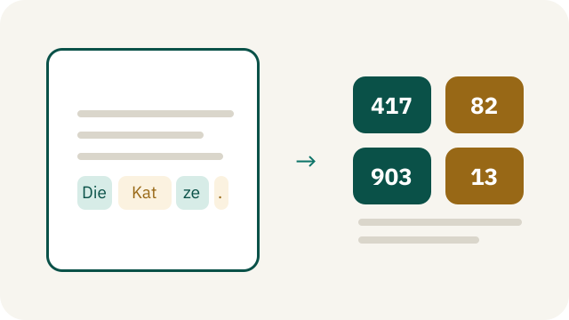
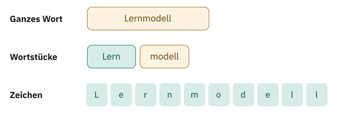
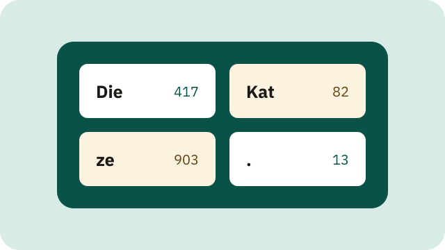
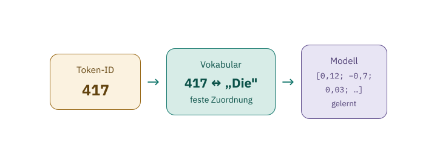
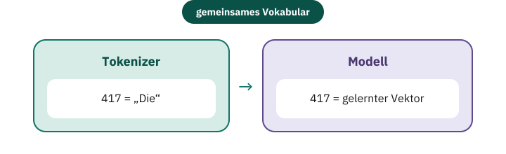
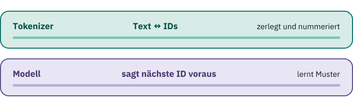

<!-- Generated from src/content/bausteine/de/tokenizer-ids-vokabular.mdx by scripts/export-lessons.mjs -- do not edit by hand. -->

# Tokenizer: Wie Sprache zu Zahlen wird

> Lesefassung für GitHub. Die vollständige Fassung mit interaktiven Demos, Animationen und Abrufmoment findest du auf der Website: **[Tokenizer: Wie Sprache zu Zahlen wird](https://ki-einfach-verstehen.de/de/bausteine/tokenizer-ids-vokabular/)**
>
> Lizenz: [CC BY 4.0](https://creativecommons.org/licenses/by/4.0/deed.de) · Nenne die Quelle so: KI einfach verstehen, „Tokenizer: Wie Sprache zu Zahlen wird“, CC BY 4.0, https://ki-einfach-verstehen.de/de/bausteine/tokenizer-ids-vokabular/

Zeigt, wie ein Tokenizer Text in wiederverwendbare Stücke zerlegt, über ein festes Vokabular nummeriert und daraus den Zahlen-Input eines Sprachmodells macht.

Bevor du weiterliest, teile diesen Ausdruck im Kopf in Stücke: „unwahrscheinlich". Würdest du daraus ein einziges Stück machen, drei verständliche Teile wie „un–wahr–scheinlich" oder jeden Buchstaben einzeln nehmen? Alle drei Varianten könnten einem Computer als Eingabe dienen. Sie führen aber zu sehr unterschiedlichen Listen von Zahlen — und genau diese Entscheidung trifft ein **[Tokenizer](https://ki-einfach-verstehen.de/de/glossar/tokenizer/)**.

Im vorigen Baustein war der [Input](https://ki-einfach-verstehen.de/de/glossar/input/) eines [Sprachmodells](https://ki-einfach-verstehen.de/de/glossar/sprachmodell/) noch eine Folge von „Textstücken". Jetzt wird sichtbar, was zwischen deinem lesbaren Satz und diesem Modell-Input liegt: Der Text wird in Stücke zerlegt, und jedes Stück bekommt eine Nummer. Erst diese Folge ganzer Zahlen geht ins [Modell](https://ki-einfach-verstehen.de/de/glossar/modell/).

## Ein Modell bekommt keinen Text zu sehen

Auf deinem Bildschirm steht vielleicht „Die Katze sitzt." Für dich besteht diese Zeile aus Wörtern, Leerzeichen und einem Punkt. Das Modell braucht etwas anderes: eine feste Liste von Textstücken, die nicht weiterwächst. Den Grund kennst du aus dem vorigen Baustein: Ein Sprachmodell gibt für jedes Textstück, das es kennt, einen eigenen Score aus. Das geht nur, wenn feststeht, welche Textstücke es gibt und wie viele. Und weil jedes gewählte Stück angehängt wird, besteht auch der Input aus Stücken dieser Liste. Ein beliebiger Text muss deshalb zuerst in Stücke dieser Liste übersetzt werden.

Die Zerlegung bestimmt, wie lang der Input aus Sicht des Modells ist: Aus einem sichtbaren Wort können ein, zwei oder viele solcher Stücke werden. Sie heißen **[Tokens](https://ki-einfach-verstehen.de/de/glossar/token/)**. Wie zerlegt wird, legt der Tokenizer fest, bevor das Modell rechnet.

Der Tokenizer *versteht* den Satz nicht, er folgt festen Regeln. Derselbe Text ergibt mit demselben Tokenizer deshalb dieselbe Tokenfolge. Ein anderer Tokenizer darf denselben Satz anders zerlegen.

*Ein Satz wird zuerst in Textstücke zerlegt, dann in Zahlen-IDs überführt. Das Zeichen ␣ markiert ein Leerzeichen, das zum Stück gehört.*

## Warum nicht einfach jedes Wort nummerieren?

Die naheliegendste Idee: Man nimmt ein Wörterbuch und gibt jedem Wort eine Nummer, „Die" etwa 417 und „Katze" 982. Für einen begrenzten Textbestand funktioniert das, für offene Sprache nicht.

Welche Einträge müsste die Liste enthalten? „Haus", „Haustür", „Haustürschlüssel", „Haustürschlüsselanhänger" und jede weitere deutsche Zusammensetzung? Dazu Namen, Produktbezeichnungen, Tippfehler, gebeugte Formen desselben Wortes wie „lernen", „lernt" und „gelernt" und Wörter, die morgen neu geprägt werden. Eine Liste kann groß werden, aber sie bleibt begrenzt. Sprache bildet weiter neue Zeichenfolgen.

Man könnte unbekannte Wörter durch einen Platzhalter „unbekannt" ersetzen. Dann sähe ein Chatbot aber bei jedem neuen Namen, etwa dem einer gerade gegründeten Band, nur „unbekannt".

## Warum nicht jeden Buchstaben einzeln nehmen?

Am anderen Ende liegt eine ebenso einfache Lösung: Jeder Buchstabe und jedes Satzzeichen wird ein eigenes Token. Damit lässt sich fast jedes Wort zusammensetzen, auch ein völlig neues. Für ein einzelnes Alphabet bleibt die Liste der möglichen Stücke klein. „Katze" benötigt dann allerdings fünf Tokens statt vielleicht einem oder zwei.

Jedes Token belegt einen eigenen Platz in der Eingabe, eine sogenannte **Position**. In einem langen Dokument vervielfacht sich so die Zahl der Positionen, und ein Modell kann nur eine begrenzte Zahl davon auf einmal verarbeiten. Schon „Die Katze sitzt." hätte mit Leerzeichen und Punkt 16 Positionen. Ein Chatbot bräuchte außerdem für jeden Buchstaben seiner Antwort eine eigene Runde der Schleife aus dem vorigen Baustein.

Einzelne Zeichen tragen zudem sehr wenig auf einmal. Das Modell müsste häufige Folgen wie „sch", „ung" oder „tion" immer wieder aus vielen Positionen zusammensetzen. **Ganze Wörter sind zu starr, einzelne Zeichen zu kleinteilig.** Gesucht ist ein Mittelweg.

*Dieselbe Zeichenfolge – dreimal unterschiedlich fein zerlegt.*

## Der brauchbare Mittelweg: wiederverwendbare Wortstücke

*Subword-Tokens funktionieren wie ein Baukasten: wenige große fertige Stücke für Häufiges, kleine Teile für den Rest.*

Viele moderne Text-Tokenizer arbeiten deshalb mit **[Subword-Tokens](https://ki-einfach-verstehen.de/de/glossar/subword-token/)**: Ein Token kann ein ganzes häufiges Wort sein, aber ebenso ein wiederkehrender Wortteil oder ein einzelnes Zeichen. Das funktioniert wie ein Baukasten: Häufiges liegt als großes fertiges Stück bereit, Seltenes setzt du aus kleinen Teilen zusammen, notfalls aus einzelnen Zeichen. So arbeiten auch die Tokenizer hinter bekannten Chatbots wie ChatGPT. Das Wort „Lernmodell" könnte beispielsweise in „Lern" und „modell" zerfallen. Das ist nur ein Denkbeispiel; andere Tokenizer zerlegen anders.

Welche Stücke existieren, hängt vom Textmaterial und vom Verfahren ab, mit dem das **[Vokabular](https://ki-einfach-verstehen.de/de/glossar/vokabular/)** erzeugt wurde, also die feste Liste aller Stücke, die ein Tokenizer kennt. Und „unwahrscheinlich" vom Anfang? Ein Subword-Tokenizer nähme vermutlich weder das ganze Wort noch jeden Buchstaben, sondern zwei oder drei häufige Stücke. Welche, entscheidet nicht die Silbenlehre, sondern das, was der Tokenizer aus Texten gelernt hat.

Der Mittelweg hat aber eine Kehrseite: Häufiges passt in wenige Tokens, eine seltene Schreibweise kann in viele kleine Teile zerfallen. Dadurch ist die Zahl der Tokens nicht einfach die Zahl der Wörter. Selbst Großschreibung oder ein Akzent können die Aufteilung ändern.

Bleibt die Frage, woher die Stücke kommen. Anders als beim Baukasten hat sie sich niemand ausgedacht.

## Woher die Stücke kommen: zählen und verschmelzen

Im vorigen Baustein kam das Sprachmodell GPT-2 vor: Es kennt 50.257 Textstücke, und seine Score-Liste hat für jedes einen Eintrag. Ausgewählt hat sie kein Mensch. Der Tokenizer von GPT-2 hat sie mit einem Verfahren namens **[Byte Pair Encoding](https://ki-einfach-verstehen.de/de/glossar/byte-pair-encoding/)** gelernt, kurz BPE, etwa „Paar-Kodierung“. „Gelernt“ heißt etwas anderes als beim Spamfilter aus dem ersten Baustein: Es gibt keinen Fehler und keine Gewichte, die nachgestellt werden. **Es wird nur gezählt.**

Am Anfang besteht das Vokabular nur aus einzelnen Zeichen. Erstens wird in einem großen Übungstext gezählt, welche zwei Stücke wie oft direkt nebeneinanderstehen. Zweitens wird das häufigste Paar zu einem neuen Stück verschmolzen und als neuer Eintrag ins Vokabular aufgenommen. Drittens beginnt alles von vorn, jetzt mit dem neuen Stück. Jede Verschmelzung wird als nummerierte Regel notiert, lesbar wie ein Rezeptschritt, anders als die Zahlen eines Modells. Das geht so lange, bis das Vokabular die vorher festgelegte Größe hat. Bei echten Tokenizern sind das Zehntausende Einträge oder mehr.

Ein ausgedachter Übungstext aus 24 kurzen Sätzen wie „Die Katzen lachen.“ und „Wir machen die Gärten neu.“ zeigt, wie das läuft; gezählt wird echt. Welches Paar steht dort wohl am häufigsten nebeneinander? Es ist „e“ + „n“, 35-mal: in „lachen“, „machen“, „Katzen“, „Garten“ und vielen mehr. Also wird „en“ Regel 1. Danach liegt „c“ + „h“ mit 22-mal vorn, Regel 2. Jetzt steht das neue Stück „ch“ oft hinter „a“: „a“ + „ch“ kommt 17-mal vor und wird Regel 3, „ach“. Ein Verfahren, das nur zählt, hat damit gängige Teile deutscher Wörter gefunden, ohne zu wissen, was eine Endung ist.

*Oben der Lernablauf von BPE, darunter die ersten drei gelernten Regeln, abgespielt auf das neue Wort „wachen“. Dabei wird nicht neu gezählt. Die Zahlen sind echte Zählungen im ausgedachten Übungstext. Das Zeichen ␣ markiert ein Leerzeichen.*

Und wie zerlegt der fertige Tokenizer einen neuen Satz? Er teilt ihn zuerst in einzelne Zeichen. Dann spielt er seine Regeln in genau der gelernten Reihenfolge ab: erst überall „e“ + „n“ zu „en“, dann „c“ + „h“ zu „ch“, dann „a“ + „ch“ zu „ach“ und so weiter durch alle Regeln. Schon nach diesen drei Regeln wird aus „wachen“, das im Übungstext fehlt, „w“ + „ach“ + „en“. Was keine Regel erfasst, bleibt als kleines Stück stehen. Zuletzt schlägt er jedes Stück im Vokabular nach.

Weil notfalls einzelne Zeichen übrig bleiben, braucht ein solcher Tokenizer den Platzhalter „unbekannt“ nur noch für Zeichen, die im Übungstext nie vorkamen. Der von GPT-2 umgeht auch das: Er beginnt mit Bytes statt Zeichen (siehe „Eine Ebene tiefer“).

Eine Ebene tiefer: Wie BPE ohne „unbekannt“ auskommt

Der Name verrät die Herkunft: Byte Pair Encoding war ursprünglich ein Verfahren zur Datenkompression, das häufige Paare von **Bytes** durch ein einzelnes neues Zeichen ersetzt. Ein Byte ist ein kleiner Zahlenbaustein im Computerspeicher; jedes sichtbare Zeichen wird durch ein oder mehrere Bytes dargestellt, ein Umlaut oder Emoji durch mehrere. Für die maschinelle Übersetzung wurde BPE so angepasst, dass es Zeichen statt Bytes verschmilzt.

Ein Tokenizer, der mit Zeichen beginnt, hat eine Lücke: Ein Zeichen, das im Übungstext nie vorkam, steht nicht im Grundvokabular und bleibt „unbekannt“. Alle Schriftzeichen der Welt als Grundeinheiten wären über 130.000 Einträge. Byte-Level-BPE, wie bei GPT-2, beginnt deshalb mit Bytes. Davon gibt es nur 256 verschiedene, und alle passen ins Grundvokabular. Selbst ein nie gesehenes Schriftzeichen lässt sich so aus Bytes zusammensetzen. Das fertige Vokabular ist so groß wie dieses Grundvokabular plus die Zahl der gelernten Regeln, dazu kommen manchmal Sondereinträge wie eine Endmarke.

BPE ist nicht das einzige Subword-Verfahren. **[SentencePiece](https://ki-einfach-verstehen.de/de/glossar/sentencepiece/)** lernt Subword-Modelle, darunter BPE, direkt aus unveränderten Sätzen, ohne sie vorher an vermuteten Wortgrenzen zu zerlegen. Das hilft bei Sprachen, die Wortgrenzen nicht wie das Deutsche mit Leerzeichen markieren.

> **Interaktive Demo:** [auf der Website ausprobieren](https://ki-einfach-verstehen.de/de/bausteine/tokenizer-ids-vokabular/)

## Token, Tokenizer und Vokabular sauber trennen

Woher weiß der Tokenizer, dass es „ Kat" als Stück gibt und „Kaz" nicht? Angenommen, „ Kat" kam beim Zählen oft genug vor, „Kaz" nie. Beim Zerlegen sind dann drei Dinge im Spiel, die man leicht verwechselt. Ein Token ist eine einzelne Einheit, zum Beispiel „ Kat" (mit Leerzeichen davor, dazu gleich mehr), „ze" oder „.". Das Vokabular, die feste Liste aller Stücke, ordnet jeder erlaubten Einheit eine ID zu. Der [Tokenizer](https://ki-einfach-verstehen.de/de/glossar/tokenizer/) ist das Verfahren samt Regeln und Vokabular, das Text in diese Einheiten zerlegt und die Einheiten wieder zu Text zusammensetzt.

Stell dir das Vokabular als Kartei vor. Auf jeder Karte stehen ein Textstück und eine Kennnummer. Der Tokenizer zerlegt deinen Satz nach seinen Regeln in Stücke, sucht zu jedem Stück die Karte und gibt deren Nummern aus. Beim Rückweg schlägt er die Nummern nach und fügt die Textstücke wieder zusammen. Beide Richtungen laufen bei jeder Chatbot-Nachricht: hin mit deiner Frage, zurück mit jedem Stück der Antwort.

Das Denkbild hat eine Grenze: Der Tokenizer wählt keine Karten, die inhaltlich passen. Welche Stücke entstehen, legen allein seine gelernten Regeln fest. Und die Karte mit „Kat" enthält keine Definition einer Katze, nur eine Zeichenfolge.

*Das Vokabular als Kartei: jedes Textstück mit einer festen Kennnummer.*

## Eine ID ist ein Etikett, keine Bedeutung

Sobald ein Textstück im Vokabular steht, erhält es eine ganze Zahl, seine **[Token-ID](https://ki-einfach-verstehen.de/de/glossar/token-id/)**. Angenommen, „Die" trägt die ID 417. Sie misst weder Bedeutung noch Häufigkeit, Stimmung oder Wichtigkeit. **Sie ist nur die Nummer auf einer Karteikarte.** Dass ein Chatbot „Die" sinnvoll weiterführt, liegt also nicht an der 417, sondern an dem, was sein Modell dazu gelernt hat.

*Eine ID ist nur ein Etikett – eine Nummer, die nichts über den Inhalt verrät.*

Darum ist eine Token-ID ohne Angabe des Tokenizers nicht eindeutig. In einem anderen Vokabular kann 417 für „und", einen Teil eines Wortes oder ein Sonderzeichen stehen. Im Modell dient dieselbe Nummer als Adresse für eine Liste gelernter Zahlen. Das kennst du vom Spamfilter: Dort gehörte zu jedem Wort ein Gewicht, im ausgedachten Beispiel „Gewinn“ +3. Beim Sprachmodell gehört zu jeder ID statt einer Zahl eine ganze Liste; die ID sagt nur, welche.

*Dieselbe ID 417 ist im Tokenizer die Nummer des Textstücks „Die“ und im Modell die Adresse gelernter Zahlen. Das Modell selbst sieht nur die Zahl.*

## Ein vollständiges Spielzeugbeispiel

Betrachte ein erfundenes Mini-Vokabular; ein realer Tokenizer zerlegt anders.

| Token-ID | Textstück |
| ---: | :--- |
| 417 | „Die" |
| 82 | „ Kat" |
| 903 | „ze" |
| 771 | „ sitzt" |
| 13 | „." |

Beim **[Kodieren](https://ki-einfach-verstehen.de/de/glossar/tokenizer/)** erhält der Tokenizer den Text „Die Katze sitzt.". Mit diesem Mini-Vokabular gibt es genau eine Zerlegung: „Die" + „ Kat" + „ze" + „ sitzt" + „.", denn ein Stück „ Katze" steht nicht in der Liste. Durch Nachschlagen im Vokabular entsteht die Folge 417, 82, 903, 771, 13. Diese fünf Zahlen bekommt das Modell als Eingabe.

In einem echten Vokabular stünden auch einzelne Zeichen wie „K“, „a“ und „t“. Welche Stücke herauskommen, entscheiden dann die gelernten Regeln: Gibt es Regeln, die „ Kat“ und „ze“ bilden, aber keine, die beide zu „ Katze“ verschmilzt, bleibt es bei „ Kat“ + „ze“.

Beim **[Dekodieren](https://ki-einfach-verstehen.de/de/glossar/tokenizer/)** läuft die Zuordnung rückwärts. Der Tokenizer schlägt jede ID nach, erhält die fünf gespeicherten Textstücke und fügt sie in derselben Reihenfolge zusammen. Weil die Leerzeichen schon am Anfang zweier Tokens gespeichert sind, entsteht wieder „Die Katze sitzt.".

Das Beispiel zeigt auch, warum die Reihenfolge zählt. 417, 82, 903 ist „Die Katze"; 82, 903, 417 ergibt „ KatzeDie".

Leerzeichen sind für einen Tokenizer Zeichen wie alle anderen, das zeigen „ Kat“ und „ sitzt“. Auch Zeilenumbrüche und Satzzeichen werden zu Tokens oder gehen in größere ein. Kopierst du eine Tabelle mit vielen Leerzeilen in einen Chatbot, zählen auch diese Zeichen mit.

> **Interaktive Demo:** [auf der Website ausprobieren](https://ki-einfach-verstehen.de/de/bausteine/tokenizer-ids-vokabular/)

Die Zahlen legt allein das Vokabular dieses einen Tokenizers fest. Was passiert, wenn ein Modell mit dem falschen Vokabular gefüttert wird?

## Warum Tokenizer und Modell ein festes Paar sind

Das Modell wurde mit genau einer bestimmten Zuordnung trainiert. Wenn seine Eingabe 417 lautet, greift es auf die Liste gelernter Zahlen zurück, also [Parameter](https://ki-einfach-verstehen.de/de/glossar/parameter/), die im Training für Eintrag 417 angepasst wurden. Tauscht man nur den Tokenizer aus, bekommt das Modell formal gültige Zahlen, aber die falschen Symbole. Es ist, als hätte jemand die Nummern auf den Karteikarten neu verteilt: Unter 417 steht jetzt „und“, das Modell erwartet aber, was es für „Die“ gelernt hat.

*Ein fremder Tokenizer verteilt die Nummern auf den Karteikarten neu – das Modell bekommt unter vertrauten Nummern fremde Textstücke.*

**Deshalb gehört zu jedem Modell genau sein Tokenizer**, mit Vokabular und gelernten Regeln, und beide werden immer gemeinsam weitergegeben. Bekommt ein neu trainiertes Modell einen neuen Tokenizer, ergibt derselbe Satz dort andere IDs und oft auch eine andere Zahl von Tokens.

*Tokenizer und Modell bilden ein festes Paar: Dieselbe ID muss für beide auf denselben Vokabulareintrag zeigen.*

## Warum du Tokens im Alltag bemerkst

In einem langen Chat mit einem KI-Assistenten scheint das Modell irgendwann zu vergessen, was ganz am Anfang stand. Oder ein Dienst meldet, dein Text sei zu lang, obwohl er nur wenige Seiten hat. **In beiden Fällen geht es nicht um Wörter, sondern um Tokens.**

Modelle verarbeiten nur eine begrenzte Zahl von Tokenpositionen auf einmal. Dieses **[Kontextfenster](https://ki-einfach-verstehen.de/de/glossar/kontextfenster/)** umfasst je nach System Eingabe und erzeugte [Ausgabe](https://ki-einfach-verstehen.de/de/glossar/output/). Einen Grund für das Vergessen kennst du aus dem vorigen Baustein: In einem Chat geht bei jeder Runde der ganze bisherige Verlauf erneut als Input ins Modell, und er wird mit jeder Antwort länger. Passt er nicht mehr hinein, muss das System etwas weglassen, und meist fällt dann weg, was am Anfang stand.

Manche Texte zerfallen in besonders viele Tokens: eine ungewöhnliche Produktkennung, eine lange Zahlenreihe oder eine Sprache, die das Vokabular weniger kompakt abdeckt. Solche Texte verbrauchen mehr Positionen als ein gleich langer geläufiger Text. Manche Dienste rechnen sogar pro Token ab. Faustformeln wie „ein Token sind ungefähr vier Zeichen" sind grob, genau zählt nur der Tokenizer des jeweiligen Modells.

## Was der Tokenizer nicht leistet

Der Tokenizer erkennt weder Wortbedeutungen noch grammatische Bausteine noch die Absicht eines Satzes. Manchmal sehen seine Grenzen sprachlich sinnvoll aus — etwa „Lern" und „modell". Das liegt daran, dass solche Folgen beim Zählen häufig waren, nicht an einer Sprachanalyse. Ein Token darf mitten durch eine Silbe, Endung oder einen Namen verlaufen.

Der Tokenizer entscheidet auch nicht, welches Token als Nächstes kommt. Er wandelt vorhandenen Text in IDs um und erzeugte IDs wieder in Text zurück. Die Vorhersage geschieht *im Modell*.

Ein verbreiteter Irrtum lautet: Ein Modell „versteht" ein Wort, wenn es dafür einen einzelnen Token gibt; zerfällt das Wort in viele Tokens, versteht es das Wort schlechter oder gar nicht. Das klingt plausibel, weil eine kompakte Einheit vollständiger wirkt als mehrere Bruchstücke.

Tatsächlich hat das Modell während des Trainings Muster über ganze Folgen von Tokens gelernt und kann Informationen aus mehreren Positionen zusammensetzen. **Von der Tokenzahl kannst du deshalb nicht auf Verständnis schließen.** Folgenlos ist die Zerlegung trotzdem nicht: Bei manchen Aufgaben, etwa beim Rechnen mit mehrstelligen Zahlen, hängt die Leistung messbar davon ab, wie die Ziffern in Tokens aufgeteilt werden.

*Der Tokenizer zerlegt und nummeriert Text – die Vorhersage übernimmt allein das Modell.*

## Die Zahlen sind erst der Anfang

Der vollständige Weg bis hierhin lautet nun: sichtbarer Text → Tokenizer-Regeln → Tokenfolge → Nachschlagen im Vokabular → Folge von Token-IDs. Damit ist der Text nummeriert, aber noch nicht in einer Form, mit der das [Modell](https://ki-einfach-verstehen.de/de/glossar/modell/) sinnvoll Ähnlichkeiten und Beziehungen berechnen kann.

Im nächsten Schritt dient jede ID als Adresse für eine lange Liste gelernter Zahlen. Was genau eine solche Zahlenliste ist und wie man viele davon ordnet, zeigt der nächste Baustein: Skalar, [Vektor](https://ki-einfach-verstehen.de/de/glossar/vektor/), Matrix und [Tensor](https://ki-einfach-verstehen.de/de/glossar/tensor/).

Wenn du dir nur einen Satz merkst, dann diesen: Ein Token ist ein wiederverwendbares Textstück, seine ID ist nur die Nummer im Vokabular, und erst das Modell verbindet diese Nummer mit einer Liste gelernter Zahlen.

---

Quelle: https://ki-einfach-verstehen.de/de/bausteine/tokenizer-ids-vokabular/

← Zurück: [Input und Output: Was eine Funktion tut](./input-und-output.md) · [Alle Bausteine](../../README.de.md#inhalt) · Weiter: [Skalar, Vektor, Matrix, Tensor: die Bausteine der Zahlen](./skalar-vektor-matrix-tensor.md) →
