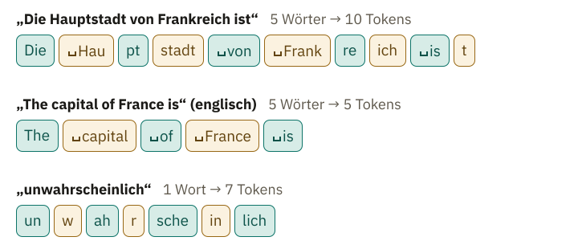

<!-- Generated from src/content/bausteine/de/tokenizer-ids-vokabular.mdx by scripts/export-lessons.mjs -- do not edit by hand. -->

# Tokenizer: Wie Text in Tokens zerfällt

> Lesefassung für GitHub. Die vollständige Fassung mit interaktiven Demos, Animationen und Abrufmoment findest du auf der Website: **[Tokenizer: Wie Text in Tokens zerfällt](https://ki-einfach-verstehen.de/de/bausteine/tokenizer-ids-vokabular/)**
>
> Lizenz: [CC BY 4.0](https://creativecommons.org/licenses/by/4.0/deed.de) · Nenne die Quelle so: KI einfach verstehen, „Tokenizer: Wie Text in Tokens zerfällt“, CC BY 4.0, https://ki-einfach-verstehen.de/de/bausteine/tokenizer-ids-vokabular/

Zeigt, warum ein Sprachmodell Text in Stücke aus einer festen Liste zerlegt, wie ein Tokenizer diese Stücke durch Zählen lernt und warum die Zahl der Tokens nicht die Zahl der Wörter ist.

Bevor du weiterliest, teile dieses Wort im Kopf in Stücke: „unwahrscheinlich“. Machst du daraus ein einziges Stück, drei verständliche Teile wie „un“, „wahr“ und „scheinlich“ oder lauter einzelne Buchstaben? Halte deine Wahl fest.

Im vorigen Baustein bekam ein [Sprachmodell](https://ki-einfach-verstehen.de/de/glossar/sprachmodell/) als [Input](https://ki-einfach-verstehen.de/de/glossar/input/) einen Textanfang wie „Die Katze sitzt“ und gab für jedes Textstück, das es kennt, einen Score aus. Offen blieb, wie aus Text etwas wird, womit ein Modell rechnen kann. Was ist ein Textstück genau, und wer hat festgelegt, welche Stücke es gibt? Wie aus den Stücken Zahlen werden, zeigt der nächste Baustein.

## Warum das Modell eine feste Liste von Stücken braucht

Warum nimmt ein Sprachmodell deinen Text nicht einfach so, wie er kommt? Das ältere Sprachmodell GPT-2 kennt 50.257 Textstücke, und seine Score-Liste hat immer genau 50.257 Einträge, einen für jedes Stück. Es geht ihm wie der Bilderkennung aus dem vorigen Baustein: Sie gibt immer genau einen Score für Katze, Hund, Fuchs und Auto aus und kann keine neue Klasse anlegen. Auch beim Sprachmodell steht die Form des Outputs fest, bevor es rechnet. Die Score-Liste lässt sich also nur bauen, wenn vorher feststeht, welche Stücke es gibt.

Dasselbe gilt für den Input. Erinnerst du dich an die Schleife? Ein Stück wird gewählt und an den Text angehängt. Der längere Text geht wieder ins Modell, er besteht also teils aus gewählten Stücken. Aus dem vorigen Baustein weißt du außerdem: Jedes Modell rechnet nur mit der Art von Input, für die es gebaut ist. Das Sprachmodell kann nur Stücke aus seiner festen Stückliste verarbeiten, dem **[Vokabular](https://ki-einfach-verstehen.de/de/glossar/vokabular/)**. Die Score-Liste ist etwas anderes: Sie wird für jeden Input neu berechnet und hat für jedes Stück im Vokabular einen Eintrag. Deshalb muss auch deine Frage zuerst in Stücke aus dem Vokabular zerlegt werden. Jedes dieser Stücke heißt **[Token](https://ki-einfach-verstehen.de/de/glossar/token/)**.

*Bevor das Modell rechnet, wird dein Text in Stücke geschnitten.*

Bevor dein Text ins Modell geht, zerlegt ihn ein eigenes Programm, der **[Tokenizer](https://ki-einfach-verstehen.de/de/glossar/tokenizer/)**. Jede Nachricht, die du einem Chatbot schickst, läuft zuerst durch ihn, und auch jede Antwort besteht aus seinen Stücken. Er versteht deinen Satz nicht, er folgt festen Regeln. Wo er schneidet, steht also fest, bevor das Modell auch nur eine Zahl berechnet. Welche Stücke soll seine Liste enthalten?

## Ganze Wörter oder einzelne Buchstaben?

Wenn jedes Wort ein Token wird, funktioniert das für eine begrenzte Sammlung von Texten, aber nicht für beliebige Texte. Die Liste bräuchte „Haus“, „Haustür“, „Haustürschlüssel“ und jede weitere Zusammensetzung, dazu gebeugte Formen wie „lernen“, „lernt“ und „gelernt“, Namen, Tippfehler und Wörter, die morgen neu entstehen. Sie kann groß werden, aber sie bleibt endlich. Was fehlt, könnte nur als Platzhalter „unbekannt“ hinein. Beim Regelfilter aus dem ersten Baustein griff die Gewinn-Regel nicht mehr, sobald im Betreff „G3WINN“ statt „Gewinn“ stand. Ein Chatbot mit fester Wortliste sähe ebenso bei jedem neuen Bandnamen nur „unbekannt“.

Eine andere Möglichkeit ist, jeden Buchstaben, jedes Leerzeichen und jedes Satzzeichen als eigenes Token zu nehmen. Damit lässt sich jedes Wort zusammensetzen, auch ein völlig neues, und die Liste bleibt klein. Dafür wird der Input lang. Das Modell bekommt den Input als Reihe von Tokens, jedes auf einem eigenen Platz. Für jedes Modell ist festgelegt, wie viele Plätze diese Reihe höchstens haben darf. Mehr dazu im nächsten Baustein. „Die Katze sitzt.“ belegt mit Leerzeichen und Punkt 16 Plätze, und selbst ein häufiges „sch“ belegt jedes Mal drei. Auch die Antwort entstünde Buchstabe für Buchstabe, mit einer Runde der Schleife für jedes Zeichen.

**Ganze Wörter sind zu starr, einzelne Zeichen zu kleinteilig.** Gesucht ist ein Mittelweg.

*Dasselbe Wort, dreimal unterschiedlich fein zerlegt. Die mittlere Zerlegung ist ein Denkbeispiel.*

## Der Mittelweg: wiederverwendbare Wortstücke

Viele Tokenizer arbeiten deshalb mit **[Subword-Tokens](https://ki-einfach-verstehen.de/de/glossar/subword-token/)**, also Wortstücken. Ein Token kann ein ganzes häufiges Wort sein, ein wiederkehrender Wortteil oder ein einzelnes Zeichen. So arbeiten auch die Tokenizer hinter Chatbots wie ChatGPT. „Lernmodell“ könnte etwa in „Lern“ und „modell“ zerfallen. Das ist ein Denkbeispiel; jeder Tokenizer zerlegt anders.

*Wortstücke funktionieren wie ein Baukasten: wenige große fertige Stücke für Häufiges, kleine Teile für den Rest.*

Das funktioniert wie ein Baukasten. Häufiges liegt als großer fertiger Klotz bereit, Seltenes wird aus kleinen Klötzen zusammengesetzt, notfalls aus einzelnen Zeichen. So fällt kein Wort durch, und häufige Wörter belegen trotzdem nur wenige Plätze. Die gebaute Reihe ist die Tokenfolge deines Textes; sie entsteht für jeden Text neu. Der Kasten selbst bleibt dagegen immer derselbe: Er ist das Vokabular, die feste Liste aller Stücke, die ein Tokenizer kennt. Bei GPT-2 sind das die 50.257 Textstücke, für die seine Score-Liste je einen Eintrag hat.

Das Bild hat eine Grenze. Beim Baukasten suchst du selbst aus, welchen Klotz du nimmst. Der Tokenizer sucht nichts aus, er folgt seinen Regeln. Und die Klötze hat niemand nach ihrer Bedeutung zugeschnitten: Welche Stücke im Kasten liegen, hat ein Verfahren durch Zählen bestimmt.

## Woher die Stücke kommen: zählen und verschmelzen

Der Tokenizer von GPT-2 hat seine Stücke mit einem Verfahren gelernt, das **[Byte Pair Encoding](https://ki-einfach-verstehen.de/de/glossar/byte-pair-encoding/)** heißt, kurz BPE. „Pair“ heißt „Paar“. Gelernt heißt hier etwas anderes als beim Spamfilter aus dem ersten Baustein, dessen Gewichte nach Fehlern nachgestellt wurden. BPE kennt weder Fehler noch Gewichte. **Es wird nur gezählt.**

Am Anfang besteht das Vokabular nur aus einzelnen Zeichen. Zuerst zählt das Verfahren in einem großen Übungstext, welche zwei Stücke wie oft direkt nebeneinanderstehen. Dann verschmilzt es das häufigste Paar zu einem neuen Stück. Dieses Stück kommt als Eintrag ins Vokabular. Das Verfahren notiert die Verschmelzung als nummerierte **Regel**. Der Regelfilter aus dem ersten Baustein hatte lesbare Regeln, aber Menschen hatten sie geschrieben. Der trainierte Spamfilter hatte nur Gewichte. Hier entstehen durch Zählen lesbare Regeln, die kein Mensch geschrieben hat. Der Tokenizer ist deshalb kein Modell mit Gewichten, sondern ein Programm, das diese Regeln abarbeitet. Danach beginnt alles von vorn, jetzt mit dem neuen Stück. In jeder Runde gewinnt genau ein Paar, das häufigste. Das geht so lange, bis das Vokabular die vorher gewählte Größe erreicht. Echte Tokenizer lernen so Zehntausende Regeln, neuere oft weit über 100.000.

Ein ausgedachter Übungstext enthält neun Wörter: „lachen“ und „machen“ je zweimal, „sagen“ dreimal, „nicht“ und „lacht“ je einmal. Die Wörter und ihre Häufigkeiten wurden für das Beispiel gewählt. Gezählt wird aber echt, und du kannst jede Zählung auf dem Papier nachprüfen. Das Verfahren zählt nur Paare innerhalb eines Wortes. Welches Paar kommt wohl am häufigsten vor? Überleg kurz, bevor du weiterliest.

Es ist „e“ + „n“, 7-mal: zweimal in „lachen“, zweimal in „machen“ und dreimal in „sagen“. Damit wird „en“ zur ersten Regel.

Danach zählt das Verfahren neu, denn der Übungstext besteht jetzt aus anderen Stücken. Am häufigsten ist jetzt „c“ + „h“, 6-mal: in „lachen“, „machen“, „nicht“ und „lacht“. Das wird die zweite Regel, „ch“. Beim dritten Zählen steht das neue Stück „ch“ fünfmal hinter einem „a“, nämlich in jedem „lachen“, „machen“ und „lacht“. Die dritte Regel verschmilzt beide zu „ach“. Welches Paar würde wohl zur vierten Regel? Zähl selbst, bevor du weiterliest.

Ein Verfahren, das nur zählt, hat damit Stücke gefunden, die wie deutsche Wortteile aussehen. Was eine Endung ist, weiß es trotzdem nicht: „en“ und „ach“ wurden Regeln, weil sie häufig waren.

Die vierte Regel verbindet „ach“ und „en“. Das Paar kommt 4-mal vor, in „lachen“ und „machen“. Echte Tokenizer zählen genauso, nur in riesigen Textmengen. Deshalb lernen sie andere Regeln als die aus diesem Mini-Beispiel.

Eine Ebene tiefer: Wie BPE ohne „unbekannt“ auskommt

Byte Pair Encoding war ursprünglich ein Verfahren zur Datenkompression, das häufige Paare von **Bytes** durch ein einzelnes neues Zeichen ersetzt. Ein Byte ist ein kleiner Zahlenbaustein im Computerspeicher. Jedes sichtbare Zeichen wird durch ein oder mehrere Bytes dargestellt, ein Umlaut oder Emoji durch mehrere. Für die maschinelle Übersetzung wurde BPE so angepasst, dass es Zeichen statt Bytes verschmilzt.

Ein Tokenizer, der mit Zeichen beginnt, hat eine Lücke. Ein Zeichen, das im Übungstext nie vorkam, steht nicht im Grundvokabular und bleibt „unbekannt“. Ein Grundvokabular mit allen Schriftzeichen der Welt hätte über 130.000 Einträge. Byte-Level-BPE, wie bei GPT-2, beginnt deshalb mit Bytes. Davon gibt es nur 256 verschiedene, und alle passen ins Grundvokabular. Selbst ein nie gesehenes Schriftzeichen lässt sich so aus Bytes zusammensetzen. Das fertige Vokabular hat so viele Einträge wie das Grundvokabular, plus einen für jede gelernte Regel. Manchmal kommen Sondereinträge dazu.

BPE ist nicht das einzige Verfahren für Wortstücke. **[SentencePiece](https://ki-einfach-verstehen.de/de/glossar/sentencepiece/)** lernt Wortstücke, auch mit BPE, direkt aus unveränderten Sätzen. Es zerlegt die Sätze vorher nicht an vermuteten Wortgrenzen. Das hilft bei Sprachen, die Wortgrenzen nicht wie das Deutsche mit Leerzeichen markieren.

## Wie der fertige Tokenizer ein neues Wort zerlegt

Was macht der fertige Tokenizer mit einem Wort, das im Übungstext nie vorkam, etwa „machten“? Rate, bevor du weiterliest, in welche Stücke es mit den drei Regeln zerfällt.

Der Tokenizer zählt nicht neu. Er teilt das Wort in einzelne Zeichen und spielt seine drei Regeln in der gelernten Reihenfolge ab. Zuerst macht Regel 1 aus „e“ + „n“ das Stück „en“: m | a | c | h | t | en. Danach bildet Regel 2 aus „c“ + „h“ das Stück „ch“: m | a | ch | t | en. Zuletzt verbindet Regel 3 „a“ und „ch“: m | ach | t | en. Für das „m“ und das „t“ gibt es keine Regel, sie bleiben einzelne Zeichen.

*Oben der Lernablauf von BPE, darunter die drei Regeln aus dem ausgedachten Übungstext, abgespielt auf das neue Wort „machten“. Die Zahlen in Klammern sind die Zählungen beim Lernen; beim Zerlegen wird nicht gezählt.*

Jedes Zeichen des Übungstexts stand schon am Anfang im Vokabular. Deshalb fällt kein Wort aus diesen Zeichen durch; Unbekanntes zerfällt nur in kleinere Stücke. Der Tokenizer von GPT-2 setzt notfalls jedes Zeichen aus noch kleineren Bausteinen zusammen, den Bytes, mit denen ein Computer Zeichen speichert (mehr dazu in der Box oben). Bei ihm bleibt deshalb gar nichts unbekannt. Und weil Regeln und Reihenfolge feststehen, ergibt derselbe Text mit demselben Tokenizer immer dieselben Tokens. Schickst du dieselbe Frage in zwei neuen Chats ab, werden aus ihr beide Male dieselben Tokens. Verschiedene Antworten entstehen fast immer erst danach, im Auswahlschritt, der mit etwas Zufall aus der Score-Liste des Modells ein Stück wählt.

Und „unwahrscheinlich“ vom Anfang? Der echte Tokenizer von GPT-2 macht daraus sieben Stücke: „un“, „w“, „ah“, „r“, „sche“, „in“ und „lich“. Die Grenzen laufen mitten durch „wahr“, denn keine seiner Regeln hat „wahr“ als Ganzes gebildet. Ein Tokenizer mit anderen Regeln zerlegt dasselbe Wort anders.

> **Interaktive Demo:** [auf der Website ausprobieren](https://ki-einfach-verstehen.de/de/bausteine/tokenizer-ids-vokabular/)

## Warum Tokens keine Wörter sind

Wie viel Text ein Chatbot auf einmal verarbeiten kann, ist durch die Zahl der Tokens begrenzt, nicht durch die Zahl der Wörter. Wer Sprachmodelle nicht im Chatfenster, sondern direkt aus eigenen Programmen heraus nutzt, zahlt auch pro Token. Der echte Tokenizer von GPT-2 zerlegt „Die Hauptstadt von Frankreich ist“ in 10 Tokens, „The capital of France is“ in 5. Beide Sätze haben fünf Wörter. „France“ ist bei GPT-2 ein einziges Stück, „Frankreich“ wird zu „Frank“, „re“ und „ich“.

*Drei Texte, zerlegt vom echten Tokenizer von GPT-2. Die Farbe wechselt mit jedem Token. Das Zeichen ␣ markiert ein Leerzeichen; bei GPT-2 gehört es zum folgenden Wort.*

> **Interaktive Demo:** [auf der Website ausprobieren](https://ki-einfach-verstehen.de/de/bausteine/tokenizer-ids-vokabular/)

Was beim Zählen häufig war, wurde zu großen Stücken. Der Tokenizer von GPT-2 entstand für ein Modell, aus dessen Trainingstexten man nicht-englische Webseiten bewusst aussortiert hatte. Seine Paare hat er vermutlich in ähnlichen, überwiegend englischen Texten gezählt. In seinem Übungstext waren englische Buchstabenfolgen also weit häufiger als deutsche. Englische Wörter sind deshalb oft ein Token, deutsche zerfallen öfter. Schon ein Tippfehler kann die Zahl erhöhen: „Frankkreich“ braucht ein Stück mehr als „Frankreich“.

Mit mehr Tokens belegt der Text mehr Plätze im Input. Oft hört man, ein Modell verstehe ein Wort schlechter, wenn es in viele Tokens zerfällt. Das klingt plausibel, weil ein ganzes Stück vollständiger wirkt als Bruchstücke. Das Modell bekommt aber immer den ganzen Input auf einmal, wie „Die Katze sitzt auf“ im vorigen Baustein, nicht nur das letzte Stück. „Frank“, „re“ und „ich“ kommen also zusammen bei ihm an, und im Training hat es mit genau solchen Folgen gerechnet. **Von der Zahl der Tokens kannst du deshalb nicht auf Verständnis schließen.** Folgenlos ist die Zerlegung trotzdem nicht. GPT-2 zerlegt „12345“ in „123“ und „45“, „4096“ mit Leerzeichen davor ist dagegen ein einziges Stück. Die Ziffern stehen also nicht Stelle für Stelle da wie beim schriftlichen Rechnen. Studien zeigen, dass die Zerlegung von Zahlen messbar beeinflusst, wie gut Sprachmodelle rechnen.

Der Tokenizer sagt auch nichts vorher. Er zerlegt Text in Stücke; welche Stücke als Nächstes gut passen, bewertet allein das Modell.

## Stücke sind noch keine Zahlen

Bevor ein Sprachmodell rechnet, zerlegt sein Tokenizer den Text in Tokens aus einem festen Vokabular. Welche Stücke darin stehen, hat BPE durch Zählen bestimmt. Deshalb wird „unwahrscheinlich“ zu sieben Stücken und „Frankreich“ zu drei, während „France“ eins bleibt. Die Zahl der Tokens ist nicht die Zahl der Wörter.

Die Tokens sind aber immer noch Text, und ein Modell rechnet nur mit Zahlen. Welche Zahl jedes Stück bekommt und was diese Zahl dem Modell verrät, zeigt der nächste Baustein: [Token-IDs: Wie aus Tokens Zahlen werden](./token-ids-und-vokabular.md).

---

Quelle: https://ki-einfach-verstehen.de/de/bausteine/tokenizer-ids-vokabular/

← Zurück: [Input und Output: Was eine Funktion tut](./input-und-output.md) · [Alle Bausteine](../../README.de.md#inhalt) · Weiter: [Token-IDs: Wie aus Tokens Zahlen werden](./token-ids-und-vokabular.md) →
