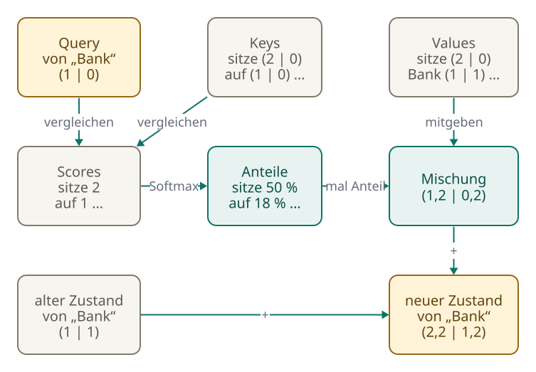

<!-- Generated from src/content/bausteine/de/transformerbloecke-und-attention.mdx by scripts/export-lessons.mjs -- do not edit by hand. -->

# Transformerblöcke und Attention: Wie Kontext eingemischt wird

> Lesefassung für GitHub. Die vollständige Fassung mit interaktiven Demos, Animationen und Abrufmoment findest du auf der Website: **[Transformerblöcke und Attention: Wie Kontext eingemischt wird](https://ki-einfach-verstehen.de/de/bausteine/transformerbloecke-und-attention/)**
>
> Lizenz: [CC BY 4.0](https://creativecommons.org/licenses/by/4.0/deed.de) · Nenne die Quelle so: KI einfach verstehen, „Transformerblöcke und Attention: Wie Kontext eingemischt wird“, CC BY 4.0, https://ki-einfach-verstehen.de/de/bausteine/transformerbloecke-und-attention/

Wie ein Sprachmodell die Information früherer Wörter in jedes Token einmischt, warum es dabei nicht nach vorne schauen darf und wie viele solcher Blöcke hintereinander arbeiten.

Zwei Sätze: „Ich zahle Geld bei der Bank ein“ und „Ich sitze auf der Bank im Park“. Im vorigen Baustein hat jedes Token seinen Steckbrief bekommen, eine lange Zahlenliste aus der Nachschlagetabelle des Modells. Für „Bank“ ist es in beiden Sätzen dieselbe Liste. Ein Chatbot, der beide Sätze ins Englische übersetzt, muss aber einmal „bank“ und einmal „bench“ schreiben. Woher soll er das wissen, wenn „Bank“ in beiden Fällen gleich aussieht?

*Geldinstitut oder Sitzbank: Das Wort allein entscheidet es nicht.*

Die Antwort steckt im größten Teil eines Sprachmodells, in vielen gleich gebauten Blöcken, jeder mit eigenen Zahlen. Eine Architektur aus solchen Blöcken heißt **[Transformer](https://ki-einfach-verstehen.de/de/glossar/transformer/)**, vorgestellt 2017. Die Blöcke sorgen dafür, dass jedes Token Information von den anderen bekommt. Wie das geht und was ein Token dabei sehen darf, zeigt dieser Baustein. Zur Vereinfachung ist hier jedes Wort ein Token, auch wenn echte Tokenizer manche Wörter zerlegen.

## Ein Steckbrief, zwei Bedeutungen

Wenn du „Ich sitze auf der Bank“ liest, denkst du nicht an Geld. Du hast den Satz drumherum mitgelesen, ohne es zu bemerken. Ein Steckbrief aus der Tabelle kann das nicht. Für jedes Vorkommen von „Bank“ wird derselbe Steckbrief nachgeschlagen, egal was davor oder danach steht. Das Sitzplatz-Signal aus dem vorigen Baustein verrät nur, wo das Wort steht, nicht welche Bank gemeint ist. Ein Lehrbuch über Sprachverarbeitung nennt dieses Problem: Ein fester [Vektor](https://ki-einfach-verstehen.de/de/glossar/vektor/) ist immer derselbe, erst Wörter wie „Teich“ verraten, dass mit dem englischen „bank“ das Ufer gemeint ist.

Ein Sprachmodell löst das, indem es jeden Steckbrief nach und nach umformt. Dafür schickt es die Vektoren aller Tokens durch einen Block nach dem anderen. Im ersten Baustein dieses Themenbereichs hießen diese Blöcke Rechenstufen, in Modellangaben heißen sie meist Schichten (englisch Layer). Von den 399 benannten Zahlenblöcken aus dem ersten Baustein gehören je elf zu einem dieser Blöcke, zusammen 396. Die übrigen drei liegen außerhalb: einer am Eingang, zwei am Ausgang. In jedem Block wird in den Vektor eines Tokens etwas von den anderen Tokens eingemischt. Was dabei entsteht, heißt in diesem Baustein der **Zustand** eines Tokens: sein Vektor an einer bestimmten Stelle im Modell.

Dass das wirklich passiert, lässt sich messen. Forschende haben die Zustände desselben Wortes in vielen verschiedenen Sätzen verglichen. Je höher der Block, desto stärker unterscheiden sie sich je nach Satz. Bei GPT-2 sind sie nach dem letzten Block fast vollständig vom Satz geprägt. Der Steckbrief ist also nur der Startpunkt. Die Frage ist, wie die Information der anderen Wörter hineinkommt.

## Der Scheinwerfer: Kontext gewichtet einmischen

Für jedes Token, das gerade an der Reihe ist, gehen Scheinwerfer an. Sie richten sich auf die Tokens davor und auf das Token selbst. In Wirklichkeit rechnet das Modell alle Positionen gleichzeitig; „an der Reihe“ heißt nur, dass wir uns diese eine Position ansehen. Manche Stellen werden hell beleuchtet, andere nur schwach. Was hell beleuchtet ist, fließt stark in den neuen Zustand ein, was im Halbdunkel liegt, nur wenig. Dieses Verfahren heißt **[Attention](https://ki-einfach-verstehen.de/de/glossar/attention/)**, englisch für Aufmerksamkeit.

*Scheinwerfer leuchten unterschiedlich hell auf eine Reihe von Karten. Was hell beleuchtet ist, fließt stark ein.*

Ein Rechenbeispiel mit erfundenen Zahlen und einem einzigen Scheinwerfer zeigt das. Ist „Bank“ in „Ich sitze auf der Bank im Park“ an der Reihe, bekommt jedes sichtbare Wort ein Gewicht: „sitze“ 0,52, „Bank“ selbst 0,22, „auf“ 0,12, „Ich“ 0,08 und „der“ 0,06. Zusammen ergeben die Gewichte genau 1. Die Helligkeiten werden also verteilt: Was ein Wort mehr bekommt, fehlt den anderen. Die Regel kennst du aus dem Baustein über [Wahrscheinlichkeit und Softmax](./wahrscheinlichkeit-und-softmax.md), und tatsächlich rechnet das Modell die Gewichte mit [Softmax](https://ki-einfach-verstehen.de/de/glossar/softmax/) aus.

Und im Geld-Satz „Ich zahle Geld bei der Bank ein“? Überleg kurz, welches Wort am hellsten beleuchtet sein dürfte, bevor du weiterliest.

Am hellsten ist „Geld“ mit 0,44, danach kommen „zahle“ und „Bank“ selbst.

*Dasselbe Wort, zwei Sätze, verschiedene Gewichte (ausgedachte Zahlen). Wörter, die erst nach „Bank“ kommen, bekommen kein Gewicht.*

Was heißt nun „stark einfließen“? Angenommen, jeder Vektor hätte nur zwei Zahlen, eine für „Geld“ und eine für „Sitzmöbel“ (echte Vektoren haben Tausende Zahlen ohne Namen). „sitze“ gibt beim Sitzmöbel-Wert 1 mit, „Bank“ 0,5 und „auf“ 0,3. Jeder Beitrag wird mit seinem Gewicht malgenommen, dann wird alles zusammengezählt: 0,52 · 1 + 0,22 · 0,5 + 0,12 · 0,3 ergibt rund 0,67. So eine Rechnung heißt **gewichtete Summe**. Beim Geld-Wert kommt nur 0,11 zusammen. Diese Mischung wird zum alten Zustand von „Bank“ addiert, und schon zeigt er mehr in Richtung Sitzmöbel. Im Geld-Satz ergibt dieselbe Rechnung das Gegenteil.

Das Bild hat eine Grenze. Niemand richtet die Scheinwerfer aus, und das Modell „achtet“ nicht im menschlichen Sinn auf etwas. Die Helligkeiten werden berechnet.

## Query, Key und Value: woher die Gewichte kommen

Woher weiß das Modell, dass „sitze“ zu „Bank“ besser passt als „der“? Dafür bekommt jedes Token drei Rollen. Aus seinem Zustand berechnet das Modell für jede Rolle einen eigenen Vektor.

Die **Query** gehört zum Token, das gerade an der Reihe ist, hier „Bank“. Sie wird verglichen. Der **Key** gehört zu jedem Token, mit dem verglichen wird. Der Vergleich von Query und Key ergibt einen [Score](https://ki-einfach-verstehen.de/de/glossar/score/). Verglichen wird ähnlich wie bei der Kosinus-Ähnlichkeit im vorigen Baustein: Die Zahlen von Query und Key werden paarweise malgenommen und addiert. Zeigen beide in eine ähnliche Richtung, kommt ein hoher Score heraus. Der **Value** ist das, was ein Token in die Mischung mitgibt, wenn es beleuchtet wird. Ein Token kann also gut passen und trotzdem wenig Neues mitbringen, denn zwei getrennte Vektoren bestimmen, wie gut es passt und was es mitgibt.

[▶ Animation auf der Website ansehen](https://ki-einfach-verstehen.de/de/bausteine/transformerbloecke-und-attention/)

*Ein Durchgang für „Bank“: Query und Keys vergleichen, Softmax macht Gewichte daraus, die Values werden gewichtet gemischt (ausgedachte Zahlen).*

Der Ablauf hat damit vier Schritte: die Query von „Bank“ mit allen sichtbaren Keys vergleichen (im Beispiel hat „sitze“ mit 2,17 den höchsten Score), mit Softmax Gewichte bilden, die Values gewichtet mischen und die Mischung zum Zustand von „Bank“ addieren.

Drei [Matrizen](https://ki-einfach-verstehen.de/de/glossar/matrix/) legen fest, welche Query, welcher Key und welcher Value aus einem Zustand entstehen. Ihre Zahlen sind [Parameter](https://ki-einfach-verstehen.de/de/glossar/parameter/): Das Training hat sie eingestellt, und sie sind für jede Chatnachricht dieselben. Niemand hat dem Modell gesagt, dass „sitze“ gut zu „Bank“ passt. Solche Passungen entstehen, weil sie beim Vorhersagen des nächsten Tokens geholfen haben.

Eine Ebene tiefer: Die Attention-Formel

Im Paper von 2017, das den Transformer vorstellte, steht die Rechnung in einer Zeile. Mit der Maske aus dem nächsten Abschnitt lautet sie:

`Attention(Q, K, V) = softmax(Q·Kᵀ / √d_k + M) · V`

Q, K und V sind Matrizen mit einer Zeile pro Token. Q·Kᵀ vergleicht jede Query mit jedem Key auf einmal. Dieses paarweise Malnehmen und Addieren heißt Skalarprodukt. Im Beispiel hat die Query von „Bank“ die Zahlen (1,5; 1,5; 1,5) und der Key von „sitze“ (0,5; 2; 0). Das ergibt 0,75 + 3 + 0 = 3,75. M enthält 0 für erlaubte und −∞ für gesperrte Paare. d_k gibt an, wie viele Zahlen ein Key enthält, im Beispiel 3. 3,75 geteilt durch √3 ergibt die 2,17 aus dem Beispiel.

Warum dieses Teilen? Die Autoren vermuten: Mit vielen Zahlen werden Skalarprodukte sehr groß, und Softmax legt dann fast alles Gewicht auf einen einzigen Kandidaten. Dort lernt das Modell kaum noch dazu. Rechnet man mit Zufallszahlen nach, streuen die Skalarprodukte bei 128 Zahlen um etwa ±11,3, nach dem Teilen durch √128 nur noch um ±1. Wie stark das wirkt, zeigt Softmax: Aus 1, 2 und 3 macht es 9, 24 und 67 Prozent, aus 8, 16 und 24 dagegen rund 0,00001, 0,03 und 99,97 Prozent.

Im Beispiel fällt noch etwas auf. Im Park-Satz stand „Park“, der beste Hinweis darauf, dass es um eine Sitzbank geht. Trotzdem bekam „Park“ kein Gewicht. Warum?

## Nicht nach vorne schauen: die Causal Mask

„Park“ steht nach „Bank“. Und Sprachmodelle, die wie Chatbots von links nach rechts schreiben, haben eine feste Regel: Jede Position sieht nur sich selbst und die Positionen davor, nie die danach. Für „Bank“ ist „Park“ unsichtbar, obwohl es dasteht.

*Was nach dem aktuellen Token kommt, bleibt unsichtbar.*

Das klingt nach einer unnötigen Einschränkung. Der Grund steckt im Training. Ein Sprachmodell lernt, an jeder Stelle das nächste Token vorherzusagen: Die Position von „Bank“ soll im Training „im“ vorhersagen. Könnte sie „im“ schon sehen, müsste sie nichts vorhersagen, sie könnte abschreiben. Beim Erzeugen einer Antwort gilt dasselbe ohnehin: Ein Chatbot schreibt Stück für Stück, und die späteren Tokens gibt es noch nicht.

Umgesetzt wird die Regel mit einer **[Causal Mask](https://ki-einfach-verstehen.de/de/glossar/causal-mask/)**. Bevor Softmax rechnet, setzt sie den Score jeder späteren Position auf minus unendlich. Softmax macht aus minus unendlich ein Gewicht von genau 0, nicht bloß fast 0. So machte es schon der erste Transformer 2017. Von 49 möglichen Blickpaaren bei sieben Wörtern sind 28 erlaubt: Das erste Wort sieht nur sich, das zweite zwei Wörter, und so weiter bis zum siebten, das alle sieben sieht.

*Die Causal Mask für „Ich sitze auf der Bank im Park“: Jede Zeile zeigt, worauf eine Position schauen darf. Hervorgehoben ist die Zeile von „Bank“.*

„Park“ dagegen darf auf alles schauen, auch zurück auf „Bank“. Information aus „Park“ und „Bank“ kommt also durchaus zusammen, nur nicht im Zustand von „Bank“, sondern in späteren Positionen. Stellst du den Satz um, etwa zu „Im Park sitze ich auf der Bank“, sieht „Bank“ den „Park“ sofort. In der ausgedachten Rechnung bekommt „Park“ dann 0,33.

Im Baustein über [Skalar, Vektor, Matrix und Tensor](./skalar-vektor-matrix-tensor.md) kam schon eine andere Maske vor: die Attention Mask mit 1 und 0. Sie markiert Füllzeichen, mit denen kürzere Texte im Stapel auf gleiche Länge gebracht werden. Die Causal Mask hat einen anderen Zweck. Sie sperrt echte Tokens, sobald sie später im Text stehen, und bildet deshalb immer dasselbe Dreieck.

## Viele Scheinwerfer, viele Blöcke

Ein einziger Scheinwerfer pro Token müsste vieles auf einmal erledigen: wer etwas tut, welches Wort davor stand, worum es im ganzen Text geht. Ein Block hat deshalb mehrere Scheinwerfer, **Heads** genannt. Ein einzelner Head hat nur eine Lichtverteilung, die immer 1 ergibt. Soll er Verb und Handelnden zugleich beleuchten, verschwimmen beide Beiträge zu einem Durchschnitt. Mehrere Heads mit je eigener Query können jeder ein anderes Wort hell beleuchten. Der erste Transformer hatte 8 Heads, das frei verfügbare Sprachmodell Qwen3-8B hat 32. Dort teilen sich mehrere Heads Keys und Values, mehr dazu in der Box.

Manche Heads lassen sich deuten. Induction Heads suchen im bisherigen Text, was beim letzten Auftreten des aktuellen Tokens folgte, und setzen es fort. Stand früher im Chat „Frau Kowalczyk“ und folgt jetzt wieder „Frau“, sucht ein solcher Head das frühere „Frau“ und hebt hervor, was danach kam: „Kowalczyk“. Für große Modelle gibt es dafür aber nur Indizien, und viele Heads zeigen gar kein Muster, das sich benennen ließe.

Attention ist nur der erste Teil eines Blocks. Danach kommt eine **Weiterverarbeitung** (Fachwort: Feed-Forward-Netz). Sie rechnet auf jeder Position für sich. Die Ergebnisse beider Teile werden zum Zustand addiert, statt ihn zu ersetzen. In heutigen Modellen bringt vor jedem Teil ein Schritt die Zahlen auf eine einheitliche Größenordnung. In den Parameter-Namen aus dem ersten Baustein heißen die beiden Teile self_attn und mlp. Attention plus Weiterverarbeitung bilden zusammen einen **[Transformerblock](https://ki-einfach-verstehen.de/de/glossar/transformerblock/)**.

*Jeder Block mischt erst zwischen den Positionen und verarbeitet dann jede Position für sich. Qwen3-8B hat 36 solcher Blöcke hintereinander.*

Die Arbeitsteilung ist streng: Kontext kommt nur über die Attention herein. Die meisten Parameter stecken trotzdem in der Weiterverarbeitung. Bei Qwen3-8B sind es rund zwei Drittel, nachgerechnet aus den veröffentlichten Werten. Dort scheint auch viel von dem Wissen zu sitzen, um das es im ersten Baustein dieses Themenbereichs ging.

Ein Transformer stapelt viele gleich gebaute Blöcke: GPT-2 hat in der kleinsten Fassung 12, Llama 3.1 8B hat 32, Qwen3-8B 36. Attention selbst gab es schon 2014, als Zusatz zu älteren Übersetzungsmodellen. Neu war 2017, deren übrige Bauteile wegzulassen und das Mischen zwischen Positionen allein der Attention zu überlassen.

Eine Ebene tiefer: 32 Heads, aber nur 8 Key-Value-Heads

Jeder Head liest den ganzen Zustand, rechnet daraus aber mit eigenen Matrizen kleinere Query-, Key- und Value-Vektoren. Im Original von 2017 hatte ein Zustand 512 Zahlen, jeder der 8 Heads rechnete mit 64. Bei Qwen3-8B hat ein Zustand 4.096 Zahlen, die 32 Heads rechnen mit je 128, zusammen also wieder 4.096.

Qwen3-8B hat aber nur 8 Key-Value-Heads. Je 4 Query-Heads teilen sich einen Satz Keys und Values (Grouped-Query Attention). Das spart Speicher beim Erzeugen. Denn damit nicht bei jedem neuen Token alles neu berechnet wird, speichert das Modell in jedem Block die Keys und Values aller bisherigen Tokens. Dieser Speicher heißt **KV-Cache**. Möglich ist das wegen der Causal Mask: Spätere Tokens ändern nichts an früheren Positionen.

Nachgerechnet aus der Konfiguration, mit 2 Byte pro Zahl: 2 (Key und Value) × 36 Blöcke × 8 Heads × 128 Zahlen × 2 Byte ergibt rund 147.000 Byte pro Token. Bei 32.768 Tokens sind das knapp 5 Gigabyte zusätzlich zu den Parametern, ohne das Teilen wäre es viermal so viel. Deshalb kosten lange Chats Speicher.

Nach dem letzten Block hat jedes Token einen Zustand, in dem viel Kontext steckt. Kann man an den Scheinwerfern ablesen, warum der Chatbot am Ende antwortet, wie er antwortet?

## Was der Scheinwerfer nicht verrät

Es gibt Programme, die die Gewichte eines Heads als farbige Tabelle zeigen: Hier hat das Modell „hingeschaut“. Das wirkt wie ein Blick in seine Überlegungen. Die Forschung ist da vorsichtiger.

Eine viel zitierte Studie von 2019 fand, dass die Gewichte oft nicht mit anderen Messungen übereinstimmen, die zeigen, wie wichtig ein Wort für das Ergebnis war. Zudem führten ganz andere Verteilungen zur gleichen Vorhersage. Untersucht wurden allerdings ältere Modellarten, und andere Forschende hielten dagegen: Es komme darauf an, was man unter einer Erklärung versteht. Die Frage ist umstritten.

Für Transformer gibt es eigene Gründe zur Vorsicht. Erstens vermischt sich die Information über die Blöcke immer stärker. Schon nach wenigen Blöcken ist der Zustand von „sitze“ nicht mehr nur „sitze“, und ein Gewicht im zehnten Block zeigt auf eine Mischung. Zweitens bestimmt nicht das Gewicht allein, wie viel einfließt, sondern auch, wie groß der Value ist. Ein hell beleuchtetes Token mit winzigem Value bringt wenig.

Drittens landet auffällig viel Gewicht auf den allerersten Tokens eines Textes, auch wenn sie inhaltlich nichts bedeuten. Forschende nennen sie **Attention Sinks**. Ihre Erklärung: Die Gewichte müssen immer zusammen 1 ergeben. Hat ein Head an einer Stelle nichts Passendes, muss das Licht trotzdem irgendwohin.

Hier endet das Bild vom Scheinwerfer. Es zeigt gut, wie Information gemischt wird. Was hell beleuchtet ist, erklärt aber nicht zuverlässig, warum eine Antwort entsteht.

Damit ist die Frage vom Anfang beantwortet. „Bank“ startet mit demselben Steckbrief. In jedem Block mischt die Attention die Values früherer Tokens mit berechneten Gewichten hinein, nie die der späteren. Im Park-Satz zieht „sitze“ den Zustand Richtung Sitzmöbel, im Geld-Satz zieht „Geld“ ihn Richtung Geldinstitut. Aber das Modell soll ja ein nächstes Token vorhersagen. Wie aus dem Zustand der letzten Position eine Score-Liste über das ganze Vokabular wird, zeigt der nächste Baustein.

---

Quelle: https://ki-einfach-verstehen.de/de/bausteine/transformerbloecke-und-attention/

← Zurück: [Embeddings: wie aus einer Nummer ein bedeutungsvoller Vektor wird](./embeddings.md) · [Alle Bausteine](../../README.de.md#inhalt) · Weiter: [Output Head: Vom letzten Zustand zur Vorhersage](./output-head.md) →
