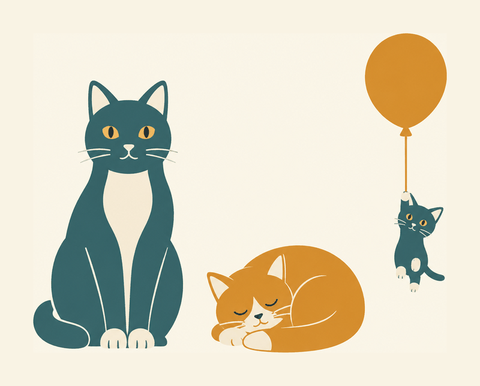
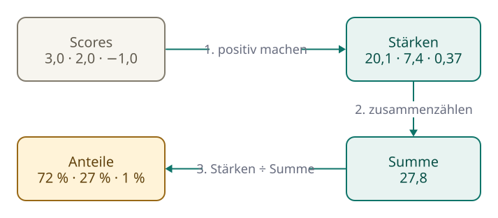
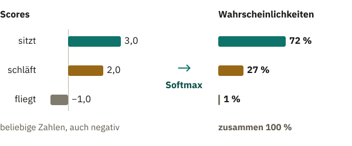
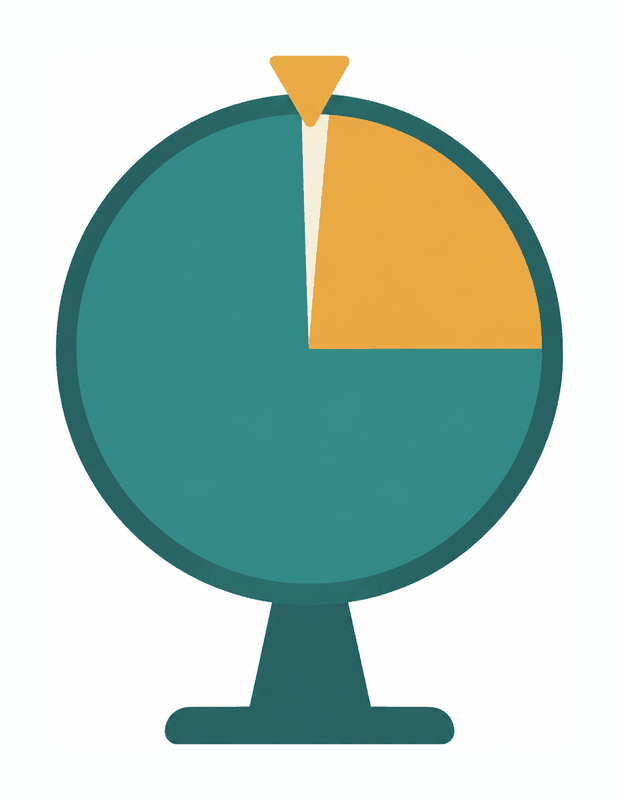
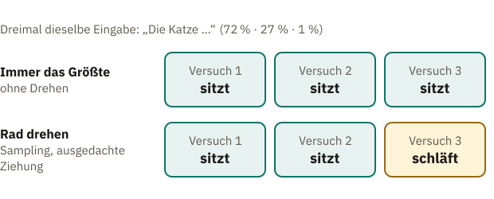
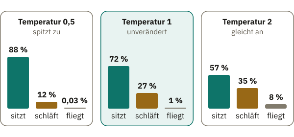

<!-- Generated from src/content/bausteine/de/wahrscheinlichkeit-und-softmax.mdx by scripts/export-lessons.mjs -- do not edit by hand. -->

# Wahrscheinlichkeit und Softmax: Wie ein Modell sich entscheidet

> Lesefassung für GitHub. Die vollständige Fassung mit interaktiven Demos, Animationen und Abrufmoment findest du auf der Website: **[Wahrscheinlichkeit und Softmax: Wie ein Modell sich entscheidet](https://ki-einfach-verstehen.de/de/bausteine/wahrscheinlichkeit-und-softmax/)**
>
> Lizenz: [CC BY 4.0](https://creativecommons.org/licenses/by/4.0/deed.de) · Nenne die Quelle so: KI einfach verstehen, „Wahrscheinlichkeit und Softmax: Wie ein Modell sich entscheidet“, CC BY 4.0, https://ki-einfach-verstehen.de/de/bausteine/wahrscheinlichkeit-und-softmax/

Wie ein Sprachmodell aus seinen Scores Prozente macht, warum es mal das Naheliegende und mal etwas anderes wählt und was die Temperatur damit zu tun hat.

Am Ende des vorigen Bausteins stand der Score-Vektor: für jedes Textstück eine Zahl wie 7,1 oder −2,3. Solche Scores sind noch keine Wahrscheinlichkeiten. Trotzdem muss ein Sprachmodell aus dieser langen Liste am Ende genau ein Textstück machen.

Ein kleines Beispiel zeigt, worum es geht. Du tippst „Die Katze“, und das Modell bewertet jedes Textstück danach, wie gut es als Nächstes passt. Angenommen, es kennt nur drei Fortsetzungen, mit ausgedachten Scores: „sitzt“ 3,0, „schläft“ 2,0 und „fliegt“ −1,0. Damit sind zwei Fragen offen. Welches Stück wird gewählt? Und warum antwortet ein Chatbot oft anders, wenn du die Antwort neu erzeugen lässt, obwohl sich an deiner Frage nichts geändert hat?

## Was eine Prozentzahl kann, was ein Score nicht kann

Die Wetter-App zeigt für morgen 80 Prozent Regenwahrscheinlichkeit. Damit kannst du sofort etwas anfangen. Gemeint ist laut Deutschem Wetterdienst: An 8 von 10 vergleichbaren Tagen fiel am Ort Niederschlag, also Regen, Schnee oder Ähnliches. Wie lange oder wie stark, sagt die Zahl nicht. Eine solche Zahl heißt **[Wahrscheinlichkeit](https://ki-einfach-verstehen.de/de/glossar/wahrscheinlichkeit/)**. Sie gibt an, wie oft etwas eintritt, wenn sich dieselbe Lage sehr oft wiederholt, und liegt immer zwischen 0 und 100 Prozent.

Beim Wetter gibt es hier zwei Möglichkeiten: Regen oder kein Regen. Stehen 80 Prozent für Regen, bleiben 20 Prozent für trocken, denn mehr als 100 Prozent gibt es nicht zu verteilen. Eine Liste mit einem Wert für jede Möglichkeit, bei der jeder Wert zwischen 0 und 100 Prozent liegt und alle zusammen genau 100 ergeben, heißt **Wahrscheinlichkeitsverteilung**, kurz Verteilung.

*Drei mögliche Fortsetzungen von „Die Katze …“: sitzt, schläft, fliegt. Nicht jede ist gleich naheliegend.*

Jetzt zurück zu den drei Kandidaten für „Die Katze …“. Ihre Scores sind 3,0, 2,0 und −1,0. Angenommen, du lässt die Antwort hundertmal neu erzeugen. Kannst du aus den Scores ablesen, wie oft dabei „sitzt“ drankommen sollte? Versuch es kurz, bevor du weiterliest. Spätestens bei „fliegt“ hakt es: Ein Score kann negativ sein, und „fliegt kommt minus einmal von hundert dran“ ergibt keinen Sinn. Die Scores haben auch keine feste Summe: 3,0 plus 2,0 plus −1,0 ergibt 4,0, und nach einem anderen Satzanfang käme etwas ganz anderes heraus. Ein Score sagt, welcher Kandidat besser dasteht als ein anderer und mit welchem Abstand. Wie oft er deshalb drankommen soll, lässt sich daran aber nicht direkt ablesen, dafür braucht es noch eine Umrechnung.

Wo dir eine KI Prozente zeigt, hat sie die Scores also schon umgerechnet. Eine Bilderkennung meldet nicht „Katze 6,2“, sondern etwa „Katze 93 %“ (eine ausgedachte Zahl). Auch die Wortvorschläge über deiner Handy-Tastatur stammen aus solchen Prozenten. So beschreibt Google es für seine Tastatur Gboard: Ein Sprachmodell berechnet, wie wahrscheinlich jedes nächste Wort ist, in der Mitte der Vorschlagsleiste steht das wahrscheinlichste, links und rechts die Plätze zwei und drei.

Wie aber kommt man von 3,0, 2,0 und −1,0 zu Prozenten?

## Aus Punkten werden Anteile: Softmax

Nach einem Quizabend hängt die Punktetafel an der Wand: Team A hat 30 Punkte, Team B 20, Team C 10. Die Anteile lassen sich leicht ausrechnen: Zusammen sind es 60 Punkte, Team A hat davon die Hälfte. Klappt derselbe Weg auch mit den Scores?

Zusammen ergeben die drei Scores 4,0. „sitzt“ bekäme 3,0 von 4,0, also 75 Prozent, „schläft“ 50 Prozent und „fliegt“ −25 Prozent. Die Summe stimmt zwar, aber ein negativer Anteil ist unbrauchbar. Für Scores braucht es einen anderen Weg.

Der Weg, den Sprachmodelle tatsächlich gehen, hat drei Schritte.

Schritt 1: Jeder Score wird zu einer positiven Zahl, seinem Gewicht. Dabei gilt eine feste Regel: Ein Score von 0 bekommt das Gewicht 1. Jeder Punkt darüber multipliziert es mit etwa 2,72, jeder Punkt darunter teilt es durch 2,72. Aus 3,0 wird so rund 20,1, aus 2,0 rund 7,4 und aus −1,0 rund 0,37.

Schritt 2: Die Gewichte werden zusammengezählt. 20,1 plus 7,4 plus 0,37 ergibt rund 27,8.

Schritt 3: Jedes Gewicht wird durch diese Summe geteilt, so wie die Punkte eines Teams durch die Gesamtpunktzahl. „sitzt“ bekommt 20,1 von 27,8, also rund 72 Prozent, „schläft“ rund 27 und „fliegt“ rund 1 Prozent. Zusammen sind es 100 Prozent.

[▶ Animation auf der Website ansehen](https://ki-einfach-verstehen.de/de/bausteine/wahrscheinlichkeit-und-softmax/)

*Softmax in drei Schritten: Scores in positive Gewichte verwandeln, die Gewichte zusammenzählen, jedes Gewicht durch die Summe teilen.*

Diese Rechnung heißt **[Softmax](https://ki-einfach-verstehen.de/de/glossar/softmax/)**. Sie macht aus jeder beliebigen Score-Liste eine Verteilung. Drei Folgen davon lohnen einen genaueren Blick.

Die erste: Die Reihenfolge bleibt erhalten. Wer den höchsten Score hat, bekommt auch den größten Anteil.

*Softmax macht aus Punkten Anteile: Die Reihenfolge bleibt, die Summe ist 100 %.*

Die zweite betrifft die Abstände. Was passiert, wenn du zu allen drei Scores 10 addierst, also 13,0, 12,0 und 9,0 nimmst? Werden die Prozente größer, kleiner oder bleiben sie gleich?

Sie bleiben genau gleich, 72, 27 und 1. Denn 10 Punkte mehr machen alle drei Gewichte rund 22.000-mal so groß, und ihre Summe auch. Teilt man dann jedes Gewicht durch die Summe, kommt derselbe Anteil heraus wie vorher, so wie 2 von 4 dieselbe Hälfte ist wie 20 von 40. Hier endet das Bild der Punktetafel: Bekäme dort jedes Team 10 Punkte dazu, würden sich die Anteile verschieben. **Bei Scores zählt nur, wie weit sie auseinanderliegen.**

Ein Punkt Vorsprung macht ein Gewicht etwa 2,7-mal so groß, drei Punkte etwa 20-mal: Das Gewicht von „schläft“ (7,4) ist rund 20-mal so groß wie das von „fliegt“ (0,37). Liegt ein Kandidat weit vor allen anderen, bekommt er deshalb fast alles.

Die dritte: Kein Kandidat fällt ganz auf null. „fliegt“ behält rund 1 Prozent, so unpassend es ist. Softmax wirft nichts weg, es verteilt nur.

Genau diese Rechnung läuft in einem Sprachmodell wie GPT-2 für jedes nächste Textstück, nur mit allen 50.257 Scores auf einmal. Auch die Prozente einer Bilderkennung entstehen meist durch Softmax.

Eine Ebene tiefer: Die Formel hinter Softmax

Das Gewicht eines Scores ist die Zahl e hoch dem Score. e ist eine feste Zahl aus der Mathematik, ungefähr 2,718. Die kleine Zahl oben zählt, wie oft mit e malgenommen wird: e³ = e · e · e ≈ 20,1 und e² = e · e ≈ 7,4. Eine negative Zahl oben heißt teilen: e⁻¹ = 1 : e ≈ 0,37. Und e⁰ ist 1, genau wie in der Regel aus Schritt 1. Als Formel für den Kandidaten Nummer i:

`Softmax(xᵢ) = eˣⁱ / Σⱼ eˣʲ`

Oben steht das Gewicht des Kandidaten, unten die Summe der Gewichte aller Kandidaten. Das Σ ist das Summenzeichen.

Der Name kommt vom Vergleich mit der Regel „nimm den Größten“, die dem Sieger 100 Prozent gibt und allen anderen null. Softmax ist eine weiche Version davon: Der Größte bekommt am meisten, die anderen behalten etwas. Je größer der Vorsprung, desto näher kommt Softmax der harten Regel. In der Fachsprache heißen die Scores vor Softmax **Logits**.

Damit hast du Softmax beisammen: Die Reihenfolge bleibt, nur die Abstände zählen, und keiner fällt auf null. Jetzt stehen Prozente da. Gewählt ist aber noch nichts.

## Den Favoriten nehmen oder das Rad drehen

Was fängt man mit 72, 27 und 1 Prozent an, wenn am Ende genau ein Textstück herauskommen muss? Ein Bild hilft: ein Glücksrad mit drei Feldern. Das Feld für „sitzt“ nimmt 72 Prozent des Rads ein, das für „schläft“ 27 Prozent, und „fliegt“ bekommt einen schmalen Streifen von 1 Prozent. Softmax hat dieses Rad aus den Scores gebaut. Die Verteilung ist das Rad.

*Das Glücksrad nach Softmax: Jedes Feld ist so groß wie seine Wahrscheinlichkeit.*

Die einfachste Möglichkeit kennst du schon aus dem Baustein über Input und Output: Man nimmt immer das Wahrscheinlichste, hier „sitzt“ (Fachleute nennen das **Greedy-Auswahl**, nach dem englischen Wort für gierig). Im Bild heißt das: Das Rad wird gar nicht gedreht, man zeigt einfach auf das größte Feld. Dabei fällt etwas auf. Softmax ändert die Reihenfolge nicht, das größte Feld gehört immer dem höchsten Score. Wer ohnehin immer das Wahrscheinlichste nimmt, bräuchte die Prozente also gar nicht. Wofür dann der ganze Aufwand?

Für die zweite Möglichkeit: Das Rad wird wirklich gedreht, und genommen wird das Stück, bei dem der Zeiger stehen bleibt. Das heißt **[Sampling](https://ki-einfach-verstehen.de/de/glossar/sampling/)**, vom englischen Wort für Stichprobe. Bei 100 Drehungen landet der Zeiger im Schnitt ungefähr 72-mal auf „sitzt“, 27-mal auf „schläft“ und einmal auf „fliegt“. Jedes Stück mit einem Anteil über null kann drankommen, aber nicht jedes gleich oft.

*Dreimal dieselbe Eingabe: Wer immer das Wahrscheinlichste nimmt, bekommt dreimal „sitzt“. Wer das Rad dreht, bekommt meistens „sitzt“ und manchmal etwas anderes (ausgedachte Ziehung).*

**Zufall heißt hier also nicht, dass das Modell irgendein Wort nimmt.** Das klingt zunächst so, weil Zufall im Alltag an einen Würfel erinnert, bei dem jede Seite gleich oft kommt. Beim Rad sind die Felder aber verschieden groß. Deshalb bleiben Antworten mit Sampling meist sinnvoll und unterscheiden sich trotzdem von Mal zu Mal. Viele Anwendungen sortieren zusätzlich die ganz unpassenden Stücke vorher aus (mehr dazu in der Box unten).

Warum dann nicht immer das Wahrscheinlichste nehmen? Bei kurzen Antworten wie einer Zahl funktioniert das gut. Bei längeren Texten zeigt sich ein Problem: Der Text wird fade und gerät leicht in Schleifen, in denen sich dieselben Wendungen wiederholen. Das verstärkt sich selbst: Steht eine Wendung schon zweimal im Text, wird ihre Wiederholung oft zur wahrscheinlichsten Fortsetzung. Wer immer das Wahrscheinlichste nimmt, kommt aus dieser Rille nicht mehr heraus. Das ist für Sprachmodelle gut untersucht. Sampling bringt Abwechslung hinein, weil gelegentlich auch das zweit- oder drittbeste Stück drankommt.

An einer Stelle braucht das Bild eine Korrektur. Es gibt nicht ein Rad für die ganze Antwort. Für jedes Textstück rechnet das Modell neue Scores, Softmax baut daraus ein neues Rad, und das wird genau einmal gedreht. Das gewählte Stück wird angehängt, und die Schleife aus dem Baustein über Input und Output beginnt von vorn. Lässt du einen Chatbot eine Antwort neu erzeugen, werden alle Räder noch einmal gedreht. Bleibt der Zeiger früh an einer anderen Stelle stehen, etwa bei „schläft“ statt „sitzt“, bauen alle folgenden Runden darauf auf, denn zurückgenommen wird nichts. So entsteht auf dieselbe Frage eine ganz andere Antwort.

Eine Ebene tiefer: Zehntausende haarfeine Felder

Ein echtes Rad hat bei GPT-2 nicht drei Felder, sondern 50.257, eins für jeden Eintrag im Vokabular, die allermeisten haarfein. Zusammen nehmen sie aber erstaunlich viel Platz ein. Ein ausgedachtes Beispiel: Zu den drei Kandidaten kommen 50.000 unpassende Textstücke mit einem Score von −10. Jedes davon bekommt nur 0,00015 Prozent, alle zusammen aber 7,5 Prozent. Bei reinem Sampling landet der Zeiger dann ungefähr bei jeder 13. Drehung auf einem unpassenden Stück. Beobachtet haben Forschende das bei GPT-2: Reines Sampling ergab zusammenhanglosen Text.

Viele Anwendungen schneiden diesen langen Schwanz deshalb vor dem Drehen ab. **Top-k** behält nur die k wahrscheinlichsten Stücke, zum Beispiel die besten 50. **Top-p** behält die kleinste Gruppe der wahrscheinlichsten Stücke, die zusammen mindestens einen bestimmten Anteil erreichen, zum Beispiel 90 Prozent. Die übrigen Felder verschwinden, und die verbliebenen werden wieder auf 100 Prozent hochgerechnet. Im Katzenbeispiel würde Top-p mit 90 Prozent „fliegt“ streichen, „sitzt“ hätte dann 73 Prozent und „schläft“ 27 Prozent. Anders als Softmax wirft dieser Schritt also *tatsächlich* Kandidaten weg.

Lässt sich einstellen, wie viel Zufall beim Drehen im Spiel ist?

## Mehr oder weniger Zufall: die Temperatur

Wer ein Sprachmodell nicht über die Chat-App nutzt, sondern es in eigene Programme einbaut (über die sogenannte Programmierschnittstelle des Anbieters), findet dort einen Einstellwert namens Temperatur. Dahinter steckt ein einfacher Handgriff zwischen den Scores des Modells und Softmax: Sie werden durch eine Zahl geteilt, die **[Temperatur](https://ki-einfach-verstehen.de/de/glossar/temperatur/)**. Bei Temperatur 1 bleibt alles, wie es war: 72, 27 und 1 Prozent.

Bei Temperatur 0,5 wird durch 0,5 geteilt: In Softmax gehen jetzt 6, 4 und −2 statt 3, 2 und −1. Die Abstände sind jetzt doppelt so groß, und Softmax macht aus jedem Punkt Vorsprung wieder den Faktor 2,7. Ergebnis: „sitzt“ 88 Prozent, „schläft“ 12 Prozent, „fliegt“ nur noch 0,03 Prozent. Das Rad spitzt sich zu, das große Feld wird noch größer.

Und bei Temperatur 2? Überleg, was mit „fliegt“ passiert, bevor du weiterliest. Geteilt durch 2 gehen 1,5, 1 und −0,5 in Softmax. Die Abstände schrumpfen auf die Hälfte, und die Felder gleichen sich an: 57, 35 und 8 Prozent. „fliegt“ kommt jetzt ungefähr bei jeder 13. Drehung dran statt bei jeder hundertsten.

*Dieselben Scores, drei Temperaturen: Eine niedrige Temperatur spitzt die Verteilung zu, eine hohe gleicht sie an.*

Je näher die Temperatur an 0 rückt, desto größer werden die Abstände. Bei 0,2 hat „sitzt“ schon über 99 Prozent. Am Ende bleibt nur das größte Feld übrig, und das Drehen wird zum Nehmen des Wahrscheinlichsten. Durch 0 selbst lässt sich nicht teilen. Temperatur 0 ist deshalb eine Abmachung: Anbieter nehmen dann einfach das Wahrscheinlichste. Ganz gleiche Antworten garantiert aber auch das nicht, denn die Rechnung im Rechenzentrum kann winzig schwanken, wie im Baustein über Input und Output beschrieben.

*Die Temperatur regelt, wie stark die Abstände zwischen den Scores zählen.*

**Die Temperatur verändert weder das Modell noch die Scores, die es berechnet.** Geteilt werden sie erst danach. Die Temperatur ist kein Parameter, wird nicht trainiert und kann bei jeder Anfrage anders gesetzt werden. Sie bestimmt nur, wie stark die Abstände zwischen den Scores dabei zählen. Eine hohe Temperatur macht ein Modell deshalb auch nicht klüger. Sie gibt unwahrscheinlicheren Stücken öfter eine Chance, guten Überraschungen ebenso wie Unsinn.

> **Interaktive Demo:** [auf der Website ausprobieren](https://ki-einfach-verstehen.de/de/bausteine/wahrscheinlichkeit-und-softmax/)

Wo sich die Temperatur einstellen lässt, liegt sie meist zwischen 0 und 1 oder zwischen 0 und 2. Anbieter empfehlen niedrige Werte für Aufgaben mit einer richtigen Antwort und höhere für kreative, wo es nicht die eine richtige Antwort gibt. Kreativer wird das Modell dadurch nicht, es zieht nur öfter weniger naheliegende Stücke. Bei manchen neuen Modellen lässt sie sich aber gar nicht mehr ändern, oder der Anbieter rät davon ab und legt den Wert selbst fest. In Chat-Apps gibt es ohnehin meist keinen Regler.

## Was 72 Prozent nicht bedeuten

Bleibt die Frage, was die Prozente überhaupt aussagen. Gibt ein Modell „sitzt“ 72 Prozent, liegt der Gedanke nahe, es sei sich zu 72 Prozent sicher, dass „sitzt“ stimmt. **Gemeint ist aber nur der Anteil am Rad für das nächste Textstück.** Er spiegelt ungefähr, was beim Training in ähnlichen Texten als Nächstes folgte, nicht, was wahr ist. Bei Chatbots kommt noch ein zweites Training dazu, ein Nachtraining, das das Modell auf hilfreiche Antworten im Gespräch trimmt. Auch das verschiebt die Felder, macht aus ihnen aber ebenfalls kein Maß dafür, was wahr ist.

*Beim Wetter wird an echtem Regen nachgeprüft, ob die Prozente stimmen.*

Hier endet auch das Wetterbild. Der Wetterdienst wird an echtem Regen gemessen, über viele ähnliche Tage. Ob die Prozente eines Modells zur Trefferquote passen, muss eigens geprüft werden. Das geht bei Aufgaben mit fester Lösung, etwa einer Quizfrage mit den Antworten A, B, C und D. Dort ist die Antwort ein einziges Textstück, und jeder Buchstabe hat sein Feld auf dem Rad.

Sammelt man alle Fragen, bei denen das Feld der gewählten Antwort rund 72 Prozent groß ist, kann man nachzählen: Taugten die Prozente auch als Trefferquote, müssten davon etwa 72 von 100 stimmen. Oft passt das nicht. Bei GPT-4 passte es vor diesem Nachtraining gut, danach schlechter. Und weil die Prozente nur sagen, was als Nächstes gut klingt, kann ein Chatbot eine falsche Antwort genauso flüssig und bestimmt formulieren wie eine richtige.

Damit ist die Frage vom Anfang beantwortet. Softmax macht aus den Scores eine Verteilung, ein Rad mit einem Feld pro Textstück. Dann wird entweder das größte Feld genommen oder das Rad gedreht, und die Temperatur legt vorher fest, wie verschieden groß die Felder sind. Weil gedreht wird, kann dieselbe Frage verschiedene Antworten bekommen. Offen bleibt, was hinter den Scores steckt. Sie werden aus den Parametern des Modells berechnet, und die Temperatur war ein erstes Beispiel für eine Einstellung, die nicht trainiert wird. Wie viele Parameter ein Modell hat, wie das Training sie einstellt und was beim Benutzen eines fertigen Modells passiert, zeigt der nächste Baustein.

---

Quelle: https://ki-einfach-verstehen.de/de/bausteine/wahrscheinlichkeit-und-softmax/

← Zurück: [Skalar, Vektor, Matrix, Tensor: die Bausteine der Zahlen](./skalar-vektor-matrix-tensor.md) · [Alle Bausteine](../../README.de.md#inhalt) · Weiter: [Parameter, Training und Inferenz, Hardware: Wie ein Modell läuft](./parameter-training-inferenz-hardware.md) →
