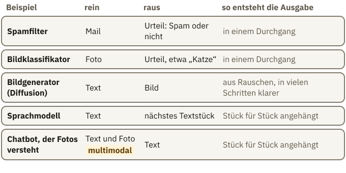

<!-- Generated from src/content/bausteine/de/was-ein-ki-modell-eigentlich-ist.mdx by scripts/export-lessons.mjs -- do not edit by hand. -->

# Was ein KI-Modell eigentlich ist

> Lesefassung für GitHub. Die vollständige Fassung mit interaktiven Demos, Animationen und Abrufmoment findest du auf der Website: **[Was ein KI-Modell eigentlich ist](https://ki-einfach-verstehen.de/de/bausteine/was-ein-ki-modell-eigentlich-ist/)**
>
> Lizenz: [CC BY 4.0](https://creativecommons.org/licenses/by/4.0/deed.de) · Nenne die Quelle so: KI einfach verstehen, „Was ein KI-Modell eigentlich ist“, CC BY 4.0, https://ki-einfach-verstehen.de/de/bausteine/was-ein-ki-modell-eigentlich-ist/

Warum ein KI-Modell keine Datenbank voller Fakten ist, wie Wissen in seinen Zahlen verteilt steckt und warum daraus kluge Antworten und erfundene Fakten entstehen.

Am Ende der Grundlagen blieb eine Frage offen: In den Milliarden Zahlen eines Modells steht kein ausgeschriebener Fakt. Woher weiß ein Chatbot dann, dass Paris die Hauptstadt von Frankreich ist?

Für diesen Baustein bekam Qwen3-0.6B-Base, ein kleines, frei verfügbares **[Sprachmodell](https://ki-einfach-verstehen.de/de/glossar/sprachmodell/)**, das Text nur fortsetzt, in einem einzelnen Versuch den Satzanfang „Die Hauptstadt von Frankreich ist“. Als nächstes **[Token](https://ki-einfach-verstehen.de/de/glossar/token/)** lag „Paris“ vorn, mit 47,5 Prozent. Dann kam derselbe Fakt andersherum: „Paris ist die Hauptstadt von“. Jetzt lag „Deutschland“ vorn, mit 28,9 Prozent. Die Prozente geben an, welches Textstück als Nächstes passt, nicht, ob eine Aussage wahr ist.

In einer Tabelle steht „Frankreich | Paris“ in einer Zeile. Du kannst sie von links lesen, um die Hauptstadt zu finden, oder von rechts, um das Land zu finden. Das Modell kam nur in einer Richtung auf den Fakt. Was geschieht also im Modell, wenn es antwortet? Daran hängt auch, wie kluge Antworten und erfundene Fakten entstehen.

## Wo steht, dass Paris die Hauptstadt ist?

Eine richtige Antwort wirkt wie Nachschlagen: Irgendwo im Modell gäbe es eine Zeile mit diesem Fakt, und das Modell fände sie. So arbeitet eine Datenbank.

Ein Blick in eine echte **[Modelldatei](./parameter-training-inferenz-hardware.md)** spricht dagegen. Du kennst sie aus den Grundlagen: ein kleiner Bauplan, die **[Architektur](https://ki-einfach-verstehen.de/de/glossar/architektur/)**, und sehr viele Zahlen, die **[Parameter](https://ki-einfach-verstehen.de/de/glossar/parameter/)**. Beim frei verfügbaren Qwen3-8B liegen sie in 399 benannten Zahlenblöcken. Die Namen beschreiben Rechenschritte wie „self_attn“ oder „mlp“, keiner heißt „Länder“ oder „Hauptstädte“. Geordnet sind die Zahlen nach ihrer Rolle in der Rechnung, nicht nach Themen.

Aus den Grundlagen kennst du das Mischpult: Jeder Regler steht für einen Parameter, seine Stellung für dessen Zahlenwert. Das Training hat die Regler eingestellt, beim Antworten bleiben sie fest. Gespeichert sind also Einstellungen, keine Sätze. Neu ist hier der Weg durchs Pult: Links kommt ein Signal herein, rechts geht es hinaus, und die Anzeigen zeigen, was gerade hindurchläuft.

*Die Regler bleiben stehen. Die Anzeigen wechseln mit dem Signal, das gerade hindurchläuft.*

Im Modell ist dieses Signal dein Text, in Zahlen übersetzt. Die erste Rechenstufe verrechnet diese Zahlen mit ihren festen Parametern und gibt neue Zahlen an die nächste Stufe weiter, und so fort durch alle Stufen bis zum Ausgang. Diese weitergereichten Zahlen heißen **Zwischenwerte**. Sie entsprechen den Anzeigen, denn sie entstehen für jeden Text neu. Aus den letzten Zwischenwerten wird die **[Score](https://ki-einfach-verstehen.de/de/glossar/score/)**-Liste aus den Grundlagen, ein Score für jedes Textstück, das das Modell kennt. Eine Zeile mit dem Fakt wird dabei nirgends gesucht.

Weiter trägt das Bild nicht. Am echten Pult gehört jede Anzeige zu einem Kanal. Ein Zwischenwert gehört dagegen weder zu einem einzelnen Parameter noch zu einem Thema. Und wie die Stufen im Einzelnen rechnen, zeigt das Pult nicht.

*Eine Datenbank sucht die passende Zeile. Im Modell entstehen aus deiner Eingabe und den festen Parametern Zwischenwerte, aus denen am Ende die Score-Liste wird.*

Damit lässt sich der Versuch vom Anfang genauer beschreiben. Bei der umgedrehten Frage rechneten dieselben Parameter, nur die Eingabe war eine andere. Also entstanden andere Zwischenwerte und eine andere Score-Liste, diesmal mit „Deutschland“ vorn. Warum das Training den Fakt in der einen Richtung viel wirksamer gemacht hat als in der anderen, zeigt der erste von drei Fällen weiter unten. Zuerst aber die Frage: Wie können feste Zahlen Wissen über Paris enthalten?

*Derselbe Fakt, zweimal gefragt, je ein Lauf von Qwen3-0.6B-Base: Die Parameter sind dieselben, die Zwischenwerte und die Score-Liste nicht. Die Balken der Zwischenwerte sind schematisch.*

## Kein Parameter heißt „Paris“

Im Training hat das Modell Schritt für Schritt geübt, das nächste Textstück vorherzusagen, und dabei wurden seine Parameter immer wieder ein wenig verstellt. Was es so über Paris gelernt hat, steckt in diesen Einstellungen, aber nicht in einem einzelnen Parameter und nicht als ausgeschriebener Satz. Wirksam wird es erst beim Rechnen: Läuft eine Frage nach der Hauptstadt Frankreichs durch, wirken viele Parameter zusammen, und am Ende liegt „Paris“ vorn.

Wo genau der Paris-Fakt sitzt, kann bis heute niemand vollständig zeigen. Forschende können aber zuschauen, was beim Rechnen entsteht, also die Zwischenwerte untersuchen. Vorweg: Was sie dort finden, sind Muster für Begriffe wie „Stadt“ oder „Brücke“, keine ausgeschriebenen Fakten.

Ein Team bei Anthropic untersuchte das an einem kleinen Sprachmodell. Ein einzelner Zwischenwert schlug dort bei wissenschaftlichen Zitaten aus, bei englischen Dialogen, bei Anfragen, mit denen ein Browser Webseiten abruft, und bei koreanischem Text. Ein einzelner Zwischenwert ist also kein Fach für einen Begriff. Am großen Modell Claude 3 Sonnet zog das Team dann Millionen wiederkehrender Muster aus den Zwischenwerten heraus, sogenannte **Merkmale**: für berühmte Personen, für Länder, für Städte. Ein Merkmal ist eine bestimmte Kombination von Werten über viele Zwischenwerte zugleich.

*Ein einzelner Zwischenwert reagiert auf ganz verschiedene Dinge. Ein Merkmal zeigt sich als bestimmte Kombination von Werten über viele Zwischenwerte.*

Dass solche Muster beeinflussen, was das Modell schreibt, zeigte ein Versuch mit der Golden Gate Bridge. Das Team verstärkte während der Rechnung das Muster für die Brücke auf das Zehnfache seines Höchstwerts, an den Parametern änderte es nichts. Daraufhin begann das Modell, sich selbst für die Golden Gate Bridge zu halten. Wie ein Fakt gespeichert ist, zeigt dieser Eingriff nicht.

Halte deshalb zwei Ebenen auseinander: Die Parameter bestimmen, wie gerechnet wird. Die Merkmale sind Muster in dem, was dabei entsteht. Ein Merkmal für Paris ist noch nicht der Fakt, dass Paris die Hauptstadt von Frankreich ist. Wie aus solchen Mustern Stufe für Stufe eine Antwort wird, haben Forschende bisher nur für einzelne Fälle nachverfolgt. Einen davon zeigt der Abschnitt „Antworten, die so nirgends standen“.

Eine Ebene tiefer: Wie sich Merkmale die Zwischenwerte teilen

Hätte jedes Merkmal einen eigenen Zwischenwert, wäre ein Modell leicht zu lesen. Stattdessen nutzen verschiedene Merkmale dieselben Zwischenwerte, jedes mit seinem eigenen Muster. Bei 82 Prozent der untersuchten Merkmale in Claude 3 Sonnet hing kein einzelner Zwischenwert stark mit dem Merkmal zusammen. Sind mehrere Merkmale zugleich aktiv, überlagern sich ihre Beiträge. Das Fachwort dafür ist **Superposition**, Überlagerung.

So passen mehr Merkmale hinein, als es Zwischenwerte gibt. In einem kleinen Sprachmodell mit nur einer Rechenstufe ließen sich aus 512 Zwischenwerten Zehntausende Merkmale herauslösen. Das klappt, weil meist nur wenige Merkmale gleichzeitig aktiv sind. Der Preis: Die Beiträge stören sich gegenseitig, und weitere Rechenschritte müssen die Störungen herausfiltern. Deshalb ist ein einzelner Zwischenwert so schwer zu deuten. Forschende ziehen daher die Merkmale mit einem eigenen Verfahren aus vielen Zwischenwerten zugleich heraus.

## Drei Fragen, bei denen eine Tabelle anders reagiert

Gemeint ist hier das Sprachmodell selbst, ohne angeschlossene Suche. Es hat im Training gelernt, Text fortzusetzen, und beim Antworten rechnet es aus deiner Eingabe eine Fortsetzung. Daraus folgen drei Unterschiede zur Tabelle.

Der erste Fall ist die umgedrehte Frage vom Anfang. Warum das kleine Modell gerade „Deutschland“ wählt, lässt sich nicht sicher sagen. Ein Sprachmodell lernt, Text in Leserichtung fortzusetzen. Bei Fakten, die fast immer in derselben **Richtung** aufgeschrieben werden, zeigt sich deshalb ein deutlicher Richtungseffekt. Über Tom Cruise steht vermutlich oft, wer seine Mutter ist, über seine Mutter kaum, wessen Mutter sie ist. Bei solchen Paaren vieler Prominenter beantwortete GPT-4 im Jahr 2023 Fragen nach einem Elternteil, etwa der Mutter von Tom Cruise, zu 79 Prozent richtig. Die umgekehrten Fragen nach dem Kind nur zu 33 Prozent. Diese Prozente zählen richtige Antworten, keine Scores. Steht der Fakt dagegen schon in deiner Frage, gelingt die Umkehrung meist: Dann muss das Modell ihn nicht aus seinen Parametern holen.

Der zweite Fall: Nicht jeder Fakt sitzt gleich fest. Wie gut ein Modell eine Faktenfrage beantwortet, hängt davon ab, wie viele passende Texte es im Training gesehen hat. Bei einer Tabelle ist jede Zeile gleich gut auffindbar. Dazu kommt die Größe: Größere Modelle halten mehr fest. Im Versuch für diesen Baustein bekamen zwei Qwen3-Modelle den Satzanfang „Der Physiker Albert Einstein wurde geboren am“. Das kleine Modell mit 0,6 Milliarden Parametern schrieb „14. August 1879 in Zürich“. Das größere mit 4 Milliarden schrieb „14. März 1879 in Ulm“, und das stimmt. Selbst dieser oft erwähnte Fakt saß beim kleinen Modell nicht sicher.

Der dritte Fall ist eine Frage nach etwas, das es nicht gibt. Der Physiker Bernhard Quelling wurde für diesen Baustein erfunden. Eine Datenbank meldet: kein Treffer, denn sie hat keine Zeile dazu. Was, glaubst du, schreibt ein Sprachmodell? Beide Qwen-Modelle nannten ohne Zögern ein Geburtsdatum. Das kleine schrieb „13. August 1920 in der Stadt Berlin“. Die Rechnung liefert kein „kein Treffer“, sondern eine Score-Liste, und irgendein Textstück liegt darin vorn. Auch „Das weiß ich nicht“ wäre nur eine mögliche Fortsetzung. Nach diesem Satzanfang passt ein Datum aber besser, und ein nur vortrainiertes Modell hat kaum gelernt, an solchen Stellen abzubrechen.

Was zeigen die drei Fälle zusammen? Die Richtung zählt, die Häufigkeit zählt, und Leerstellen werden oft plausibel gefüllt. Nachtrainierte Chatbots sagen öfter „Das weiß ich nicht“, aber auch das ist gelerntes Verhalten, kein Suchergebnis. Die Prozente stammen aus einzelnen Läufen kleiner Modelle und zeigen das Prinzip, keine Trefferquote.

## Antworten, die so nirgends standen

Dass Wissen in Mustern steckt, ist zugleich die größte Stärke eines Modells. Muster lassen sich kombinieren. Ein Beispiel aus der Forschung bei Anthropic: Ein Modell bekam die Frage nach der Hauptstadt des US-Bundesstaats, in dem die Stadt Dallas liegt. Im Modell beobachteten die Forschenden zwei Schritte. Zuerst sprang ein Muster für „Dallas liegt in Texas“ an, danach eines für „die Hauptstadt von Texas ist Austin“. Die Antwort lautete Austin.

[▶ Animation auf der Website ansehen](https://ki-einfach-verstehen.de/de/bausteine/was-ein-ki-modell-eigentlich-ist/)

*Zwei gelernte Fakten werden verknüpft: Dallas liegt in Texas, die Hauptstadt von Texas ist Austin.*

Kombiniert das Modell hier wirklich, oder ruft es eine auswendig gelernte Antwort ab? Die Forschenden griffen ein. Sie ersetzten während der Rechnung das Muster für Texas durch eines für Kalifornien. Daraufhin antwortete das Modell „Sacramento“, die Hauptstadt Kaliforniens. Der zweite Schritt hing also wirklich vom ersten ab.

Auch über Sprachen hinweg funktioniert das. Wenn die Forschenden auf Englisch, Französisch oder Chinesisch nach dem Gegenteil von „klein“ fragten, wurden dieselben Muster für „klein“ und „Gegenteil“ aktiv. Erst am Ende kam die Antwort in der Sprache der Frage heraus. Das spricht dafür, dass dir ein Chatbot auf Deutsch etwas erklären kann, das er fast nur aus englischen Texten kennt.

Heißt das, ein Modell gibt nie etwas wörtlich wieder? Auch das wäre falsch. Aus GPT-2 ließen sich Hunderte Textstücke wörtlich herausholen, darunter Namen, Telefonnummern und E-Mail-Adressen, manche aus einem einzigen Trainingsdokument. Nachgeschlagen wird auch dann nichts: Nach diesem Textanfang liegt Stück für Stück genau diese Fortsetzung vorn. Auch auswendig Gelerntes steckt in den Parametern, nicht in einer abrufbaren Zeile.

## Warum das Modell lieber rät als schweigt

Im Jahr 2023 reichten zwei Anwälte in New York bei einem Bundesgericht einen Schriftsatz mit sechs Gerichtsentscheidungen ein. Keine davon existierte. ChatGPT hatte sie erzeugt, samt Aktenzeichen und Zitaten, die echten Urteilen oberflächlich glichen. Wie ein Urteil aufgebaut ist und wie ein Aktenzeichen aussieht, hatte das Modell als Muster gelernt. Die Form entstand auch ohne die passenden Fakten.

Solche flüssigen, plausibel klingenden Aussagen, die nicht stimmen, heißen **[Halluzinationen](https://ki-einfach-verstehen.de/de/glossar/halluzination/)**. Sie sind kein seltener Programmierfehler, sondern folgen aus dem, was du jetzt über Modelle weißt. Drei Ursachen greifen ineinander.

*Sechs Urteile, die echt aussahen und nie gefällt wurden.*

Die erste steckt im Training. Ein Sprachmodell soll an jeder Stelle eines Textes ein nächstes Stück liefern, auch dort, wo seine Trainingsdaten kaum etwas hergeben. Eine Fortsetzung entsteht deshalb immer. Die zweite steckt in der Bewertung. Modelle werden oft wie in einer Prüfung getestet: Eine richtige Antwort bringt einen Punkt, eine falsche null und „weiß ich nicht“ ebenfalls null. Wer dort unsicher ist, rät besser, denn Schweigen bringt nie mehr. Chatbots werden nach dem Vortraining gezielt auf gute Testergebnisse weitertrainiert und lernen so, dass ein Tipp mehr bringt. Das Bild hat eine Grenze: Ein Modell entscheidet sich nicht bewusst zum Raten. Es wurde so eingestellt, dass Raten sich auszahlt.

Die dritte Ursache steckt ebenfalls im Nachtraining. Das gelernte „Das weiß ich nicht“ lässt sich im Inneren des Chatbots Claude beobachten: Bei Fragen nach Personen antwortet Claude mit „Das kann ich nicht beantworten“, solange nichts anderes anspringt. Ein Muster für „bekannte Person“ schaltet diese Antwort ab, wenn das Modell eine Person kennt. Manchmal wirkt ein Name aber nur vertraut, ohne dass das Modell etwas über die Person gelernt hat. Auch dann springt dieses Muster an. Dann ist die Antwort freigegeben, und das Modell schreibt weiter, was plausibel klingt.

Besonders anfällig sind Einzelfakten, die sich aus keiner Regel ableiten lassen, etwa Geburtstage. Wenn ein Fakt im Training nur einmal vorkam, hält das Modell ihn meist nicht zuverlässig fest, auch wenn einzelne solche Stellen hängen bleiben wie die Telefonnummern aus GPT-2. Das gilt selbst dann, wenn alle Trainingsdaten fehlerfrei waren. Prüfe deshalb Fakten, die selten in Texten vorkommen, anhand einer Quelle: Urteile, Zitate, Zahlen, Lebensdaten.

Eine Ebene tiefer: Warum sich Raten rechnerisch lohnt

Eine Forschungsgruppe von OpenAI und dem Georgia Institute of Technology hat 2025 durchgerechnet, warum Halluzinationen so hartnäckig sind. Angenommen, ein Modell soll den Geburtstag einer Person nennen, über die es nichts weiß. Rät es ein Datum, liegt es mit einer Wahrscheinlichkeit von 1 zu 365 richtig; der erwartete Punktestand ist rund 0,003. „Weiß ich nicht“ bringt sicher 0 Punkte. Raten gewinnt knapp, und über Tausende Testfragen summiert sich der Vorsprung.

Der Artikel leitet außerdem unter vereinfachten Annahmen eine Untergrenze für Fehler aus dem Vortraining her, selbst bei fehlerfreien Daten: Sie wächst mit dem Anteil der Fakten, die im Training nur ein einziges Mal vorkommen.

Als Ausweg schlagen die Autoren vor, Tests anders zu bewerten: Eine falsche Antwort soll mehr kosten als ein ehrliches „weiß ich nicht“. Dann lohnt sich Raten nicht mehr.

## Nicht jedes KI-Modell ist ein Sprachmodell

Bis hierher ging es um Sprachmodelle. Aber „KI-Modell“ ist ein Oberbegriff. Den **[Spamfilter](https://ki-einfach-verstehen.de/de/glossar/spamfilter/)** und den **[Bildklassifikator](https://ki-einfach-verstehen.de/de/glossar/bildklassifikator/)** kennst du aus den Grundlagen: Eine Mail oder ein Foto geht hinein, ein Urteil kommt heraus, etwa „Spam“ oder „Katze“.

Bildgeneratoren wie Stable Diffusion arbeiten anders. Sie sind **[Diffusionsmodelle](https://ki-einfach-verstehen.de/de/glossar/diffusionsmodell/)**: Sie beginnen mit reinem Bildrauschen und entfernen es in vielen kleinen Schritten, gesteuert durch deinen Text, bis ein Bild entsteht. Und dann gibt es **[multimodale Modelle](https://ki-einfach-verstehen.de/de/glossar/multimodales-modell/)**, die mehrere Arten von Input verarbeiten. Die Gemma-4-Modelle von Google etwa nehmen Text und Bilder entgegen und antworten mit Text.

*Vier Arten von KI-Modellen, unterschieden nach Input und Output. Gemeinsam ist ihnen der Aufbau aus Bauplan und trainierten Parametern.*

Alle bestehen aus einem Bauplan und trainierten Parametern, in denen das Gelernte verteilt steckt. Was hineingeht, was herauskommt und wie gerechnet wird, unterscheidet sich.

Dieser Themenbereich folgt dem Weg durch ein Sprachmodell, denn die meisten großen Sprachmodelle von heute sind nach demselben Grundmuster gebaut: Sie sagen das nächste Token voraus und sehen dabei nur den Text davor. Auch Chatbots, die Fotos verstehen, arbeiten im Kern so. Der Weg hat vier Stationen: Aus deinem Text werden Tokens, und jedes Token bekommt einen Steckbrief aus Zahlen. Danach wird in vielen Stufen der Zusammenhang des Satzes eingemischt. Am Ende entsteht die Score-Liste.

Damit ist die Frage vom Anfang beantwortet. Ein Chatbot weiß, dass Paris die Hauptstadt von Frankreich ist, weil das Training seine Parameter so eingestellt hat, dass beim Durchrechnen dieser Frage „Paris“ vorn liegt. Kein einzelner Parameter enthält den Fakt. Er schlägt nichts nach, sondern rechnet mit gelernten Mustern eine Fortsetzung aus. Deshalb kann er Fakten neu kombinieren, und deshalb füllt er Lücken flüssig mit Erfundenem.

Zuerst muss aus deiner Chatnachricht etwas werden, womit das Modell rechnen kann: eine einzige lange Folge von Tokens, in der auch steht, wer was gesagt hat. Wie diese Folge entsteht und wie lang sie sein darf, zeigt der nächste Baustein.

---

Quelle: https://ki-einfach-verstehen.de/de/bausteine/was-ein-ki-modell-eigentlich-ist/

← Zurück: [Parameter, Training und Inferenz, Hardware: Wie ein Modell läuft](./parameter-training-inferenz-hardware.md) · [Alle Bausteine](../../README.de.md#inhalt) · Weiter: [Tokenisierung im Modell: Wie dein Chat zu einer Tokenfolge wird](./tokenisierung-im-modell.md) →
