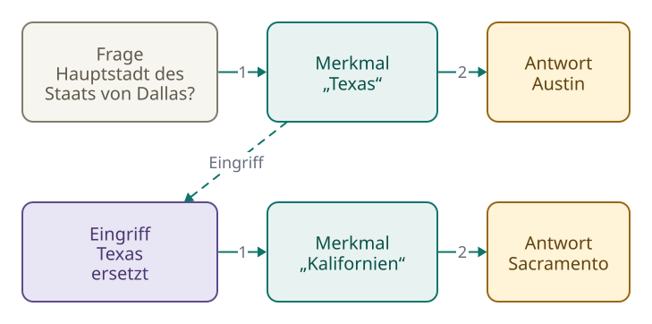

<!-- Generated from src/content/bausteine/de/was-ein-ki-modell-eigentlich-ist.mdx by scripts/export-lessons.mjs -- do not edit by hand. -->

# Was ein KI-Modell eigentlich ist

> Lesefassung für GitHub. Die vollständige Fassung mit interaktiven Demos, Animationen und Abrufmoment findest du auf der Website: **[Was ein KI-Modell eigentlich ist](https://ki-einfach-verstehen.de/de/bausteine/was-ein-ki-modell-eigentlich-ist/)**
>
> Lizenz: [CC BY 4.0](https://creativecommons.org/licenses/by/4.0/deed.de) · Nenne die Quelle so: KI einfach verstehen, „Was ein KI-Modell eigentlich ist“, CC BY 4.0, https://ki-einfach-verstehen.de/de/bausteine/was-ein-ki-modell-eigentlich-ist/

Was ist ein KI-Modell? Keine Datenbank voller Fakten, sondern Milliarden Zahlen, in denen Wissen verteilt steckt. Daraus entstehen Antworten und Erfindungen.

Am Ende der Grundlagen blieb eine Frage offen: In den Milliarden Zahlen eines Modells steht kein ausgeschriebener Fakt. Woher weiß ein Chatbot dann, dass Paris die Hauptstadt von Frankreich ist?

In einem Versuch bekam ein kleines, frei verfügbares [Sprachmodell](https://ki-einfach-verstehen.de/de/glossar/sprachmodell/) den Satzanfang „Die Hauptstadt von Frankreich ist“. Es heißt Qwen3-0.6B-Base: „0.6B“ steht für 0,6 Milliarden [Parameter](https://ki-einfach-verstehen.de/de/glossar/parameter/) (gespeicherte Zahlen, die das Training eingestellt hat), „Base“ für die Grundfassung, die noch nicht zum Chatbot nachtrainiert wurde. Bei genau diesem Wortlaut lag „Paris“ als nächstes [Token](https://ki-einfach-verstehen.de/de/glossar/token/) (ein Textstück aus der festen Stückliste des Modells) vorn, mit knapp 50 Prozent. Die Prozente sagen, wie gut ein Textstück passt, nicht, ob es stimmt.

Derselbe Mechanismus, der hier „Paris“ liefert, erfindet in anderen Fällen ein Gerichtsurteil, das es nie gab.

## Wo steht, dass Paris die Hauptstadt ist?

Eine richtige Antwort wirkt wie Nachschlagen: Irgendwo im Modell gäbe es eine Zeile mit diesem Fakt.

Eine echte [Modelldatei](./parameter-training-inferenz-hardware.md) sieht anders aus. Du kennst sie aus den Grundlagen: ein kleiner Bauplan, die [Architektur](https://ki-einfach-verstehen.de/de/glossar/architektur/), und sehr viele Zahlen, die [Parameter](https://ki-einfach-verstehen.de/de/glossar/parameter/). Bei einem größeren Qwen-Modell liegen sie in einigen Hundert Zahlentabellen wie im Baustein über Vektor und Matrix. Jede trägt in der Datei den Namen eines Rechenschritts, den spätere Bausteine erklären. Keiner heißt „Länder“ oder „Hauptstädte“.

Aus den Grundlagen kennst du das Mischpult: Jeder Regler steht für einen Parameter, seine Stellung für dessen Zahlenwert. Das Training hat die Regler eingestellt, beim Antworten bleiben sie fest. Gespeichert sind also Einstellungen, keine ausgeschriebenen Sätze. Am Mischpult kommt links ein Signal herein und geht rechts hinaus. Die Anzeigen zeigen, was gerade hindurchläuft.

*Die Regler bleiben stehen. Die Anzeigen wechseln mit dem Signal, das gerade hindurchläuft.*

Im Modell ist dieses Signal dein Text, in Zahlen übersetzt. Der Spamfilter aus den Grundlagen zählte für „Gratis: Dein Gewinn wartet“ die Gewichte 2 und 3 zusammen und kam auf 5. Diese 5 war nirgends gespeichert, sie entstand für genau diese Mail. Ein Sprachmodell nimmt auf jeder Rechenstufe vor allem ankommende Zahlen mal feste Parameter, zählt viele solcher Produkte zusammen und reicht die Summen weiter. Dazu kommen weitere Schritte, etwa der Knick aus dem Baustein über [neuronale Netze](./neuronale-netze.md). Beim Spamfilter zählte ein Gewicht mit, wenn sein Wort in der Mail stand; das ist dasselbe, wie es mit 1 oder 0 malzunehmen. Die weitergereichten Zahlen sind die **[Zwischenwerte](https://ki-einfach-verstehen.de/de/glossar/zwischenwert/)** (die Zahlen zwischen Eingabe und Ausgabe) aus demselben Baustein. Sie entsprechen den Anzeigen, denn sie entstehen für jeden Text neu.

Aus den letzten Zwischenwerten wird die [Score](https://ki-einfach-verstehen.de/de/glossar/score/)-Liste aus den Grundlagen, ein Score für jedes Textstück, das das Modell kennt. [Softmax](https://ki-einfach-verstehen.de/de/glossar/softmax/) (eine Rechnung, die Scores in Prozente umwandelt) macht daraus Anteile, die Prozente vom Anfang.

Weiter trägt das Bild nicht: Am echten Pult zeigt jede Anzeige den Pegel eines bestimmten Kanals, etwa des Gesangs. Ein Zwischenwert steht meist für keinen bestimmten Inhalt und hängt auch nicht an einem einzelnen Regler.

*Eine Datenbank sucht die passende Zeile. Im Modell entstehen aus deiner Eingabe und den festen Parametern Zwischenwerte, aus denen am Ende die Score-Liste wird. Die Zwischenwerte sind schematisch.*

## Kein Parameter heißt „Paris“

Was das Modell im Training über Paris lernte, steckt in den Einstellungen seiner Parameter, aber in keinem einzelnen. Wie das geht, zeigt ein ausgedachtes Mini-Modell. Seine zehn Regler hat ein Mensch gesetzt. Trainiert wurde nichts; echte Modelle haben Milliarden Regler. Es zeigt nur, wie dieselben Regler bei zwei Satzanfängen Verschiedenes ergeben, nicht, was ein echtes Modell antwortet.

Satz A, „Die Hauptstadt von Frankreich ist“, kommt als drei ausgedachte Zahlen herein. Jede Anzeige zeigt eine Summe aus Produkten. Für Satz A kommen 4 und 1 heraus. Eine zweite Stufe rechnet mit den Anzeigen auf dieselbe Art weiter und liefert zwei Scores: Paris 9, Frankreich 6. Satz B, „Paris ist die Hauptstadt von“, kommt als drei andere Zahlen herein. Dieselben Regler ergeben die Anzeigen 1 und 4 und die Scores Paris 6, Frankreich 9.

Wie rechnet das Mini-Modell die Anzeigen aus?

Satz A kommt als 2, 1 und 1 herein. Für Anzeige 1 stehen die Regler 1 bis 3 auf 2, −1 und 1. Jeder Regler wird mit seiner ankommenden Zahl malgenommen, dann wird alles zusammengezählt: 2·2 − 1·1 + 1·1 = 4. Anzeige 2 rechnet mit den Reglern 4 bis 6 (−1, 2 und 1) und kommt auf 1. Die zweite Stufe rechnet mit den Anzeigen weiter: Paris 2·4 + 1·1 = 9, Frankreich 1·4 + 2·1 = 6. Bei Satz B kommen 1, 2 und 1 herein; dieselbe Rechnung ergibt die Anzeigen 1 und 4.

Ein Regler der zweiten Stufe rechnet Anzeige 1 in den Frankreich-Score ein. Überleg kurz: Springt er von 1 auf 3, ändern sich dann nur die Scores von Satz A?

> **Interaktive Demo:** [auf der Website ausprobieren](https://ki-einfach-verstehen.de/de/bausteine/was-ein-ki-modell-eigentlich-ist/)

*Ein ausgedachtes Mini-Modell: Stufe 1 macht mit sechs festen Reglern aus der Eingabe zwei Anzeigen, Stufe 2 mit vier weiteren aus den Anzeigen zwei Scores. Dieselben Regler rechnen bei beiden Satzanfängen.*

Bei Satz A zeigt Anzeige 1 eine 4. Zwei Punkte mehr am Regler bringen deshalb 2 · 4 = 8 dazu: Frankreich steigt von 6 auf 14 und überholt Paris. Bei Satz B zeigt Anzeige 1 nur eine 1, also kommen nur 2 dazu, von 9 auf 11. Die Scores beider Sätze verschieben sich, die Antwort kippt nur bei Satz A. Im echten Modell rechnen dieselben Parameter bei sehr vielen Fragen mit. Eine Änderung verschiebt deshalb vieles ein wenig, aber nicht so, dass jede verwandte Antwort passend mitwandert.

Gezielt ändern lässt sich ein Fakt trotzdem. Forschende haben 2022 in GPT-Modellen (der Familie hinter ChatGPT) einzelne Fakten umgeschrieben, indem sie bestimmte Parameter in mittleren Rechenstufen umrechneten. Spätere Tests zeigten aber, dass zusammenhängende Fakten dabei oft nicht mitziehen: Bekommt eine Person im Modell einen neuen Vater, nennt es als ihre Geschwister oft weiter die alten. Anders als eine Tabellenzeile lässt sich ein Fakt also nicht sauber an einer Stelle korrigieren.

## Was Forschende in den Zwischenwerten finden

Eine vollständige Karte aller Regler, die an „Paris“ beteiligt sind, hat bisher niemand vorgelegt. Untersuchen lassen sich aber die Zwischenwerte.

Ein Team von Anthropic, der Firma hinter Claude, untersuchte sie in einem kleinen Sprachmodell. Ein einzelner Zwischenwert, im Bild eine einzelne Anzeige, schlug dort bei wissenschaftlichen Zitaten aus, bei englischen Dialogen und bei koreanischem Text. Dieser Zwischenwert ist also kein Fach für einen Begriff.

*Ein einzelner Zwischenwert reagiert auf ganz verschiedene Dinge. Ein Merkmal zeigt sich als bestimmte Kombination von Werten über viele Zwischenwerte.*

In einer Fassung von Claude löste das Team mit einem eigenen Hilfsprogramm Millionen wiederkehrender Kombinationen aus vielen Zwischenwerten heraus. Was eine Kombination bedeutet, zeigte sich daran, bei welchen Texten sie ansprang, etwa bei berühmten Personen, Ländern oder Städten. Solche Kombinationen heißen **Merkmale**. Ein Merkmal ist wie ein Akkord: Ein einzelner Ton kommt in vielen Akkorden vor und verrät allein nicht, welcher gerade erklingt. Erst die Töne zusammen ergeben C-Dur. Anders als Akkorde hat Merkmale niemand festgelegt; sie entstanden im Training, und welche man findet, hängt auch vom Hilfsprogramm ab.

Parameter, Zwischenwerte und Merkmale sind drei verschiedene Größen. Parameter sind gespeichert und fest, wie die Regler im Bild. Merkmale sind Kombinationen aus Zwischenwerten: am Pult ein bestimmtes Muster über viele Anzeigen zugleich. Ein Merkmal für Paris ist noch nicht der Fakt „Paris ist die Hauptstadt von Frankreich“. Der zeigt sich erst, wenn die Rechnung für eine Frage „Paris“ vorn liefert.

*Drei Größen und ihr Platz im Bild. Ein Merkmal für Paris ist noch nicht der Fakt.*

Eine Ebene tiefer: Wie sich Merkmale die Zwischenwerte teilen

Viele Merkmale teilen sich dieselben Zwischenwerte, jedes als eigene Kombination daraus. Das Fachwort dafür ist **Superposition**, Überlagerung. Bei 82 Prozent der untersuchten Merkmale in Claude 3 Sonnet hing kein einzelnes Neuron, also kein Zwischenwert wie der beim koreanischen Text, stark mit dem Merkmal zusammen. So passen mehr Merkmale hinein, als es Zwischenwerte gibt: In einem kleinen Modell mit nur einer Rechenstufe ließen sich aus 512 Zwischenwerten Zehntausende herauslösen. Das klappt, weil meist nur wenige zugleich aktiv sind; sind es mehrere, stören sie sich gegenseitig.

Merkmale beeinflussen die Antwort. In einem Versuch hielt das Team das Merkmal für die Golden Gate Bridge während der Rechnung auf dem Zehnfachen seines Höchstwerts, ohne Parameter zu ändern. Daraufhin bezeichnete sich das Modell selbst als die Golden Gate Bridge. Wo ein Fakt steckt, zeigt der Versuch nicht.

## Drei Fragen, bei denen eine Tabelle anders reagiert

Eine Tabelle Land | Hauptstadt liest jede Zeile von beiden Seiten, findet jeden Eintrag gleich gut und meldet „kein Treffer“, wo nichts steht. Das kleine Modell und ein größeres derselben Art mit 4 Milliarden Parametern bekamen drei Fragen: der umgedrehte Satzanfang „Paris ist die Hauptstadt von“ und die Geburtsdaten von Albert Einstein und des Physikers Bernhard Quelling, den es nicht gibt. Hier antwortet das Sprachmodell allein; manche Chatbots geben ihm zusätzlich Treffer einer Websuche als [Input](https://ki-einfach-verstehen.de/de/glossar/input/) (zusätzliche Eingabe). Überleg kurz: Was glaubst du, wie das kleine Modell jeweils weiterschreibt?

> **Interaktive Demo:** [auf der Website ausprobieren](https://ki-einfach-verstehen.de/de/bausteine/was-ein-ki-modell-eigentlich-ist/)

Der erste Fall, der umgedrehte Satzanfang: Im Versuch lag beim kleinen Modell „Deutschland“ vorn, mit knapp 30 Prozent. Beim größeren lag „Frank…“, der Anfang von „Frankreich“, mit gut 60 Prozent vorn. Bei Paris gelingt die Umkehrung dem größeren Modell, vermutlich weil Paris und Frankreich in Texten in beiden Reihenfolgen stehen. Warum das kleine Modell danebenlag, verrät dieser eine Lauf nicht.

*Derselbe Fakt, zweimal gefragt, je ein Lauf von Qwen3-0.6B-Base: Die Parameter sind dieselben, die Zwischenwerte und die Score-Liste nicht. Die Balken der Zwischenwerte sind schematisch.*

Trotzdem zählt die Richtung. Im Training ist immer der Textanfang der Input und das folgende Stück das Label, wie bei „Die Katze sitzt“ und „auf“. Die Mutter eines Prominenten steht dagegen meist hinter seinem Namen. In einer Studie von 2023 beantwortete GPT-4, ein Modell hinter ChatGPT, Fragen wie „Wer ist die Mutter von Tom Cruise?“ (Mary Lee Pfeiffer) zu fast vier Fünfteln richtig. Umgedrehte Fragen wie „Wer ist der Sohn von Mary Lee Pfeiffer?“ beantwortete es nur zu einem Drittel richtig. Steht der Fakt schon in deiner Frage, gelingt die Umkehrung meist.

Der zweite Fall: Nicht jeder Fakt sitzt gleich fest. Eine Studie zeigt, dass ein Modell umso häufiger richtig antwortet, je mehr passende Texte es im Training sah, und dass größere Modelle mehr festhalten. Einsteins Geburtsdatum ist ein sehr häufiger Fakt; dieser Lauf zeigt nur den Größenunterschied. Auf „Der Physiker Albert Einstein wurde geboren am“ schrieb das kleine Modell „14. August 1879 in Zürich“, das größere richtig „14. März 1879 in Ulm“.

Der dritte Fall, der erfundene Bernhard Quelling: Beide Modelle nannten ohne Zögern ein Geburtsdatum, das kleine „13. August 1920 in der Stadt Berlin“. Die Rechnung liefert immer eine Score-Liste, und irgendein Textstück liegt darin vorn. „Das weiß ich nicht“ wäre nur eine mögliche Fortsetzung, nach diesem Satzanfang passt ein Datum besser. Auch das unsichtbare Stopp-Zeichen, das eine Antwort beendet, lag bei keinem Modell vorn. Nachtrainierte Chatbots (nach dem Grundtraining mit Beispielen nachgeschult) sagen öfter, dass sie etwas nicht wissen; auch das ist gelerntes Verhalten, kein Suchergebnis, und es versagt manchmal.

## Antworten, die so nirgends standen

Weil ein Modell rechnet, lässt sich Gelerntes kombinieren. Eine Fassung von Claude bekam die Frage nach der Hauptstadt des US-Bundesstaats, in dem Dallas liegt. Das ist Texas mit der Hauptstadt Austin. Das Anthropic-Team beobachtete, wie zuerst ein Merkmal für Texas ansprang, ausgelöst durch „Dallas“. Zusammen mit der Frage nach einer Hauptstadt führte es zur Antwort Austin.

[▶ Animation auf der Website ansehen](https://ki-einfach-verstehen.de/de/bausteine/was-ein-ki-modell-eigentlich-ist/)

*Zwei gelernte Fakten werden verknüpft: Dallas liegt in Texas, die Hauptstadt von Texas ist Austin.*

Überleg kurz: Kombiniert das Modell hier wirklich, oder ruft es eine auswendig gelernte Antwort ab? Die Forschenden ersetzten während der Rechnung das Merkmal für Texas durch eines für Kalifornien, indem sie Zwischenwerte änderten, nicht Parameter. Daraufhin antwortete das Modell „Sacramento“, die Hauptstadt Kaliforniens. In diesem Beispiel hing der zweite Schritt also vom ersten ab; ob Modelle immer so vorgehen, zeigt der eine Versuch nicht.

Trotzdem gibt ein Modell manchmal Text wörtlich wieder: Aus GPT-2, einem älteren, frei verfügbaren Modell, ließen sich Hunderte Textstücke herausholen. Auch dafür gibt es keine Zeile in der Modelldatei.

## Warum das Modell lieber rät als schweigt

2023 reichten zwei Anwälte in New York bei einem Bundesgericht einen Schriftsatz ein, der sechs erfundene Gerichtsentscheidungen zitierte. ChatGPT hatte sie erzeugt, samt Aktenzeichen und Zitaten, die echten Urteilen oberflächlich glichen. Wie Urteile und Aktenzeichen aussehen, hatte das Modell aus sehr vielen Texten gelernt. Die Form entstand auch ohne die passenden Fakten.

Solche flüssigen, plausibel klingenden Aussagen, die nicht stimmen, heißen **[Halluzinationen](https://ki-einfach-verstehen.de/de/glossar/halluzination/)**.

*Sechs Urteile, die echt aussahen und nie gefällt wurden.*

Die erste Ursache steckt im Grundtraining. Ein Sprachmodell soll an jeder Stelle eines Textes ein nächstes Stück liefern, auch dort, wo seine [Trainingsdaten](https://ki-einfach-verstehen.de/de/glossar/trainingsdaten/) kaum etwas hergeben. Die zweite steckt in der Bewertung. In Tests mit großen Fragenkatalogen bringt eine richtige Antwort oft einen Punkt, eine falsche null und „weiß ich nicht“ ebenfalls null. Das ist wie eine Klassenarbeit ohne Minuspunkte: Wer etwas nicht weiß, kreuzt trotzdem an. Werden Chatbots im Nachtraining mit solchen Tests bewertet, zahlt sich ein Tipp aus. Eine bewusste Entscheidung ist das nicht.

Drittens wendet das Modell Gelerntes falsch an. Das Anthropic-Team beobachtete in einer Fassung von Claude, dass „Das kann ich nicht beantworten“ bei jeder Frage zunächst die Standardantwort ist. Ein Merkmal für „das kenne ich“ schaltet sie ab, etwa bei einer bekannten Person. Wirkt ein Name nur vertraut, springt es manchmal trotzdem an, und das Modell schreibt weiter, was plausibel klingt.

Besonders anfällig sind Einzelfakten, die sich aus keiner Regel ableiten lassen, etwa Geburtstage. Kam ein Fakt im Training nur einmal vor, hält das Modell ihn meist nicht zuverlässig fest, selbst bei fehlerfreien Trainingsdaten. Je seltener ein Fakt ist, etwa ein Urteil, ein Zitat oder ein Lebensdatum, desto weniger verrät eine flüssige Antwort darüber, ob er stimmt. Wie du solche Antworten prüfst, zeigt ein späterer Baustein.

## Nicht jedes KI-Modell ist ein Sprachmodell

Den [Spamfilter](https://ki-einfach-verstehen.de/de/glossar/spamfilter/) und die Bilderkennung, fachlich ein **[Bildklassifikator](https://ki-einfach-verstehen.de/de/glossar/bildklassifikator/)**, kennst du aus den Grundlagen: Eine Mail oder ein Foto geht hinein, ein Urteil kommt heraus, etwa „Spam“ oder „Katze“. Auch das sind KI-Modelle, aber keine Sprachmodelle.

Viele Bildgeneratoren wie Stable Diffusion (ein frei verfügbarer Bildgenerator) arbeiten anders. Sie sind **[Diffusionsmodelle](https://ki-einfach-verstehen.de/de/glossar/diffusionsmodell/)**: Sie beginnen mit reinem Rauschen, wie Schnee auf einem alten Fernseher, und machen das ganze Bild in vielen Schritten klarer, gesteuert durch deinen Text. Ein Sprachmodell hängt dagegen Stück an Stück hinten an. **[Multimodale Modelle](https://ki-einfach-verstehen.de/de/glossar/multimodales-modell/)** verarbeiten mehrere Arten von Input, etwa ein Chatbot, dem du ein Foto schickst und dazu eine Frage stellst. Viele antworten mit Text, manche erzeugen auch Bilder. Alle bestehen aus einem Bauplan und Parametern, die ein Training eingestellt hat.

![Eine Tabelle mit den Spalten Beispiel, rein, raus und so entsteht die Ausgabe. Spamfilter: Mail rein, Urteil Spam oder nicht raus, in einem Durchgang. Bildklassifikator: Foto rein, Urteil etwa Katze raus, in einem Durchgang. Bildgenerator mit Diffusion: Text rein, Bild raus, aus Rauschen in vielen Schritten klarer. Sprachmodell: Text rein, nächstes Textstück raus, Stück für Stück angehängt. Chatbot, der Fotos versteht: Text und Foto rein, markiert als multimodal, Text raus, Stück für Stück angehängt](../../public/bausteine/was-ein-ki-modell-eigentlich-ist/modellarten.svg)

*Die Beispiele aus diesem Abschnitt, beschrieben nach Eigenschaften. Mehrere Arten von Input heißen multimodal.*

Dieser Themenbereich folgt dem Weg durch ein Sprachmodell, denn die meisten großen Sprachmodelle von heute sind nach demselben Grundmuster gebaut: Sie sagen das nächste Token voraus und sehen dabei nur den Text davor. Der Weg hat vier Stationen, eine je Baustein. Aus deinem Text werden Tokens. Jedes Token bekommt eine Liste aus Zahlen. Viele Rechenstufen, Blöcke genannt, mischen dann den Zusammenhang des Satzes ein. Am Ende macht der Ausgang, der Output Head, daraus die Score-Liste.

*Der Weg durchs Modell in vier Stationen. Heraus kommt die Score-Liste; aus ihr wird das nächste Token gewählt.*

Ein Chatbot weiß also, dass Paris die Hauptstadt von Frankreich ist, weil das Training seine Parameter so eingestellt hat, dass beim Durchrechnen dieser Frage „Paris“ vorn liegt. Er rechnet aus deiner Eingabe eine Fortsetzung aus. Deshalb kann er Gelerntes neu kombinieren, und deshalb füllt er Lücken flüssig mit Erfundenem.

An der ersten Station wird aus deiner Chatnachricht eine lange Folge von Tokens, in der auch steht, wer was gesagt hat. Wie sie entsteht und wie lang sie sein darf, zeigt der nächste Baustein.

---

Quelle: https://ki-einfach-verstehen.de/de/bausteine/was-ein-ki-modell-eigentlich-ist/

← Zurück: [Neuronale Netze: Wie aus vielen kleinen Rechnungen ein Modell wird](./neuronale-netze.md) · [Alle Bausteine](../../README.de.md#inhalt) · Weiter: [Tokenisierung im Modell: Wie dein Chat zu einer Tokenfolge wird](./tokenisierung-im-modell.md) →
