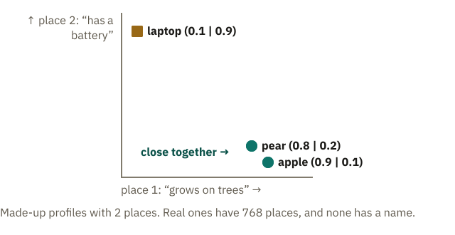
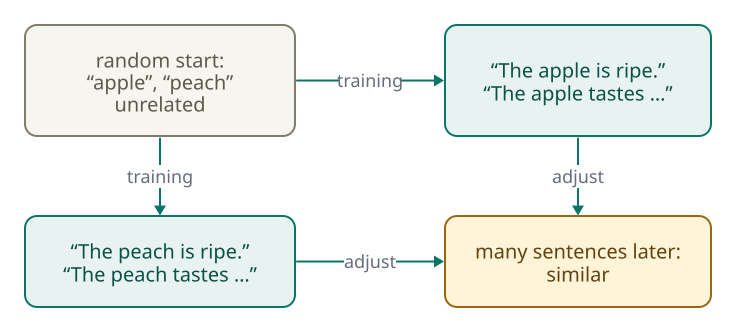
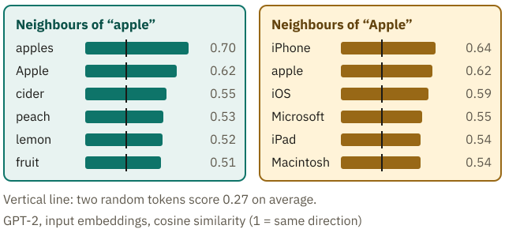
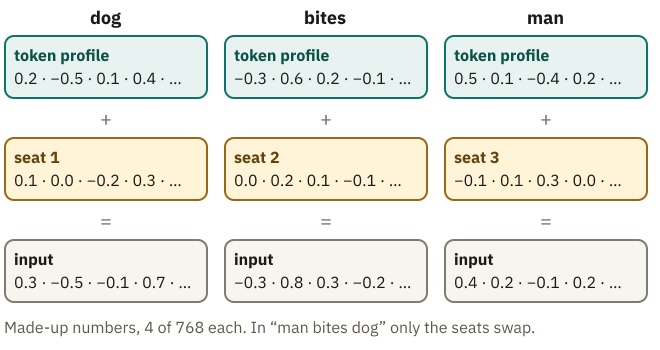

<!-- Generated from src/content/bausteine/en/embeddings.mdx by scripts/export-lessons.mjs -- do not edit by hand. -->

# Embeddings: How a Number Becomes a Meaningful Vector

> Reading copy for GitHub. The full version with interactive demos, animations and recall moments is on the website: **[Embeddings: How a Number Becomes a Meaningful Vector](https://ki-einfach-verstehen.de/en/lessons/embeddings/)**
>
> Licence: [CC BY 4.0](https://creativecommons.org/licenses/by/4.0/deed.en) · Credit it as: KI einfach verstehen, “Embeddings: How a Number Becomes a Meaningful Vector”, CC BY 4.0, https://ki-einfach-verstehen.de/en/lessons/embeddings/

Why a token ID tells the model nothing about meaning, and how training turns random numbers into similar profiles for tokens used in similar ways.

*A barcode tells the checkout which item it is, but nothing about what the item has in common with others.*

At the checkout, the scanner beeps and the display shows “Apples, loose.” The barcode told the till only which item it is, not that apples and pears are both fruit. A language model is in a similar position with your chat message once the [tokenizer](https://ki-einfach-verstehen.de/en/glossary/tokenizer/) has split it. What remains is a sequence of [token IDs](https://ki-einfach-verstehen.de/en/glossary/token-id/), each saying only which piece of text is meant.

The example is the smallest version of the freely available model GPT-2, with an English vocabulary; this lesson always means that version. In the middle of a sentence, with a space in front, “apple” has the ID 17180, “laptop” 13224, and “pear” 25286. By ID, the laptop is closer to the apple than the pear is. Yet the model treats apple and pear as related. How does it know, if nobody ever told it what fruit is?

## What a number lacks

A token ID is a barcode, as at the end of the [previous lesson](./tokenization-inside-the-model.md), or, as in the lesson on [token IDs](./token-ids-and-vocabulary.md), the number on an index card. It identifies a piece of text and means nothing by itself; neighboring IDs do not stand for similar pieces.

What the model does with the ID, you know from the lesson on [scalar, vector, matrix, and tensor](./scalar-vector-matrix-tensor.md). Remember the thick reference book? The token ID was the page number, and in GPT-2 each page held 768 numbers. In the computer, each page is a row of a large table. As the first lesson of this topic said, the model looks up no row like “France | Paris.” This row holds no fact, only the token’s numbers; calculating comes afterward.

Here, this row is called the token’s **profile**: a long, fixed sequence of numbers that belongs to exactly this token. In the lesson on scalars and vectors, “profile” meant the shape of a block of numbers; from here on, it means a token’s row.

**Unlike IDs, profiles can be compared.** A made-up example with two places, named here to help you think: “grows on trees” and “has a battery.” The apple has (0.9 | 0.1), the pear (0.8 | 0.2), the laptop (0.1 | 0.9). Real profiles have 768 places, and none of them has a name.

*A made-up example: each profile of two numbers becomes a point, the first number saying how far right, the second how far up. Apple and pear lie close together, the laptop far away.*

Draw each place as a direction, and every profile becomes a point: the first number to the right, the second upward. Similar profiles land close together. Nobody can draw 768 directions, but the principle stays. That is why experts say similar profiles are **neighbors**.

In GPT-2, the profile of “apple” is closer to that of “pear” than to that of “laptop”; a measurement follows two sections on. First the bigger question: who entered the numbers this way?

## How random numbers become profiles

Nobody did. Before training, the table holds random numbers, so every token starts with a different profile. In this state, “apple” has no more in common with “pear” than with “laptop.”

Then training begins. Remember the spam filter from the first lesson of the foundations? Its weights started at zero rather than at random numbers, but the adjusting worked the same way: whenever it got an email wrong, the weights involved shifted a small step in the direction that makes the error smaller. A language model learns the same way, as in the last lesson of the foundations: it predicts the next token, and its [parameters](https://ki-einfach-verstehen.de/en/glossary/parameters/), the faders on the mixing desk, are adjusted a little so that the prediction fits better. The table’s numbers are such faders too, so a token’s row is adjusted whenever it occurs in a training sentence.

Suppose a small model has one row each for “apple” and “pear” in its table. In its training texts, “The apple is ripe” and “The pear is ripe” both occur often. After “apple,” the model should predict “is” as the next token, so the numbers in the “apple” row are shifted to make “is” fit better. The same follows “pear.” “Laptop,” by contrast, stands in sentences such as “The laptop has a battery.”

Why do the two rows become alike, rather than each fitting in its own way? Everything after the table is the same calculation, with the same faders, for every token. A toy calculation shows what follows. Suppose each profile had only one number, and the calculation after it were simply “times 2.” It yields the score for “is” as the next token, which should be 10 for “is” to come out on top. The “apple” row happens to start with 3, giving 6, too little, so it is adjusted step by step toward 5. The “pear” row holds 8, giving 16, too much; it also moves toward 5.

Both end up at 5, because the same calculation should give the same result. After “laptop” comes “has,” so the score for “is” should be low there, say 2. Its number moves toward 1. How does training know whether a number has to go up or down? The lesson on [parameters, training, and inference](./parameters-training-inference-hardware.md) shows how: training calculates for every fader which direction makes the error smaller and turns it a little that way. Real profiles have 768 numbers and a far longer calculation that learns too, but the principle stays: **tokens followed by similar things are adjusted alike**, and their profiles move together.

[▶ watch the animation on the website](https://ki-einfach-verstehen.de/en/lessons/embeddings/)

*A made-up example: because the same thing follows “apple” and “pear,” both rows are adjusted alike during training.*

Over millions of sentences, these small steps add up. Linguists had the underlying idea back in the 1950s: words that occur in similar contexts tend to have similar meanings. It is called the **distributional hypothesis**. The linguist J. R. Firth summed it up in 1957: “You shall know a word by the company it keeps.”

> **Interactive demo:** [try it on the website](https://ki-einfach-verstehen.de/en/lessons/embeddings/)

Chatbot models learn their tables this way too. But does it hold in a real model?

## Similar use, similar profile

GPT-2 lets you check. For this lesson, its table was searched: which profiles are closest to that of “apple”? At the top are spelling variants such as “apples” and “Apple.” Right after them come “cider,” “peach,” “lemon,” and “fruit.” Nobody told the model these belong together. They just stood in similar sentences.

Draw an arrow from the zero point to each point of the sketch and ask how much two arrows point the same way. Only the direction counts, not the length: the same direction gives 1, a right angle 0. In the sketch, apple and pear come to almost 1, apple and laptop to about 0.2. Even two randomly drawn tokens reach about 0.27 on average in GPT-2. Only what lies clearly above that counts as a neighbor, and the neighbors of “apple” reach 0.5 to 0.7. And the puzzle from the start? “pear” is not among the very nearest neighbors, but it lies clearly above chance; “laptop” only barely.

But what happens to a word that occurs in two quite different contexts, like “apple” as a fruit and as a company? Think for a moment before reading on.

With “apple,” the spelling helps. The company is usually capitalized, and capitalized “Apple” is a different token for the model, with its own profile. Its nearest neighbors are “iPhone,” “apple,” “iOS,” “Microsoft,” “iPad,” and “Macintosh.” Apart from the fruit word, the list holds phones and competitors.

*The nearest neighbors of “apple” and “Apple” in GPT-2’s input table (a selection, recomputed for this lesson). The bars show how similar the profiles are; 1 would mean pointing the same way. The vertical line marks 0.27, what two random tokens reach on average.*

The list for “Apple” also shows what a profile is not: a definition. Microsoft is neither an apple nor a phone; it just occurs in similar texts. So similarity at the input means **similar use, not the same meaning**.

> **Interactive demo:** [try it on the website](https://ki-einfach-verstehen.de/en/lessons/embeddings/)

One level deeper: how do you measure whether two profiles are similar?

Usually with **cosine similarity**: 1 means the same direction, 0 a right angle, −1 opposite directions. Multiply the numbers in the same place, add up all the products, and divide by the lengths of the two arrows (the square root of the sum of the squares). As a formula: cos(v, w) = (v · w) / (|v| · |w|).

With the sketch from above: apple and pear give 0.9 · 0.8 + 0.1 · 0.2 = 0.74, divided by √0.82 · √0.68 ≈ 0.75, so cos ≈ 0.99. Apple and laptop come to 0.18 / 0.82 ≈ 0.22.

In GPT-2, “apple” and “pear” reach 0.456, “apple” and “laptop” 0.357; 20,000 random pairs averaged 0.27, and 95 out of 100 were below 0.35. Why not 0? All profiles point partly in a shared base direction: recomputed, every row has a positive cosine with the average of all rows. Subtract this average, and random pairs average 0.

## Embedding and embedding matrix

In technical terms, a token’s profile is called an **[embedding](https://ki-einfach-verstehen.de/en/glossary/embedding/)**. Because it is an ordered list of numbers, it is a [vector](https://ki-einfach-verstehen.de/en/glossary/vector/). The whole table, with one row for every token of the [vocabulary](https://ki-einfach-verstehen.de/en/glossary/vocabulary/), is called the **[embedding matrix](https://ki-einfach-verstehen.de/en/glossary/embedding-matrix/)**.

*Profiles without labels: tokens used in similar ways carry similar patterns of numbers; a token used differently carries a different one.*

A real profile looks different from the “grows on trees” example. Here are the first 8 of 768 numbers for “apple” in GPT-2: 0.119 · −0.175 · 0.129 · 0.063 · 0.045 · 0.046 · −0.323 · 0.079. What does the seventh number mean? Nobody can say. Here the picture falls short: a profile on paper has fields such as height or eye color that someone filled in. Here no field has a name, and textbooks note that single numbers have no clear meaning. **What an embedding expresses lies in all the numbers together.**

One level deeper: does “king − man + woman = queen” hold?

You can calculate with embeddings, number by number: from the 768 numbers of “king,” subtract those of “man” and add those of “woman.” Then search for the profile closest to the result. The famous example comes from Tomas Mikolov and colleagues (2013), and it worked with a trick: the input words were excluded from the search.

Without this exclusion, according to a 2020 study, accuracy fell from 0.71 to 0.21; most often the starting word came back, because subtracting and adding only shift the vector a little. On GPT-2 without exclusion, “king” comes first with 0.776, followed by “queen” with 0.709. According to the textbook by Jurafsky and Martin, the method only works for certain relations, such as country and capital. An embedding is no calculator for meanings.

In the smallest version of GPT-2, with about 124 million parameters, it has one row for each of the just over 50,000 entries in the vocabulary and makes up nearly a third of all parameters. In today’s large models it is longer still, yet only a small part; most of the model sits in the computing stages after it.

## One row per token, not per word

In GPT-2, “apple” is a whole token. Other words fall apart into pieces, as “cats” became “␣cat” and “s” in the made-up example of the tokenizer lesson, German words especially often. Qwen3, the freely available model from Alibaba in the previous lesson, splits “Apfel” (apple) into “␣Ap” and “fel” and “Birne” (pear) into “␣Bir” and “ne.” “Laptop” and “Bank” are one token each there.

So for “Apfel,” this table has no row of its own, only rows for the two pieces. The profile of “␣Ap” has to suit every word that starts with this piece, including “Apotheke” (pharmacy) and “Aprikose” (apricot). That “Ap” and “fel” together mean the fruit only emerges in the computing stages after the table. Chat in German, and your message often consists of pieces like these.

Now every token has its profile. But how does the model know in what order they stand?

## The seat in the sentence

“Dog bites man” and “man bites dog” consist of the same three words. Suppose each is one token: then the model fetches the same three profiles in both sentences. Only the order differs, and it decides who gets bitten.

You might think the model knows the order anyway, since the profiles stand one below the other. But the computing stages after them, the blocks from the first lesson of this topic, treat every row the same, wherever it stands, like cards spread face up on a table. A made-up toy case: suppose the model simply adds up all the profiles for its prediction. “Dog bites man” gives dog + bites + man, “man bites dog” gives man + bites + dog, the same sum. Who bites whom would be lost. So the researchers who presented this blueprint for language models in 2017 wrote that positions had to be supplied separately.

GPT-2 solves this with a second table. It has one row for every position that fits into the [context window](https://ki-einfach-verstehen.de/en/glossary/context-window/), so 1,024 in GPT-2, the maximum from the previous lesson. Each row is a profile for a **seat**: one for seat 1, one for seat 2, and so on. They too start random and are learned.

Because both profiles have the same length, they are added number by number. Suppose the profile of “dog” has 0.2 as its first number and the profile of seat 1 has 0.1: then 0.3 is passed on. If the dog sits in seat 3, as in “man bites dog,” and this seat has −0.1 there, 0.1 is passed on. **Same token, different seat, different sum:** the blocks receive “dog in seat 1” or “dog in seat 3,” not just “dog.” The technical term for the seat profile is **[position embedding](https://ki-einfach-verstehen.de/en/glossary/position-embedding/)**.

*Token profile plus seat profile gives what is passed on into the model. In “man bites dog,” the dog sits in seat 3, and its sum comes out differently.*

Doesn’t adding lose track of what was dog and what was seat? With a single number, yes: 0.3 could be 0.2 plus 0.1 or 0.3 plus 0. With 768 numbers, the token’s pattern stays recognizable, much as you can still hear the single notes in a chord. Recomputed on GPT-2: if you look for the token profile most similar to such a sum, you find the right token in over 99 out of 100 cases. Unlike a chord, though, there are no separate notes, only overlapping patterns of numbers.

The sum is no longer a stored value but an intermediate value, like the meters on the mixing desk from the first lesson of this topic. It arises anew for every sentence, and with it the blocks can tell who bites whom.

Taken literally, the seat picture only fits models like GPT-2. Other models, such as Llama, bring the place in another way; the next lesson shows one of them. Common to all: the order is supplied separately.

## A bank is a bank, for now

*A bank by the river or a bank for your money: at the model’s input, it is the same profile.*

“We sat on the river bank.” “I took the money to the bank.” At the model’s input, it is the same token: same ID, same row in the embedding matrix. Only the seat part differs, and it reveals nothing about rivers or money.

This is the limit: a token with several meanings must make do with one profile. With “apple,” capitalization helped, but even it does not separate cleanly; “iPhone” turns up among the neighbors of lowercase “apple,” after many fruit words. With “bank,” no spelling helps. River and money sit in the *same* row.

Even so, a chatbot usually understands “bank” correctly. In the model’s blocks, often called layers, these sums turn stage by stage into new intermediate values that take in information from the sentence. The row in the table itself stays unchanged. A 2019 study of GPT-2 showed: in the later blocks, closer to the output, the intermediate values of the same word depend much more strongly on the sentence than at the input. **The profile from the table is only the starting point.**

With that, the model’s input is complete. What is missing is context: how does each token get information from the other tokens in the sentence, so that “bank” means money one time and a riverside the next? The next lesson answers that.

---

Source: https://ki-einfach-verstehen.de/en/lessons/embeddings/

← Previous: [Tokenization Inside the Model: How Your Chat Becomes a Token Sequence](./tokenization-inside-the-model.md) · [All lessons](../../README.md#contents) · Next: [Transformer Blocks and Attention: How Context Gets Mixed In](./transformer-blocks-and-attention.md) →
