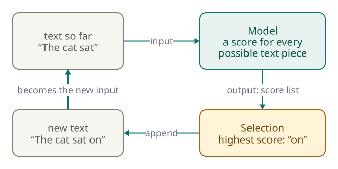
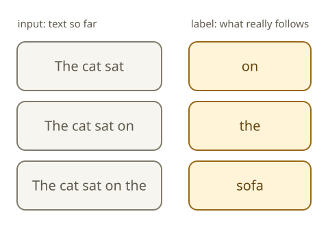

<!-- Generated from src/content/bausteine/en/input-and-output.mdx by scripts/export-lessons.mjs -- do not edit by hand. -->

# Input and Output: What a Function Does

> Reading copy for GitHub. The full version with interactive demos, animations and recall moments is on the website: **[Input and Output: What a Function Does](https://ki-einfach-verstehen.de/en/lessons/input-and-output/)**
>
> Licence: [CC BY 4.0](https://creativecommons.org/licenses/by/4.0/deed.en) · Credit it as: KI einfach verstehen, “Input and Output: What a Function Does”, CC BY 4.0, https://ki-einfach-verstehen.de/en/lessons/input-and-output/

What does an AI model receive, and what does it give back? From the spam filter to image recognition to the chatbot: why the output is usually a list of ratings, and how an answer is built from it piece by piece.

The spam filter from the [previous lesson](./program-algorithm-model.md) has a manageable job: an email goes in, a verdict comes out. A chatbot feels different. You type a question, and a moment later a complete, fitting answer appears. How does that happen if the model behind it only calculates with fixed numbers? This lesson starts with the spam filter and shows, step by step, what a model really receives and what it gives back.

## What goes in, what comes out

Take another close look at the spam filter. What goes in is called the **[input](https://ki-einfach-verstehen.de/en/glossary/input/)**: here an email, or more precisely the words in it. What comes out is called the **[output](https://ki-einfach-verstehen.de/en/glossary/output/)**. At first glance, that is a verdict: spam or not spam. But there is a number in between. The filter adds up the weights of the words, and for “Free: your prize is waiting” the total is 5. Only the comparison with the threshold of 2 turns that into the verdict spam.

*For the spam filter, the input is an email. What comes out first is a number, and only after that the verdict.*

Keep these two steps apart. Adding up the trained weights rates the email. The fixed comparison with the threshold then decides. Whenever this lesson talks about “the model”, it means only the part that does the rating. Why that matters shows up with the chatbot: there, the second step explains why one question can be answered in two different ways.

One more thing holds for every email: the same input gives the same output. If the same email arrives twice, the filter adds up the same weights twice. It does not remember the first email, and it does not get stricter the second time. The weights change only during training, not while rating.

*A calculator always gives the same result for the same keys. In this sense, a trained model is a function too.*

A familiar device works the same way: the calculator. You type “2 + 3” and it shows 5, today, tomorrow, and for anyone else who types it. Mathematicians call something like this a **[function](https://ki-einfach-verstehen.de/en/glossary/function/)**: a fixed mapping that calculates exactly one output for each input. A trained model is a function in this sense, too. Its computation rule is fixed, and after training its parameters are fixed as well. The kind of input and output is fixed too. The spam filter always receives text, no matter how long, and always outputs exactly one number. It could not rate a photo at all. All it can do is look up words and add up their weights. Every model calculates only with the kind of input it was built for.

The comparison has its limits. People designed every step of how a calculator computes. In a model, what the calculation does is decided by numbers that the training algorithm has set. And a calculator outputs a single number. Many models, by contrast, output a whole row of numbers, as the next section shows. They are still functions: the whole row together is the one output, and for the same input it is the same row every time.

## A rating for every possibility

A spam filter has only two possible results. Image recognition, by contrast, is supposed to assign a photo to one of many classes, such as cat, dog, fox or car. Its input is the photo, which to the model means the brightness and color values of its pixels. Its output is not a single number but one number for each class.

For a photo of a cat, it might look like this, with made-up numbers: cat 6.2, dog 2.9, fox 1.4, car −3.0. Each of these numbers is a **[score](https://ki-einfach-verstehen.de/en/glossary/score/)**, a rating of how well the class fits the image. High means a good fit, low or negative means a poor fit. Which class ends up on the screen is again decided by a separate step: it takes the class with the highest score. That is the same split as with the spam filter. The model rates, and a simple step after it decides.

Now on to a [language model](https://ki-einfach-verstehen.de/en/glossary/language-model/), the model behind a chatbot. Think for a moment before you read on: the model receives the text “The cat sat”. What does it output? The finished answer? A single word?

Neither. The output of a language model has the same shape as in image recognition, except that its classes are text pieces. A text piece is a whole word, part of a word, or a punctuation mark. For every text piece it knows, it outputs a score for how well that piece fits next. With made-up values, an excerpt looks like this:

*Excerpt from a score list after “The cat sat” (made-up values). The model outputs such a score for every text piece it knows.*

“on” and “still” fit well, “rain” hardly fits at all. In reality, the list is very long. The older language model GPT-2, for example, knows 50,257 text pieces, so its score list for the next piece always has exactly 50,257 entries, no matter how short or long the input is. What exactly a text piece is, and where the list of all text pieces comes from, is covered in the next lesson.

## How single pieces become an answer

So one pass rates only the next text piece. A whole answer comes from repeating the same small process:

1. The text so far goes into the model as input.
2. The model outputs the score list.
3. A selection step turns it into a single text piece.
4. This piece is appended to the text, and the longer text is the input for the next round.

[▶ watch the animation on the website](https://ki-einfach-verstehen.de/en/lessons/input-and-output/)

*The generation loop: input into the model, score list out, pick one text piece, append it, and the longer text goes back in.*

Play through three rounds. Round one: the input is “The cat sat”. Here, the selection step simply takes the top-scoring piece, “on” with 8.1. Round two: the input is now “The cat sat on”. The model computes the whole list again, and this time different pieces come out on top:

*Score list after “The cat sat on” (made-up values): with the longer input, different text pieces come out on top.*

Now “the” leads with 7.6, just ahead of “a” with 6.8. So “the” is chosen. Round three receives “The cat sat on the”, where “sofa” comes out on top and is appended. The loop ends when the selection step picks a special stop marker or a set length limit is reached.

## What the loop explains in the chat window

*Three rounds, three appended pieces: “The cat sat” has become “The cat sat on the sofa”.*

This loop explains three things you can observe in any chatbot. First, the answer often appears in small pieces, almost word by word, because it really is produced piece by piece. Second, nothing gets taken back. Every chosen piece stays, and all later rounds build on it, so an unsuitable piece chosen early shapes the rest of the answer. Had round two picked “a” instead of “the”, every later round would have continued from “The cat sat on a”, with no way back to “the”.

Third, the same question can get two different answers. The model is still a function. The split from the spam filter helps here: the model rates, and a separate step decides. For the same input, the rating in principle always gives the same score list. The difference almost always arises only in the second step, the selection. In the spam filter, that step is a fixed comparison with the threshold. Many chatbots, by contrast, do not always take the piece with the highest score but pick with a bit of randomness. Then pieces with a somewhat lower score get a chance too, as a later lesson explains.

One level deeper: how tiny arithmetic differences arise in the data center

A computer stores decimal numbers as so-called floating-point numbers with a fixed number of digits, rounding whatever does not fit. It stores them in binary, using only zeros and ones. Even 0.1 cannot be stored exactly that way, much like 1/3 never ends as 0.333… in decimal. As a result, it matters which numbers are added first. With a = 0.1, b = 0.2 and c = 0.3, Python shows 0.6000000000000001 for (a + b) + c, adding a and b first. For a + (b + c), adding b and c first, it shows 0.6. The two results differ in the last stored digit. On paper, both are equal; in a computer, they are not.

Each score list takes huge amounts of such additions. In the data center, graphics chips split large sums across many processing cores and combine the partial results. Many people's requests are computed together as a so-called batch, and how the work is split can depend on its size. That size depends on how many people are asking at the moment. If it changes, the order of the additions can change too, and the scores then differ in their last digits.

Usually this has no effect. But if two pieces are almost tied, it can tip which one leads, and from there the answer continues differently, with no way back. The research company Thinking Machines Lab tested this: a model answered the same request 1,000 times, always taking the top-scoring piece, and produced 80 different answers. Each was 1,000 pieces long. All of them matched for the first 102 pieces; only then did they part ways.

The model remains the same function: the computation rule and the parameters are unchanged, and on paper, the same score list would come out every time. Only the execution can differ: the same steps run in a different order and round slightly differently in the last digit.

Now you have the whole loop: text in, score list out, pick one piece, append it, and everything goes back in until a stop marker comes. With a chatbot, your text, the **[prompt](https://ki-einfach-verstehen.de/en/glossary/prompt/)**, is the input for the first round, and the answer is appended piece by piece.

> **Interactive demo:** [try it on the website](https://ki-einfach-verstehen.de/en/lessons/input-and-output/)

## Labeled examples in training, input only in use

That leaves the question of how the model knows that “on” fits better after “The cat sat” than “rain”. You know the answer from the previous lesson: from training examples with labels. A training example consists of an input and the output that would have been correct. The training algorithm compares what the model outputs with the label and adjusts the parameters a little.

For the spam filter, people had to mark every email as spam or normal mail. For a language model, the label is already in the text itself. Take a perfectly ordinary sentence: “The cat sat on the sofa.” Several training examples can be built from it at once.

*One ordinary sentence yields several training examples: each beginning is an input, and the text piece that really follows is its label.*

Each time, the input is the beginning and the label is the piece that actually follows: “The cat sat” gets the label “on”, and “The cat sat on” gets the label “the”. The training algorithm looks at the score the model gave the correct piece. If the correct piece was not far enough ahead of the others, it adjusts the parameters so that next time it does a little better compared to them. Because every text yields many examples this way, a language model can be trained on huge amounts of text. For this basic training, predicting the next piece, nobody assigns labels by hand. Only afterwards is the model trained further on examples that people have written or rated. That is how it learns to answer questions like a helpful chatbot.

In use, there is no label. When you ask a chatbot a question, nobody knows the “correct” next piece, so there is nothing to compare against. The model calculates only with the parameters that training left behind. Your question does not change them. That a chatbot responds to your earlier messages in the same conversation does not contradict this. The conversation so far is simply sent along as input every time. A new conversation starts without that history, unless the application itself sends something from it along. Just as with the spam filter, the parameters stay where they are until someone trains the model again.

That settles what a language model receives and what it gives back: text goes in, a score list over all text pieces comes out, and a loop turns that into an answer. One gap remains. A model calculates only with numbers; it cannot do anything with letters. How “The cat sat” becomes something it can calculate with is shown in the next lesson, [Tokenizers: How Language Becomes Numbers](./tokenizer-ids-vocabulary.md).

---

Source: https://ki-einfach-verstehen.de/en/lessons/input-and-output/

← Previous: [Program, Algorithm, Model Compared](./program-algorithm-model.md) · [All lessons](../../README.md#contents) · Next: [Tokenizers: How Language Becomes Numbers](./tokenizer-ids-vocabulary.md) →
