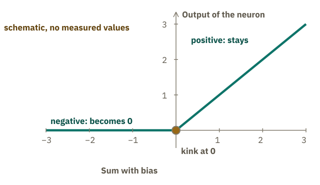
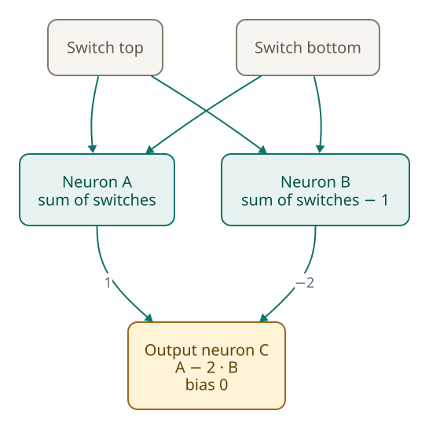
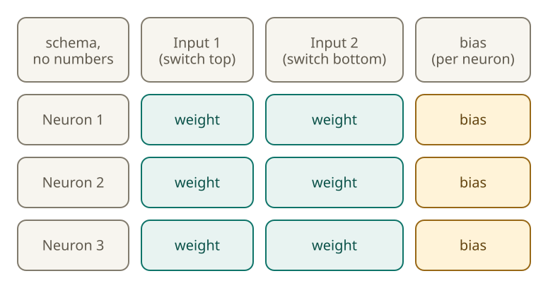
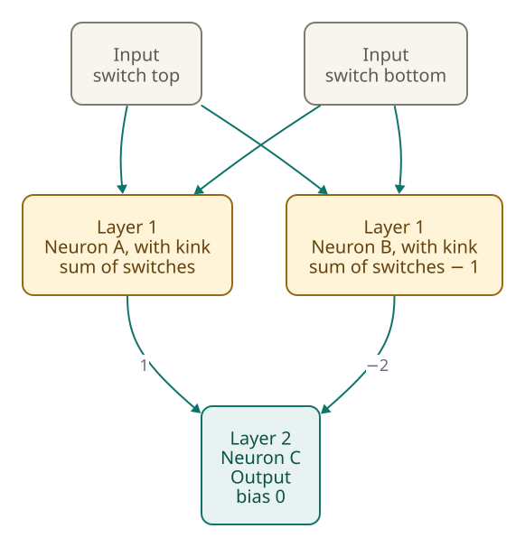

<!-- Generated from src/content/bausteine/en/neural-networks.mdx by scripts/export-lessons.mjs -- do not edit by hand. -->

# Neural Networks: How Many Small Calculations Become a Model

> Reading copy for GitHub. The full version with interactive demos, animations and recall moments is on the website: **[Neural Networks: How Many Small Calculations Become a Model](https://ki-einfach-verstehen.de/en/lessons/neural-networks/)**
>
> Licence: [CC BY 4.0](https://creativecommons.org/licenses/by/4.0/deed.en) · Credit it as: KI einfach verstehen, “Neural Networks: How Many Small Calculations Become a Model”, CC BY 4.0, https://ki-einfach-verstehen.de/en/lessons/neural-networks/

What a single artificial neuron calculates, why only the kink and stacking let it do more than one sum, and what a figure like “96 layers” means.

Nowhere among a model’s billions of numbers is there a sentence. How an answer comes out of them nevertheless starts with a surprisingly small calculation, and you already know it.

## The spam filter already calculates like a neuron

Remember the spam filter from the first lesson? It stored a weight for each word: “prize” +3, “free” +2, “invoice” −2. For each email, it added up the weights of the words it contained. If the sum was above 2, the email counted as spam.

Emails show the result. “Free: your prize is waiting” reaches 2 plus 3, which is 5: spam. “Cup prize: invoice for the party” reaches 3 minus 2, which is 1: inbox. “Your invoice, free to download” reaches 2 minus 2, which is 0: inbox. “Hi, how are you?” contains no listed word: 0, also inbox. Each word counts once, even if it appears several times: an input is 1 if the word appears and 0 if not.

The filter is already almost a [neuron](https://ki-einfach-verstehen.de/en/glossary/neuron/). A neuron multiplies each input by its weight and adds everything up; this sum is called the **weighted sum**. The spam filter does the same, except that it ends with a verdict instead of a number. The neuron borrowed its name from nerve cells.

The matching picture is the mixing desk from the first lesson. A channel has faders, which are the weights, and the sum runs through it. What is new is the meter at the end: it shows the neuron’s output. The faders are stored and stay as they are. The inputs, by contrast, are new for every email.

*One channel as a neuron: the vertical faders hold the weights, the horizontal fader above is the bias. Behind it sits the kink; the meter shows the output.*

In the spam filter, each fader belongs to a word: the word is the input, the fader holds its weight. In a large network, a fader instead belongs to the connection between two calculation steps. There it carries no label, just like the 175 billion faders of GPT-3 from the first lesson. The filter still lacks two things. It decides only with a fixed threshold, and it passes on no number that another calculation could work with. The neuron fixes both.

## The bias replaces the threshold, the kink cuts off

The threshold of 2 gets a counterpart in the neuron: the **[bias](https://ki-einfach-verstehen.de/en/glossary/bias/)**, a fixed number that is added to the sum. For the spam filter, it would be −2. Instead of asking whether the sum is above 2, the neuron adds −2 and checks whether anything stays above zero. “Free: your prize is waiting” thus reaches 5 minus 2, which is 3, and the cup email 1 minus 2, which is −1. It applies to every email.

After that comes the [kink](https://ki-einfach-verstehen.de/en/glossary/activation-function/), a fixed circuit behind the sum. A positive number stays as it is. A negative one is set to zero. Drawn out, it is a bend: flat below zero, straight above it. It caps nothing from above; it only cuts off below. Researchers call such a circuit an **activation function**, and its simplest form is called **ReLU**, short for rectified linear unit.

*Schematic, no measured values: below zero the output stays at zero, above it rises in a straight line.*

A stair light has two switches, one at the top and one at the bottom. The light is on when exactly one of them is pressed; if both or neither are pressed, it stays dark. The numbers in the following network are set by hand, not trained. The network shows only how sum, bias and kink work together, and nothing about a real model with billions of numbers.

The network has three neurons. A and B sit at the front, both see both switches, and each has weight 1. The bias of A is 0, that of B is −1. Behind both sits the kink.

What does B show when none of the switches is pressed? Calculate it yourself briefly.

If no switch is pressed, A calculates 0. B calculates 0 with bias −1, so −1, and the kink turns that into 0. If one switch is pressed, A calculates 1, and B calculates 1 with bias −1, so 0. If both are pressed, A calculates 2, and B calculates 2 with bias −1, so 1.

The values of A and B go into an output neuron C. It weights A’s output with 1 and B’s with −2, and its bias is 0. With no switch pressed, that gives 0; with one, 1; with both, 2 minus 2, which is 0. So the results are 0, 1, 1, 0, and the light is on exactly when one of the two is pressed.

In Qwen3-8B, a freely available language model, this place holds a smoother curve instead of the sharp kink.

One level deeper: which kink does a current language model use?

In the public configuration file of Qwen3-8B, `hidden_act` is set to `silu`. This means a kink rounded into a curve: for large negative inputs it approaches zero, for positive ones it stays nearly equal to the input, and in between there is no sharp corner.

The same file lists 36 under `num_hidden_layers`: the blocks of the model description further down the text, not individual layers of neurons.

The file does not show how the neurons around this kink are wired. The basic idea stays the same: behind the sum sits a circuit that does not simply pass the number on.

## Without a kink, everything stays addition

Think before you read on. What does the stair light without a kink show when no switch is pressed?

> **Interactive demo:** [try it on the website](https://ki-einfach-verstehen.de/en/lessons/neural-networks/)

The answer is not 0. Neuron A calculates as before: 0, 1 and 2. Its sum is never negative, so the kink has nothing to cut off. Neuron B, without the kink, stands at −1, and the output neuron C then calculates 0 plus (−2 times −1), which is 2.

With one switch pressed, A calculates 1, B calculates 1 minus 1, which is 0, and C calculates 1. With both, A calculates 2, B calculates 1, and C calculates 2 minus 2, which is 0. The series of four cases is therefore 2, 1, 1, 0. Without the kink, the value drops evenly with each pressed switch: 2, 1, 0. The pattern “exactly one” would require 0 for none and for both switches, with a peak in between. A value that falls evenly cannot form a peak.

[▶ watch the animation on the website](https://ki-einfach-verstehen.de/en/lessons/neural-networks/)

*Without the kink: the four switch positions one after another. The series is 2, 1, 1, 0, and the value falls evenly, 2, 1, 0, so no peak at exactly one pressed switch arises.*

Why? Without the kink, every calculation is a weighted sum with a fixed number added. The output of A is the sum of the switches, the output of B the same sum minus 1. The output neuron calculates the output of A minus 2 times that of B. With both switches pressed, that is 2 minus 2 times 1. In general, the number of pressed switches minus 2 times (the same number minus 1) comes to 2 minus the number of pressed switches. What remains is a weighted sum with a fixed number added. A single neuron with weight −1 on each switch and bias 2 gives the same four values.

Two groups of neurons stacked without a kink can therefore do no more than one. Ten could not either; they would all combine into one. The textbook agrees: if the step between them is also linear, that is, only multiplying and adding, the whole network remains a linear function of its input.

Without a kink or a similar circuit, a network cannot represent a pattern such as “exactly one of the two,” in which two inputs together mean something other than each alone. Language models rely on such kinks too, one reason they can capture relationships of this kind.

## How many numbers are in a layer?

A and B in the stair light received the same switches as input. A group of neurons with the same input is called a [layer](https://ki-einfach-verstehen.de/en/glossary/layer/), so A and B form one. The output neuron C is a layer with just one neuron.

A [matrix](https://ki-einfach-verstehen.de/en/glossary/matrix/) from the fifth lesson is a table with rows. A layer can be written the same way: each table row is one neuron, each column one input. Where a row and a column cross, you find that neuron’s weight for that input. Each neuron also has a bias. How many numbers does a layer with two inputs and three neurons have? Count before you read on.

*Counting box for two inputs and three neurons: each neuron has two weight boxes and one bias.*

Counting works like this: each of the three neurons has two weights, one per input. Three neurons times two weights make six. Add one bias per neuron, three more: nine numbers in all. The bias is counted once per neuron, not once per input. The rule is: inputs times neurons, plus one bias for each neuron, in every layer that has biases. A layer with five inputs and four neurons has 5 times 4, which is 20 weights, and four biases. Together that is 24 numbers.

PyTorch, a widely used program for building neural networks, stores the weights of a layer as a table, with rows for the neurons (called outputs there) and columns for the inputs, and by default has one bias per neuron. The model behind your chatbot stores its weights in tables like this, just much larger.

*The same layer as a table: rows are neurons, columns are inputs, the crossings are weights. The margin column holds the biases.*

One level deeper: how many numbers does a network for digits have?

A teaching example from a video series applies the rule to a larger network. It recognizes handwritten digits: 784 inputs for 28 by 28 pixels, then two layers of 16 neurons each, and at the end 10 outputs for the digits.

Between the inputs and the first layer there are 784 times 16, which is 12,544 weights. Between the two layers, 16 times 16, which is 256. To the last layer, 16 times 10, which is 160. Together that is 12,960 weights. Add 16 plus 16 plus 10 biases, which is 42. In total, that makes 13,002 numbers. The number says nothing about what a single weight means.

## Stacking layers: the intermediate value keeps going

The output of one layer becomes the input of the next. The number that a neuron passes on to the next layer is called an [intermediate value](https://ki-einfach-verstehen.de/en/glossary/intermediate-value/). On the mixing desk, these are the meters that change with every pass. Intermediate values are created anew for every text. The weights, by contrast, stay fixed while the model answers.

In the stair light, A and B are the intermediate values. If no switch is pressed, both are 0, because the kink sets B from −1 to 0. If both switches are pressed, they are 2 and 1. The output neuron C calculates 0 from that. The next layer continues with them; the answer comes only at the end.

[▶ watch the animation on the website](https://ki-einfach-verstehen.de/en/lessons/neural-networks/)

*Two layers: the intermediate values A and B run on into the output neuron C. The kink sits in layer 1, behind the sum of A and B.*

The kink is what makes stacking worthwhile. With it, a layer can represent what the previous one cannot: in the stair light, “exactly one of the two.”

Model descriptions use the same word but often mean more. GPT-3, the model with about 175 billion [parameters](https://ki-einfach-verstehen.de/en/glossary/parameters/), that is, the faders from the first lesson, has 96 layers according to its research paper. Here a layer means a larger building block, the [transformer block](https://ki-einfach-verstehen.de/en/glossary/transformer-block/): a group of several parts, among them neuron layers, that the model runs through one after another. What a block contains, the last section shows. [Transformer](https://ki-einfach-verstehen.de/en/glossary/transformer/) is the name of the design today’s large language models are based on. Each of the 96 blocks has many neurons.

## What the brain comparison does not tell you

The word neuron comes from biology. As early as 1943, Warren McCulloch and Walter Pitts described nerve cells as switching elements with a threshold that either fire or do not. Their model had fixed values and did not learn.

The name invites an idea: a neuron is a small component in the brain that learns. That is not right. An artificial neuron is a calculation rule made of a sum, a bias and a kink. Its weights and biases are learned; the rule stays the same.

The textbook stresses this: neural networks are loosely inspired by neuroscience, but their goal is not to reproduce the brain exactly. How far the gap reaches shows a study from 2021. To reproduce the input-output behavior of a single simulated nerve-cell model, it took a network with five to eight layers. A single artificial neuron is therefore no substitute for a real nerve cell.

*The nerve cell gave the neuron its name. The calculation rule behind it is a sum with a bias and a kink.*

The second idea is just as tempting: a neuron stands for one word. In the spam filter that was so, where each word had a fader. Large networks, however, mix many inputs. In a small language model, a single neuron responded to scientific citations, English dialogue, HTTP requests (the requests a browser sends to fetch web pages) and Korean text. So a neuron does not necessarily stand for a single concept.

You know from the first lesson that training sets the weights: with the spam filter, the weights moved a little after each mislabeled email. How training finds, among billions of faders, which one must move and in which direction is the subject of the third topic area.

## What a language model builds its layers from

A transformer block in a language model has two parts. The first contains a calculation step that works differently from a neuron with a kink. Remember the [tokens](https://ki-einfach-verstehen.de/en/glossary/token/), the text pieces a tokenizer splits text into? In this step, each token is calculated together with the others, so information flows between them. Researchers call this step [attention](https://ki-einfach-verstehen.de/en/glossary/attention/). How it works is explained in the next topic area.

The second part is a [feed-forward network](https://ki-einfach-verstehen.de/en/glossary/feed-forward-network/), a network in which numbers flow only forward. It calculates each token separately, and it consists of layers with a step that resembles the kink. How these layers are exactly connected differs from model to model. Some language models, such as Qwen3, leave out the bias in their feed-forward network.

The 2017 research paper that introduced the transformer uses this structure too. In the part that reads the input, each layer there consists of two sublayers, and the second is a feed-forward network with a ReLU step in between. What distinguishes a small network that recognizes handwritten digits in images from a language model is mainly size and arrangement. What is new in the language model is the calculation step between the tokens.

Which numbers are in all these layers is set by training. The next topic area first shows how a language model as a whole runs through these layers. It starts with the lesson [What an AI Model Actually Is](./what-an-ai-model-actually-is.md).

---

Source: https://ki-einfach-verstehen.de/en/lessons/neural-networks/

← Previous: [Model Size and Hardware: Where a Model Fits](./model-size-and-hardware.md) · [All lessons](../../README.md#contents) · Next: [What an AI Model Actually Is](./what-an-ai-model-actually-is.md) →
