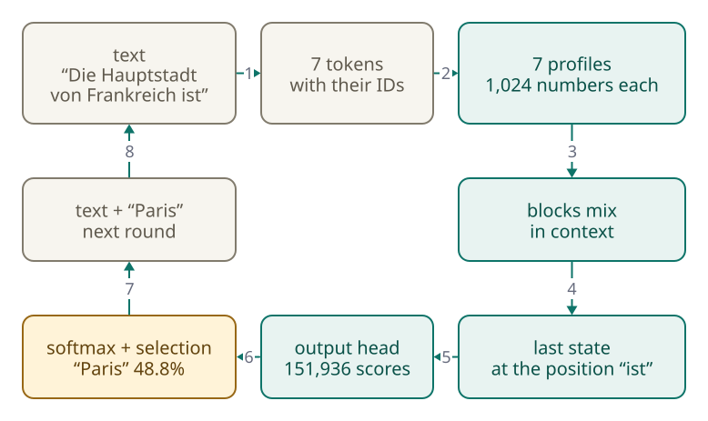

<!-- Generated from src/content/bausteine/en/output-head.mdx by scripts/export-lessons.mjs -- do not edit by hand. -->

# Output Head: From the Last State to a Prediction

> Reading copy for GitHub. The full version with interactive demos, animations and recall moments is on the website: **[Output Head: From the Last State to a Prediction](https://ki-einfach-verstehen.de/en/lessons/output-head/)**
>
> Licence: [CC BY 4.0](https://creativecommons.org/licenses/by/4.0/deed.en) · Credit it as: KI einfach verstehen, “Output Head: From the Last State to a Prediction”, CC BY 4.0, https://ki-einfach-verstehen.de/en/lessons/output-head/

How a language model computes a score for every token from its last state, why only the last position counts, and how this builds an answer piece by piece.

The previous lesson ended with a state at every position: a list of numbers into which the blocks mixed context. In the small language model Qwen3-0.6B, that is 1,024 numbers per position. But a chat window shows words, not lists of numbers.

In the first lesson of this topic area, exactly this model predicted “Paris” at 47.5 percent after “Die Hauptstadt von Frankreich ist” (German for “The capital of France is”). In another attempt, the same model wrote “Zürich” after exactly this opening. How do the two fit together? And which calculation leads to 47.5 percent?

## What comes out is a scoreboard, not a word

At the end, the model delivers the score list the previous lesson announced. It resembles the quiz-night scoreboard from the lesson on [probability and softmax](./probability-and-softmax.md). This board, however, has a row for every entry in the [vocabulary](https://ki-einfach-verstehen.de/en/glossary/vocabulary/); for Qwen3-0.6B, that is 151,936. Each gets a [score](https://ki-einfach-verstehen.de/en/glossary/score/), even a comma or a Chinese character.

*The scoreboard at the end of the model: one row for every entry in the vocabulary, each with its own score. One row is ahead.*

For this topic area, Qwen3-0.6B was tried out on an ordinary computer, in the free base version without chat training. After “Die Hauptstadt von Frankreich ist”, “Paris” has the highest score, 20.5. Second, at 19.1, is a blank line “____”, as in worksheets and quiz questions. Third and fourth are blank lines too, of other lengths, because each length is a token of its own. The model apparently saw such texts often in training. “Bern” only follows in fifth place. Softmax turns these scores into percentages.

Remember the rule of thumb from the softmax lesson? One point ahead means about 2.7 times as much, two points a good seven times as much (2.7 · 2.7). “Paris” is almost one and a half points ahead of the blank line and gets about four times as much: 47.5 against 12.0 percent. “Bern” is three and a half points behind and only reaches 1.4 percent. The top five together have about two thirds. The last third is shared in tiny pieces by the remaining rows, and only with them does “Paris” come to exactly 47.5 percent, the number from the first lesson.

*The top of the real board: softmax turns a lead of almost one and a half points into four times the share.*

You know from the lesson on [input and output](./input-and-output.md) that the model rates every vocabulary entry and a separate step picks one: after “The cat sat”, “on” was ahead. Often, the chosen piece is not even a whole word. After “Der Hund jagt die” (“The dog chases the”), Qwen3 put word beginnings in the lead, such as “T” (as in “Taube”, pigeon), “F” (as in “Fliege”, fly) and “Kat” (as in “Katze”, cat). The next rounds decide which word they become. What gets chosen is a [token](https://ki-einfach-verstehen.de/en/glossary/token/).

Scores can even all be negative. In the older model GPT-2, also part of the experiment, “dog” led after “The dog chased the” with −86.4 and still got almost 20 percent. Only the gaps count, as in a race where everyone stays behind the record: whoever is least behind wins.

But where do the 20.5 points for “Paris” come from?

## Where the points come from: one row per token

The part of the model that fills the board is called the **[output head](https://ki-einfach-verstehen.de/en/glossary/output-head/)**. It is not another block but a much simpler calculation step: no attention, no mixing, just a comparison. For every entry in the vocabulary, it has a row with as many numbers as the state. A token's score measures how well the state fits its row.

Suppose states had only three numbers and the vocabulary four tokens: “cat”, “pigeon”, “duck” and “cloud”. To show what the numbers do, the three positions are called “animal”, “quick” and “object” here. After “The dog chases the”, the last position holds the state (1.0 | 0.5 | −1.0): an animal fits, preferably a quick one, an object rather not. The row for “cat” reads (2.0 | 1.0 | −1.5): clearly an animal, quick, not an object. The numbers say how well a word fits after “chases the”, not what it is.

The output head calculates position by position: first number times first number, and so on. Then it adds everything up. 1.0 times 2.0 makes 2.0. 0.5 times 1.0 makes 0.5. −1.0 times −1.5 makes plus 1.5, because minus times minus is plus. Together that is 4.0, the score of “cat”. You know this calculation from the previous lesson: that is exactly how the query of “bank” was compared with every key.

“pigeon” has the row (1.0 | 1.0 | −1.0), giving 1.0 + 0.5 + 1.0 = 2.5. “duck” has (0.5 | 0 | −1.0) and comes to 1.5. “cloud” has the row (−1.0 | 0 | 0). What score does it get? Work it out before reading on.

It is −1.0. An animal is wanted, and a cloud is not one: at the position “animal”, the state is positive and the row negative, which gives a deduction. This yields the rule behind every score: if state and row have the same sign at a position, there are points; with opposite signs, a deduction. The further a number is from zero, the more it counts.

So a high score does not mean that state and row are equal. Experts say: both point in the same direction. That means the rule from above: the same sign at the same positions, with larger numbers counting more. If the state were exactly the row of “pigeon”, “cat” would still lead, 4.5 to 3.0: same direction, but larger numbers.

*The output head in miniature: the state is multiplied with every row position by position, and the results are added up (made-up numbers and position names).*

Real models do the same, just bigger. In Qwen3-0.6B, the output head compares the state with 151,936 rows of 1,024 numbers each, about 156 million [parameters](https://ki-einfach-verstehen.de/en/glossary/parameters/) set during training. There, the positions have no names; “animal”, “quick” and “object” were made up.

> **Interactive demo:** [try it on the website](https://ki-einfach-verstehen.de/en/lessons/output-head/)

The scoreboard picture also ends here. On a scoreboard, a referee awards points according to rules you can look up. Nobody wrote the output head's rows; training set their numbers.

One level deeper: the output head as a single matrix calculation

Stacked, the rows form a [matrix](https://ki-einfach-verstehen.de/en/glossary/matrix/), in GPT-2 of shape 50,257 × 768: one row per token, 768 numbers per row, as many as the state h. All comparisons together are one multiplication:

`Scores = h · Wᵀ`

W is the matrix of all rows; the superscript T means it is flipped so its rows meet the state's positions. Out comes a vector with 50,257 scores. Recalculated for GPT-2, the result differs from the model's own scores by less than 0.0002. Just before it sits a balancing step, a normalization; “last state” means the state after it. Experts call the scores logits.

The output head's rows recall something from the very start of the path.

## The same table at the input and the output

At the input, every token ID fetches its profile from a large table; in the lesson on embeddings, the profiles of “apple” and “peach” lay close together there. This table has one row per vocabulary entry, each as long as a state. The output head's table looks exactly like that. Could it be the same one?

The lesson on tokenization in the model said a second table usually sits at the output. Some models share it, though. Experts call this weight tying. “Weights” here just means parameters, the numbers in the table. The table is then used twice: at the front to fetch an ID's numbers, at the back to compare the last state with every row. A high score for “Paris” then means: the state at the last position points in a similar direction to the profile of “Paris”.

*Weight tying: the same table translates tokens into numbers at the input and compares numbers with tokens at the output.*

Whether a model shares the table is stated in its blueprint, the small file that comes with every model's parameters (lesson on parameters, training, inference and hardware). For Qwen3-0.6B, it says yes; for the larger Qwen3-8B, no: it has a second table of its own at the output.
Sharing can even make language models slightly better, as researchers showed in 2016, and above all it saves space.

The Qwen3-0.6B table has the roughly 156 million numbers from before. The whole model has about 0.6 billion parameters, hence the “0.6B” in its name. Without sharing, the 156 million would come a second time at the output, about a quarter more. Each number takes two bytes here, as in Llama 3.1 8B from the basics, whose eight billion numbers fill 16 gigabytes. So sharing saves about 0.3 gigabytes. Small models in particular often run on laptops or phones, where every gigabyte counts.

So far, it was about a single state. But the model has one at every position.

## Which position counts

For Qwen3-0.6B, “Die Hauptstadt von Frankreich ist” consists of seven tokens: “Die”, “Haupt”, “stadt”, “von”, “Frank”, “reich” and “ist”. Each has its state after the last block. Which goes into the output head?

During generation, only the state of the last position, here “ist” (“is”). The other six would predict tokens that are already in the text.

Does the model then only look at the last word? No: the blocks have mixed information from all earlier positions into this state, as the previous lesson described. The word “ist” alone points to no capital. Only the mixed-in context makes its state fit the row of “Paris” well.

In training, every position of a text delivers its own board. How many predictions are in a single pass with “The dog chases the cat”, if every word is one token? Think it over.

Five positions deliver a board each, four can be checked directly: “The” should predict “dog”, “dog” the word “chases”, “chases” the word “the”, and “the” the word “cat”. For “cat”, the next token is no longer in the text. No position can copy, although the whole sentence is in the model: the causal mask from the previous lesson lets every position see only what comes before it. Each gets the real text before it, not the model's own guess (technical term: teacher forcing). So no prediction waits for another; all run at once.

*During generation, only the last position delivers a board. In training, every position predicts its next token, all at the same time.*

That is why chatbot answers appear piece by piece, although training processes whole texts at once: during generation, the real next text does not exist yet. Each token must be chosen before the next can be computed.

## One full round, from text to the next token

Now for the whole path in one go. The text is split into tokens, each with its ID. Every ID fetches its profile from the table. The blocks mix context into the states, one after another. The state of the last position goes into the output head, and out comes the board with 151,936 scores. Softmax turns them into percentages. A selection step picks a token, and it is appended. Then the next round starts with one more token.

[▶ watch the animation on the website](https://ki-einfach-verstehen.de/en/lessons/output-head/)

*One complete round through the model: from the text via tokens, profiles, blocks and the last state to the board, the selection and the appended token.*

The selection step decides what the board turns into. If the model always takes the most likely token (greedy decoding), “Paris” follows every time. If instead the prize wheel from the softmax lesson is spun ([sampling](https://ki-einfach-verstehen.de/en/glossary/sampling/)), the result is open: every token has a segment there as large as its percentage. In the experiment, “Zürich” came out first; then a colon followed by the sentence again; the third time, “Paris”.

How does “Zürich” get onto the wheel when it is not even in the top five? For the model, “Zürich” is not one token but three: “Z”, “ür” and “ich”. The word beginning “Z” is in 17th place on the board, at about 0.6 percent. This narrow segment is hit roughly once every 170 spins; that it hit on the very first try in the experiment was chance. Once “Z” is appended, “ür” and “ich” follow almost certainly. So the output head did not miscalculate. It saw “Paris” ahead; the selection step did the drawing.

Once appended, a token stays; every further round builds on it. Tapping “Regenerate” in a chatbot does the same: the first board stays, only the draw is new, and from the first different token on, the later ones change too.

> **Interactive demo:** [try it on the website](https://ki-einfach-verstehen.de/en/lessons/output-head/)

Always taking the most likely token has a weakness. GPT-2 continued “Der Hund jagt die” this way with “Welt des Welt des Welt des Welt des” (“world of the world of the …”). That is the loop of repeated phrases from the softmax lesson: once a phrase is in the text twice, repeating it often becomes the most likely continuation. GPT-2 barely knows German, which sharpens the effect.

One level deeper: does everything have to be recomputed every round?

As described, the whole text runs through the model every round, though only one token was added. The way out from the previous lesson's deep dive is called the KV cache: the keys and values of earlier tokens are kept, because later tokens do not change them. Each round, only the new token goes through the blocks.

Measured with GPT-2 on an ordinary computer (only as an order of magnitude), 200 tokens took about 3.6 seconds with the cache and about 14 without, roughly four times as long. The cache is not free: it grows with every token and can take up a large part of the memory for very long texts.

## When the loop ends and what you can adjust

When does the loop stop? Remember the end token from the lesson on tokenization in the model, such as `<|eot_id|>` in Llama, which closes a turn? In the basics, it was called the stop marker. It has its own row in the output head and gets a score every round; the model ends its answer when this token is chosen. The length limit is a setting outside the model. If a long answer stops mid-sentence and the app offers to continue, the limit was hit.

*What can be adjusted from outside mainly affects the selection step, not the output head.*

From outside, you can adjust almost nothing but the selection step. You know temperature from the softmax lesson: low, it makes the large segments of the prize wheel even larger; high, it evens them out. In chat apps, you usually cannot move such controls; the provider sets them.

One level deeper: what providers report and allow

Programs reach a model through the provider's interface, an API. It reports why an answer ended: at Anthropic “end_turn” if the model finished by itself, otherwise for example the token maximum.

Besides temperature, there are often top-k and top-p: before the spin, only the k most likely tokens remain, or only as many as it takes for them to reach the share p together. Some providers restrict them (as of October 2026). For OpenAI's GPT-6 models, temperature and top-p must be dropped once the model is to think in a separate step before answering. For models after Claude Opus 4.6, Anthropic accepts only temperature 1.0, no top-k, and top-p only from 0.99. That only removes hairline segments.

So the model does not write a word; it fills a board. The output head compares the last state with one row per token, often the same profiles as at the input. The more both point in the same direction, the higher the score. Softmax turns this into percentages such as the 47.5 for “Paris”. A selection step takes the most likely token or draws; when drawing, it sometimes hits the narrow segment “Z”, and it becomes “Zürich”.

The path through the model is now complete. But every number on this path was simply there: the profiles, the parameters in the blocks, the rows of the output head. Training set them, using exactly this lesson's prediction: at every position, the next token is predicted and compared with the real one. How this makes a better model is shown in the next topic area, “How learning works”.

---

Source: https://ki-einfach-verstehen.de/en/lessons/output-head/

← Previous: [Transformer Blocks and Attention: How Context Gets Mixed In](./transformer-blocks-and-attention.md) · [All lessons](../../README.md#contents)
