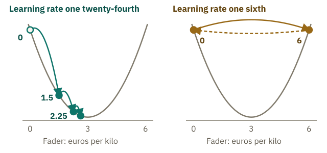

<!-- Generated from src/content/bausteine/en/parameters-training-inference-hardware.mdx by scripts/export-lessons.mjs -- do not edit by hand. -->

# Parameters, Training and Inference: How a Model Learns

> Reading copy for GitHub. The full version with interactive demos, animations and recall moments is on the website: **[Parameters, Training and Inference: How a Model Learns](https://ki-einfach-verstehen.de/en/lessons/parameters-training-inference-hardware/)**
>
> Licence: [CC BY 4.0](https://creativecommons.org/licenses/by/4.0/deed.en) · Credit it as: KI einfach verstehen, “Parameters, Training and Inference: How a Model Learns”, CC BY 4.0, https://ki-einfach-verstehen.de/en/lessons/parameters-training-inference-hardware/

What is inside a model file, what people decide before training, how training uses the error to find each fader’s direction and why learning costs more than using.

Some models can be downloaded, such as Llama 3.1, released by Meta in the summer of 2024. Its smallest version, Llama 3.1 8B, consists mainly of about eight billion numbers.

The [temperature](https://ki-einfach-verstehen.de/en/glossary/temperature/) from the previous lesson (the value that sets how much chance plays a part in the selection step) is not among them; it is chosen during use. Training set these numbers. Who decided how many there are, and how did training know for every single number whether it had to go up or down?

## What is inside a model file

Download Llama 3.1 8B and you get mainly two kinds of files. One is tiny, under a thousand characters: a kind of blueprint. The other kind consists of four large files totaling about 16 gigabytes. They hold only numbers, about eight billion of them: the parameters that training has set.

*A downloaded model consists of two parts: a small blueprint and billions of numbers.*

The “8B” stands for 8 billion parameters. That also accounts for the 16 gigabytes. Memory is measured in bytes (eight yes-or-no digits make one byte); a gigabyte is a billion bytes. Llama 3.1 stores each number in 2 bytes, so eight billion numbers give 16 billion bytes, 16 gigabytes. The next lesson explains why it is 2 bytes and whether fewer would do.

*The architecture determines how the desk is built. The parameters record where its faders sit.*

On the mixing desk from the first lesson, each fader stands for a parameter and its position for a number. The wiring of the faders corresponds to the calculation rule. The small file specifies the type of desk and its dimensions: how many computing steps it has and how many faders each gets. This blueprint is called the model’s **[architecture](https://ki-einfach-verstehen.de/en/glossary/architecture/)**. The large files record where every single fader sits. You know part of these faders from the lesson on vectors and matrices: the lookup table with a list of learned numbers for every token. Each of these numbers is a fader; how many pages and numbers the table has is set in the blueprint. Unlike on a real desk, none of these faders has a label.

What do you think: if two models have exactly the same architecture, do they also behave the same? Think about it before you read on.

Not necessarily. Meta also offers Llama 3.1 8B Instruct, with the same blueprint and number of parameters. The base version has only had basic training, learning to predict the next text piece, as in “Input and Output”. The Instruct version was then trained further to respond to questions and instructions like a chatbot. Apart from small accompanying files, they differ only in the values of their numbers. On download pages, you can recognize the version for chatting by the suffix “Instruct”.

But who decided that Llama 3.1 8B has eight and not nine billion faders?

## What people decide before training

Not training. It sets the faders but does not build a new desk. People decide before training how many computing steps the model has and how many faders each gets. The number of parameters follows from that. That is like choosing which mixing desk goes on stage.

The vocabulary size is fixed beforehand too. In the tokenizer lesson, [Byte Pair Encoding](https://ki-einfach-verstehen.de/en/glossary/byte-pair-encoding/) (BPE, which only counts) ran until the [vocabulary](https://ki-einfach-verstehen.de/en/glossary/vocabulary/) (the fixed list of all pieces a tokenizer knows) reached the size set in advance. The context window, the number of tokens the model can process at once, is fixed too. That is why every chatbot’s context window is set in the blueprint before anyone asks a question.

Such settings are called **[hyperparameters](https://ki-einfach-verstehen.de/en/glossary/hyperparameter/)**. Training does not change them; it sets the parameters. Hyperparameters include the dimensions in the blueprint, such as the number of computing steps. They also include settings for the training run itself, such as how much text the model sees.

The temperature is not trained either. Is it a hyperparameter, then? Think about it.

No. Hyperparameters are fixed before training and shape which numbers end up in the file. Whoever uses the finished model chooses the temperature only then, anew with every request. It only determines how the scores become percentages and does not change any number in the file. A chat app can therefore run the same model with low or high temperature.

*Hyperparameters are fixed before training, training sets the parameters, and the temperature is chosen only during use.*

One level deeper: how GPT-3 was set up

GPT-3 from the first lesson, a predecessor of the models behind ChatGPT, has about 175 billion parameters. Its 2020 paper lists these among the hyperparameters for the largest model:

- **96 layers.** A layer is a computing stage that processes the previous one’s result.
- **12,288 numbers per token.** The length of the vector that represents each token on its way through the layers.
- **A context window of 2048 tokens.**
- **A learning rate of at most 0.00006.** “How far a step goes” explains what it does. Its changes during training were also fixed in advance: it was ramped up at the start, then lowered.
- **A batch of 3.2 million tokens.** The training algorithm collects the corrections from this much text, then adjusts the faders once.

None of these values was learned. Layer count and vector length determine how large the desk is: the 175 billion parameters follow from them. Learning rate and batch determine how training runs.

Once everything is fixed, training begins.

## How does training know the direction?

With the spam filter from the first lesson, the training algorithm moved the weights a small step after every error to reduce it. You could still guess the direction there. When the library email “Summer reading prize: new opening hours” landed in spam, the weight of “prize” was too high. With eight billion unlabeled faders, nobody can guess. So how does the training algorithm know where each should go?

First, the error becomes a number: how far the model’s prediction is from the right answer. This error number is called **loss**. For a language model, the loss is larger when the model gives a lower percentage to the text piece that actually follows in the training text, such as “on” after “The cat sat”.

A made-up mini model with one fader predicts what apples cost: prediction equals fader times kilos, so the fader is the price per kilo. It learns from three made-up purchases: 1 kilo for 2 euros, 1 kilo for 4 euros and 2 kilos for 6 euros. There are no percentages here, so the apple model gets its own error rule: multiply each deviation by itself and add the results. That way, too much and too little count equally, and large deviations weigh more.

The fader starts at 0, like the spam filter’s weights. The model predicts 0 euros for every purchase, and the error is 56. Does it shrink with the fader at 1? Think about it.

Yes, to 26. So higher is the right direction. At 2 it drops to 8, at 3 to 2, the smallest value, and at 4 it rises back to 8. It never reaches zero, because the two one-kilo purchases contradict each other.

The purchases and rule are made up; the mini model only shows how the error tells you which way a fader must go. It does not show whether a real model’s error, which depends on billions of faders at once, also has just one lowest point.

Where do the 56 and the 26 come from?

At 0, every prediction is 0 euros, so the model is off by 2, 4 and 6 euros. Each deviation times itself gives 4, 16 and 36, 56 in total. At 1, it predicts 1, 1 and 2 euros; the deviations shrink to 1, 3 and 4. Squaring them gives 1, 9 and 16, 26 in total. At 3, the third prediction is exactly right and the first two are off by 1 euro each: the error is 2.

*The error of the made-up apple model for every fader setting: far from the bottom it falls steeply per euro, close to it hardly at all.*

The error drops less and less: first by 30, then by 18, finally only by 6. The change in error from a tiny turn at one exact point, scaled up to one euro, is the **slope**, as on a hillside. It reveals the direction: if the error falls when you turn the fader up, it must go higher; if it rises, lower. Its size reveals the distance. In a valley like this, the bottom is still far away where the slope is steep and close where it flattens out.

It is like standing on a hillside in thick fog, trying to reach the valley. You see nothing, but feel underfoot which way the ground falls and how steeply. So you step downhill and feel again. The valley represents the fader setting with the smallest error. The hillside does not exist, though: it stands for the error number at every fader setting, and training has to calculate the slope you feel.

How far should a step go? In the fog, you would stride out where it is steep and slow down just before the valley.

## How far a step goes

Step equals slope times learning rate. The **[learning rate](https://ki-einfach-verstehen.de/en/glossary/learning-rate/)** is a number people choose before training, a hyperparameter. Here it stays fixed.

For the apple model, the slope at 0 is even larger than the 30 from before. The error drops by 30 over the whole move from 0 to 1, as the hillside flattens. A tiny turn shows how steep it is right at 0: from 0 to 0.01, the error drops by just under 0.36. Multiplying by 100 scales this up to a whole euro, giving a slope of 36 at 0. The learning rate is set to one twenty-fourth here so the steps work out neatly. The first step is 36 divided by 24, 1.5. The fader moves from 0 to 1.5.

On this curve, the slope grows in proportion to the distance to the bottom. At 0, the fader is 3 euros from the bottom. At 1.5, it is only half as far, so the slope is half as large: 18. The next step is half as long, 0.75, and leads to 2.25. Each further step halves the remaining distance to the bottom at 3. With the apple model, nobody has to shorten the steps. They shrink by themselves because the slope shrinks.

What do you think happens with a learning rate four times as large, one sixth? Think about it before you read on.

The first step is 36 divided by 6, 6 euros long. The fader jumps from 0 to 6, to the other side of the valley. There the error is 56 again, but the hillside now falls the other way, and the next step leads back to 0. It jumps back and forth and never reaches the bottom. With a very small learning rate, training hardly makes progress. Experts often find the right learning rate only through several trial runs.

*The same error curve, two learning rates: with one twenty-fourth, each step halves what is left to the valley; with one sixth, the fader jumps back and forth between 0 and 6.*

> **Interactive demo:** [try it on the website](https://ki-einfach-verstehen.de/en/lessons/parameters-training-inference-hardware/)

A real model has billions of faders. Turning each one a bit and measuring the error again would mean computing the whole model billions of times per step. Instead, a method called **backpropagation** gives the slope for all faders at once, in a single pass backward through the model. Each fader then moves a bit downhill. In the apple model, a steeper slope means a bigger step. Large language models instead base each fader’s step on how large its slopes have been so far. The topic area “How learning works” shows how backpropagation finds all slopes in one pass.

The spam filter worked the same way. After the library email, a higher weight for “prize” would have increased the error and a lower one would have decreased it, so the weight moved down a bit. Where advertising emails and library emails balance out, the error reaches its lowest point.

## Learning costs more than using

An answer appears in the chat window after a few seconds. According to Meta, training Llama 3.1 8B took just under one and a half million hours of computing time, added up over all chips working on it at once. It ran on graphics processors, the chips from the lesson on vectors and matrices that carry out thousands of similar calculations in parallel. A single chip would be busy for over 160 years.

At the sound check before a concert, the band plays a few bars. The sound engineer listens and pushes faders until it sounds right. During the concert, the desk simply processes whatever comes in. The sound check stands for training. Using the finished model is called **[inference](https://ki-einfach-verstehen.de/en/glossary/inference/)** and corresponds to the concert. Every question you ask a chatbot triggers inference.

*The sound check before the concert: first the faders are set, then they stay put.*

The comparison has two limits. In training, nobody pushes faders by ear; backpropagation calculates where all faders should go. And at a real desk, the engineer still steps in during the concert. **During inference, no fader moves, whatever you type.** What a chatbot “remembers” in your conversation is sent along as input with every message, as in the lesson on input and output.

Why does one cost so much more than the other? During inference, the model computes once per text piece with its fixed numbers: input in, score list out. After the same computation, the training algorithm compares the prediction with the text piece that actually follows and measures the loss. Then backpropagation gives each of the eight billion faders its slope. The training algorithm adjusts the faders once it has collected the slopes from a large batch of text.

*Training is a loop of computing, comparing and adjusting. Inference is only the first step, with fixed numbers.*

Per text piece, training takes only about three times as much computing as answering. The amount of text explains the gap between seconds and millions of hours. An answer has a few hundred text pieces. According to Meta, Llama 3.1’s training used about 15 trillion. That is why training runs on thousands of chips at once. This training happens once per version. Single requests are cheap. But because millions of people ask questions, using the models also requires large data centers.

So nobody set the eight billion numbers of Llama 3.1 8B one by one. People fixed the blueprint and chose the learning rate. Training measured the error for trillions of text pieces, calculated each fader’s slope from it and moved the fader a bit downhill again and again. During use, the numbers stay put.

Still, 16 gigabytes for these numbers alone is a lot. So how does a language model fit on some phones while large chatbots need a data center? That is the topic of the next lesson, [Model Size and Hardware: Where a Model Fits](./model-size-and-hardware.md).

---

Source: https://ki-einfach-verstehen.de/en/lessons/parameters-training-inference-hardware/

← Previous: [Probability and Softmax: How a Model Decides](./probability-and-softmax.md) · [All lessons](../../README.md#contents) · Next: [Model Size and Hardware: Where a Model Fits](./model-size-and-hardware.md) →
