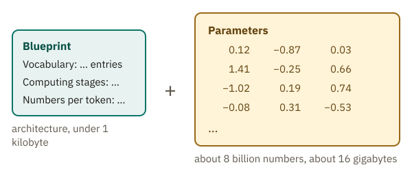
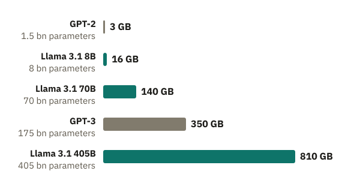
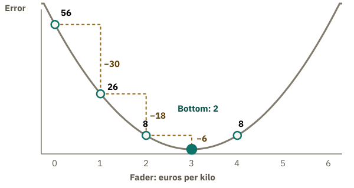
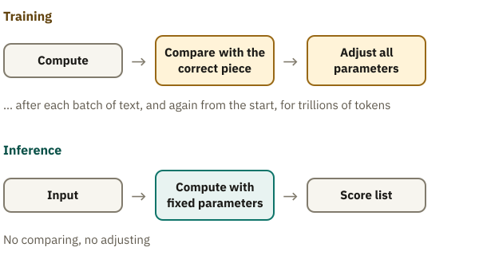

<!-- Generated from src/content/bausteine/en/parameters-training-inference-hardware.mdx by scripts/export-lessons.mjs -- do not edit by hand. -->

# Parameters, Training vs. Inference, Hardware: How a Model Runs

> Reading copy for GitHub. The full version with interactive demos, animations and recall moments is on the website: **[Parameters, Training vs. Inference, Hardware: How a Model Runs](https://ki-einfach-verstehen.de/en/lessons/parameters-training-inference-hardware/)**
>
> Licence: [CC BY 4.0](https://creativecommons.org/licenses/by/4.0/deed.en) · Credit it as: KI einfach verstehen, “Parameters, Training vs. Inference, Hardware: How a Model Runs”, CC BY 4.0, https://ki-einfach-verstehen.de/en/lessons/parameters-training-inference-hardware/

What is inside a finished AI model, what people decide before training, why learning costs so much more than using, and what hardware a model needs.

The previous lesson introduced temperature, a setting that is not trained. The scores themselves come from the model’s parameters, and training sets those. What would such a model look like if you could hold it in your hand?

You almost can, because some models are available for download, such as Llama 3.1, which Meta released in 2024. The smallest version, Llama 3.1 8B, comes as roughly 16 gigabytes of weight files. What is inside those 16 gigabytes? How did training set the numbers in them, and why did that take over a million hours of computing time? And why does a small model run on a phone while a large chatbot needs a data center?

## What is inside a model file

Download Llama 3.1 8B and you get two kinds of files. One is tiny, under a kilobyte, a kind of blueprint of the model. The other kind are the weight files, here four of them totalling 16 gigabytes. They hold numbers, about eight billion of them: the parameters that training has set. No sentence or fact appears in them as plain text.

*A downloaded model consists of two parts: a small blueprint and a huge number of numbers.*

The first lesson gave you an image for these two parts: the mixing desk. The small file names the device’s build type and dimensions, such as how many computing stages it has. This blueprint is called the model’s **[architecture](https://ki-einfach-verstehen.de/en/glossary/architecture/)**. The large files record where every single fader sits: the parameters. Unlike on a real desk, none of these faders has a label.

What do you think: if two models have exactly the same architecture, do they also behave the same?

Not necessarily. Meta also offers Llama 3.1 8B Instruct. Both versions have the same architecture and exactly as many parameters. The base version has only had basic training, predicting the next text piece. The Instruct version was trained further to respond to questions like a chatbot. Apart from small differences in the accompanying files, the numbers make the difference: same desk, different fader positions, different behavior. Chatbots, too, come from base models this way.

How many faders do large models have, and how much space does that take?

## Billions of faders: how big a model is

The “8B” in Llama 3.1 8B stands for 8 billion parameters, 8 billion faders on the desk.

Each number takes up space. Llama 3.1 stores every parameter in 2 bytes. Memory is counted in bytes. A gigabyte is a billion bytes. So eight billion numbers at 2 bytes each are 16 billion bytes, about 16 gigabytes, exactly the size of the weight files. Hence a simple rule of thumb: billions of parameters times 2 gives the memory needed in gigabytes.

Try the rule yourself: Meta also offers the model with 70 billion parameters. How much memory does that need?

About 140 gigabytes. The largest version has 405 billion parameters and so comes to about 810 gigabytes.

*Memory needed at 2 bytes per parameter: from GPT-2 to the largest Llama 3.1, it grows from 3 to about 810 gigabytes.*

GPT-3 from the first lesson, a predecessor of the models behind ChatGPT, has about 175 billion parameters and would come to 350 gigabytes. The rule counts only the parameters. Using a model adds intermediate results, so the rule gives a lower bound.

Careful with names like Llama-4-Scout-17B-16E: there, only some of the faders compute for each text piece, and the 17B counts only those. Space is still needed for all of them, 109 billion according to the model description.

But who decided on eight billion faders for Llama 3.1 8B, not nine? Not training, that much is certain.

## What is fixed before training

Before any fader moves, people have decided a lot. Training sets the faders, but it builds no new desk. How many faders there are, how many entries the vocabulary has, how many tokens fit into the context window, that is, how much text the model sees at once: all this is fixed before training.

Such settings are called **[hyperparameters](https://ki-einfach-verstehen.de/en/glossary/hyperparameter/)**. The difference: people fix hyperparameters, training sets parameters. Then there are settings that only concern training. At the mixing desk, that would be everything fixed before the sound check, such as how many channels the desk has. The sound check, setting the faders, is what training does for the model.

One hyperparameter acts directly on training: the **[learning rate](https://ki-einfach-verstehen.de/en/glossary/learning-rate/)**. In the first lesson, the training algorithm moved the spam filter’s weights a “small step” after every error. The size of that step depends on the learning rate. What do you think happens if the step is very big?

Then every correction overshoots. The weight of “prize” would jump far up after an ad email and far down after a library email, never settling where both sides balance. If the step is too small, training barely progresses. Experts often find the right learning rate only by trial.

More faders do not automatically mean better. At the AI lab DeepMind, the model Chinchilla, with the same computing time, beat Gopher, four times its size, because it saw four times as much text instead.

One level deeper: how GPT-3 was set up

The 2020 GPT-3 paper lists, among others, these hyperparameters for the largest model:

- **96 layers.** A layer is a computing stage that further processes the previous one’s result.
- **12,288 numbers per token.** The length of the vector representing each token along the way.
- **A learning rate of at most 0.00006.** How it changes over the course of training was also fixed in advance.
- **A batch of 3.2 million tokens.** The training algorithm collects the corrections from 3.2 million tokens of text, then adjusts once.

None of these values was learned. Layer count and vector length set the size of the desk: the 175 billion parameters follow from them. The learning rate and the batch determine how the sound check goes.

Once all decisions are made, training begins. But how does it know, for each fader, whether to go up or down?

## How does training know the direction?

With the spam filter from the first lesson, you can still guess the direction. With billions of unlabeled faders, you cannot.

First, the error becomes a number. The training algorithm compares a prediction with the right answer and calculates how far off it is. The bigger the number, the more wrong the prediction. Experts call it the loss.

A made-up mini model shows what this number reveals. It predicts the price of apples with a single fader, the price per kilo: prediction equals fader times kilos. It learns from three invented purchases: 1 kilo for 2 euros, 1 kilo for 4 euros, 2 kilos for 6 euros. For the error, each deviation is multiplied by itself and everything added up. That way, large deviations weigh more, and too much counts the same as too little.

The fader starts at 0, like the spam filter’s weights. The model is then off by 2, 4 and 6 euros, and the error is 4 + 16 + 36 = 56. Does it get smaller if you turn the fader to 1?

Yes: the deviations shrink to 1, 3 and 4, the error to 1 + 9 + 16 = 26. So higher is the right direction. Had the error grown, it would be the other. At 2 it drops to 8, at 3 to 2, at 4 it rises back to 8. The smallest error is at 3 euros. It never reaches zero, because the two one-kilo purchases contradict each other.

*The error of the made-up apple model for every fader setting: far from the bottom it falls steeply per euro, close to it hardly at all.*

Per turn, the error drops first by 30, then 18, finally only 6. How strongly the error changes for a small turn is the slope, as on a hillside. If the error falls when you turn up, training turns the fader further up; if it rises, training turns it down. And in a valley like this one, the more it changes, the further the bottom. That is why training takes big steps where it is steep and small ones where it flattens. The learning rate is the factor: step equals slope times learning rate.

An image for this: you stand on a hillside in thick fog and want to reach the valley. All you can feel is which way the ground falls away and how steeply. So you take a step downhill and feel again. The valley is the fader setting with the smallest error. The limit of the image: the hillside does not exist. It stands for the error number at every fader setting, and the slope you feel, training has to calculate.

> **Interactive demo:** [try it on the website](https://ki-einfach-verstehen.de/en/lessons/parameters-training-inference-hardware/)

A real model has not one fader but billions. Trying each one would mean computing the whole model billions of times per learning step, far too expensive. A method called **backpropagation** gives direction and strength for all faders at once, in one pass backward through the model. How that works is shown in the topic area “How learning works”.

Back to the spam filter: after the library email “Summer reading prize: new opening hours”, the weight of “prize” was too high. A little lower would have shrunk the error, so it moved down. The point where ad emails and harmless emails balance out is the bottom of its error curve.

Why does training take so long, then, when an answer appears in the chat window within seconds?

## Learning costs more than using

A concert has two phases at the mixing desk. At the sound check, the band plays a few bars. The sound engineer listens and pushes faders until it is right. During the concert, the desk simply processes whatever comes in. The sound check is training. Using the finished model is called **[inference](https://ki-einfach-verstehen.de/en/glossary/inference/)**: the concert.

*The sound check before the concert: first the faders are set, then they stay put.*

Here the image falls short: in training, nobody pushes faders by ear; backpropagation calculates for all faders at once where they should go. And at a real desk, the engineer still steps in during the concert. Not so with the model: during inference, no fader moves. What a chatbot “remembers” in your conversation is sent along as input with every message, as in the lesson on input and output. New versions only come from later training runs. Some providers also use stored conversations for them when the matching setting is on.

Why does one cost so much more than the other? During inference, the model computes once with its numbers for each text piece: input in, score list out. Training adds the two steps from the previous section for every example. The training algorithm measures the error: the smaller the segment of the actual next text piece on the wheel from the softmax lesson, the bigger the error. Then backpropagation gives direction and strength for every parameter. For Llama 3.1 8B, that is eight billion corrections per portion of training text.

*Training is a loop of computing, comparing and adjusting. Inference is only the first step, with fixed numbers.*

And training needs a huge number of examples. Llama 3.1 was trained on about 15 trillion tokens. For the smallest version, Meta reports 1.46 million hours of computing time on graphics chips (the graphics processors from the tensor lesson). A single chip would need over 160 years, so training runs on thousands of chips at once. This effort happens once for each version. A single request is cheap by comparison, but millions of requests also take large data centers.

Memory, too, does not stop at the parameters. For every fader, training remembers its correction, a more precise copy and two helper values, about 16 bytes instead of 2. So even without intermediate results, training needs eight times the space of using the model: for Llama 3.1 8B, well over 100 gigabytes instead of 16.

One level deeper: what training also keeps in memory

First, each parameter’s slope from the last computing step, called the gradient when there are many faders. Second, the popular training method Adam keeps two running averages for every parameter, over the direction and the size of the latest corrections. Third, the computing uses 2-byte numbers, but a more precise 4-byte copy of all parameters is kept. Otherwise tiny corrections could vanish in rounding.

The paper on the memory technique ZeRO breaks it down: 2 bytes for the parameter, 2 for its gradient, 12 for the precise copy and the two Adam values. That makes 16 bytes per parameter. For Llama 3.1 8B, 16 bytes give about 130 gigabytes, more than one 80-gigabyte data-center chip holds. Add the intermediate results of every computing stage, which backpropagation needs. Techniques like ZeRO therefore spread all this data across many chips.

And what does a finished model run on when you use it?

## Space and speed: what hardware a model needs

Some phones run a language model on the device itself, Apple’s with about 3 billion parameters. Large chatbots run in data centers. Are phones simply too slow?

Here the mixing desk image ends: a model is not a device but a file. “Running” means a chip loads all fader positions and computes with them. A graphics chip computes fastest with numbers in its own adjacent memory, the **[GPU memory](https://ki-einfach-verstehen.de/en/glossary/gpu-memory/)**, often called VRAM. All parameters must fit there for a model to run quickly.

*A graphics chip computes with the numbers in its own fast memory.*

The gaming graphics card GeForce RTX 4090 has 24 gigabytes of GPU memory; Llama 3.1 8B, at 16 gigabytes, fits. A data-center chip like Nvidia’s H100 has 80 gigabytes in its common version. The largest Llama 3.1, about 810 gigabytes, needs several chips. So the first limit is space, not speed.

In a phone, model, system and all apps share the same memory (RAM): 8 to 16 gigabytes on current Pixel phones. By the rule of thumb, a 3-billion-parameter model would need 6 gigabytes, almost all of an 8-gigabyte phone. How does it fit? The answer is **[quantization](https://ki-einfach-verstehen.de/en/glossary/quantization/)**: every number is stored with fewer digits, that is, rounded more coarsely. This is counted in bits, the smallest yes-or-no units of memory. A byte has 8, so 2 bytes have 16.

8 bits instead of 16 halve the space; 4 bits leave a quarter. Apple even shrinks most of its phone model to 2 bits per number, an eighth. Coarser numbers can cost some accuracy, depending on the method. At 8 bits, the drop is often barely measurable, even for models the size of GPT-3.

> **Interactive demo:** [try it on the website](https://ki-einfach-verstehen.de/en/lessons/parameters-training-inference-hardware/)

One level deeper: why the answer appears piece by piece

Each new text piece takes one pass through the whole model, and all parameters have to travel from GPU memory to the chip’s compute units. With single requests, this loading takes longer than the computing.

Memory bandwidth is how many gigabytes memory can deliver per second. For the H100 in its common SXM version, the manufacturer gives 3.35 terabytes per second, or 3350 gigabytes. A rough estimate with Llama 3.1 8B: 3350 divided by 16 is about 209. With 16-bit numbers, a single request on this chip thus hardly gets beyond about 200 text pieces per second, however fast it computes. In practice, it is fewer.

So data centers process many people’s requests together, in the batch from the lesson on input and output: the chip loads the parameters once and uses them for all requests in that step.

That answers the opening question: the 16 gigabytes of Llama 3.1 8B hold a small blueprint and about eight billion numbers. People decided beforehand how the desk is built. Training spent over a million chip hours measuring errors and moving every fader downhill. Using the model means computing with fixed numbers, and where that works depends first on space.

One question remains. No sentence is written in these billions of numbers. So how can a model know that Paris is the capital of France? That is the topic of the next part: what an AI model really is, and why it is not a database of facts.

---

Source: https://ki-einfach-verstehen.de/en/lessons/parameters-training-inference-hardware/

← Previous: [Probability and Softmax: How a Model Decides](./probability-and-softmax.md) · [All lessons](../../README.md#contents) · Next: [What an AI Model Actually Is](./what-an-ai-model-actually-is.md) →
