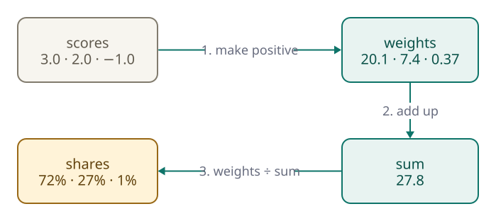
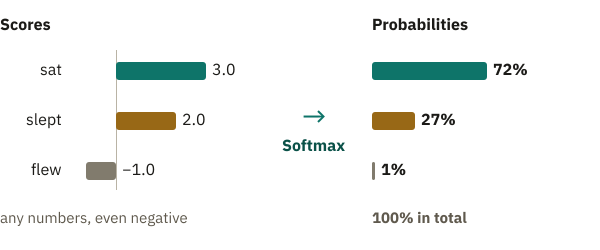
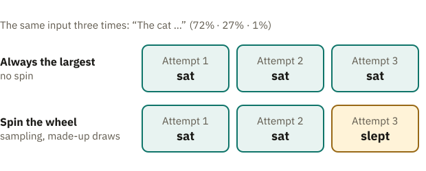
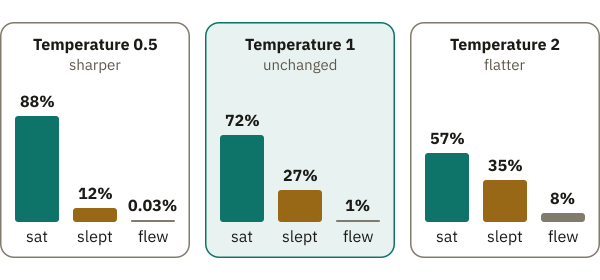

<!-- Generated from src/content/bausteine/en/probability-and-softmax.mdx by scripts/export-lessons.mjs -- do not edit by hand. -->

# Probability and Softmax: How a Model Decides

> Reading copy for GitHub. The full version with interactive demos, animations and recall moments is on the website: **[Probability and Softmax: How a Model Decides](https://ki-einfach-verstehen.de/en/lessons/probability-and-softmax/)**
>
> Licence: [CC BY 4.0](https://creativecommons.org/licenses/by/4.0/deed.en) · Credit it as: KI einfach verstehen, “Probability and Softmax: How a Model Decides”, CC BY 4.0, https://ki-einfach-verstehen.de/en/lessons/probability-and-softmax/

How a language model turns its scores into shares, why it sometimes picks the obvious choice and sometimes something else, and what temperature changes about that.

When you have a chatbot regenerate an answer, you often get a different one, even though your question stayed the same. As you learned in the lesson on input and output, the model computes, in principle, the same [score](https://ki-einfach-verstehen.de/en/glossary/score/) list every time it receives the same input. It gives each [token](https://ki-einfach-verstehen.de/en/glossary/token/) a rating for how well it fits next. A separate step after that makes the choice, and that is where chance comes in. Scores like 7.1 or −2.3 from the previous lesson are not yet probabilities. How do they turn into exactly one token?

You type “The cat”, and there are only three possible continuations: “sat” with the score 3.0, “slept” with 2.0 and “flew” with −1.0. These scores are made up for the example. A person set them; nothing was trained. A real model gives a score to every token in its [vocabulary](https://ki-einfach-verstehen.de/en/glossary/vocabulary/). For GPT-2, that means 50,257 tokens. It computes each score from its [parameters](https://ki-einfach-verstehen.de/en/glossary/parameters/), the numbers set during training. With these made-up scores, you can only work through how scores turn into a chosen token. They do not tell you which continuation a real model prefers after “The cat”.

## How often should “sat” come up?

Suppose the model has to choose the next token after “The cat” a hundred times. How often should “sat” come up, and how often “flew”? Try to read it off the scores before you read on.

If the selection step always takes the highest score, as in the lesson on input and output, “sat” comes up a hundred times, and regenerating would never give you anything else. If “slept” is to come up now and then too, you need to specify how often. The scores do not tell you that. “flew” is where it breaks down. Its score is negative, and “minus once in a hundred” does not exist. Scores have no fixed total either. With a different sentence opening, the whole list can be higher or lower. A score only says which token is ahead of another and by how much. It does not say how often the token should come up.

*Three possible continuations of “The cat …”: sat, slept, flew. Not all of them are equally likely.*

As on a prize wheel, each token gets a segment whose size tells you how often it comes up over very many tries. All the segments together fill the whole wheel. The larger a segment, the more often the pointer stops there. A segment’s share of the wheel is called its **[probability](https://ki-einfach-verstehen.de/en/glossary/probability/)** and always lies between 0 and 100 percent. The list of all shares, which together make exactly 100 percent, is called a **probability distribution**, or distribution for short. A chatbot needs a wheel like this for each token it adds to an answer, and a new one after each token is appended. So how do you build a wheel from 3.0, 2.0 and −1.0?

## From points to shares: softmax

After a quiz night, the scoreboard hangs on the wall. Team A has 30 points, team B 20, team C 10. So team A has half of all 60 points.

This does not work with scores. They add up to 4.0, and “flew” would get −1.0 of that, a negative share. A segment smaller than nothing cannot fit on any wheel.

So the selection step, after the model, first turns each score into a positive number, called its strength here. It is calculated anew for each score list. A fixed rule applies: a score of 0 gets a strength of 1. Each point above multiplies it by about 2.7, and each point below divides it by 2.7. Then the selection step adds up the strengths. Finally, it divides each strength by this sum, just as a team’s points are divided by the total.

“sat” is three points above zero and gets 2.7 · 2.7 · 2.7, “slept” gets 2.7 · 2.7 and “flew” 1 ÷ 2.7. Calculated with the exact factor, that comes to about 20.1, 7.4 and 0.37, together about 27.8.

Dividing by 27.8 gives about 72 percent for “sat”, about 27 for “slept” and about 1 percent for “flew”. This calculation is called **[softmax](https://ki-einfach-verstehen.de/en/glossary/softmax/)**. It turns any score list into a distribution, a wheel.

[▶ watch the animation on the website](https://ki-einfach-verstehen.de/en/lessons/probability-and-softmax/)

*Softmax in three steps: turn scores into positive strengths, add up the strengths, divide each strength by the sum. The scores are made up.*

Suppose you add 10 to all three scores, giving 13.0, 12.0 and 9.0. Do the percentages get larger, smaller, or stay the same?

They stay exactly the same. Adding ten points multiplies every strength and the sum by the same factor, which cancels out when you divide. That is what the rule is made for: as the first section showed, a whole score list can sit higher or lower without its message changing. This is where the scoreboard comparison stops working. If every team there got 10 extra points, the shares would shift. **With scores, all that counts is how far apart they are.**

On the wheel, the highest score always gets the largest segment. Each point in a token’s lead multiplies its strength. A one-point lead makes it about 2.7 times as large; a two-point lead makes it a good seven times as large. A token far ahead of all the others therefore gets almost the whole wheel. No token drops all the way to zero; even “flew” keeps about 1 percent.

*Softmax turns made-up scores into shares: the order stays the same, and the sum is 100%.*

The image recognition example from the lesson on input and output usually uses exactly the same calculation. There, the cat was a good three points ahead of the dog and got about 96 percent. Even the car kept a tiny share above zero. In a language model like GPT-2, the same calculation can run before every new token, using the scores for its entire vocabulary.

One level deeper: the formula behind softmax

The strength of a score is the number e raised to the power of the score. e is a fixed number from mathematics, roughly 2.718. The small number at the top counts how often you multiply by e: e³ = e · e · e ≈ 20.1 and e² = e · e ≈ 7.4. A negative number at the top means dividing: e⁻¹ = 1 ÷ e ≈ 0.37. And e⁰ is 1, just as in the rule above. For candidate number i, the formula is:

`Softmax(xᵢ) = eˣⁱ / Σⱼ eˣʲ`

The candidate’s strength is at the top. At the bottom, the summation sign Σ gives the sum of all strengths.

The name comes from the hard rule “take the largest” (max). Softmax is its soft version: the largest gets the most, the others keep something, and the larger the lead, the closer softmax comes to the hard rule. In technical language, the scores before softmax are called **logits**.

## Take the favorite or spin the wheel

Softmax has built the wheel. “sat” has a segment of 72 percent, “slept” one of 27 percent, “flew” a thin strip. Nothing has been chosen yet. In the lesson on input and output, the selection step simply took the token with the highest score, “on” with 8.1 after “The cat sat”. The wheel is not spun at all, and the pointer points to the largest segment. This kind of selection is called **greedy selection** (technically: greedy decoding). Because softmax does not change the order, the largest segment always belongs to the highest score. So you would not need softmax for greedy selection at all.

*The prize wheel after softmax: each segment is as large as its probability.*

You only need the wheel to choose at random. It really is spun, and the token where the pointer stops is chosen. This is called **[sampling](https://ki-einfach-verstehen.de/en/glossary/sampling/)**, from drawing a sample. Over 100 spins, the pointer lands on average about 72 times on “sat”, 27 times on “slept” and once on “flew”. In everyday life, chance brings to mind a die, where every side comes up equally often. **The wheel, by contrast, makes weighted choices:** large segments come up often, thin ones rarely. With sampling, answers therefore differ from one time to the next, without the model stringing random words together.

*The same input three times: always taking the most likely gives “sat” three times. Spinning the wheel gives “sat” most of the time and sometimes something else (made-up draw).*

So why doesn’t a chatbot always take the largest segment? For short answers like a number, that works well. Longer texts, though, turn bland and tend to repeat the same phrases over and over. That reinforces itself. Once a phrase appears twice in the text, repeating it often becomes the most likely continuation, and greedy selection cannot get out of this rut. Sampling brings in variety, because now and then the second- or third-best token comes up too.

A wheel only ever applies to one token. Before every new token, the model computes a new score list, softmax builds a new wheel from it, and that wheel is spun exactly once. The chosen token is appended, and the loop starts over. When you have an answer regenerated, all the wheels are spun again. The first wheel is, in principle, the same as the first time. But if the pointer stops somewhere else, say on “slept” instead of “sat”, all following rounds continue with that token, because nothing is taken back. That is how the same question gets a different answer, even though nothing about the model has changed. Try it in your own chatbot: have a short answer regenerated three or four times and watch for the word where the versions part ways.

The three segments are a simplification. A real wheel has a segment for every token of the vocabulary, most of them hair-thin. How strongly chance acts when spinning can also be adjusted.

## More or less randomness: temperature

Not every task tolerates the same amount of chance. If a program is supposed to pull the same date out of an email every time, any deviation is a problem. For ten suggestions for a title, variety is welcome. That is why many models let you send a value called **[temperature](https://ki-einfach-verstehen.de/en/glossary/temperature/)** with every request from your own program. It acts in the selection step. The model delivers its scores as always. Then they are divided by the temperature, and only then does softmax turn them into shares. At temperature 1, the shares stay at 72, 27 and 1 percent.

At temperature 0.5, dividing by 0.5 means doubling the scores. So 6, 4 and −2 go into softmax. “slept” was one point behind “sat”, now two; “flew” was four points behind, now eight. Because every point of lead multiplies the strength, “sat” now gets about 88 percent, and “flew” almost nothing. The large segment gets even larger.

At temperature 2, the scores are divided by 2. Think about what happens to the thin segment for “flew”.

> **Interactive demo:** [try it on the website](https://ki-einfach-verstehen.de/en/lessons/probability-and-softmax/)

If the scores are divided by 2, all gaps shrink by half, and the segments even out. “flew” is now only two points behind “sat”. Its segment grows from about 1 to about 8 percent. Over 100 spins it therefore comes up about eight times instead of once.

*The same made-up scores, three temperatures: a low temperature sharpens the distribution, a high one evens it out.*

The closer the temperature gets to 0, the larger the gaps become, until practically only the largest segment is left. You cannot divide by 0 itself. So for temperature 0 there is a fixed rule: the programs take the largest segment without spinning. That is greedy selection.

*The temperature controls how strongly the gaps between the scores count.*

**Temperature changes neither the model nor its scores.** It is not a parameter, is not trained, and can be set differently for every request. So a high temperature does not make the model smarter. The answers become more varied. Temperature gives rare tokens a chance more often, good fits and poor fits alike. In most chat apps, you will find no temperature slider; the provider sets the value.

## What 72 percent does not mean

If a model gives “sat” 72 percent, it is tempting to think it is 72 percent sure that “sat” is correct. **But all it means is the size of the segment on the wheel for the next token.** The basic training from the lesson on input and output explains where this size comes from. There, the label was always the token that really followed in the text.

Suppose that in the training texts, “The cat” is followed seven times by “sat” and three times by “slept”. Each example nudges the parameters a little, so that the score of its label rises compared with the others. “sat” is the label more often, so its score rises more often. In the end, softmax turns the scores after “The cat” into segments of roughly 70 and 30 percent. So the model learns how often a continuation followed. Nobody checks along the way whether it is true. The further training that turns a model into a helpful chatbot shifts the scores once more. That still does not make the segments a reliable measure of whether an answer is correct.

Suppose that in many training texts, “The capital of Australia is” is followed by “Sydney”. Then “Sydney” gets a large segment, even though Canberra is the capital. A chatbot then phrases a wrong answer just as fluently as a right one. A later lesson on convincingly wrong answers shows how often that happens and how you can notice it.

So the different answer you get when regenerating comes from a new spin of the same first wheel, not from a changed model. The model computes the scores from its parameters. Unlike the temperature, these parameters are set in training. The next lesson shows how many parameters a model has, how training sets them and what happens when you use a finished model.

---

Source: https://ki-einfach-verstehen.de/en/lessons/probability-and-softmax/

← Previous: [Scalar, Vector, Matrix, Tensor: the Building Blocks of Numbers](./scalar-vector-matrix-tensor.md) · [All lessons](../../README.md#contents) · Next: [Parameters, Training vs. Inference, Hardware: How a Model Runs](./parameters-training-inference-hardware.md) →
