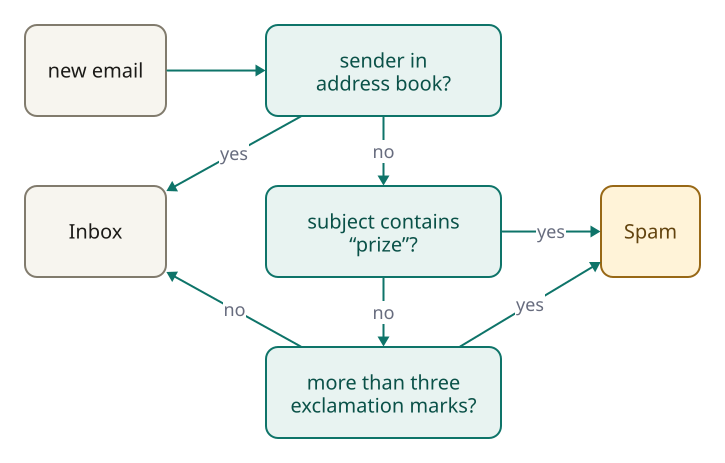
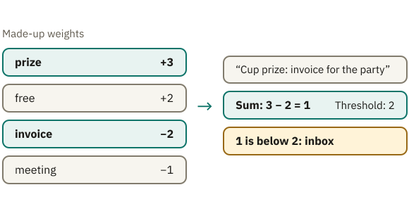
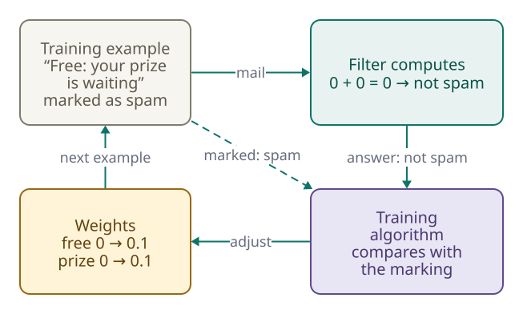
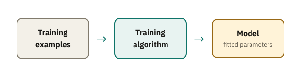

<!-- Generated from src/content/bausteine/en/program-algorithm-model.mdx by scripts/export-lessons.mjs -- do not edit by hand. -->

# Program, Algorithm, Model Compared

> Reading copy for GitHub. The full version with interactive demos, animations and recall moments is on the website: **[Program, Algorithm, Model Compared](https://ki-einfach-verstehen.de/en/lessons/program-algorithm-model/)**
>
> Licence: [CC BY 4.0](https://creativecommons.org/licenses/by/4.0/deed.en) · Credit it as: KI einfach verstehen, “Program, Algorithm, Model Compared”, CC BY 4.0, https://ki-einfach-verstehen.de/en/lessons/program-algorithm-model/

What is the difference between AI and an algorithm? Classic software follows rules a person writes down. An AI model is made of numbers set by training.

Somewhere in your mailbox there is a folder you rarely open: spam. That is where the emails end up that promise you a lottery win or announce a parcel you never ordered. Most of the time the filter sorts them correctly, even though you never explained to it what junk mail is. How does it know?

The obvious answer: someone wrote down rules for it. Many people picture [AI](https://ki-einfach-verstehen.de/en/glossary/ai/) as a giant rulebook that experts filled in line by line. For some software, that is true. For what people usually mean by AI today, it is not. Three terms that often get mixed up in everyday language show where the difference lies: program, algorithm and model.

## Who actually writes the rules?

Suppose you had to build a spam filter yourself. The obvious way: you write down rules. A made-up but typical filter might have three. If the sender is in your address book, the email goes straight to the inbox. Otherwise: if the subject contains the word “prize”, it goes to spam. The same goes for an email with more than three exclamation marks. Everything else lands in the inbox. This is exactly how a classic **[program](https://ki-einfach-verstehen.de/en/glossary/program/)** works: a sequence of instructions, laid down by a person, that a computer carries out step by step.

The computer understands none of these rules. It checks whether a condition holds and carries out whatever comes after it. Everything the filter can do is in these lines. If you want to know why an email ended up in spam, you look it up and find the rule that fired.

*A rule filter: every email passes fixed conditions that people wrote.*

The procedure behind these lines can also be described without a computer: compare the sender with the address book, read the subject, count the exclamation marks, decide. A precisely defined procedure like this is called an **[algorithm](https://ki-einfach-verstehen.de/en/glossary/algorithm/)**. It resembles a recipe, a sequence of steps that leads to the result no matter who carries them out. The program is the version of this recipe that a computer can run. The comparison has a limit: a recipe may say “a pinch of salt” and leave the rest to you. An algorithm leaves no such leeway; every step has to be unambiguous.

*An algorithm is like a recipe: fixed steps, no matter who carries them out.*

Rule filters have a weakness that spammers find quickly. If the subject says “PR1ZE” instead of “prize”, the prize rule no longer fires. So a rule for the spelling with the 1 gets added, then one for “p-r-i-z-e”, then one for the next loophole. As the rules get stricter, they also catch genuine emails, such as the message from your sports club about the cup prize.

The programmer Paul Graham described exactly this experience in 2002. By his own account, he had spent about half a year on software that looked for individual spam features. The stricter he made the filters, the more genuine emails they sorted out. Then he tried a different route: a filter whose rules nobody writes down.

## A mixing desk instead of a list of rules

How can a filter decide without anyone telling it which words are suspicious? With numbers. Suppose the filter stores a number for every word, a **weight**. The following values are made up and only meant to show the principle: “prize” has the weight +3, “free” +2 and “invoice” −2. All other words count as 0. For every email, the filter adds up the weights of the words it contains. If the sum is above 2, the email counts as spam.

Two emails show how this plays out. “Free: your prize is waiting” gives 2 + 3 = 5, so spam. And the email from the sports club, “Cup prize: invoice for the party”? It comes to 3 − 2 = 1, stays below the threshold and lands in the inbox. **No if-then line decides this email.** The result follows from how the weights balance each other. So far, though, someone still made these weights up.

*Made-up weights, one email worked through: the sum decides, not a single rule.*

A filter like this is a small **[model](https://ki-einfach-verstehen.de/en/glossary/model/)**: a calculation whose behavior depends on stored numbers. These numbers are called **[parameters](https://ki-einfach-verstehen.de/en/glossary/parameters/)**, often also weights. The calculation itself is as simple as it gets: it adds up and compares with the threshold. A person wrote this calculation too, but it says nothing about spam. Which words are suspicious is in the numbers *alone*. What the filter actually does is decided by the parameters. Change a single number and it decides differently, without a single line of program code changing.

A mixing desk makes this tangible. Every fader is a parameter, and its position is a number. How the faders are wired up corresponds to the calculation, which for the spam filter means: add up and compare with the threshold. The same desk can make a song sound muffled or clear, depending on where the faders sit. In the same way, the same calculation can recognize spam or do nothing useful at all, depending on which numbers are in it.

*A model is like a mixing desk: what comes out depends on where the faders sit.*

That sorts out the three terms. The algorithm is the procedure, the program its executable version, and the model a calculation whose behavior lies in parameters that are set from examples during training. What training means exactly is still open, and with it the question of who set the faders.

> **Interactive demo:** [try it on the website](https://ki-einfach-verstehen.de/en/lessons/program-algorithm-model/)

## How the faders find their positions

Not by hand, at any rate. Two procedures are at work in the spam filter. You already know the first: it judges an email by adding up and comparing with the threshold. That is an algorithm too, just one that cannot recognize spam without the numbers set in it. The second sets the numbers the first one computes with. It is called a **[training algorithm](https://ki-einfach-verstehen.de/en/glossary/training-algorithm/)**. For this it needs examples where the right answer is already known: thousands of emails that people have marked beforehand as spam or as normal mail.

At the start, all weights are zero, so the filter considers no word suspicious and lets every email through. Then the same loop runs over and over. The filter gets an example and computes its answer. The training algorithm compares this answer with how the email was marked. If the filter got it wrong, the training algorithm shifts the weights involved a small step in the direction that makes the error smaller: so that this email’s sum moves a little closer to the correct side of the threshold. Then the next example comes. This repeated adjusting based on examples is called **training**.

[▶ watch the animation on the website](https://ki-einfach-verstehen.de/en/lessons/program-algorithm-model/)

*The training loop: compute the answer, compare it with the marking, adjust the weights a little, next example.*

The first training email reads “Free: your prize is waiting”, marked as spam. The filter computes 0 + 0 = 0 and lets it through. Wrong. So the weights of “free” and “prize” move up a little. After thousands of such rounds, typical advertising words have high numbers, words from normal mail low or negative ones.

Think for a moment before you read on: during training, a genuine email from your library turns up, “Summer reading prize: new opening hours”, marked as normal mail. The filter takes it for spam, because “prize” has a high weight by now. What happens to that weight now?

It drops a little, and with it the weights of the other words in this email, such as “hours”. That way, words that often appear in harmless mail slip below zero over time. So advertising emails containing “prize” keep pushing the weight up a little, and harmless emails containing “prize” keep pushing it down a little. It stops where the two sides balance out: high enough to catch most advertising, but not so high that every library newsletter lands in spam.

So much for the made-up example. Does this also work with real mail?

## What the filter actually learns

Graham showed in 2002 that weights taken from examples also work with real mail, though by a simpler route than the loop above: by counting. He no longer had to decide how suspicious each word was. From collections of spam and normal mail, his filter worked out a number for every word by itself, saying how typical the word is of spam: similar to the weights above, just calculated differently. In Graham’s own test, this filter missed fewer than 5 in 1000 spam emails and did not sort out a single genuine email. That was a measurement on his own mail, not a general study.

One level deeper: what Graham still set by hand

Graham’s filter did not nudge weights step by step like the loop above. It counted. For every word, it recorded how often it appeared in the spam collection and how often in the normal mail, each divided by the number of emails in that collection. From this came a probability: how likely is an email containing this word to be spam? An example: a word appears in 100 of 1,000 spam emails and in 5 of 1,000 normal ones. Graham doubled the 5 to 10 (the reason follows below). That gives 0.1 against 0.01. Of the combined 0.11, 0.1 falls to spam, so the word gets about 0.9. A word that appears almost only in spam ends up close to 1, a word from normal mail close to 0.

These word values came from the data. How to calculate with them, Graham decided himself, much of it, by his account, through trial and error:

- He doubled every count from the normal mail. This pushes down the values of words that occasionally appear in genuine mail too, and protects against false positives, that is, genuine emails in spam.
- He only considered words that appeared more than five times in total.
- No value went below 0.01 or above 0.99. No single word was ever completely certain.
- A word the filter had never seen got 0.4: fairly innocent, because spam words tend to be all too familiar.

When a new email arrived, the filter used only its 15 most striking words, the ones whose value lay furthest from 0.5. It combined these 15 values with Bayes’ rule, a formula from probability theory, into one overall value. The formula amplifies agreement: if most of the 15 words are close to 1, the overall value ends up very close to 1; if they are close to 0, very close to 0. If that was above 0.9, the email counted as spam. According to Graham, it hardly mattered where exactly this threshold sat, because few emails ended up in the middle.

Mapped onto the example filter: Graham’s word values correspond to the weights, the 0.9 to the threshold of 2. The word values came from the examples. How they were calculated and combined was chosen by a person: the doubling, the minimum count, the limits 0.01 and 0.99, the value 0.4, the 15 words and the threshold.

People often say a filter like this has learned what spam is, and the whole approach is called **[machine learning](https://ki-einfach-verstehen.de/en/glossary/machine-learning/)**. The word only fits with a caveat. The filter has not *understood* what advertising is. **All that changed were numbers:** in the example filter through adjusting, until the errors on the examples were small; in Graham’s through counting. Most of today’s training algorithms work like the loop above, only more precisely: measure the error, adjust a little, repeat.

## Where the mixing desk reaches its limit

The mixing desk has a limit, too. The faders on a real desk have names printed on them: bass, treble or volume. The parameters of a large model have no such names, and there are unimaginably many of them. The model GPT-3 from 2020, a forerunner of the models behind ChatGPT, has around 175 billion. What a single one does cannot be put into words; **only all of them together produce the behavior**. The example filter with its three words is so small that you can still read every weight. That makes it good for explaining, and that is exactly where it differs most from real models.

But if nobody writes down rules, why does the idea of the giant rulebook persist so stubbornly?

## Why the rulebook idea is so persistent

*How many people picture AI: a rulebook so thick it has a line for every case.*

The idea does not come out of nowhere. Almost everything else you use on a computer really does work with fixed instructions, from spreadsheets to traffic light control. AI itself looked like this for a long time, too. **[Expert systems](https://ki-einfach-verstehen.de/en/glossary/expert-systems/)** emerged in the 1970s, were widespread by the 1980s and were among the first truly successful forms of AI software. They were meant to emulate the decisions of experts and at their core consisted of large collections of if-then rules.

So if you picture AI as a rulebook, the image in your head is one that really existed. It just does not describe the trained models that are usually meant today. Mixed systems still exist, though: according to Google, Gmail, for example, combines learned models with other protective filters, including rule-based ones.

Why the difference matters becomes clear when something goes wrong. With the rule filter, you find the line that fired and change it. **In a trained model, that line does not exist, only numbers.** In the small example filter, the weight of “prize” still tells you the word is suspicious. With billions of unnamed parameters, no single number says “prize is suspicious”. The errors of a trained model also come from the examples. If the people doing the marking had marked every email with the word “invoice” as spam, the filter would have picked up exactly that. There would be no wrong rule anywhere that you could correct.

Back to the question from the beginning: how does the spam filter know what junk mail is? From numbers that a training algorithm set using many marked examples, not from rules that someone wrote down. Once training is over, the faders stay where they are. From then on, the model works like an ordinary program: it receives something, computes with its fixed parameters and outputs something. As long as nobody retrains it, a new email no longer moves any fader.

*First the training algorithm sets the parameters, then the model works with these fixed values.*

With the spam filter, it is easy to see what goes in and what comes out: an email in, a verdict out. With a model that writes texts or recognizes images, this is less obvious. What exactly goes in there and what comes out is the subject of the next lesson, [Input and Output](./input-and-output.md).

---

Source: https://ki-einfach-verstehen.de/en/lessons/program-algorithm-model/

[All lessons](../../README.md#contents) · Next: [Input and Output: What a Function Does](./input-and-output.md) →
