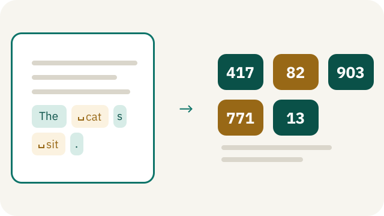
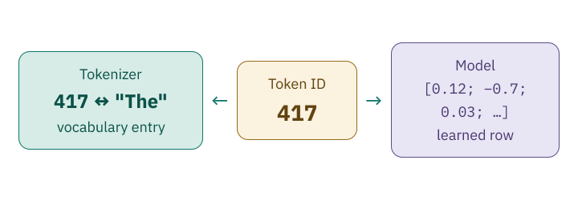

<!-- Generated from src/content/bausteine/en/token-ids-and-vocabulary.mdx by scripts/export-lessons.mjs -- do not edit by hand. -->

# Token IDs: How Tokens Become Numbers

> Reading copy for GitHub. The full version with interactive demos, animations and recall moments is on the website: **[Token IDs: How Tokens Become Numbers](https://ki-einfach-verstehen.de/en/lessons/token-ids-and-vocabulary/)**
>
> Licence: [CC BY 4.0](https://creativecommons.org/licenses/by/4.0/deed.en) · Credit it as: KI einfach verstehen, “Token IDs: How Tokens Become Numbers”, CC BY 4.0, https://ki-einfach-verstehen.de/en/lessons/token-ids-and-vocabulary/

Shows how a tokenizer uses its vocabulary to turn every text piece into a number and back, why that number means nothing, why tokenizer and model belong together, and how many tokens a model processes at once.

In the previous lesson, a [tokenizer](https://ki-einfach-verstehen.de/en/glossary/tokenizer/) split text into [tokens](https://ki-einfach-verstehen.de/en/glossary/token/), pieces from its fixed list, the [vocabulary](https://ki-einfach-verstehen.de/en/glossary/vocabulary/). GPT-2’s tokenizer, for example, turned the German word “Frankreich” into “Frank”, “re”, and “ich”. It had already learned which pieces exist by counting. But a [model](https://ki-einfach-verstehen.de/en/glossary/model/) cannot calculate with “Frank”; it needs numbers. Which number does a piece like “Frank” get, and does that number tell the model anything about what it means?

## Every piece gets a number

Every piece in the vocabulary has a fixed number, its **[token ID](https://ki-einfach-verstehen.de/en/glossary/token-id/)**. The tokenizer assigns these numbers once, when it learns its vocabulary; after that, they never change. So the number only tells you where a piece is in the list.

*The vocabulary as a card index: for every piece of your sentence, the matching card is pulled out.*

The vocabulary works like a card index. Each card holds a piece of text and a number. The tokenizer splits your sentence according to its rules, finds the card for each piece, and writes down its number. The result is a sequence of numbers, in the order of the pieces. The box always stays the same; the tokenizer pulls out a new row of cards for each text. A card holds only a sequence of characters, no explanation of what it means. And the tokenizer does not pick cards that fit the content; it takes exactly the ones its rules produce.

This invented mini vocabulary has five cards. The symbol ␣ stands for a space that belongs to the piece.

| Token ID | Text piece |
| ---: | :--- |
| 417 | “The” |
| 82 | “␣cat” |
| 903 | “s” |
| 771 | “␣sit” |
| 13 | “.” |

The pieces and numbers are invented for the example; nothing was trained here. Picture the five cards as a small selection from a much larger box; that is why they are not numbered 1 to 5. Real vocabularies have tens of thousands to hundreds of thousands of entries, and 417 usually stands for something entirely different there.

The tokenizer receives “The cats sit.” and splits the sentence into “The”, “␣cat”, “s”, “␣sit”, and “.”; there is no piece “␣cats” in this list. Then it looks up each piece and outputs the sequence 417, 82, 903, 771, 13. This step from text to numbers is called **[encoding](https://ki-einfach-verstehen.de/en/glossary/tokenizer/)**. The model receives exactly these five numbers as input. Every message you send to a chatbot is encoded like this before the model sees it.

*A sentence is first split into text pieces, then translated into numbers using the invented mini vocabulary. The symbol ␣ marks a space that belongs to the piece.*

## The way back: numbers become text

A chatbot’s answer also starts as numbers. Remember the loop: the model outputs a [score](https://ki-einfach-verstehen.de/en/glossary/score/) for every piece in the vocabulary, and the selection step picks one of them. This score list is ordered by the vocabulary’s numbers: entry 417 rates the piece with number 417. When the selection step picks an entry, it also picks that entry’s number, say 82. To make the answer readable, the tokenizer works in reverse: it looks up each number and joins the stored pieces in the same order. This reverse step is called **[decoding](https://ki-einfach-verstehen.de/en/glossary/tokenizer/)**.

So 417, 82, 903, 771, 13 becomes “The cats sit.” again. The spaces are not lost, because they are already stored in “␣cat” and “␣sit”. Order matters, too: 82, 903, 417 gives “catsThe”, with a space at the start.

In the card-index picture, a token is the piece on a card, such as “␣cat”. The token ID is the number on it, such as 82, and the vocabulary is the whole box. The tokenizer is the program that pulls out the cards according to its rules and translates the numbers back into pieces.

Before you read on, guess what comes out when you swap 417 and 82.

> **Interactive demo:** [try it on the website](https://ki-einfach-verstehen.de/en/lessons/token-ids-and-vocabulary/)

If you swap 417 and 82, you get “catThes sit.”, with a space at the start. Each number only brings back its own piece, space included.

## An ID is a label

Does 417 tell the model that “The” is an article? No. In the invented mini vocabulary, 417 stands for “The”, but in GPT-2’s real vocabulary it stands for “el”, a word part. **A number is only valid within its vocabulary**. It measures nothing for the model, which never calculates with the number’s size. The model uses it only to look something up.

*An ID is only a label: a number that says nothing about the content.*

Where does the model store what it has learned about “The”? The spam filter from the first lesson stored one number for each word, a weight; in the made-up example, “prize” had the weight +3. Instead of a single number, a language model stores a whole list of learned numbers for each token ID. In a made-up example, that list contains 0.3, −1.2, 0.8, and so on. These are [parameters](https://ki-einfach-verstehen.de/en/glossary/parameters/) too, adjusted in training like the spam filter’s weights. The ID only tells the model which list to fetch. The calculation for the piece starts with this list.

The output is a separate score list, ordered by the same numbers. It is not stored; the model calculates it again for every input. GPT-2’s score list has exactly one entry for every piece in its vocabulary, so both have 50,257 entries.

*In the tokenizer, the same ID 417 is the number of the text piece “The” from the mini vocabulary; in the model, it is the address of a list of learned numbers. The model itself only sees the number.*

## Why the tokenizer and the model form a fixed pair

Can you give a finished model a different tokenizer? Suppose two tokenizers have the same number of cards but assign the numbers differently: in one, 417 stands for “The”, in the other for “el”, as in GPT-2. A model was trained with the first one but receives numbers from the second. Your text contains “el”, and the foreign tokenizer returns 417 for it. What does the model make of that?

It fetches the list it learned for 417, that is, for “The”. There is no error message, because 417 is a valid number. For every number, the model fetches the list it learned for a different piece and keeps calculating with these wrong lists without any warning.

*A foreign tokenizer has its own card index: under the same number, it holds a different piece.*

**That is why every model comes with its own specific tokenizer**, with its rules and vocabulary. The model learned its parameters with exactly one mapping from numbers to pieces. With a different mapping, the number and the learned list no longer match. If you switch to a model with a different tokenizer in a chat app, your message is split and numbered differently. It often has a different number of tokens, too. Each model gets it from its own tokenizer.

> **Interactive demo:** [try it on the website](https://ki-einfach-verstehen.de/en/lessons/token-ids-and-vocabulary/)

## How many tokens fit at once

In a long chat with an AI assistant, an early instruction seems to stop working at some point. A limit on the number of tokens can cause this.

Every token takes up its own place, or **position**, in the sequence that goes into the model. With the mini vocabulary, “The cats sit.” takes up five positions. But a model only processes a limited number of positions at once.

This maximum is called the **[context window](https://ki-einfach-verstehen.de/en/glossary/context-window/)**. For GPT-2, it was 1,024 tokens; some models today hold around a million. The answer the model is currently producing takes up places too: every chosen piece is appended to the input.

As in the lesson on input and output, your whole conversation so far goes back into the model as input with every new message you send. It grows with every answer. At some point, it no longer fits into the window. What happens then is up to the chat application, not the model. This is the program that puts your conversation together and sends it to the model. Some chat applications leave out the oldest parts, others summarize them. Programs that send requests directly to a model rather than through a chat window often just get an error message if a request is too long. If the beginning drops out, an early instruction stops working. The model did not forget it the way a person forgets; it was simply no longer in its input.

*An invented chat as a sequence of tokens. Only a fixed number of places fits into the context window; whatever comes before is no longer part of the input for this message.*

The limit is measured in tokens, not words. In the previous lesson, the German sentence “Die Hauptstadt von Frankreich ist” needed twice as many tokens with GPT-2’s tokenizer as “The capital of France is”. With that tokenizer, a German text fills the window faster than an English one of the same length. Only the model’s own tokenizer knows exactly how many tokens a text takes up.

## The numbers are only the beginning

So “Frank” gets a fixed number from GPT-2’s vocabulary, just as “␣cat” gets 82 in the mini vocabulary. None of these numbers tells the model what the piece means. Each only tells the model which list of learned numbers to fetch, and that works only with that model’s own tokenizer.

The next lesson shows what a token ID’s list of learned numbers looks like and how to arrange many such lists into one table: [Scalar, Vector, Matrix, Tensor](./scalar-vector-matrix-tensor.md).

---

Source: https://ki-einfach-verstehen.de/en/lessons/token-ids-and-vocabulary/

← Previous: [Tokenizers: How Text Breaks into Tokens](./tokenizer-ids-vocabulary.md) · [All lessons](../../README.md#contents) · Next: [Scalar, Vector, Matrix, Tensor: the Building Blocks of Numbers](./scalar-vector-matrix-tensor.md) →
