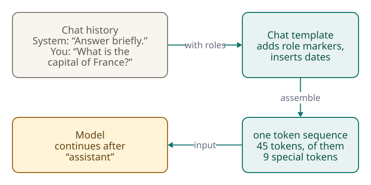
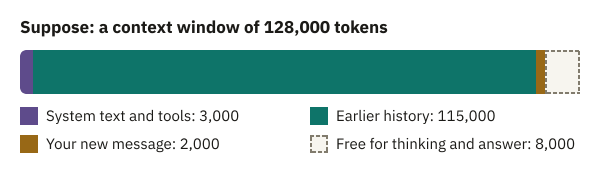

<!-- Generated from src/content/bausteine/en/tokenization-inside-the-model.mdx by scripts/export-lessons.mjs -- do not edit by hand. -->

# Tokenization Inside the Model: How Your Chat Becomes a Token Sequence

> Reading copy for GitHub. The full version with interactive demos, animations and recall moments is on the website: **[Tokenization Inside the Model: How Your Chat Becomes a Token Sequence](https://ki-einfach-verstehen.de/en/lessons/tokenization-inside-the-model/)**
>
> Licence: [CC BY 4.0](https://creativecommons.org/licenses/by/4.0/deed.en) · Credit it as: KI einfach verstehen, “Tokenization Inside the Model: How Your Chat Becomes a Token Sequence”, CC BY 4.0, https://ki-einfach-verstehen.de/en/lessons/tokenization-inside-the-model/

How a chat with roles becomes a single token sequence, what special tokens are for, and everything that has to fit into the context window.

“What is the capital of France?” Six words and a question mark. Beforehand, the chat app also gave the model the instruction “Answer briefly.” Before you read on, guess how many [tokens](https://ki-einfach-verstehen.de/en/glossary/token/) reach the [model](https://ki-einfach-verstehen.de/en/glossary/model/) when you send the question.

From the first lesson in this topic, you know what happens at the first station on the way through the model. Your chat message becomes one long sequence of tokens that also records who said what. You know from the lesson on [token IDs](./token-ids-and-vocabulary.md) how a [tokenizer](https://ki-einfach-verstehen.de/en/glossary/tokenizer/) splits text into pieces from its [vocabulary](https://ki-einfach-verstehen.de/en/glossary/vocabulary/) and gives each piece a number.

## Your chat is one long text

In the chat window, a conversation looks like a row of separate speech bubbles. You might expect the model to get only the newest one, with the roles arriving through separate channels. Neither is true. The next section shows why older messages go along too. Separate channels would not work: as you know from the lesson on [input and output](./input-and-output.md), a [language model](https://ki-einfach-verstehen.de/en/glossary/language-model/) appends a piece to a text, round after round. **Continuing a sequence of tokens is all it can do.** So the chat app, the program around the model, has to turn the whole conversation into a single sequence.

To do this, every chat model has a **[chat template](https://ki-einfach-verstehen.de/en/glossary/chat-template/)**: a fixed pattern that lines up the messages with their roles. Openly available models include it as a small accompanying file alongside their learned [parameters](https://ki-einfach-verstehen.de/en/glossary/parameters/). Common roles are “user” for you, “assistant” for the model, and “system” for instructions from the chat app’s provider. The **system message** in this example is “Answer briefly.” You usually do not get to see it.

Meta is the company behind Llama 3.1 8B Instruct, an openly available chat model. Its template turns the opening chat into this text:

```text
<|begin_of_text|><|start_header_id|>system<|end_header_id|>

Cutting Knowledge Date: December 2023
Today Date: 26 Jul 2024

Answer briefly.<|eot_id|><|start_header_id|>user<|end_header_id|>

What is the capital of France?<|eot_id|><|start_header_id|>assistant<|end_header_id|>

```

Counted with the real tokenizer, that is 45 tokens. Only 10 come from the chat: your question and the system message. The template added the other 35: role names, line breaks (which count as tokens too), two lines with dates, and several entries in angle brackets.

These entries in angle brackets are called **[special tokens](https://ki-einfach-verstehen.de/en/glossary/special-token/)**, or markers for short. The template writes them as names, and the tokenizer turns each name into exactly one token with its own entry in the vocabulary. An entry like this does not stand for a piece of text; it marks the structure of the conversation. The stop marker you know from the lesson on input and output is related: it is an invisible entry that shows a text is over. The general term for such a marker is **end token**. A conversation needs more such markers, because it has roles and several turns.



[▶ watch the animation on the website](https://ki-einfach-verstehen.de/en/lessons/tokenization-inside-the-model/)

*With Llama 3.1, two messages with roles become a single sequence of 45 tokens that ends with an open header for the answer.*


*The token sequence as a freight train: ordinary wagons for pieces of text, differently colored marker wagons for special tokens. The buffer stop at the end of the track stands for the length limit covered further down.*

The finished sequence is like a long freight train. Each wagon is a token. Differently colored marker wagons show where a role name appears and where a message ends. The template assembles the train again for every request, following the model’s pattern. The comparison has two limits. A wagon carries no cargo that means anything, only a number on its side: its [token ID](https://ki-einfach-verstehen.de/en/glossary/token-id/) in the vocabulary. And the markers only work because the model saw a great many trains with exactly these markers in training.

## Text you never wrote

Two lines of the Llama sequence come neither from you nor from the chat app: “Cutting Knowledge Date: December 2023” and “Today Date: 26 Jul 2024”. The template inserts this **extra text** on its own. The first line states the knowledge cutoff because the texts the model was first trained on only go up to December 2023. The second date is preset and applies unless the chat app supplies a current one. You never see these lines; the model reads them with every request.

How much extra text is added depends on the model. For four openly available models, the official templates add between 10 and 74 tokens. The part from the chat stays small. In English, it comes to the same 10 tokens with all four tokenizers, although each model has its own.


*The same chat, four chat templates: the part from the chat stays the same, the template’s addition ranges from 10 to 74 tokens (counted on October 6, 2026).*

The longest template belongs to gpt-oss, openly available models from OpenAI, the company behind ChatGPT. It puts its own extra text, with the date and knowledge cutoff, at the very start, even before the app provider’s system message. Its markers also look different from Llama’s: each message starts with `<|start|>` and ends with `<|end|>`.

> **Interactive demo:** [try it on the website](https://ki-einfach-verstehen.de/en/lessons/tokenization-inside-the-model/)

If you follow the answer “Paris.” with “And Italy?”, the chat app does not send only this question. The Llama template rebuilds the whole train: system message, first question, old answer, new question, with markers between them. Now 60 tokens go into the model, 15 more than the first time: the old answer, your new question, and their markers. The history goes back in as input every time because the model remembers nothing between your messages. **So what a request costs does not depend only on what you type.** If billing is per token, you pay for extra text, markers, and history in every round.

## Marker wagons: how the model recognizes roles and endings


*Special tokens mark where a turn begins and where it ends.*

How does the model know to treat the system message differently from your question? By fixed markers. In the Llama sequence, `<|begin_of_text|>` is at the very front. `<|start_header_id|>` and `<|end_header_id|>` enclose the role name “system”, “user”, or “assistant”; together, the three form the header of a message. `<|eot_id|>` ends a turn; the name stands for “end of turn”.

The model knows what these markers mean from training. After its **basic training** on ordinary text, a chatbot is trained further with examples so that it answers like a helpful assistant. These example conversations use exactly this format, with exactly these markers. So the model has learned what follows a header with “system”, “user”, or “assistant”. A model that has only had basic training is called a **base model**.

At the end of the sequence is an open header for the role “assistant”, with nothing after it yet. What happens if this header is missing? Then nothing signals who speaks next. The model might, for example, continue writing your message instead of answering it. The guide to chat templates from Hugging Face, a platform through which many openly available models are distributed, warns about this.

A special token also determines when an answer is finished. Remember the text loop: in every round, the model outputs a score list with one score for every entry in the vocabulary. A selection step picks one piece from the list, and that piece is appended at the back. `<|eot_id|>` is one such entry with its own score. In the conversations used for further training, it appeared at the end of every answer, so it gets a high score when an answer seems finished. The chat app watches for exactly this number. If the selection step picks this number, the chat app stops. It stops no later than a set length limit. **So the chat app sets the end, not the model.**

Llama 3.1 comes as a base model and as a chat model. For this example, two of their end tokens matter: the base model ends a text with `<|end_of_text|>`, the chat model ends an answer with `<|eot_id|>`. If a program waits for the wrong end token with the chat model, it does not stop. The model then writes on past its answer, for example with an invented next turn, until the length limit kicks in.

Because the markers only work through training, using another model’s template also harms performance. Suppose a program sends a Llama model the markers of gpt-oss. The Llama vocabulary has no special entry for `<|start|>`. Counted with the Llama tokenizer, the string splits into five ordinary pieces: `<`, `|`, `start`, `|`, and `>`. Instead of one marker wagon, five normal wagons ride in the train, and the sequence no longer looks like the conversations from training. Hugging Face warns that chat models perform drastically worse with the wrong markers. OpenAI writes that the gpt-oss models only work correctly with their own format.

## The context window is a budget

The train can only get so long. In the lesson on the tokenizer, this limit was called the [context window](https://ki-einfach-verstehen.de/en/glossary/context-window/): the maximum number of tokens a model can process at once. In the train comparison, it is the buffer stop at the end of the track. For Llama 3.1, the window holds up to 128,000 tokens. For the largest current models, it holds around a million.

Many assume that only what you type has to fit into this window, since the answer comes afterward. But the answer is generated in the text loop: each selected piece is appended at the back and becomes part of the input in the next round. That is why **everything counts**. This is how OpenAI and Anthropic, the company behind the chatbot Claude, describe it. That includes the system message and the template’s extra text. It also includes descriptions of tools (functions the model can call), such as a web search, that the chat app makes available to the model, along with their results. Attached documents, the history, your new message, and the answer itself count as well.

Models that “think” before answering add **thinking tokens**: intermediate steps the model writes as tokens before the actual answer begins. You often do not see them, but they take up space.



*A made-up example: if system message, template, tools, history, and new message take up 92,000 of 100,000 tokens, only 8,000 remain for thinking and answer together.*

Suppose your model’s window holds 100,000 tokens, and you have been chatting for a long time. The system message, extra text, tools, history, and your new question together take up 92,000. What would happen if the model needed 12,000 tokens for a thorough answer? It has only 8,000, and the thinking tokens come out of that too. If the model reaches the limit while writing, the answer breaks off unfinished. The train comparison ends here: a real freight train departs fully assembled, while the token train grows at the back as the model answers, until the end token or the buffer stop.

If the input alone is too long, Anthropic, for example, rejects the request with the message “prompt is too long”. So chat applications make room beforehand. According to Anthropic, claude.ai can let the oldest parts of a conversation drop out bit by bit. If a chatbot no longer responds to the start of a long conversation, that may be because this part no longer rides along in the train.

## In the end there is a sequence of numbers

So six words, a question mark, and a short instruction have become 45 tokens with Llama 3.1 and 84 with gpt-oss. There are more after a follow-up question, and every answer has to fit into the same window.

The sequence reaches the model like a train whose wagons carry only their number on the side. The model cannot compute anything meaningful with a number alone. No number records that “Paris” and “France” belong together. The next lesson shows how the model turns each number into something it can compute with.

---

Source: https://ki-einfach-verstehen.de/en/lessons/tokenization-inside-the-model/

← Previous: [What an AI Model Actually Is](./what-an-ai-model-actually-is.md) · [All lessons](../../README.md#contents) · Next: [Embeddings: How a Number Becomes a Learned Vector](./embeddings.md) →
