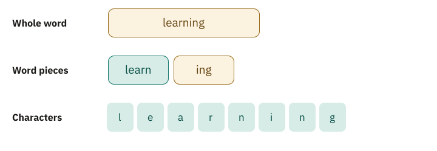
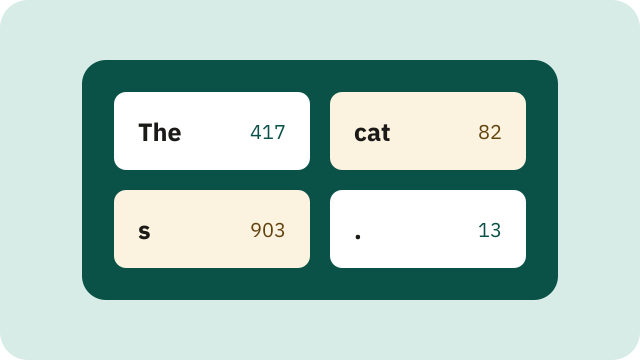
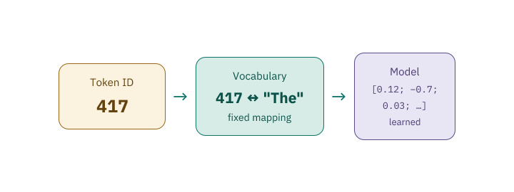
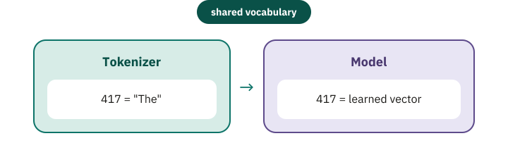
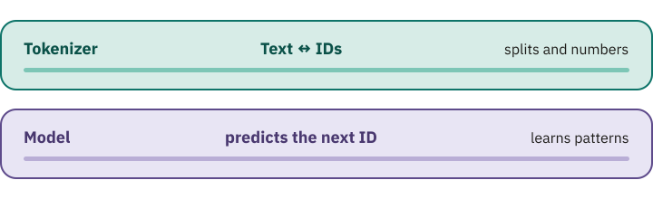

<!-- Generated from src/content/bausteine/en/tokenizer-ids-vocabulary.mdx by scripts/export-lessons.mjs -- do not edit by hand. -->

# Tokenizers: How Language Becomes Numbers

> Reading copy for GitHub. The full version with interactive demos, animations and recall moments is on the website: **[Tokenizers: How Language Becomes Numbers](https://ki-einfach-verstehen.de/en/lessons/tokenizer-ids-vocabulary/)**
>
> Licence: [CC BY 4.0](https://creativecommons.org/licenses/by/4.0/deed.en) · Credit it as: KI einfach verstehen, “Tokenizers: How Language Becomes Numbers”, CC BY 4.0, https://ki-einfach-verstehen.de/en/lessons/tokenizer-ids-vocabulary/

Shows how a tokenizer splits text into reusable pieces, numbers them through a fixed vocabulary, and turns them into the numerical input of a language model.

Before you read on, split this word into pieces in your head: **“unbelievable.”** One piece, three parts such as “un–believ–able,” or every letter on its own? All three could serve as input for a computer, but they lead to very different lists of numbers. This is exactly the decision a **[tokenizer](https://ki-einfach-verstehen.de/en/glossary/tokenizer/)** makes.

In the previous lesson, the **[input](https://ki-einfach-verstehen.de/en/glossary/input/)** of a **[language model](https://ki-einfach-verstehen.de/en/glossary/language-model/)** was still a sequence of “text pieces”. Now you see what lies between your readable sentence and that input: the text is cut into pieces, and every piece gets a number. Only this sequence of whole numbers goes into the **[model](https://ki-einfach-verstehen.de/en/glossary/model/)**.

## A model never gets to see text

Your screen might show “The cats sit.” To you, that is words, spaces, and a period. The model needs something else: a fixed list of text pieces that does not keep growing. You know why from the previous lesson: a language model outputs its own score for every text piece it knows. That only works if it is settled which text pieces exist and how many. And since every chosen piece is appended, the input uses this list too. Any text must therefore first be translated into these pieces.

The split decides how long the input is for the model: one visible word can become one, two, or many pieces. They are called **[tokens](https://ki-einfach-verstehen.de/en/glossary/token/)**. How text is split is fixed by the tokenizer before the model calculates anything.

The tokenizer does not understand the sentence; it works by fixed rules. So the same text gives the same token sequence with the same tokenizer; only during training do some methods add randomness on purpose. A different tokenizer may split it differently. So there is no *one natural tokenization* hidden inside language.

*A sentence is first split into text pieces, then turned into numerical IDs (invented example). The symbol ␣ marks a space that belongs to the piece.*

## Why not simply number every word?

The most obvious idea: take a dictionary, give every word a number, done. “The” could be 417, “cats” 982, and “sit” 771. For a carefully limited collection of texts, that works. For open-ended language, it does not.

Which entries would the list need? “Friend,” “friendly,” “unfriendly,” “unfriendliness,” and every further word built the same way? Plus names, product labels, typos, forms such as “learn,” “learns,” and “learned,” and words coined tomorrow. A list can grow large, but it stays limited, while language keeps forming new character sequences.

Unknown words could share a single placeholder. But then two completely different new names would both shrink to the same “unknown” symbol. A chatbot would see nothing but “unknown” for every new name, say that of a band founded last week.

## Why not take every letter on its own?

At the other end lies an equally simple solution: every letter and punctuation mark becomes a token. Then almost any word can be assembled, even a new one, and for a single alphabet, the list of pieces stays small. “Cats,” however, now takes four tokens instead of perhaps one or two.

Every token takes up its own place in the input, called a position. In a long document, this multiplies the positions the model has to process. With spaces and the period, “The cats sit.” already has 13 character positions. With single characters, a chatbot would also need a separate round of the text loop for every letter of its answer.

Single characters also carry very little. The model would have to rebuild frequent sequences such as “ing”, “tion”, or “str” from many positions every time. Whole words are too coarse; single characters are flexible but needlessly fine-grained. A workable middle ground is needed.

*The same character sequence, split three times at different levels of detail.*

## The useful middle ground: reusable word pieces

*Subword tokens work like a building set: a few large finished pieces for frequent things, small parts for the rest.*

Many modern text tokenizers therefore use **[subword tokens](https://ki-einfach-verstehen.de/en/glossary/subword-token/)**: a token can be a frequent whole word, a recurring word part, or a single character. It works like a building set: frequent things come as large finished pieces, rare things you assemble from small parts. The tokenizers behind well-known chatbots such as ChatGPT work this way, too. “Learning,” for example, might split into “learn” and “ing.” Just an example; other tokenizers split differently.

Which pieces exist depends on the text material and the procedure that built the **[vocabulary](https://ki-einfach-verstehen.de/en/glossary/vocabulary/)**, the fixed list of all pieces a tokenizer knows. And “unbelievable” from the start? A subword tokenizer might keep it whole or take two or three frequent pieces, chosen by its learned vocabulary, not by syllable rules. Because almost any word can, if necessary, be assembled from single characters, such a tokenizer rarely needs an “unknown” placeholder.

The middle ground has a downside, though: frequent patterns fit into a few tokens, while an unusual spelling can fall apart into many small pieces. So the token count is not the word count, and two sentences of similar length can need different numbers of tokens. Even capitalization, spaces, or an accent can change the split.

Where do the pieces come from? Unlike in a building set, nobody designed them. They are learned from large amounts of text: a procedure counts which characters often stand next to each other and merges them step by step into larger pieces. The details follow below under “One level deeper.”

## Keeping token, tokenizer, and vocabulary apart

How does the tokenizer know which pieces exist, such as “ cat” or “s”? Three things are easy to confuse here. A **token** is a single unit, for example “ cat” (with a space in front, more on that shortly), “s”, or “.”. The **vocabulary** assigns an ID to every permitted unit. The **[tokenizer](https://ki-einfach-verstehen.de/en/glossary/tokenizer/)** is the procedure, including rules and vocabulary, that splits text into these units and joins them back into text.

Picture the vocabulary as a card index: each card holds a text piece and an identifying number. The tokenizer finds a matching sequence of cards for your sentence and outputs their numbers. On the way back, it looks up the numbers and joins the pieces again. Both directions run with every chatbot message: there with your question, back with every piece of the answer.

The picture has a limit: the tokenizer does not search for cards that “fit the meaning.” Its splitting rules fix which sequence is chosen. And the card with “ cat” holds no definition of a cat, only a sequence of characters. What the model later connects with this card emerges only through its trained **[parameters](https://ki-einfach-verstehen.de/en/glossary/parameters/)**.

*The vocabulary as a card index: every text piece with a fixed identifying number.*

## An ID is a label, not a meaning

Each text piece in the vocabulary has a whole number, its **[token ID](https://ki-einfach-verstehen.de/en/glossary/token-id/)**. Suppose “The” carries ID 417. This number is not the word translated into mathematics, and it measures neither meaning nor frequency nor importance. It is just the number on an index card. So when a chatbot continues “The” sensibly, that is due to what its model learned, not to the 417.

*An ID is only a label – a number that says nothing about the content.*

That is why a token ID is ambiguous without its tokenizer. In another vocabulary, 417 can stand for “and,” part of a word, or a special character. Adding IDs would be pointless too: ID 417 plus ID 82 does not give the meaning of ID 499. In the model, the same number serves as an address for a list of learned numbers.

*In the tokenizer, ID 417 is the number of the text piece “The”; in the model, the same ID is the address of learned numbers. The model itself only sees the number.*

## A complete toy example

Here is an invented mini vocabulary; a real tokenizer splits differently.

| Token ID | Text piece |
| ---: | :--- |
| 417 | “The” |
| 82 | “ cat” |
| 903 | “s” |
| 771 | “ sit” |
| 13 | “.” |

During **[encoding](https://ki-einfach-verstehen.de/en/glossary/tokenizer/)**, the tokenizer receives the text “The cats sit.” With this mini vocabulary, there is exactly one split: “The” + “ cat” + “s” + “ sit” + “.”, because “ cats” is not in the list. Looking the pieces up in the vocabulary gives the sequence 417, 82, 903, 771, 13. These five numbers are the model’s input.

During **[decoding](https://ki-einfach-verstehen.de/en/glossary/tokenizer/)**, the mapping runs backwards: the tokenizer looks up each ID and joins the five stored pieces in the same order. Because two tokens already carry their leading space, the result is “The cats sit.” again. An extra space would change it.

The example also shows why order matters. 417, 82, 903 is “The cats”; 82, 903, 417 gives “ catsThe”. From such sequences, a language model later learns which token is likely to come next.

> **Interactive demo:** [try it on the website](https://ki-einfach-verstehen.de/en/lessons/tokenizer-ids-vocabulary/)

## Spaces and punctuation are part of the input

People often treat spaces as empty gaps. For a tokenizer, they are characters like any other. Some vocabularies store frequent words with a leading space as separate entries. So “cat” with no space before it can be split differently from “ cat” after a space. Line breaks, tabs, quotation marks, and punctuation can likewise be tokens or part of larger units. Paste a table with lots of blank lines into a chatbot, and those characters become tokens, too.

Which numbers come out is set by the vocabulary of this one tokenizer alone. What happens if a model is fed with the wrong vocabulary?

## Why the tokenizer and the model form a fixed pair

The model was trained with exactly one mapping. For input 417, its parameters draw on the list of learned numbers that was adjusted for entry 417 during training. Swap only the tokenizer, and the model receives valid numbers but the wrong symbols. It is as if someone had renumbered the index cards: 417 now says “and,” but the model expects what it learned for “The”.

*A foreign tokenizer renumbers the index cards – under familiar numbers, the model gets unfamiliar text pieces.*

The vocabulary size has to match as well, or the tokenizer produces IDs for which the model has no entry. So tokenizer files, vocabulary, rules, and special tokens are shipped and versioned together with a model. If a newly trained model gets a new tokenizer, the same sentence gives different IDs and often a different token count.

*Tokenizer and model form a fixed pair: for both, the same ID must point to the same vocabulary entry.*

One level deeper: why a vocabulary contains special tokens

Besides text pieces, a vocabulary often contains **special tokens**. They stand not for text but for structure. A real example is OpenAI’s early language model GPT-2. Its vocabulary has 50,257 entries with IDs 0 to 50256. The last entry, ID 50256, is called `<|endoftext|>`. In GPT-2, it serves as both the beginning and the end marker of a text sequence. When the model outputs this ID, the text is finished.

Chatbots need more such markers, because a conversation has roles. In the “harmony” chat format of OpenAI’s open gpt-oss models, every message begins with `<|start|>`. Then comes the role, such as `user` for you or `assistant` for the model. `<|message|>` introduces the actual content, and `<|end|>` closes the message. These markers are numbered entries too, with IDs around 200,000 for gpt-oss, in a much larger vocabulary than GPT-2’s. So one long token sequence shows the model who said what.

If you type the text `<|endoftext|>` yourself, it must not become special ID 50256, or anyone could slip fake markers to the model. Anyone building programs with OpenAI’s tool tiktoken must therefore decide: by default, tiktoken stops with an error at this text. On request, it splits it like ordinary text, into seven normal tokens instead of the one special token.

One level deeper: how BPE learns its vocabulary

**Byte Pair Encoding**, or **[BPE](https://ki-einfach-verstehen.de/en/glossary/byte-pair-encoding/)**, began as a data compression method. For machine translation, it was adapted to represent rare and unknown words as sequences of smaller units instead of discarding them. Only a tokenizer that goes all the way down to bytes can do without a placeholder entirely. A **byte** is a small numeric unit in computer memory; every visible character is stored as one or more bytes, an accented letter or an emoji as several. All the world’s characters would take over 130,000 base entries; there are only 256 different bytes, so all of them fit into the vocabulary. Even a never-seen character can be assembled this way.

Depending on the variant, BPE starts with characters or bytes. It counts which neighboring pairs occur most often in the training material and merges the most frequent pair into a new unit; that is the “Pair Encoding.” This repeats until the desired vocabulary size or number of merges is reached.

If “l e a r n”, “l e a r n s”, and “l e a r n e d” are frequent in the material, letter pairs might become units first, and later larger sequences such as “learn”. Rare endings remain composable from smaller parts.

In use, the tokenizer replays the learned merges on new text in the same order, so the same text gives the same split. BPE is not the only subword method. **[SentencePiece](https://ki-einfach-verstehen.de/en/glossary/sentencepiece/)** learns subword models, including BPE, directly from unmodified sentences, without first cutting them at presumed word boundaries. This helps with languages that do not mark word boundaries with spaces the way English does. The shared idea: a limited set of learned units should represent any input as usefully as possible.

## Why you notice tokens in everyday use

In a long chat with an AI assistant, the model eventually seems to forget the beginning. Or a service reports that your text is too long, although it is only a few pages. In both cases, the issue is not words but tokens.

Models process only a limited number of token positions at once. Depending on the system, this **[context window](https://ki-einfach-verstehen.de/en/glossary/context-window/)** covers the input and the generated **[output](https://ki-einfach-verstehen.de/en/glossary/output/)**. One reason for the forgetting is familiar from the previous lesson: in a chat, the whole conversation goes back into the model every round and grows with each answer. Once it no longer fits, the system must drop, shorten, or split part of it; only then does the very start usually drop out. Even before that, models often handle details in the middle of very long inputs less reliably than those at the beginning or end.

Some texts fall apart into especially many small tokens: an unusual product code, a long string of digits, or a language the vocabulary covers less compactly. They use more positions than familiar text of the same length. If you build a model into your own software through a programming interface, you usually pay per token; chat subscriptions cost a fixed monthly price but have usage limits. Rules of thumb such as “one token is about four characters” are rough; only the model’s own tokenizer counts exactly; some providers offer a counting function.

## What the tokenizer does not do

The tokenizer recognizes neither word meanings nor grammar nor intention. Sometimes its boundaries look linguistically sensible — such as “learn” and “ing.” That can be because these sequences were frequent in the training material; it is not a linguistic analysis. A token may cut right through a syllable, an ending, or a name.

Nor does the tokenizer decide which token comes next. It converts existing text into IDs and generated IDs back into text. Prediction happens in the model.

A common misconception: a model “understands” a word if it is a single token; if the word falls apart into many tokens, the model understands it less well or not at all. That sounds plausible, because one compact unit seems more complete than several fragments.

In fact, the model learned patterns across whole token sequences during training and can combine information from several positions. Whether a word is one token or several describes only its technical representation. So you cannot infer understanding from the token count. Still, the split has consequences: for some tasks, such as arithmetic with multi-digit numbers, performance measurably depends on how the digits are divided into tokens.

*The tokenizer splits and numbers text – prediction is the model’s job alone.*

## The numbers are only the beginning

The complete path so far: visible text → tokenizer rules → token sequence → vocabulary lookup → sequence of token IDs. The text is numbered, but not yet in a form in which the **[model](https://ki-einfach-verstehen.de/en/glossary/model/)** can calculate similarities and relationships.

In the next step, every ID serves as the address of a long list of learned numbers. What exactly is such a list, and how do you organize many of them, one per token? That is the topic of the next lesson: scalar, **[vector](https://ki-einfach-verstehen.de/en/glossary/vector/)**, matrix, and **[tensor](https://ki-einfach-verstehen.de/en/glossary/tensor/)**.

If you remember only one sentence, make it this one: **A token is a reusable text piece, its ID is only its number in the vocabulary, and only the model links that number to a list of learned numbers.**

---

Source: https://ki-einfach-verstehen.de/en/lessons/tokenizer-ids-vocabulary/

← Previous: [Input and Output: What a Function Does](./input-and-output.md) · [All lessons](../../README.md#contents) · Next: [Scalar, Vector, Matrix, Tensor: the Building Blocks of Numbers](./scalar-vector-matrix-tensor.md) →
