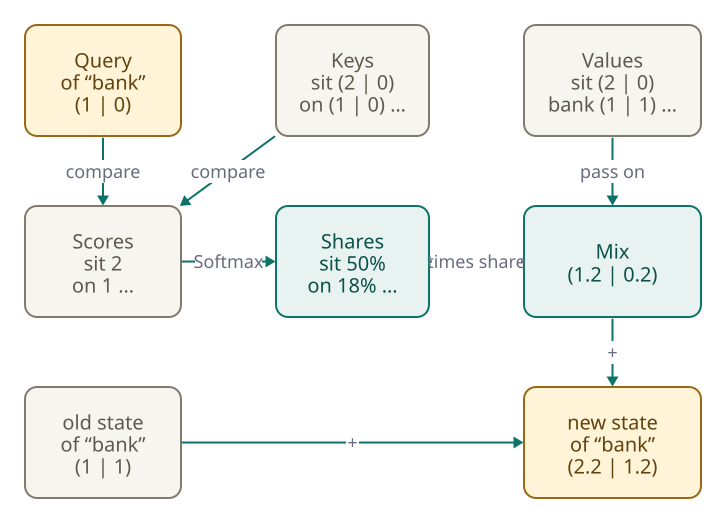

<!-- Generated from src/content/bausteine/en/transformer-blocks-and-attention.mdx by scripts/export-lessons.mjs -- do not edit by hand. -->

# Transformer Blocks and Attention: How Context Gets Mixed In

> Reading copy for GitHub. The full version with interactive demos, animations and recall moments is on the website: **[Transformer Blocks and Attention: How Context Gets Mixed In](https://ki-einfach-verstehen.de/en/lessons/transformer-blocks-and-attention/)**
>
> Licence: [CC BY 4.0](https://creativecommons.org/licenses/by/4.0/deed.en) · Credit it as: KI einfach verstehen, “Transformer Blocks and Attention: How Context Gets Mixed In”, CC BY 4.0, https://ki-einfach-verstehen.de/en/lessons/transformer-blocks-and-attention/

How a language model mixes the information of earlier words into every token, why it may not look ahead while doing so, and how many such blocks work one after another.

Two sentences: “I pay money into the bank” and “I sit on the bank in the park.” In the previous lesson, each token got its profile, a long list of numbers from the model’s lookup table. For “bank,” it is the same list in both sentences. Yet a chatbot translating both into German needs two words: one for the money bank, one for the grassy one. How can it tell which, when “bank” looks the same both times?

*A bank for money or a bank to sit on: the word alone does not decide it.*

The answer lies in the largest part of a language model: many blocks, built the same way but each with its own numbers. An architecture built from them is called a **[transformer](https://ki-einfach-verstehen.de/en/glossary/transformer/)**, introduced in 2017. The blocks let each token get information from the others. This lesson shows how, and what a token may see. For simplicity, every word here is one token, though real tokenizers split some words.

## One profile, two meanings

When you read the park sentence, you do not think of money. You read the rest of the sentence without noticing. A profile from the table cannot do that. Every “bank” gets the same profile, whatever comes before or after. The seat signal from the previous lesson only reveals where the word stands, not which bank is meant. A language-processing textbook names exactly this problem: a fixed [vector](https://ki-einfach-verstehen.de/en/glossary/vector/) is the same in every sentence; only words like “pond” reveal a river bank.

A language model solves this by reshaping each profile step by step, sending all token vectors through one block after another. The first lesson of this topic area called them computing stages; model specs usually say layers. Of the 399 named blocks of numbers from that first lesson, eleven belong to each of these blocks, 396 in total. The remaining three sit outside: one at the input, two at the output. Each block mixes something from the other tokens into a token’s vector. The result is what this lesson calls a token’s **state**: its vector at a given point in the model.

This can be measured. Researchers compared the states of one word across many sentences: the higher the block, the more they differed. In GPT-2, after the last block, they are almost entirely shaped by the sentence. The profile is only the starting point. But how does the information of the other words get in?

## The spotlight: mixing in context by weight

For the token whose turn it is, spotlights switch on, aimed at the tokens before it and at itself. (The model actually computes all positions at once; “whose turn it is” just means we look at one position.) Some places are lit brightly, others faintly. What is brightly lit flows strongly into the new state; what lies in half-darkness flows in only a little. This method is called **[attention](https://ki-einfach-verstehen.de/en/glossary/attention/)**.

*Spotlights shine with different brightness on a row of cards. What is brightly lit flows in strongly.*

Here is an example with made-up numbers and one spotlight. When “bank” in “I sit on the bank in the park” has its turn, each visible word gets a weight: “sit” 0.52, “bank” itself 0.22, “on” 0.12, “I” 0.08 and “the” 0.06. Together, the weights add up to exactly 1. The brightness is shared out: what one word gains, the others lose. You know this rule from the lesson on [probability and softmax](./probability-and-softmax.md); the model indeed computes the weights with [softmax](https://ki-einfach-verstehen.de/en/glossary/softmax/).

And in the money sentence? Before reading on, guess which word is lit most brightly.

The brightest is “money” with 0.44, followed by “pay” and “bank” itself.

*The same word, two sentences, different weights (made-up numbers). Words that only come after “bank” get no weight.*

So what does “flow in strongly” mean? Suppose each vector had only two numbers, one for “money” and one for “place to sit” (real vectors have thousands of unnamed numbers). “sit” passes on 1 for the place-to-sit value, “bank” 0.5 and “on” 0.3. Multiply each by its weight and add up: 0.52 · 1 + 0.22 · 0.5 + 0.12 · 0.3 gives about 0.67. A calculation like this is called a **weighted sum**. The money value only reaches 0.11. This mix is added to the old state of “bank,” and the state already points more towards a place to sit. In the money sentence, the same calculation gives the opposite.

The picture has a limit. Nobody aims the spotlights, and the model does not “pay attention” in the human sense. The brightness is calculated.

## Query, key and value: where the weights come from

How does the model know that “sit” fits “bank” better than “the”? Each token gets three roles, and from its state the model calculates one vector per role.

The **query** belongs to the token whose turn it is, here “bank.” It does the comparing. The **key** belongs to each token it is compared with. Comparing query and key gives a [score](https://ki-einfach-verstehen.de/en/glossary/score/). As with the cosine similarity in the previous lesson, the numbers of query and key are multiplied in pairs and added up. If both point in a similar direction, the score is high. The **value** is what a token passes into the mix when it is lit. Since separate vectors decide how well a token fits and what it passes on, it can fit well and still bring little.

[▶ watch the animation on the website](https://ki-einfach-verstehen.de/en/lessons/transformer-blocks-and-attention/)

*One pass for “bank”: compare the query with the keys, softmax turns the scores into weights, the values are mixed by weight (made-up numbers).*

So the model takes four steps: it compares the query of “bank” with all visible keys (“sit” scores highest, 2.17), turns the scores into weights with softmax, mixes the values by weight and adds the mix to the old state.

Three [matrices](https://ki-einfach-verstehen.de/en/glossary/matrix/) turn a state into its query, key and value. Their numbers are [parameters](https://ki-einfach-verstehen.de/en/glossary/parameters/): training set them, and they are the same for every chat message. Nobody told the model that “sit” fits “bank”; such fits arise because they helped predict the next token.

One level deeper: the attention formula

The 2017 transformer paper fits the calculation on one line. With the mask from the next section, it reads:

`Attention(Q, K, V) = softmax(Q·Kᵀ / √d_k + M) · V`

Q, K and V are matrices with one row per token. Q·Kᵀ compares every query with every key at once. This pairwise multiplying and adding is called the dot product. In the example, the query of “bank” has the numbers (1.5, 1.5, 1.5) and the key of “sit” (0.5, 2, 0). That gives 0.75 + 3 + 0 = 3.75. M contains 0 for allowed and −∞ for blocked pairs. d_k says how many numbers a key contains, 3 in the example. 3.75 divided by √3 gives the 2.17 from the example.

Why the division? The authors suspect that with many numbers, dot products grow very large, and softmax then puts almost all weight on one candidate. When that happens, the model barely learns anything new. With random numbers, dot products of 128 numbers spread by about ±11.3; after dividing by √128, by only ±1. Softmax shows how much this matters: from 1, 2 and 3 it makes 9, 24 and 67 percent, from 8, 16 and 24 about 0.00001, 0.03 and 99.97 percent.

One more thing stands out. “park,” the best clue that this bank is for sitting, got no weight. Why?

## No looking ahead: the causal mask

“park” comes after “bank.” And chatbot-style language models, which write from left to right, have a fixed rule: each position sees only itself and the positions before it, never those after. For “bank,” “park” is invisible, even though it is already there.

*What comes after the current token stays invisible.*

That sounds like a needless restriction, but the reason lies in training. A language model learns to predict the next token at every point: in training, the position of “bank” should predict “in.” If it could already see “in,” it could just copy instead of predicting. During generation, this holds anyway: a chatbot writes piece by piece, and later tokens do not exist yet.

A **[causal mask](https://ki-einfach-verstehen.de/en/glossary/causal-mask/)** implements the rule: before softmax runs, it sets the score of every later position to minus infinity. Softmax turns minus infinity into a weight of exactly 0, not merely almost 0. The 2017 transformer already did this. Of the 64 possible pairs in an eight-word sentence, 36 are allowed: the first word sees only itself, the second two, and so on up to the eighth, which sees all eight.

*The causal mask for “I sit on the bank in the park”: each row shows what a position may look at. The row of “bank” is highlighted.*

“park,” in turn, may look at everything, including “bank.” So the two do meet, just not in the state of “bank” but in later positions. If you rearrange the sentence, say to “In the park, I sit on the bank,” “bank” sees “park” right away. With made-up numbers, “park” then gets 0.33.

The lesson on [scalars, vectors, matrices and tensors](./scalar-vector-matrix-tensor.md) already featured a different mask: the attention mask with 1 and 0. It marks padding, which brings shorter texts in a stack to the same length. The causal mask instead blocks real tokens that come later in the text, so it always forms the same triangle.

## Many spotlights, many blocks

One spotlight per token would have to track a lot at once: who does what, which word came just before, what the text is about. So a block has several spotlights, called **heads**. A single head has one distribution of light that always adds up to 1; asked to light up a verb and its subject at once, it blurs both into an average. Several heads with their own queries can each light up a different word. The first transformer had 8 heads, the openly available Qwen3-8B has 32, which share keys and values in groups (more in the box).

Some heads can be interpreted. Induction heads look back for what followed the current token’s last occurrence and continue it. If “Anna Kowalczyk” appeared earlier in the chat and “Anna” now comes up again, such a head finds the earlier “Anna” and highlights what followed: “Kowalczyk.” For large models the evidence is only circumstantial, and many heads show no nameable pattern at all.

Attention is only the first part of a block. After it comes **further processing** (technical term: feed-forward network). It works on each position on its own. The results of both parts are added to the state instead of replacing it. In today’s models, a step before each part brings the numbers to a uniform scale. In the parameter names from the first lesson, the two parts are called self_attn and mlp. Attention plus further processing together form a **[transformer block](https://ki-einfach-verstehen.de/en/glossary/transformer-block/)**.

*Each block first mixes between the positions and then processes each position on its own. Qwen3-8B has 36 such blocks in a row.*

The division of labor is strict: context only comes in through attention. Yet most parameters sit in the further processing: about two thirds in Qwen3-8B, recalculated from the published values. Much of the model knowledge discussed in the first lesson of this topic area also seems to sit there.

A transformer stacks many identically built blocks: GPT-2 in its smallest version has 12, Llama 3.1 8B has 32, Qwen3-8B 36. Attention itself already existed in 2014, as an add-on to older translation models. New in 2017 was dropping their other parts and letting attention alone mix between positions.

One level deeper: 32 heads, but only 8 key-value heads

Each head reads the whole state but uses its own matrices to compute smaller queries, keys and values. In the 2017 original, a state had 512 numbers, and each of the 8 heads computed with 64. In Qwen3-8B, a state has 4,096 numbers, and its 32 heads compute with 128 each, which again adds up to the size of the state.

But Qwen3-8B has only 8 key-value heads. Every 4 query heads share one set of keys and values (grouped-query attention). This saves memory during generation. To avoid recalculating everything for each new token, the model stores the keys and values of all previous tokens in every block. This memory is called the **KV cache**. It works because of the causal mask: later tokens change nothing at earlier positions.

Recalculated from the configuration, with 2 bytes per number: 2 (key and value) × 36 blocks × 8 heads × 128 numbers × 2 bytes gives about 147,000 bytes per token. At 32,768 tokens, that is almost 5 gigabytes on top of the parameters; without the sharing, it would be four times as much. That is why long chats cost memory.

After the last block, every token’s state holds a lot of context. Do the spotlights reveal why the chatbot answers the way it does?

## What the spotlight does not reveal

Some programs show a head’s weights as a colored table: this is where the model “looked.” It feels like a glimpse into its reasoning. Research is more cautious.

A widely cited study from 2019 found that the weights often disagree with other measures of a word’s importance for the result. And very different distributions led to the same prediction. But it examined older model types, and others countered that it depends on what counts as an explanation. The question is disputed.

Transformers add their own reasons for caution. First, information mixes more and more across blocks. After just a few blocks, the state of “sit” is no longer just “sit,” and a weight in the tenth block points at a mix. Second, how much flows in depends not only on the weight but also on the size of the value. A brightly lit token with a tiny value brings little.

Third, a striking amount of weight lands on a text’s very first tokens, even when they carry no meaning. Researchers call them **attention sinks**. Their explanation: the weights always have to add up to 1. If a head finds nothing fitting, the light still has to go somewhere.

Here the spotlight picture ends. It shows well how information gets mixed, but what is lit does not reliably explain why an answer comes about.

That answers the opening question. “bank” starts with the same profile. In each block, attention mixes in the values of earlier tokens with calculated weights, never those of later ones. In the park sentence, “sit” pulls the state towards a place to sit; in the money sentence, “money” pulls it towards the financial institution. But the model should predict a next token. The next lesson shows how the last position’s state becomes a score list over the whole vocabulary.

---

Source: https://ki-einfach-verstehen.de/en/lessons/transformer-blocks-and-attention/

← Previous: [Embeddings: How a Number Becomes a Meaningful Vector](./embeddings.md) · [All lessons](../../README.md#contents) · Next: [Output Head: From the Last State to a Prediction](./output-head.md) →
