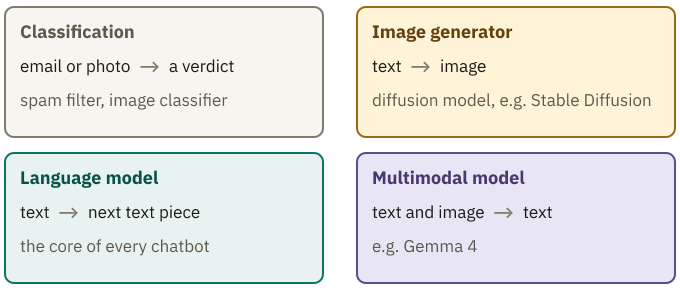

<!-- Generated from src/content/bausteine/en/what-an-ai-model-actually-is.mdx by scripts/export-lessons.mjs -- do not edit by hand. -->

# What an AI Model Actually Is

> Reading copy for GitHub. The full version with interactive demos, animations and recall moments is on the website: **[What an AI Model Actually Is](https://ki-einfach-verstehen.de/en/lessons/what-an-ai-model-actually-is/)**
>
> Licence: [CC BY 4.0](https://creativecommons.org/licenses/by/4.0/deed.en) · Credit it as: KI einfach verstehen, “What an AI Model Actually Is”, CC BY 4.0, https://ki-einfach-verstehen.de/en/lessons/what-an-ai-model-actually-is/

Why an AI model is not a database full of facts, how knowledge is spread across its numbers, and why that produces both clever answers and made-up facts.

The foundations left one question open: the billions of numbers in a model contain no written-out fact. So how does a chatbot know that Paris is the capital of France?

For this lesson, Qwen3-0.6B-Base, a small open **[language model](https://ki-einfach-verstehen.de/en/glossary/language-model/)** that only continues text, got a German sentence start in a single run: “Die Hauptstadt von Frankreich ist” (“The capital of France is”). The leading next **[token](https://ki-einfach-verstehen.de/en/glossary/token/)** was “Paris,” at 47.5 percent. Then the same fact the other way around: “Paris ist die Hauptstadt von” (“Paris is the capital of”). Now “Deutschland” (Germany) led, at 28.9 percent. The percentages say which text piece fits next, not whether a statement is true.

A table row “France | Paris” can be read from either side, to find the capital or the country. The small model reached the fact in only one direction. So what happens inside the model when it answers? The answer also explains how clever answers and made-up facts arise.

## Where does it say that Paris is the capital?

A correct answer looks like a lookup, as if somewhere in the model there were a row with this fact and the model found it. That is how a database works.

A look at a real **[model file](./parameters-training-inference-hardware.md)** says otherwise. You know it from the foundations: a small blueprint, the **[architecture](https://ki-einfach-verstehen.de/en/glossary/architecture/)**, and a vast set of numbers, the **[parameters](https://ki-einfach-verstehen.de/en/glossary/parameters/)**. In the open model Qwen3-8B, they sit in 399 named blocks of numbers. The names describe computing steps such as “self_attn” or “mlp”; none is called “countries” or “capitals.” The order follows the computation, not topics.

From the foundations you know the mixing desk: each fader is a parameter, its position the parameter’s value. Training set the faders; while answering, they stay put. So what is stored is settings, not sentences. What is new here is the path through the desk: a signal comes in on the left, goes out on the right, and the meters show what is passing through.

*The faders stay where they are. The meters change with the signal passing through.*

In the model, this signal is your text, translated into numbers. The first computing stage combines them with its fixed parameters and passes new numbers to the next stage, and so on to the output. These passed-on numbers are called **intermediate values**. Like the meters, they are computed anew for every text. The last ones become the **[score](https://ki-einfach-verstehen.de/en/glossary/score/)** list from the foundations, one score for every text piece the model knows. Nowhere is a row with the fact looked up.

That is as far as the picture goes. On a real desk, each meter belongs to one channel. An intermediate value belongs neither to a single parameter nor to a topic. Nor does the desk show how the stages compute.

*A database looks up the matching row. In the model, your input and the fixed parameters produce intermediate values, which finally become the score list. The intermediate values are schematic.*

For the reversed question, the same parameters computed with a different input, giving different intermediate values and a score list with “Deutschland” ahead. The first of three cases below asks why. But first: how can fixed numbers contain knowledge about Paris?

*The same fact, asked twice in German, one run of Qwen3-0.6B-Base each: the parameters are the same, the intermediate values and the score list are not. The bars of the intermediate values are schematic.*

## No parameter is called “Paris”

In training, the model practiced predicting the next text piece, and its parameters were nudged each time. What it learned about Paris lives in these settings, but not in one parameter and not as a sentence. It takes effect only in the computation: when a question about France’s capital runs through, many parameters work together, and “Paris” comes out on top.

Nobody can yet fully show where the Paris fact sits. But researchers can study the intermediate values. What they find there are patterns for concepts such as “city” or “bridge,” not written-out facts.

A team at Anthropic studied a small language model. One spot among its intermediate values, a single meter in the picture, fired for academic citations, English dialogue, browser requests for web pages, and Korean text. So an intermediate value is not a drawer for a single concept. From the large model Claude 3 Sonnet, the team extracted millions of recurring patterns, called **features**: for famous people, countries, cities. A feature is a particular combination of values across many intermediate values at once.

*A single intermediate value responds to very different things. A feature shows up as a particular combination of values across many intermediate values.*

An experiment with the Golden Gate Bridge showed that such patterns shape what the model writes. During the computation, the team amplified the bridge pattern to ten times its maximum, leaving the parameters untouched. The model began to think it was the Golden Gate Bridge. This intervention doesn’t show how a fact is stored.

So keep two levels apart: the parameters determine how the computation runs; the features are patterns in what it produces. A feature for Paris is not yet the fact that Paris is the capital of France. How such patterns become an answer stage by stage has been traced only in individual cases; the section “Answers that were never written down” shows one.

One level deeper: how features share the intermediate values

If every feature had its own intermediate value, a model would be easy to read. Instead, features share intermediate values, each with its own pattern. For 82 percent of the features examined in Claude 3 Sonnet, no single intermediate value was strongly linked to the feature. When several features are active at once, their contributions overlap. The technical term is **superposition**.

That way, more features fit in than there are intermediate values. In a small language model with one computing stage, tens of thousands of features were extracted from 512 intermediate values. That works because only a few are usually active at once. The price: the contributions disturb each other, and further computing steps must filter that out. Hence a single intermediate value is hard to interpret, and researchers extract features from many at once with a dedicated method.

## Three questions where a table behaves differently

This is about the language model alone, without a connected search: it computes a continuation of your input. Three differences from a table follow.

The first case is the reversed question, whose “Deutschland” can’t be explained with certainty. With the larger Qwen3-4B-Base, “Frank…” (the start of “Frankreich”) led for the reversed sentence start, at 61.7 percent, so the fact can be learned in both directions. The small model probably lacked size, and in German texts “Hauptstadt von” is often followed by “Deutschland.” But a language model learns to continue text in reading order. So for facts almost always written in the same **direction**, even large models show a clear direction effect. Texts about Tom Cruise probably often name his mother; texts about her rarely name her son. For many such celebrity pairs, GPT-4 in 2023 answered questions about a parent correctly 79 percent of the time, the reverse ones only 33 percent. These percentages count correct answers, not scores. If the fact is already in your question, the reversal usually works: the model needn’t retrieve it from its parameters.

The second case: not every fact is held equally firmly. How well a model answers a factual question depends on how many matching texts it saw in training; in a table, every row is equally easy to find. And larger models retain more. For this lesson, two Qwen3 models continued the German for “The physicist Albert Einstein was born on”. The small one (0.6 billion parameters) wrote “August 14, 1879, in Zurich,” the larger one (4 billion) “March 14, 1879, in Ulm,” which is correct. The small model didn’t hold even this often-mentioned fact firmly.

The third case is a question about something that doesn’t exist. The physicist Bernhard Quelling was made up for this lesson. A database reports no match: it has no row for him. What do you think a language model writes? Both Qwen models promptly named a date of birth. The small one wrote “August 13, 1920, in the city of Berlin.” The computation yields no “no match,” only a score list, with some text piece on top. Even “I don’t know” would just be one possible continuation. After this sentence start, though, a date fits better, and a pretrained-only model has hardly learned to stop at such points.

Together, the three cases show: direction matters, frequency matters, and gaps are often filled plausibly. When a post-trained chatbot says “I don’t know,” that is learned behavior too, not a search result. The Qwen percentages each come from one run and show the principle, not a hit rate.

## Answers that were never written down

The fact that knowledge lives in patterns is also a model’s greatest strength, because patterns can be combined. In an Anthropic experiment, a model was asked for the capital of the US state containing Dallas. The researchers observed two steps. First, triggered by “Dallas,” a pattern for Texas fired. Together with the question about a capital, it led to the answer Austin.

[▶ watch the animation on the website](https://ki-einfach-verstehen.de/en/lessons/what-an-ai-model-actually-is/)

*Two learned facts are linked: Dallas is in Texas, the capital of Texas is Austin.*

Is the model really combining, or retrieving a memorized answer? To find out, the researchers replaced the Texas pattern with one for California during the computation. The model then answered “Sacramento,” the capital of California. So the second step really depended on the first.

This also works across languages. When the researchers asked for the opposite of “small” in English, French or Chinese, the same patterns for “small” and “opposite” became active. Only at the end did the language of the question come into play. So a chatbot can likely explain to you in one language what it knows almost only from texts in another.

So does a model never reproduce anything word for word? It does. Hundreds of text sequences could be extracted verbatim from GPT-2, including names, phone numbers and email addresses, some from a single training document. Even then, nothing is looked up: after this text start, exactly this continuation comes out on top, piece by piece. What is learned by heart also lives in the parameters, not in a retrievable row.

## Why the model would rather guess than stay silent

In 2023, two New York lawyers filed a brief in federal court citing six decisions, none of which existed. ChatGPT had generated them, complete with docket numbers and quotations that superficially resembled real rulings. The model had learned the form of rulings and docket numbers as a pattern; the form came out even without the facts.

Such fluent, plausible-sounding statements that aren’t true are called **[hallucinations](https://ki-einfach-verstehen.de/en/glossary/hallucination/)**. They are not a rare programming bug; they follow from what you now know about models. Three causes interlock.

*Six rulings that looked real and were never handed down.*

The first lies in training. A language model is supposed to deliver a next piece at every position of a text, even where its **[training data](https://ki-einfach-verstehen.de/en/glossary/training-data/)** offers next to nothing. So a continuation always comes out. The second lies in evaluation. In tests, a correct answer often earns one point; a wrong one and “I don’t know” earn zero. When unsure, guessing is better, because silence never earns more. Chatbots are later trained toward good test results and so learn that a guess pays. Careful with the image: a model doesn’t consciously decide to guess; it was set up so that guessing pays off.

The third cause also lies in post-training. The learned “I don’t know” can be observed inside the chatbot Claude: asked about people, Claude answers “I can’t answer that” unless something else fires. A pattern for “known person” switches this answer off when the person is known. Sometimes, though, a name only seems familiar, and the pattern fires anyway. Then the “I can’t answer that” response is switched off, and the model writes on with whatever sounds plausible.

Individual facts that follow from no rule, such as birthdays, are especially vulnerable. A fact seen only once in training is usually not retained reliably, even if some such passages stick, like the phone numbers from GPT-2. That holds even with error-free training data. So check rare facts against a source: rulings, quotations, figures, dates of birth and death.

One level deeper: why guessing pays off mathematically

In 2025, researchers from OpenAI and Georgia Tech worked out why hallucinations are so persistent. Suppose a model is to name the birthday of someone it knows nothing about. A guessed date is right once in 365 cases, earning about 0.003 points on average. “I don’t know” earns a certain 0. Guessing wins narrowly, and over thousands of test questions that adds up.

Under simplified assumptions, the paper also derives a lower bound for pretraining errors, even with error-free data: it grows with the share of facts that appear only once in training.

As a way out, the authors propose grading tests differently: a wrong answer should cost more than an honest “I don’t know.” Then guessing no longer pays.

## Not every AI model is a language model

“AI model” covers more than language models. You know the **[spam filter](https://ki-einfach-verstehen.de/en/glossary/spam-filter/)** and the **[image classifier](https://ki-einfach-verstehen.de/en/glossary/image-classifier/)** from the foundations: an email or a photo goes in, a verdict comes out, such as “spam” or “cat.”

Many image generators, such as Stable Diffusion, work differently. They are **[diffusion models](https://ki-einfach-verstehen.de/en/glossary/diffusion-model/)**: they start with pure image noise and remove it in many small steps, steered by your text, until an image emerges. And there are **[multimodal models](https://ki-einfach-verstehen.de/en/glossary/multimodal-model/)**, which process several kinds of input. Google’s Gemma 4 models, for example, take in text and images and answer with text.

*Four kinds of AI models, distinguished by input and output. What they share is a blueprint and trained parameters.*

All consist of a blueprint and trained parameters, with what they learned spread across them. Input, output and computation differ.

This topic follows the path through a language model, because most large language models today share the same basic pattern: they predict the next token and only see the text before it. Chatbots that understand photos work this way at their core. The path has four stations, one per lesson: your text becomes tokens, and each token gets a profile of numbers. Then many computing stages, the blocks, mix in the sentence’s context. At the end comes the score list.

*The path through the model in four stations. Each gets its own lesson in this topic.*

That answers the opening question. A chatbot knows that Paris is the capital of France because training set its parameters so that “Paris” comes out on top when this question is computed. No single parameter contains the fact. The chatbot looks nothing up; it computes a continuation from learned patterns. That is why it can combine facts in new ways, and why it fluently fills gaps with inventions.

The first station: your chat message has to become something the model can compute with, one long sequence of tokens that also records who said what. The next lesson shows how this sequence comes about and how long it can be.

---

Source: https://ki-einfach-verstehen.de/en/lessons/what-an-ai-model-actually-is/

← Previous: [Parameters, Training vs. Inference, Hardware: How a Model Runs](./parameters-training-inference-hardware.md) · [All lessons](../../README.md#contents) · Next: [Tokenization Inside the Model: How Your Chat Becomes a Token Sequence](./tokenization-inside-the-model.md) →
