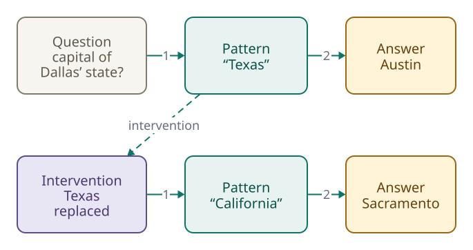

<!-- Generated from src/content/bausteine/en/what-an-ai-model-actually-is.mdx by scripts/export-lessons.mjs -- do not edit by hand. -->

# What an AI Model Actually Is

> Reading copy for GitHub. The full version with interactive demos, animations and recall moments is on the website: **[What an AI Model Actually Is](https://ki-einfach-verstehen.de/en/lessons/what-an-ai-model-actually-is/)**
>
> Licence: [CC BY 4.0](https://creativecommons.org/licenses/by/4.0/deed.en) · Credit it as: KI einfach verstehen, “What an AI Model Actually Is”, CC BY 4.0, https://ki-einfach-verstehen.de/en/lessons/what-an-ai-model-actually-is/

What is an AI model? Not a database of facts, but billions of numbers in which knowledge is spread out. That is where answers and made-up facts come from.

The foundations left a question unanswered: a model’s billions of numbers spell out no facts. So how does a chatbot know that Paris is the capital of France?

In an experiment, a small, openly available [language model](https://ki-einfach-verstehen.de/en/glossary/language-model/) called Qwen3-0.6B-Base was given “The capital of France is” in German. “0.6B” stands for 0.6 billion [parameters](https://ki-einfach-verstehen.de/en/glossary/parameters/) (stored numbers that training has set), “Base” for the basic version, not yet post-trained into a chatbot. For this exact wording, the leading next [token](https://ki-einfach-verstehen.de/en/glossary/token/) (a piece of text from the model’s fixed list) was “Paris”, at just under 50 percent. The percentages say how well a piece fits, not whether it is true.

In other cases, the same mechanism that delivers “Paris” can invent a court ruling that never existed.

## Where does it say that Paris is the capital?

A correct answer feels like a lookup in a database, as if the model held a row with this fact.

A real [model file](./parameters-training-inference-hardware.md) looks different. You know it from the foundations: a small blueprint, the [architecture](https://ki-einfach-verstehen.de/en/glossary/architecture/), and very many numbers, the [parameters](https://ki-einfach-verstehen.de/en/glossary/parameters/). A larger Qwen model stores them in a few hundred number tables, as in the lesson on vectors and matrices. Each is named after a computing step that later lessons explain. None is called “countries” or “capitals.”

You know the mixing desk from the foundations: each fader stands for a parameter, its position for its value. Training set the faders; while answering, they stay put. So settings are stored, not sentences. On the desk, a signal comes in on the left and goes out on the right. The meters show what is passing through.

*The faders stay where they are. The meters change with the signal passing through.*

In the model, this signal is your text, turned into numbers. The spam filter from the foundations added weights 2 and 3 for “Free: your prize is waiting” and got 5. That 5 wasn’t stored anywhere; it was calculated for that email. At each computing stage, a language model mostly multiplies incoming numbers by fixed parameters, adds up many such products and passes the sums on. Other steps include the kink from the [neural networks](./neural-networks.md) lesson. In the spam filter, a weight counted if its word was in the email, the same as multiplying it by 1 or 0. These sums are the **[intermediate values](https://ki-einfach-verstehen.de/en/glossary/intermediate-value/)** (the numbers that arise between input and output) from that lesson. They correspond to the meters because they are calculated for each text.

The last intermediate values become the [score](https://ki-einfach-verstehen.de/en/glossary/score/) list from the foundations, one score per text piece the model knows. [Softmax](https://ki-einfach-verstehen.de/en/glossary/softmax/) (a calculation that turns scores into percentages) turns them into proportions, the percentages from the start.

That is as far as the picture goes: on a real desk, each meter shows the level of one channel, such as the vocals. An intermediate value usually stands for no particular content and doesn’t belong to a single fader.

*A database looks up the matching row. In the model, your input and the fixed parameters produce intermediate values, which finally become the score list. The intermediate values are schematic.*

## No parameter is called “Paris”

What the model learned about Paris lives in its parameter settings, but in no single one. A made-up mini model shows how that works. A person set its ten faders, nothing was trained; real models have billions. It only shows how the same faders give different results for two sentence starts, not what a real model answers.

Sentence A, “The capital of France is,” comes in as three made-up numbers. Each meter shows a sum of products: 4 and 1 for sentence A. A second stage computes two scores from them the same way: Paris 9, France 6. Sentence B, “Paris is the capital of,” comes in as other numbers. The same faders give meter values 1 and 4 and scores of Paris 6, France 9.

How does the mini model compute the meters?

Sentence A comes in as 2, 1 and 1. For meter 1, faders 1 to 3 sit at 2, −1 and 1. Multiply each fader setting by its incoming number, then add the results: 2·2 − 1·1 + 1·1 = 4. Meter 2 uses faders 4 to 6 (−1, 2 and 1) and comes to 1. The second stage uses the meters: Paris 2·4 + 1·1 = 9, France 1·4 + 2·1 = 6. For sentence B, 1, 2 and 1 come in; the same computation gives meter values 1 and 4.

A fader in the second stage feeds meter 1 into the France score. Think for a moment: if it jumps from 1 to 3, do only sentence A’s scores change?

> **Interactive demo:** [try it on the website](https://ki-einfach-verstehen.de/en/lessons/what-an-ai-model-actually-is/)

*A made-up mini model: stage 1 turns the input into two meters with six fixed faders, stage 2 turns the meters into two scores with four more. The same faders compute for both sentence starts.*

For sentence A, meter 1 shows a 4, so two more points on the fader add 2 · 4 = 8: France rises from 6 to 14 and overtakes Paris. For sentence B, meter 1 shows only 1, so France gains just 2, from 9 to 11. The scores of both sentences shift; the answer flips only for sentence A. In a real model, the same parameters are used for very many questions. A change therefore shifts many things a little, but related answers don’t all change to match.

Facts can still be changed on purpose. In 2022, researchers rewrote individual facts in GPT models (the family behind ChatGPT) by recomputing certain parameters in middle stages. But later tests showed that related facts often don’t follow. Give a person a new father in the model, and it often still names the old siblings. Unlike a table row, a fact can’t be cleanly corrected in one place.

## What researchers find in the intermediate values

No one has yet mapped all the faders involved in “Paris”. But researchers can study the intermediate values.

A team at Anthropic, the company behind Claude, did so with a small language model. A single intermediate value, like one meter in the picture, fired for academic citations, English dialogue and Korean text. So it isn’t a drawer for one concept.

*A single intermediate value responds to very different things. A feature shows up as a particular combination of values across many intermediate values.*

In a version of Claude, the team used a helper program to extract millions of recurring combinations across many intermediate values. The texts that made a combination fire revealed what it represented, such as famous people, countries or cities. Such combinations are called **features**. A feature is like a chord: a single note occurs in many chords and alone doesn’t reveal which is sounding. Only the notes together make C major. Unlike chords, nobody defined the features; they arose during training. Which ones you find also depends on the helper program.

Parameters, intermediate values and features are three different quantities. Parameters are stored and fixed, like the faders. Features are combinations of intermediate values, like a pattern across many meters at once. A feature for Paris is not yet the fact that Paris is France’s capital. That fact only emerges when the calculation for a question puts “Paris” first.

*Three quantities and their place in the picture. A feature for Paris is not yet the fact.*

One level deeper: how features share the intermediate values

Many features share the same intermediate values, each as its own combination of them; this is called **superposition**. For 82 percent of the features examined in Claude 3 Sonnet, no single neuron, that is, no intermediate value like the one with Korean text, was strongly linked to the feature. That way, more features fit in than there are intermediate values: in a small model with only one computing stage, tens of thousands could be extracted from 512 of them. This works because only a few are usually active at once; when several are, they interfere with each other.

Features influence the answer. In an experiment, the team held the Golden Gate Bridge feature at ten times its maximum while computing, without changing parameters. The model then described itself as the Golden Gate Bridge. The experiment doesn’t show where a fact sits.

## Three questions where a table behaves differently

A country | capital table reads each row from both sides, finds every entry equally well and reports “no match” for missing entries. The small model and a larger one of the same kind with 4 billion parameters received three questions. They got the reversed start “Paris is the capital of” in German and questions about the birth dates of Albert Einstein and the nonexistent physicist Bernhard Quelling. Here the model answers alone; some chatbots also feed it web search hits. Pause to think: what does the small model write next in each case?

> **Interactive demo:** [try it on the website](https://ki-einfach-verstehen.de/en/lessons/what-an-ai-model-actually-is/)

The first case, the reversed sentence start: in the experiment, the small model put “Deutschland” (Germany) first, at just under 30 percent. The larger one put “Frank…”, the start of “Frankreich” (France), first at just over 60 percent. For Paris, the larger model manages the reversal, probably because texts name Paris and France in both orders. This one run doesn’t reveal why the small model was wrong.

*The same fact, asked twice in German, one run of Qwen3-0.6B-Base each: the parameters are the same, the intermediate values and the score list are not. The intermediate-value bars are schematic.*

Still, direction matters. In training, the start of a text is always the input and the next piece the label, as with “The cat sat” and “on.” By contrast, texts usually name a celebrity before their mother. In a 2023 study, GPT-4, a model behind ChatGPT, answered questions like “Who is Tom Cruise’s mother?” (Mary Lee Pfeiffer) correctly almost four times in five. It answered reversed questions like “Who is Mary Lee Pfeiffer’s son?” correctly only once in three. If your question already contains the fact, the reversal usually works.

The second case: some facts stick better than others. A study shows that a model answers correctly more often the more matching texts it saw in training, and that larger models retain more. The Einstein run, on a very frequent fact, only shows the size difference. Given “The physicist Albert Einstein was born on” in German, the small model wrote “August 14, 1879, in Zurich”; the larger one correctly wrote “March 14, 1879, in Ulm”.

The third case, the made-up Bernhard Quelling: both models promptly named a birth date, the small one “August 13, 1920, in the city of Berlin”. The calculation always yields a score list, with some text piece on top. “I don’t know” would be just one possible continuation; after this start, a date fits better. Neither model put the invisible stop marker that ends an answer first. Post-trained chatbots (further tuned with example conversations after basic training) more often say they don’t know; that too is learned behavior, not a search result, and it sometimes fails.

## Answers that were never written down

Computing lets a model combine what it learned. A version of Claude was asked for the capital of the US state where Dallas is. That is Texas, whose capital is Austin. The Anthropic team saw a feature for Texas fire first, triggered by “Dallas”. Together with the question about a capital, it led to Austin.

[▶ watch the animation on the website](https://ki-einfach-verstehen.de/en/lessons/what-an-ai-model-actually-is/)

*Two learned facts are linked: Dallas is in Texas, the capital of Texas is Austin.*

Think first: is the model really combining here, or retrieving a memorized answer? During the calculation, the researchers replaced the Texas feature with one for California by changing intermediate values, not parameters. The model then answered “Sacramento,” California’s capital. In this example, the second step depended on the first; this one experiment doesn’t show whether models always work this way.

Still, models sometimes reproduce text verbatim. Hundreds of passages were extracted from GPT-2, an older, openly available model. These passages have no row in the model file either.

## Why the model would rather guess than stay silent

In 2023, two New York lawyers filed a federal court brief that cited six nonexistent court decisions. ChatGPT had generated them, with docket numbers and quotations resembling real rulings. The model had learned what rulings and docket numbers look like from many texts. It produced the form even without the facts.

Fluent, plausible-sounding statements that aren’t true are called **[hallucinations](https://ki-einfach-verstehen.de/en/glossary/hallucination/)**.

*Six rulings that looked real and were never handed down.*

The first cause lies in basic training. A language model must produce the next piece at every position in a text, even where its [training data](https://ki-einfach-verstehen.de/en/glossary/training-data/) offers little. The second lies in evaluation. In large sets of test questions, a correct answer often earns one point, a wrong one zero, and “I don’t know” zero too. It is like a multiple-choice exam without penalties: if you don’t know, you answer anyway. If such tests evaluate chatbots during post-training, guessing still pays. This isn’t a conscious choice.

Third, the model misapplies what it learned. In a version of Claude, the Anthropic team saw that “I can’t answer that” is initially the default answer to every question. A feature for “I know this,” triggered by, say, a well-known person, switches it off. If a name only seems familiar, the feature sometimes fires anyway, and the model writes whatever sounds plausible.

Facts you can’t derive from a rule, such as birthdays, are especially vulnerable. A fact that appeared only once in training is usually not retained reliably, even with error-free data. The rarer a fact, such as a ruling, a quotation or a date of birth, the less a fluent answer reveals about its truth. A later lesson shows how to check them.

## Not every AI model is a language model

You know the [spam filter](https://ki-einfach-verstehen.de/en/glossary/spam-filter/) and image recognition, technically an **[image classifier](https://ki-einfach-verstehen.de/en/glossary/image-classifier/)**, from the foundations: an email or a photo goes in, a verdict comes out, such as “spam” or “cat.” These are AI models too, but not language models.

Many image generators, like Stable Diffusion (a freely available image generator), work differently. They are **[diffusion models](https://ki-einfach-verstehen.de/en/glossary/diffusion-model/)**: they start from pure noise, like snow on an old TV, and make the whole image clearer over many steps, steered by your text. A language model instead appends piece after piece. **[Multimodal models](https://ki-einfach-verstehen.de/en/glossary/multimodal-model/)** process several kinds of input, such as a chatbot you send a photo and a question. Many answer with text; some also make images. All consist of a blueprint and parameters set by training.

*The examples from this section, described by properties. Several kinds of input are called multimodal.*

This topic area follows the path through a language model, because most large language models today share one basic pattern: they predict the next token, seeing only the text before it. The path has four stations, one per lesson. Your text becomes tokens. Each token gets a list of numbers. Many computing stages, called blocks, then mix in the sentence’s context. Finally, the exit, the output head, turns this into the score list.

*The path through the model in four stations. What comes out is the score list; the next token is chosen from it.*

So a chatbot knows that Paris is France’s capital because training set its parameters so that the calculation for this question puts “Paris” first. It computes a continuation from your input. That is why it can recombine what it learned, and why it fluently fills gaps with inventions.

At the first station, your chat message becomes a long token sequence that also records who said what. The next lesson shows how it is created and how long it can be.

---

Source: https://ki-einfach-verstehen.de/en/lessons/what-an-ai-model-actually-is/

← Previous: [Neural Networks: How Many Small Calculations Become a Model](./neural-networks.md) · [All lessons](../../README.md#contents) · Next: [Tokenization Inside the Model: How Your Chat Becomes a Token Sequence](./tokenization-inside-the-model.md) →
